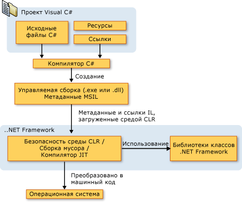

# Введение в язык C# и .NET Framework
C# — это изящный объектно-ориентированный язык со строгой типизацией, позволяющий разработчикам создавать различные безопасные и надежные приложения, работающие на платформе [!INCLUDE[dnprdnshort](../../csharp/getting-started/includes/dnprdnshort_md.md)]. C# можно использовать для создания клиентских приложений Windows, XML-веб-служб, распределенных компонентов, приложений клиент-сервер, приложений баз данных и т. д. Visual C# предоставляет развитый редактор кода, удобные конструкторы пользовательского интерфейса, интегрированный отладчик и многие другие средства, которые упрощают разработку приложений на языке C# для платформы [!INCLUDE[dnprdnshort](../../csharp/getting-started/includes/dnprdnshort_md.md)].  
  
> [!NOTE]
>  В документации по [!INCLUDE[csprcs](../../csharp/includes/csprcs_md.md)] предполагается, что у вас есть понимание основных концепций программирования. Если вы еще совсем новичок, рекомендуем сначала исследовать [!INCLUDE[csprcsxpr](../../csharp/getting-started/includes/csprcsxpr_md.md)], которая доступна в Интернете. Также для приобретения практических навыков программирования будут полезны книги и веб-ресурсы о C#.  
  
## C# - язык  
 Синтаксис C# очень богат, но при этом прост и удобен в изучении. Характерные фигурные скобки C# мгновенно узнаются всеми, кто знаком с C, C++ или Java. Разработчики, знающие любой из этих языков, обычно очень быстро начинают эффективно работать в C#. Синтаксис C# упрощает многие сложности C++, но при этом предоставляет отсутствующие в Java мощные функции, например обнуляемые типы значений, перечисления, делегаты, лямбда-выражения и прямой доступ к памяти. C# поддерживает универсальные методы и типы, которые обеспечивают более высокий уровень безопасности и производительности, а также итераторы, позволяющие определять в классах коллекций собственное поведение итерации, которое может легко применить в клиентском коде. Выражения [!INCLUDE[vbteclinqext](../../csharp/getting-started/includes/vbteclinqext_md.md)] создают очень удобную языковую конструкцию для строго типизированных запросов.  
  
 C# является объектно-ориентированным языком, а значит поддерживает инкапсуляцию, наследование и полиморфизм. Все переменные и методы, включая метод `Main`, представляющий собой точку входа в приложение, инкапсулируются в определения классов. Класс наследуется непосредственно из одного родительского класса, но может реализовывать любое число интерфейсов. Методы, которые переопределяют виртуальные методы родительского класса, должны содержать ключевое слово `override`, чтобы исключить случайное переопределение. В языке C# структура похожа на облегченный класс: это тип, распределяемый в стеке, реализующий интерфейсы, но не поддерживающий наследование.  
  
 Помимо этих основных принципов объектно-ориентированного программирования, C# предлагает ряд инновационных языковых конструкций, упрощающих разработку программных компонентов.  
  
-   Инкапсулированные сигнатуры методов, именуемые *делегатами*, которые позволяют реализовать типобезопасные уведомления о событиях.  
  
-   Свойства, выполняющие функцию акцессоров для закрытых переменных-членов.  
  
-   Атрибуты, предоставляющие декларативные метаданные о типах во время выполнения.  
  
-   Внутристрочные комментарии для XML-документации.  
  
-   [!INCLUDE[vbteclinqext](../../csharp/getting-started/includes/vbteclinqext_md.md)] для создания запросов к различным источникам данных.  
  
 Для взаимодействия с другим программным обеспечением Windows, например с объектом COM или собственными библиотеками DLL Win32, вы можете применить процесс C#, известный как "Взаимодействие". Взаимодействие позволяет программам на C# делать практически все, что возможно в приложении машинного кода C++. C# поддерживает даже указатели и понятие "небезопасного" кода для тех случаев, в которых критически важен прямой доступ к памяти.  
  
 Процесс построения в C# проще по сравнению с C или C++, но более гибок, чем в Java. Отдельные файлы заголовка не используются, и нет необходимости объявлять методы и типы в определенном порядке. Исходный файл C# может определить любое число классов, структур, интерфейсов и событий.  
  
 Вот еще несколько ресурсов по языку C#.  
  
-   Общая вводная информация о языке хорошо представлена в Главе 1 [спецификации языка C#](../../csharp/language-reference/language-specification.md).  
  
-   Подробные сведения о конкретных аспектах языка C# вы найдете в [справочнике по C#](../../csharp/language-reference/index.md).  
  
-   Дополнительные сведения о [!INCLUDE[vbteclinq](../../csharp/includes/vbteclinq_md.md)] см. в [этой статье о LINQ](http://msdn.microsoft.com/library/a73c4aec-5d15-4e98-b962-1274021ea93d).  
  
-   Свежие статьи и ресурсы, предлагаемые группой разработчиков Visual C#, размещаются в [центре для разработчиков Visual C#](http://go.microsoft.com/fwlink/?LinkId=47811).  
  
## Архитектура платформы .NET Framework  
 Программы C# выполняются на платформе [!INCLUDE[dnprdnshort](../../csharp/getting-started/includes/dnprdnshort_md.md)], которая интегрирована в Windows и содержит виртуальную общеязыковую среду выполнения (среду CLR) и унифицированный набор библиотек классов. Среда CLR корпорации Майкрософт представляет собой коммерческую реализацию международного стандарта Common Language Infrastructure (CLI), который служит основой для создания сред выполнения и разработки, позволяющих совместно использовать разные языки и библиотеки.  
  
 Исходный код, написанный на языке C# компилируется в промежуточный язык (IL), который соответствует спецификациям CLI. Код на языке IL и ресурсы, в том числе точечные рисунки и строки, сохраняются на диск в виде исполняемого файла (обычно с расширением .exe или .dll). Такой файл называется сборкой. Сборка содержит манифест с информацией о типах, версии, требований безопасности, языке и региональных параметрах для этой сборки.  
  
 При выполнении программы C# среда CLR загружает сборку и выполняет различные действия в зависимости от сведений, сохраненных в манифесте. Если выполняются все требования безопасности, среда CLR выполняет JIT-компиляцию из кода на языке IL в инструкции машинного языка. Также среда CLR выполняет другие операции, например автоматическую сборку мусора, обработку исключений и управление ресурсами. Код, выполняемый средой CLR, иногда называют "управляемым кодом", чтобы подчеркнуть отличия этого подхода от "неуправляемого кода", который сразу компилируется в машинный язык для определенной системы. На следующей схеме показаны связи между файлами исходного кода C#, библиотеками классов .NET Framework, сборками и средой CLR, существующие во время компиляции и во время выполнения.  
  
   
  
 Взаимодействие между языками является важнейшей возможностью [!INCLUDE[dnprdnshort](../../csharp/getting-started/includes/dnprdnshort_md.md)]. Создаваемый компилятором C# код IL соответствует спецификации общих типов (CTS). Это означает, что этот код IL может успешно взаимодействовать с кодом, созданным из Visual Basic и Visual C++ для платформы .NET или из любого другого CTS-совместимого языка, которых существует уже более 20. Одна сборка может содержать несколько модулей, написанных на разных языках .NET, и все типы могут ссылаться друг на друга, как если бы они были написаны на одном языке.  
  
 Помимо служб времени выполнения, платформа [!INCLUDE[dnprdnshort](../../csharp/getting-started/includes/dnprdnshort_md.md)] содержит обширную библиотеку, в которую входит более 4000 классов. Эти классы распределены по пространствам имен, соответствующим разным полезных функциям: от операций файлового ввода и вывода до управления строками, от синтаксического анализа XML до элементов управления Windows Forms. Обычно приложения C# активно используют библиотеку классов [!INCLUDE[dnprdnshort](../../csharp/getting-started/includes/dnprdnshort_md.md)] для решения типовых задач взаимодействия.  
  
 Дополнительные сведения см. в [обзоре платформы Microsoft .NET Framework](http://msdn.microsoft.com/en-us/d05daf50-00fe-45c7-8383-06fe41697355).  
  
## Главы в популярных книгах  
 [C# Language Fundamentals](http://go.microsoft.com/fwlink/?LinkId=195416) (Основные понятия языка C#) в книге [Learning C# 3.0: Master the fundamentals of C# 3.0](http://go.microsoft.com/fwlink/?LinkId=195412) (Изучение C# 3.0: овладение основными понятиями C# 3.0).  
  
 [C# Language Fundamentals](http://go.microsoft.com/fwlink/?LinkId=195413) (Программирование на C# для платформы .NET) в книге [Learning C# 3.0: Master the fundamentals of C# 3.0](http://go.microsoft.com/fwlink/?LinkId=195412) (Изучение C# 3.0: овладение основными понятиями C# 3.0).  
  
 [Introducing C#](http://go.microsoft.com/fwlink/?LinkId=221226) (Введение в C#) в книге [Beginning Visual C# 2010](http://go.microsoft.com/fwlink/?LinkId=221214) (Начало работы с Visual C# 2010).  
  
 [Visual Studio 2008 and C# Express 2008](http://go.microsoft.com/fwlink/?LinkId=195414) (Visual Studio 2008 и C# Express 2008) в книге [Learning C# 3.0: Master the fundamentals of C# 3.0](http://go.microsoft.com/fwlink/?LinkId=195412) (Изучение C# 3.0: овладение основными понятиями C# 3.0).  
  
## См. также  
 [C#](../../csharp/csharp.md)   
 [Начало работы с Visual C# и Visual Basic](https://docs.microsoft.com/visualstudio/ide/getting-started-with-visual-csharp-and-visual-basic)
