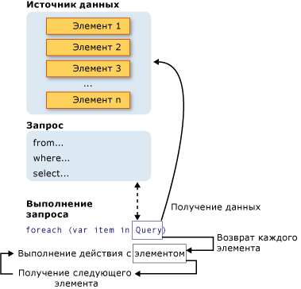

# Introduction to LINQ Queries (C#)
*Запрос* представляет собой выражение, извлекающее данные из источника данных.  Запросы обычно выражаются на специальном языке запросов.  Со временем были разработаны различные языки для различных типов источников данных, например SQL для реляционных баз данных и XQuery для XML.  Таким образом, разработчики вынуждены изучать новый язык запросов для каждого типа источника данных или формата данных, который они должны поддерживать.  [!INCLUDE[vbteclinq](../../../../csharp/includes/vbteclinq-md.md)] упрощает ситуацию, предлагая единообразную модель для работы с данными в различных видах источников и форматов данных.  В запросе [!INCLUDE[vbteclinq](../../../../csharp/includes/vbteclinq-md.md)] работа всегда осуществляется с объектами.  Для запросов и преобразований данных в XML\-документах, базах данных SQL, наборах данных [!INCLUDE[vstecado](../../../../csharp/programming-guide/concepts/linq/includes/vstecado-md.md)], коллекциях .NET и любых других форматах, для которых доступен поставщик [!INCLUDE[vbteclinq](../../../../csharp/includes/vbteclinq-md.md)], используются одинаковые базовые шаблоны кодирования.  
  
## Три части операции запроса  
 Все операции запроса [!INCLUDE[vbteclinq](../../../../csharp/includes/vbteclinq-md.md)] состоят из трех различных действий.  
  
1.  Получение источника данных.  
  
2.  Создание запроса.  
  
3.  Выполнение запроса.  
  
 В следующем примере показано выражение этих трех частей операции запроса в исходном коде.  В примере в качестве источника данных для удобства используется массив целых чисел; тем не менее, те же принципы применимы и к другим источникам данных.  Оставшаяся часть раздела ссылается на этот пример.  
  
 [!code-cs[CsLINQGettingStarted#1](../../../../csharp/programming-guide/concepts/linq/codesnippet/csharp/GettingStarted/Class1.cs#1)]  
  
 На следующем рисунке показана завершенная операция запроса.  В [!INCLUDE[vbteclinq](../../../../csharp/includes/vbteclinq-md.md)] выполнение запроса отличается от самого запроса; другими словами, создание переменной запроса само по себе не связано с получением данных.  
  
   
  
## Источник данных  
 В предыдущем примере источником данных является массив, поэтому он неявно поддерживает универсальный интерфейс <xref:System.Collections.Generic.IEnumerable%601>.  Это значит, что к нему можно выполнять запросы с [!INCLUDE[vbteclinq](../../../../csharp/includes/vbteclinq-md.md)].  Запрос выполняется в операторе `foreach`, и для `foreach` требуется <xref:System.Collections.IEnumerable> или <xref:System.Collections.Generic.IEnumerable%601>.  Типы, поддерживающие <xref:System.Collections.Generic.IEnumerable%601> или производные интерфейсы, такие как универсальный <xref:System.Linq.IQueryable%601>, называются *запрашиваемыми типами*.  
  
 Для запрашиваемого типа, выступающего в качестве источника данных [!INCLUDE[vbteclinq](../../../../csharp/includes/vbteclinq-md.md)], не требуются изменения или специальная обработка.  Если источник данных еще не находится в памяти в виде запрашиваемого типа, поставщик [!INCLUDE[vbteclinq](../../../../csharp/includes/vbteclinq-md.md)] должен представить его как таковой.  Например, [!INCLUDE[sqltecxlinq](../../../../csharp/programming-guide/concepts/linq/includes/sqltecxlinq-md.md)] загружает XML\-документ в запрашиваемый тип <xref:System.Xml.Linq.XElement>.  
  
 [!code-cs[CsLINQGettingStarted#2](../../../../csharp/programming-guide/concepts/linq/codesnippet/csharp/GettingStarted/Class1.cs#2)]  
  
 Используя [!INCLUDE[vbtecdlinq](../../../../csharp/includes/vbtecdlinq-md.md)], сначала создайте объектно\-реляционное сопоставление в режиме разработки вручную либо с помощью [Реляционный конструктор объектов](/visual-studio/data-tools/linq-to-sql-tools-in-visual-studio2).  Напишите запросы к объектам, а во время выполнения [!INCLUDE[vbtecdlinq](../../../../csharp/includes/vbtecdlinq-md.md)] будет осуществлять взаимодействие с базой данных.  В следующем примере `Customers` представляет определенную таблицу в базе данных, а тип результата запроса <xref:System.Linq.IQueryable%601> наследуется от <xref:System.Collections.Generic.IEnumerable%601>.  
  
```c#  
Northwnd db = new Northwnd(@"c:\northwnd.mdf");  
  
// Query for customers in London.  
IQueryable<Customer> custQuery =  
    from cust in db.Customers  
    where cust.City == "London"  
    select cust;  
  
```  
  
 Для получения дополнительных сведений о способах создания определенных типов источников данных см. документацию по различным поставщикам [!INCLUDE[vbteclinq](../../../../csharp/includes/vbteclinq-md.md)].  Основное правило является очень простым: источник данных [!INCLUDE[vbteclinq](../../../../csharp/includes/vbteclinq-md.md)] — это любой объект, поддерживающий универсальный интерфейс <xref:System.Collections.Generic.IEnumerable%601> или интерфейс, наследуемый от него.  
  
> [!NOTE]
>  Такие типы, как <xref:System.Collections.ArrayList>, поддерживающие неуниверсальный интерфейс <xref:System.Collections.IEnumerable>, также могут использоваться в качестве источников данных [!INCLUDE[vbteclinq](../../../../csharp/includes/vbteclinq-md.md)].  Для получения дополнительной информации см. [How to: Query an ArrayList with LINQ](../Topic/How%20to:%20Query%20an%20ArrayList%20with%20LINQ.md).  
  
##  <a name="query"></a> Запрос  
 Запрос указывает, какую информацию нужно извлечь из источника или источников данных.  При необходимости, запрос также указывает способ сортировки, группировки и формирования этих сведений перед возвращением.  Запрос хранится в переменной запроса и инициализируется выражением запроса.  Чтобы упростить написание запросов, в C\# появился новый синтаксис запроса.  
  
 Запрос из предыдущего примера возвращает все четные числа из массива целых чисел.  Выражение запроса содержит три предложения: `from`, `where` и `select`. \(Если вы знакомы с SQL, обратите внимание, что порядок предложений противоположен порядку в SQL.\) Предложение `from` указывает источник данных, предложение `where` применяет фильтр, а предложение `select` указывает тип возвращаемых элементов.  Эти и другие предложения запросов подробно описаны в разделе [Выражения запросов LINQ](../../../../csharp/programming-guide/linq-query-expressions/index.md).  Важно, что в [!INCLUDE[vbteclinq](../../../../csharp/includes/vbteclinq-md.md)] сама переменная запроса не предпринимает действий и не возвращает никаких данных.  Она просто хранит сведения, необходимые для предоставления результатов при последующем выполнении запроса.  Дополнительные сведения о построении запросов см. в разделе [Standard Query Operators Overview](../../../../visual-basic/programming-guide/concepts/linq/standard-query-operators-overview.md).  
  
> [!NOTE]
>  Запросы могут также выражаться с помощью синтаксиса методов.  Для получения дополнительной информации см. [Query Syntax and Method Syntax in LINQ](../../../../csharp/programming-guide/concepts/linq/query-syntax-and-method-syntax-in-linq.md).  
  
## Выполнение запроса  
  
### Отложенное выполнение  
 Как уже говорилось ранее, сама переменная запроса только хранит команды запроса.  Фактическое выполнение запроса откладывается до выполнения итерации переменной запроса в операторе `foreach`.  Эту концепцию называют *отложенным выполнением*, она показана в следующем примере.  
  
 [!code-cs[csLinqGettingStarted#4](../../../../csharp/programming-guide/concepts/linq/codesnippet/csharp/GettingStarted/Class1.cs#4)]  
  
 Оператор `foreach` является также местом, где извлекаются результаты запроса.  Например, в предыдущем запросе переменная итерации `num` содержит каждое \(по очереди\) значение в возвращаемой последовательности.  
  
 Так как сама переменная запроса никогда не содержит результатов запроса, ее можно выполнять так часто, как необходимо.  Например, если база данных непрерывно обновляется отдельным приложением.  В приложении можно создать один запрос, получающий последние данные, и его можно выполнять повторно с некоторым интервалом для извлечения каждый раз разных результатов.  
  
### Принудительное немедленное выполнение  
 Запросы, выполняющие статистические функции над диапазоном исходных элементов, должны сначала выполнить итерацию этих элементов.  Примерами таких запросов являются `Count`, `Max`, `Average` и `First`.  Они выполняются без явного оператора `foreach`, поскольку сам запрос должен использовать `foreach` для возвращения результата.  Обратите внимание, что такой тип запросов возвращает одиночное значение, а не коллекцию `IEnumerable`.  Следующий запрос возвращает количество четных чисел в исходном массиве.  
  
 [!code-cs[csLinqGettingStarted#5](../../../../csharp/programming-guide/concepts/linq/codesnippet/csharp/GettingStarted/Class1.cs#5)]  
  
 Чтобы принудительно вызвать немедленное выполнение любого запроса и кэшировать его результаты, можно вызвать метод <xref:System.Linq.Enumerable.ToList%2A> или <xref:System.Linq.Enumerable.ToArray%2A>.  
  
 [!code-cs[csLinqGettingStarted#6](../../../../csharp/programming-guide/concepts/linq/codesnippet/csharp/GettingStarted/Class1.cs#6)]  
  
 Можно также принудительно выполнить запрос, поместив цикл `foreach` сразу после выражения запроса.  Однако вызов `ToList` или `ToArray` также кэширует все данные в одной коллекции объектов.  
  
## См. также  
 [Getting Started with LINQ in C\#](../../../../csharp/programming-guide/concepts/linq/getting-started-with-linq.md)   
 [Walkthrough: Writing Queries in C\#](../../../../csharp/programming-guide/concepts/linq/walkthrough-writing-queries-linq.md)   
 [Примеры LINQ](../Topic/LINQ%20Samples.md)   
 [Общие сведения о реляционном конструкторе объектов](../Topic/LINQ%20to%20SQL%20Tools%20in%20Visual%20Studio1.md)   
 [Выражения запросов LINQ](../../../../csharp/programming-guide/linq-query-expressions/index.md)   
 [foreach, in](../../../../csharp/language-reference/keywords/foreach-in.md)   
 [Ключевые слова запроса \(LINQ\)](../../../../csharp/language-reference/keywords/query-keywords.md)   
 [LINQ и видеозаписи отложенного выполнения](http://go.microsoft.com/fwlink/?LinkId=112414)