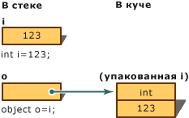
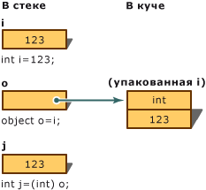

# <a name="boxing-and-unboxing-c-programming-guide"></a><span data-ttu-id="6ba22-102">Упаковка-преобразование и распаковка-преобразование (Руководство по программированию на C#)</span><span class="sxs-lookup"><span data-stu-id="6ba22-102">Boxing and Unboxing (C# Programming Guide)</span></span>
<span data-ttu-id="6ba22-103">Упаковка представляет собой процесс преобразования [типа значения](../../../csharp/language-reference/keywords/value-types.md) в тип `object` или в любой другой тип интерфейса, реализуемый этим типом значения.</span><span class="sxs-lookup"><span data-stu-id="6ba22-103">Boxing is the process of converting a [value type](../../../csharp/language-reference/keywords/value-types.md) to the type `object` or to any interface type implemented by this value type.</span></span> <span data-ttu-id="6ba22-104">Когда тип значения упаковывается средой CLR, она создает оболочку значения внутри System.Object и сохраняет ее в управляемой куче.</span><span class="sxs-lookup"><span data-stu-id="6ba22-104">When the CLR boxes a value type, it wraps the value inside a System.Object and stores it on the managed heap.</span></span> <span data-ttu-id="6ba22-105">Операция распаковки извлекает тип значения из объекта.</span><span class="sxs-lookup"><span data-stu-id="6ba22-105">Unboxing extracts the value type from the object.</span></span> <span data-ttu-id="6ba22-106">Упаковка является неявной; распаковка является явной.</span><span class="sxs-lookup"><span data-stu-id="6ba22-106">Boxing is implicit; unboxing is explicit.</span></span> <span data-ttu-id="6ba22-107">Понятия упаковки и распаковки лежат в основе единой системы типов C#, в которой значение любого типа можно рассматривать как объект.</span><span class="sxs-lookup"><span data-stu-id="6ba22-107">The concept of boxing and unboxing underlies the C# unified view of the type system in which a value of any type can be treated as an object.</span></span>  
  
 <span data-ttu-id="6ba22-108">В следующем примере выполнена операция `i`упаковки *целочисленной переменной* , которая присвоена объекту `o`.</span><span class="sxs-lookup"><span data-stu-id="6ba22-108">In the following example, the integer variable `i` is *boxed* and assigned to object `o`.</span></span>  
  
 [!code-csharp[csProgGuideTypes#14](../../../csharp/programming-guide/nullable-types/codesnippet/CSharp/boxing-and-unboxing_1.cs)]  
  
 <span data-ttu-id="6ba22-109">Затем можно выполнить операцию распаковки объекта `o`и присвоить его целочисленной переменной `i`:</span><span class="sxs-lookup"><span data-stu-id="6ba22-109">The object `o` can then be unboxed and assigned to integer variable `i`:</span></span>  
  
 [!code-csharp[csProgGuideTypes#15](../../../csharp/programming-guide/nullable-types/codesnippet/CSharp/boxing-and-unboxing_2.cs)]  
  
 <span data-ttu-id="6ba22-110">Следующий пример иллюстрирует использование упаковки в C#.</span><span class="sxs-lookup"><span data-stu-id="6ba22-110">The following examples illustrate how boxing is used in C#.</span></span>  
  
 [!code-csharp[csProgGuideTypes#47](../../../csharp/programming-guide/nullable-types/codesnippet/CSharp/boxing-and-unboxing_3.cs)]  
  
## <a name="performance"></a><span data-ttu-id="6ba22-111">Производительность</span><span class="sxs-lookup"><span data-stu-id="6ba22-111">Performance</span></span>  
 <span data-ttu-id="6ba22-112">По сравнению с простыми операциями присваивания операции упаковки и распаковки являются весьма затратными процессами с точки зрения вычислений.</span><span class="sxs-lookup"><span data-stu-id="6ba22-112">In relation to simple assignments, boxing and unboxing are computationally expensive processes.</span></span> <span data-ttu-id="6ba22-113">При выполнении упаковки типа значения необходимо создать и разместить новый объект.</span><span class="sxs-lookup"><span data-stu-id="6ba22-113">When a value type is boxed, a new object must be allocated and constructed.</span></span> <span data-ttu-id="6ba22-114">Объем вычислений при выполнении операции распаковки, хотя и в меньшей степени, но тоже весьма значителен.</span><span class="sxs-lookup"><span data-stu-id="6ba22-114">To a lesser degree, the cast required for unboxing is also expensive computationally.</span></span> <span data-ttu-id="6ba22-115">Дополнительные сведения см. в разделе [Производительность](https://msdn.microsoft.com/library/ms173196(VS.110).aspx).</span><span class="sxs-lookup"><span data-stu-id="6ba22-115">For more information, see [Performance](https://msdn.microsoft.com/library/ms173196(VS.110).aspx).</span></span>  
  
## <a name="boxing"></a><span data-ttu-id="6ba22-116">Упаковка</span><span class="sxs-lookup"><span data-stu-id="6ba22-116">Boxing</span></span>  
 <span data-ttu-id="6ba22-117">Упаковка используется для хранения типов значений в куче со сбором мусора.</span><span class="sxs-lookup"><span data-stu-id="6ba22-117">Boxing is used to store value types in the garbage-collected heap.</span></span> <span data-ttu-id="6ba22-118">Упаковка представляет собой неявное преобразование [типа значения](../../../csharp/language-reference/keywords/value-types.md) в тип `object` или в любой другой тип интерфейса, реализуемый этим типом значения.</span><span class="sxs-lookup"><span data-stu-id="6ba22-118">Boxing is an implicit conversion of a [value type](../../../csharp/language-reference/keywords/value-types.md) to the type `object` or to any interface type implemented by this value type.</span></span> <span data-ttu-id="6ba22-119">При упаковке типа значения в куче выделяется экземпляр объекта и выполняется копирование значения в этот новый объект.</span><span class="sxs-lookup"><span data-stu-id="6ba22-119">Boxing a value type allocates an object instance on the heap and copies the value into the new object.</span></span>  
  
 <span data-ttu-id="6ba22-120">Рассмотрим следующее объявление переменной типа значения.</span><span class="sxs-lookup"><span data-stu-id="6ba22-120">Consider the following declaration of a value-type variable:</span></span>  
  
 [!code-csharp[csProgGuideTypes#17](../../../csharp/programming-guide/nullable-types/codesnippet/CSharp/boxing-and-unboxing_4.cs)]  
  
 <span data-ttu-id="6ba22-121">Следующий оператор неявно применяет операцию упаковки к переменной `i`.</span><span class="sxs-lookup"><span data-stu-id="6ba22-121">The following statement implicitly applies the boxing operation on the variable `i`:</span></span>  
  
 [!code-csharp[csProgGuideTypes#18](../../../csharp/programming-guide/nullable-types/codesnippet/CSharp/boxing-and-unboxing_5.cs)]  
  
 <span data-ttu-id="6ba22-122">Результат этого оператора создает ссылку на объект `o` в стеке, которая ссылается на значение типа `int` в куче.</span><span class="sxs-lookup"><span data-stu-id="6ba22-122">The result of this statement is creating an object reference `o`, on the stack, that references a value of the type `int`, on the heap.</span></span> <span data-ttu-id="6ba22-123">Это значение является копией значения типа значения, присвоенного переменной `i`.</span><span class="sxs-lookup"><span data-stu-id="6ba22-123">This value is a copy of the value-type value assigned to the variable `i`.</span></span> <span data-ttu-id="6ba22-124">Разница между двумя этими переменными, `i` и `o`, продемонстрирована на рисунке ниже.</span><span class="sxs-lookup"><span data-stu-id="6ba22-124">The difference between the two variables, `i` and `o`, is illustrated in the following figure.</span></span>  
  
 <span data-ttu-id="6ba22-125"></span><span class="sxs-lookup"><span data-stu-id="6ba22-125"></span></span>  
<span data-ttu-id="6ba22-126">Упаковка-преобразование</span><span class="sxs-lookup"><span data-stu-id="6ba22-126">Boxing Conversion</span></span>  
  
 <span data-ttu-id="6ba22-127">Можно также выполнять упаковку явным образом, как в следующем примере, однако явная упаковка не является обязательной.</span><span class="sxs-lookup"><span data-stu-id="6ba22-127">It is also possible to perform the boxing explicitly as in the following example, but explicit boxing is never required:</span></span>  
  
 [!code-csharp[csProgGuideTypes#19](../../../csharp/programming-guide/nullable-types/codesnippet/CSharp/boxing-and-unboxing_6.cs)]  
  
## <a name="description"></a><span data-ttu-id="6ba22-128">Описание</span><span class="sxs-lookup"><span data-stu-id="6ba22-128">Description</span></span>  
 <span data-ttu-id="6ba22-129">В этом примере целочисленная переменная `i` преобразуется в объект `o` при помощи упаковки.</span><span class="sxs-lookup"><span data-stu-id="6ba22-129">This example converts an integer variable `i` to an object `o` by using boxing.</span></span> <span data-ttu-id="6ba22-130">Затем значение, хранимое переменной `i`, меняется с `123` на `456`.</span><span class="sxs-lookup"><span data-stu-id="6ba22-130">Then, the value stored in the variable `i` is changed from `123` to `456`.</span></span> <span data-ttu-id="6ba22-131">В примере показано, что исходный тип значения и упакованный объект используют отдельные ячейки памяти, а значит могут хранить разные значения.</span><span class="sxs-lookup"><span data-stu-id="6ba22-131">The example shows that the original value type and the boxed object use separate memory locations, and therefore can store different values.</span></span>  
  
## <a name="example"></a><span data-ttu-id="6ba22-132">Пример</span><span class="sxs-lookup"><span data-stu-id="6ba22-132">Example</span></span>  
 [!code-csharp[csProgGuideTypes#16](../../../csharp/programming-guide/nullable-types/codesnippet/CSharp/boxing-and-unboxing_7.cs)]  
  
## <a name="unboxing"></a><span data-ttu-id="6ba22-133">Распаковка</span><span class="sxs-lookup"><span data-stu-id="6ba22-133">Unboxing</span></span>  
 <span data-ttu-id="6ba22-134">Распаковка является явным преобразованием из типа `object` в [тип значения](../../../csharp/language-reference/keywords/value-types.md) или из типа интерфейса в тип значения, реализующего этот интерфейс.</span><span class="sxs-lookup"><span data-stu-id="6ba22-134">Unboxing is an explicit conversion from the type `object` to a [value type](../../../csharp/language-reference/keywords/value-types.md) or from an interface type to a value type that implements the interface.</span></span> <span data-ttu-id="6ba22-135">Операция распаковки состоит из следующих действий:</span><span class="sxs-lookup"><span data-stu-id="6ba22-135">An unboxing operation consists of:</span></span>  
  
-   <span data-ttu-id="6ba22-136">проверка экземпляра объекта на то, что он является упакованным значением заданного типа значения;</span><span class="sxs-lookup"><span data-stu-id="6ba22-136">Checking the object instance to make sure that it is a boxed value of the given value type.</span></span>  
  
-   <span data-ttu-id="6ba22-137">копирование значения из экземпляра в переменную типа значения.</span><span class="sxs-lookup"><span data-stu-id="6ba22-137">Copying the value from the instance into the value-type variable.</span></span>  
  
 <span data-ttu-id="6ba22-138">В следующем коде показаны операции по упаковке и распаковке.</span><span class="sxs-lookup"><span data-stu-id="6ba22-138">The following statements demonstrate both boxing and unboxing operations:</span></span>  
  
 [!code-csharp[csProgGuideTypes#21](../../../csharp/programming-guide/nullable-types/codesnippet/CSharp/boxing-and-unboxing_8.cs)]  
  
 <span data-ttu-id="6ba22-139">На следующем рисунке представлен результат выполнения этого кода.</span><span class="sxs-lookup"><span data-stu-id="6ba22-139">The following figure demonstrates the result of the previous statements.</span></span>  
  
 <span data-ttu-id="6ba22-140"></span><span class="sxs-lookup"><span data-stu-id="6ba22-140"></span></span>  
<span data-ttu-id="6ba22-141">Распаковка-преобразование</span><span class="sxs-lookup"><span data-stu-id="6ba22-141">Unboxing Conversion</span></span>  
  
 <span data-ttu-id="6ba22-142">Для успешной распаковки типов значений во время выполнения необходимо, чтобы экземпляр, который распаковывается, был ссылкой на объект, предварительно созданный с помощью упаковки экземпляра этого типа значения.</span><span class="sxs-lookup"><span data-stu-id="6ba22-142">For the unboxing of value types to succeed at run time, the item being unboxed must be a reference to an object that was previously created by boxing an instance of that value type.</span></span> <span data-ttu-id="6ba22-143">Попытка распаковать `null` создает исключение <xref:System.NullReferenceException>.</span><span class="sxs-lookup"><span data-stu-id="6ba22-143">Attempting to unbox `null` causes a <xref:System.NullReferenceException>.</span></span> <span data-ttu-id="6ba22-144">Попытка распаковать ссылку на несовместимый тип значения создает исключение <xref:System.InvalidCastException>.</span><span class="sxs-lookup"><span data-stu-id="6ba22-144">Attempting to unbox a reference to an incompatible value type causes an <xref:System.InvalidCastException>.</span></span>  
  
## <a name="example"></a><span data-ttu-id="6ba22-145">Пример</span><span class="sxs-lookup"><span data-stu-id="6ba22-145">Example</span></span>  
 <span data-ttu-id="6ba22-146">В следующем примере показан случай недопустимой распаковки, в результате чего создается исключение `InvalidCastException`.</span><span class="sxs-lookup"><span data-stu-id="6ba22-146">The following example demonstrates a case of invalid unboxing and the resulting `InvalidCastException`.</span></span> <span data-ttu-id="6ba22-147">В случае использования `try` и `catch` при возникновении ошибки выводится сообщение.</span><span class="sxs-lookup"><span data-stu-id="6ba22-147">Using `try` and `catch`, an error message is displayed when the error occurs.</span></span>  
  
 [!code-csharp[csProgGuideTypes#20](../../../csharp/programming-guide/nullable-types/codesnippet/CSharp/boxing-and-unboxing_9.cs)]  
  
 <span data-ttu-id="6ba22-148">При выполнении этой программы выводится следующий результат:</span><span class="sxs-lookup"><span data-stu-id="6ba22-148">This program outputs:</span></span>  
  
 `Specified cast is not valid. Error: Incorrect unboxing.`  
  
 <span data-ttu-id="6ba22-149">При изменении оператора:</span><span class="sxs-lookup"><span data-stu-id="6ba22-149">If you change the statement:</span></span>  
  
```  
int j = (short) o;  
```  
  
 <span data-ttu-id="6ba22-150">на:</span><span class="sxs-lookup"><span data-stu-id="6ba22-150">to:</span></span>  
  
```  
int j = (int) o;  
```  
  
 <span data-ttu-id="6ba22-151">будет выполнено преобразование со следующим результатом:</span><span class="sxs-lookup"><span data-stu-id="6ba22-151">the conversion will be performed, and you will get the output:</span></span>  
  
 `Unboxing OK.`  
  
## <a name="c-language-specification"></a><span data-ttu-id="6ba22-152">Спецификация языка C#</span><span class="sxs-lookup"><span data-stu-id="6ba22-152">C# Language Specification</span></span>  
 [!INCLUDE[CSharplangspec](~/includes/csharplangspec-md.md)]  
  
## <a name="related-sections"></a><span data-ttu-id="6ba22-153">Связанные разделы</span><span class="sxs-lookup"><span data-stu-id="6ba22-153">Related Sections</span></span>  
 <span data-ttu-id="6ba22-154">Дополнительные сведения:</span><span class="sxs-lookup"><span data-stu-id="6ba22-154">For more information:</span></span>  
  
-   [<span data-ttu-id="6ba22-155">Ссылочные типы</span><span class="sxs-lookup"><span data-stu-id="6ba22-155">Reference Types</span></span>](../../../csharp/language-reference/keywords/reference-types.md)  
  
-   [<span data-ttu-id="6ba22-156">Типы значений</span><span class="sxs-lookup"><span data-stu-id="6ba22-156">Value Types</span></span>](../../../csharp/language-reference/keywords/value-types.md)  
  
## <a name="c-language-specification"></a><span data-ttu-id="6ba22-157">Спецификация языка C#</span><span class="sxs-lookup"><span data-stu-id="6ba22-157">C# Language Specification</span></span>  
 [!INCLUDE[CSharplangspec](~/includes/csharplangspec-md.md)]  
  
## <a name="see-also"></a><span data-ttu-id="6ba22-158">См. также</span><span class="sxs-lookup"><span data-stu-id="6ba22-158">See Also</span></span>  
 [<span data-ttu-id="6ba22-159">Руководство по программированию на C#</span><span class="sxs-lookup"><span data-stu-id="6ba22-159">C# Programming Guide</span></span>](../../../csharp/programming-guide/index.md)
