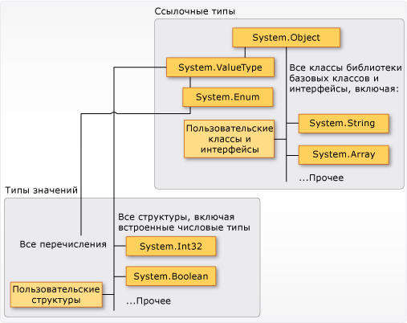

# <a name="types-c-programming-guide"></a><span data-ttu-id="30386-102">Типы (Руководство по программированию на C#)</span><span class="sxs-lookup"><span data-stu-id="30386-102">Types (C# Programming Guide)</span></span>
## <a name="types-variables-and-values"></a><span data-ttu-id="30386-103">Типы, переменные и значения</span><span class="sxs-lookup"><span data-stu-id="30386-103">Types, Variables, and Values</span></span>  
 <span data-ttu-id="30386-104">C# является строго типизированным языком.</span><span class="sxs-lookup"><span data-stu-id="30386-104">C# is a strongly-typed language.</span></span> <span data-ttu-id="30386-105">Каждая переменная и константа имеет тип, как и каждое выражение, результатом вычисления которого является значение.</span><span class="sxs-lookup"><span data-stu-id="30386-105">Every variable and constant has a type, as does every expression that evaluates to a value.</span></span> <span data-ttu-id="30386-106">Сигнатура каждого метода задает тип для каждого входного параметра и для возвращаемого значения.</span><span class="sxs-lookup"><span data-stu-id="30386-106">Every method signature specifies a type for each input parameter and for the return value.</span></span> <span data-ttu-id="30386-107">Библиотека классов платформы .NET Framework определяет набор встроенных числовых типов, а также более сложных типов, представляющих широкое разнообразие логических конструкций, например файловую систему, сетевые подключения, коллекции, массивы объектов и даты.</span><span class="sxs-lookup"><span data-stu-id="30386-107">The .NET Framework class library defines a set of built-in numeric types as well as more complex types that represent a wide variety of logical constructs, such as the file system, network connections, collections and arrays of objects, and dates.</span></span> <span data-ttu-id="30386-108">Обычная программа на C# использует типы из этой библиотеки классов и пользовательские типы, которые моделируют уникальные концепции конкретной сферы применения.</span><span class="sxs-lookup"><span data-stu-id="30386-108">A typical C# program uses types from the class library as well as user-defined types that model the concepts that are specific to the program's problem domain.</span></span>  
  
 <span data-ttu-id="30386-109">В типах может храниться следующая информация:</span><span class="sxs-lookup"><span data-stu-id="30386-109">The information stored in a type can include the following:</span></span>  
  
-   <span data-ttu-id="30386-110">место, необходимое для хранения переменной этого типа;</span><span class="sxs-lookup"><span data-stu-id="30386-110">The storage space that a variable of the type requires.</span></span>  
  
-   <span data-ttu-id="30386-111">максимальное и минимальное значения, которые могут быть представлены;</span><span class="sxs-lookup"><span data-stu-id="30386-111">The maximum and minimum values that it can represent.</span></span>  
  
-   <span data-ttu-id="30386-112">содержащиеся в типе члены (методы, поля, события и т. д.);</span><span class="sxs-lookup"><span data-stu-id="30386-112">The members (methods, fields, events, and so on) that it contains.</span></span>  
  
-   <span data-ttu-id="30386-113">базовый тип, от которого наследует этот тип;</span><span class="sxs-lookup"><span data-stu-id="30386-113">The base type it inherits from.</span></span>  
  
-   <span data-ttu-id="30386-114">расположение, в котором будет выделена память для переменных во время выполнения;</span><span class="sxs-lookup"><span data-stu-id="30386-114">The location where the memory for variables will be allocated at run time.</span></span>  
  
-   <span data-ttu-id="30386-115">разрешенные виды операций.</span><span class="sxs-lookup"><span data-stu-id="30386-115">The kinds of operations that are permitted.</span></span>  
  
 <span data-ttu-id="30386-116">Компилятор использует сведения о типах, чтобы проверить, все ли операции, выполняемые в коде, являются *типобезопасными*.</span><span class="sxs-lookup"><span data-stu-id="30386-116">The compiler uses type information to make sure that all operations that are performed in your code are *type safe*.</span></span> <span data-ttu-id="30386-117">Например, при объявлении переменной типа [int](../../../csharp/language-reference/keywords/int.md) компилятор позволяет в дополнение использовать переменную и операции вычитания.</span><span class="sxs-lookup"><span data-stu-id="30386-117">For example, if you declare a variable of type [int](../../../csharp/language-reference/keywords/int.md), the compiler allows you to use the variable in addition and subtraction operations.</span></span> <span data-ttu-id="30386-118">При попытке выполнить эти же операции для переменной типа [bool](../../../csharp/language-reference/keywords/bool.md) компилятор выдаст ошибку, как показано в следующем примере:</span><span class="sxs-lookup"><span data-stu-id="30386-118">If you try to perform those same operations on a variable of type [bool](../../../csharp/language-reference/keywords/bool.md), the compiler generates an error, as shown in the following example:</span></span>  
  
 <span data-ttu-id="30386-119">[!code-cs[csProgGuideTypes#42](../../../csharp/programming-guide/nullable-types/codesnippet/CSharp/index_1.cs)]</span><span class="sxs-lookup"><span data-stu-id="30386-119">[!code-cs[csProgGuideTypes#42](../../../csharp/programming-guide/nullable-types/codesnippet/CSharp/index_1.cs)]</span></span>  
  
> [!NOTE]
>  <span data-ttu-id="30386-120">Тем, кто ранее использовал C и C++, нужно обратить внимание на то, что в C# тип [bool](../../../csharp/language-reference/keywords/bool.md) нельзя преобразовать в [int](../../../csharp/language-reference/keywords/int.md).</span><span class="sxs-lookup"><span data-stu-id="30386-120">C and C++ developers, notice that in C#, [bool](../../../csharp/language-reference/keywords/bool.md) is not convertible to [int](../../../csharp/language-reference/keywords/int.md).</span></span>  
  
 <span data-ttu-id="30386-121">Компилятор внедряет сведения о типе в исполняемый файл в виде метаданных.</span><span class="sxs-lookup"><span data-stu-id="30386-121">The compiler embeds the type information into the executable file as metadata.</span></span> <span data-ttu-id="30386-122">Среда CLR использует эти метаданные при выделении и освобождении памяти во время выполнения для дополнительного контроля типобезопасности.</span><span class="sxs-lookup"><span data-stu-id="30386-122">The common language runtime (CLR) uses that metadata at run time to further guarantee type safety when it allocates and reclaims memory.</span></span>  
  
### <a name="specifying-types-in-variable-declarations"></a><span data-ttu-id="30386-123">Задание типов при объявлении переменных</span><span class="sxs-lookup"><span data-stu-id="30386-123">Specifying Types in Variable Declarations</span></span>  
 <span data-ttu-id="30386-124">Когда вы объявляете в программе переменную или константу, для нее нужно задать тип либо использовать ключевое слово [var](../../../csharp/language-reference/keywords/var.md), чтобы компилятор определил тип самостоятельно.</span><span class="sxs-lookup"><span data-stu-id="30386-124">When you declare a variable or constant in a program, you must either specify its type or use the [var](../../../csharp/language-reference/keywords/var.md) keyword to let the compiler infer the type.</span></span> <span data-ttu-id="30386-125">В следующем примере показаны некоторые объявления переменных, использующие встроенные числовые типы и сложные пользовательские типы:</span><span class="sxs-lookup"><span data-stu-id="30386-125">The following example shows some variable declarations that use both built-in numeric types and complex user-defined types:</span></span>  
  
 <span data-ttu-id="30386-126">[!code-cs[csProgGuideTypes#36](../../../csharp/programming-guide/nullable-types/codesnippet/CSharp/index_2.cs)]</span><span class="sxs-lookup"><span data-stu-id="30386-126">[!code-cs[csProgGuideTypes#36](../../../csharp/programming-guide/nullable-types/codesnippet/CSharp/index_2.cs)]</span></span>  
  
 <span data-ttu-id="30386-127">Типы для параметров и возвращаемых значений метода задаются в сигнатуре метода.</span><span class="sxs-lookup"><span data-stu-id="30386-127">The types of method parameters and return values are specified in the method signature.</span></span> <span data-ttu-id="30386-128">Далее представлена сигнатура метода, который требует значение [int](../../../csharp/language-reference/keywords/int.md) в качестве входного аргумента и возвращает строку:</span><span class="sxs-lookup"><span data-stu-id="30386-128">The following signature shows a method that requires an [int](../../../csharp/language-reference/keywords/int.md) as an input argument and returns a string:</span></span>  
  
 <span data-ttu-id="30386-129">[!code-cs[csProgGuideTypes#35](../../../csharp/programming-guide/nullable-types/codesnippet/CSharp/index_3.cs)]</span><span class="sxs-lookup"><span data-stu-id="30386-129">[!code-cs[csProgGuideTypes#35](../../../csharp/programming-guide/nullable-types/codesnippet/CSharp/index_3.cs)]</span></span>  
  
 <span data-ttu-id="30386-130">После объявления переменной она не может быть повторно объявлена с новым типом, и ей нельзя присвоить значение, несовместимое с ее объявленным типом.</span><span class="sxs-lookup"><span data-stu-id="30386-130">After a variable is declared, it cannot be re-declared with a new type, and it cannot be assigned a value that is not compatible with its declared type.</span></span> <span data-ttu-id="30386-131">Например, нельзя объявить переменную типа [int](../../../csharp/language-reference/keywords/int.md) и затем присвоить ей логическое значение [true](../../../csharp/language-reference/keywords/true-literal.md).</span><span class="sxs-lookup"><span data-stu-id="30386-131">For example, you cannot declare an [int](../../../csharp/language-reference/keywords/int.md) and then assign it a Boolean value of [true](../../../csharp/language-reference/keywords/true-literal.md).</span></span> <span data-ttu-id="30386-132">Однако значения могут быть преобразованы в другие типы, например при сохранении в другие переменные или при передаче в качестве аргументов метода.</span><span class="sxs-lookup"><span data-stu-id="30386-132">However, values can be converted to other types, for example when they are assigned to new variables or passed as method arguments.</span></span> <span data-ttu-id="30386-133">Если *преобразование типов* не приводит к потере данных, она выполняется компилятором автоматически.</span><span class="sxs-lookup"><span data-stu-id="30386-133">A *type conversion* that does not cause data loss is performed automatically by the compiler.</span></span> <span data-ttu-id="30386-134">Для преобразования, которое может привести к потере данных, необходимо выполнить *приведение* в исходном коде.</span><span class="sxs-lookup"><span data-stu-id="30386-134">A conversion that might cause data loss requires a *cast* in the source code.</span></span>  
  
 <span data-ttu-id="30386-135">Дополнительные сведения см. в статье [Casting and Type Conversions](../../../csharp/programming-guide/types/casting-and-type-conversions.md) (Приведение и преобразование типов).</span><span class="sxs-lookup"><span data-stu-id="30386-135">For more information, see [Casting and Type Conversions](../../../csharp/programming-guide/types/casting-and-type-conversions.md).</span></span>  
  
## <a name="built-in-types"></a><span data-ttu-id="30386-136">Встроенные типы</span><span class="sxs-lookup"><span data-stu-id="30386-136">Built-in Types</span></span>  
 <span data-ttu-id="30386-137">C# предоставляет стандартный набор встроенных числовых типов для представления целых чисел, значений с плавающей запятой, логических выражений, текстовых символов, десятичных значений и других типов данных.</span><span class="sxs-lookup"><span data-stu-id="30386-137">C# provides a standard set of built-in numeric types to represent integers, floating point values, Boolean expressions, text characters, decimal values, and other types of data.</span></span> <span data-ttu-id="30386-138">Также существуют встроенные типы `string` и `object`.</span><span class="sxs-lookup"><span data-stu-id="30386-138">There are also built-in `string` and `object` types.</span></span> <span data-ttu-id="30386-139">Они доступны для использования в любой программе C#.</span><span class="sxs-lookup"><span data-stu-id="30386-139">These are available for you to use in any C# program.</span></span> <span data-ttu-id="30386-140">Дополнительные сведения о встроенных типах см. в [Справочных таблицах по типам](../../../csharp/language-reference/keywords/reference-tables-for-types.md).</span><span class="sxs-lookup"><span data-stu-id="30386-140">For more information about the built-in types, see [Reference Tables for Types](../../../csharp/language-reference/keywords/reference-tables-for-types.md).</span></span>  
  
## <a name="custom-types"></a><span data-ttu-id="30386-141">Пользовательские типы</span><span class="sxs-lookup"><span data-stu-id="30386-141">Custom Types</span></span>  
 <span data-ttu-id="30386-142">Вы можете создавать собственные типы, используя конструкции [структура](../../../csharp/language-reference/keywords/struct.md), [класс](../../../csharp/language-reference/keywords/class.md), [интерфейс](../../../csharp/language-reference/keywords/interface.md) и [перечисление](../../../csharp/language-reference/keywords/enum.md).</span><span class="sxs-lookup"><span data-stu-id="30386-142">You use the [struct](../../../csharp/language-reference/keywords/struct.md), [class](../../../csharp/language-reference/keywords/class.md), [interface](../../../csharp/language-reference/keywords/interface.md), and [enum](../../../csharp/language-reference/keywords/enum.md) constructs to create your own custom types.</span></span> <span data-ttu-id="30386-143">Сама библиотека классов платформы .NET Framework является коллекцией пользовательских типов, предоставленных корпорацией Майкрософт, которые вы можете свободно использовать в приложениях.</span><span class="sxs-lookup"><span data-stu-id="30386-143">The .NET Framework class library itself is a collection of custom types provided by Microsoft that you can use in your own applications.</span></span> <span data-ttu-id="30386-144">По умолчанию в любой программе C# доступны наиболее часто используемые типы из библиотеки классов.</span><span class="sxs-lookup"><span data-stu-id="30386-144">By default, the most frequently used types in the class library are available in any C# program.</span></span> <span data-ttu-id="30386-145">Чтобы сделать доступными другие типы, нужно явным образом добавить в проект ссылку на сборку, в которой они определены.</span><span class="sxs-lookup"><span data-stu-id="30386-145">Others become available only when you explicitly add a project reference to the assembly in which they are defined.</span></span> <span data-ttu-id="30386-146">Если компилятору предоставлена ссылка на сборку, то вы можете объявлять в коде переменные (и константы) любых типов, объявленных в этой сборке.</span><span class="sxs-lookup"><span data-stu-id="30386-146">After the compiler has a reference to the assembly, you can declare variables (and constants) of the types declared in that assembly in source code.</span></span> <span data-ttu-id="30386-147">Дополнительные сведения см. в статье [Библиотека классов платформы .NET Framework](http://go.microsoft.com/fwlink/?LinkID=217856).</span><span class="sxs-lookup"><span data-stu-id="30386-147">For more information, see [.NET Framework Class Library](http://go.microsoft.com/fwlink/?LinkID=217856).</span></span>  
  
## <a name="the-common-type-system"></a><span data-ttu-id="30386-148">Система общих типов CTS</span><span class="sxs-lookup"><span data-stu-id="30386-148">The Common Type System</span></span>  
 <span data-ttu-id="30386-149">Важно понимать два фундаментальных тезиса о системе типов, используемой в [!INCLUDE[dnprdnshort](~/includes/dnprdnshort-md.md)].</span><span class="sxs-lookup"><span data-stu-id="30386-149">It is important to understand two fundamental points about the type system in the [!INCLUDE[dnprdnshort](~/includes/dnprdnshort-md.md)]:</span></span>  
  
-   <span data-ttu-id="30386-150">Она поддерживает принцип наследования.</span><span class="sxs-lookup"><span data-stu-id="30386-150">It supports the principle of inheritance.</span></span> <span data-ttu-id="30386-151">Типы могут быть производными от других типов, которые называются *базовыми типами*.</span><span class="sxs-lookup"><span data-stu-id="30386-151">Types can derive from other types, called *base types*.</span></span> <span data-ttu-id="30386-152">Производный тип наследует все (с некоторыми ограничениями) методы, свойства и другие члены базового типа.</span><span class="sxs-lookup"><span data-stu-id="30386-152">The derived type inherits (with some restrictions) the methods, properties, and other members of the base type.</span></span> <span data-ttu-id="30386-153">Базовый тип, в свою очередь, может быть производным от какого-то другого типа, и тогда производный тип наследует члены обоих базовых типов в иерархии наследования.</span><span class="sxs-lookup"><span data-stu-id="30386-153">The base type can in turn derive from some other type, in which case the derived type inherits the members of both base types in its inheritance hierarchy.</span></span> <span data-ttu-id="30386-154">Все типы, включая встроенные числовые типы, например <xref:System.Int32?displayProperty=fullName> (ключевое слово C#: [int](../../../csharp/language-reference/keywords/int.md)), в конечном счете являются производными от одного базового типа <xref:System.Object?displayProperty=fullName> (ключевое слово C#: [object](../../../csharp/language-reference/keywords/object.md)).</span><span class="sxs-lookup"><span data-stu-id="30386-154">All types, including built-in numeric types such as <xref:System.Int32?displayProperty=fullName> (C# keyword: [int](../../../csharp/language-reference/keywords/int.md)), derive ultimately from a single base type, which is <xref:System.Object?displayProperty=fullName> (C# keyword: [object](../../../csharp/language-reference/keywords/object.md)).</span></span> <span data-ttu-id="30386-155">Эта унифицированная иерархия типов называется [Системой общих типов CTS](../../../standard/base-types/common-type-system.md).</span><span class="sxs-lookup"><span data-stu-id="30386-155">This unified type hierarchy is called the [Common Type System](../../../standard/base-types/common-type-system.md) (CTS).</span></span> <span data-ttu-id="30386-156">Дополнительные сведения о наследовании в C# см. в статье [Inheritance](../../../csharp/programming-guide/classes-and-structs/inheritance.md) (Наследование).</span><span class="sxs-lookup"><span data-stu-id="30386-156">For more information about inheritance in C#, see [Inheritance](../../../csharp/programming-guide/classes-and-structs/inheritance.md).</span></span>  
  
-   <span data-ttu-id="30386-157">Каждый тип в CTS определяется как *тип значения* либо *ссылочный тип*.</span><span class="sxs-lookup"><span data-stu-id="30386-157">Each type in the CTS is defined as either a *value type* or a *reference type*.</span></span> <span data-ttu-id="30386-158">Это справедливо и для всех пользовательских типов, в том числе включенных в библиотеку классов платформы .NET Framework или определенных вами.</span><span class="sxs-lookup"><span data-stu-id="30386-158">This includes all custom types in the .NET Framework class library and also your own user-defined types.</span></span> <span data-ttu-id="30386-159">Если в определении типа используется ключевое слово [struct](../../../csharp/language-reference/keywords/struct.md), он является типом значения. Например, все встроенные числовые типы определены как `structs`.</span><span class="sxs-lookup"><span data-stu-id="30386-159">Types that you define by using the [struct](../../../csharp/language-reference/keywords/struct.md) keyword are value types; all the built-in numeric types are `structs`.</span></span> <span data-ttu-id="30386-160">Если в определении типа используется ключевое слово [class](../../../csharp/language-reference/keywords/class.md), он является ссылочным типом.</span><span class="sxs-lookup"><span data-stu-id="30386-160">Types that you define by using the [class](../../../csharp/language-reference/keywords/class.md) keyword are reference types.</span></span> <span data-ttu-id="30386-161">Для ссылочных типов и типов значений используются разные правила компиляции, и они демонстрируют разное поведение во время выполнения.</span><span class="sxs-lookup"><span data-stu-id="30386-161">Reference types and value types have different compile-time rules, and different run-time behavior.</span></span>  
  
 <span data-ttu-id="30386-162">Ниже показаны взаимоотношения между типами значения и ссылочными типами в CTS.</span><span class="sxs-lookup"><span data-stu-id="30386-162">The following illustration shows the relationship between value types and reference types in the CTS.</span></span>  
  
 <span data-ttu-id="30386-163"></span><span class="sxs-lookup"><span data-stu-id="30386-163"></span></span>  
<span data-ttu-id="30386-164">Типы значений и ссылочные типы в CTS</span><span class="sxs-lookup"><span data-stu-id="30386-164">Value types and reference types in the CTS</span></span>  
  
> [!NOTE]
>  <span data-ttu-id="30386-165">Как видно, все наиболее часто используемые типы организованы в пространство имен <xref:System>.</span><span class="sxs-lookup"><span data-stu-id="30386-165">You can see that the most commonly used types are all organized in the <xref:System> namespace.</span></span> <span data-ttu-id="30386-166">Но само по себе пространство имен, в котором размещен тип, никак не зависит от того, является ли он типом значения или ссылочным типом.</span><span class="sxs-lookup"><span data-stu-id="30386-166">However, the namespace in which a type is contained has no relation to whether it is a value type or reference type.</span></span>  
  
### <a name="value-types"></a><span data-ttu-id="30386-167">Типы значений</span><span class="sxs-lookup"><span data-stu-id="30386-167">Value Types</span></span>  
 <span data-ttu-id="30386-168">Типы значений являются производными от <xref:System.ValueType?displayProperty=fullName>, который является производным от <xref:System.Object?displayProperty=fullName>.</span><span class="sxs-lookup"><span data-stu-id="30386-168">Value types derive from <xref:System.ValueType?displayProperty=fullName>, which derives from <xref:System.Object?displayProperty=fullName>.</span></span> <span data-ttu-id="30386-169">Типы, производные от <xref:System.ValueType?displayProperty=fullName>, имеют особое поведение в среде CLR.</span><span class="sxs-lookup"><span data-stu-id="30386-169">Types that derive from <xref:System.ValueType?displayProperty=fullName> have special behavior in the CLR.</span></span> <span data-ttu-id="30386-170">Переменные с типами значения напрямую содержат свои значения, то есть для них всегда выделяется память из стека в том контексте, где объявлена эта переменной.</span><span class="sxs-lookup"><span data-stu-id="30386-170">Value type variables directly contain their values, which means that the memory is allocated inline in whatever context the variable is declared.</span></span> <span data-ttu-id="30386-171">Нет раздельного размещения в куче или накладных расходов при сборке мусора для переменных типа значения.</span><span class="sxs-lookup"><span data-stu-id="30386-171">There is no separate heap allocation or garbage collection overhead for value-type variables.</span></span>  
  
 <span data-ttu-id="30386-172">Существует две категории типов значений: [структура](../../../csharp/language-reference/keywords/struct.md) и [перечисление](../../../csharp/language-reference/keywords/enum.md).</span><span class="sxs-lookup"><span data-stu-id="30386-172">There are two categories of value types: [struct](../../../csharp/language-reference/keywords/struct.md) and [enum](../../../csharp/language-reference/keywords/enum.md).</span></span>  
  
 <span data-ttu-id="30386-173">Встроенные числовые типы являются структурами и имеют свойства и методы, к которым можно обращаться.</span><span class="sxs-lookup"><span data-stu-id="30386-173">The built-in numeric types are structs, and they have properties and methods that you can access:</span></span>  
  
```csharp  
// Static method on type Byte.  
byte b = Byte.MaxValue;  
```  
  
 <span data-ttu-id="30386-174">Но объявление и присвоение значений вы выполняете для них так, как если бы они были простыми нестатистическими типами.</span><span class="sxs-lookup"><span data-stu-id="30386-174">But you declare and assign values to them as if they were simple non-aggregate types:</span></span>  
  
```csharp  
byte num = 0xA;  
int i = 5;  
char c = 'Z';  
```  
  
 <span data-ttu-id="30386-175">Типы значений являются *запечатанными*, что означает, например, что нельзя наследовать тип от <xref:System.Int32?displayProperty=fullName> и нельзя определить структуру для наследования от любого пользовательского класса или структуры, поскольку структура может наследовать только от <xref:System.ValueType?displayProperty=fullName>.</span><span class="sxs-lookup"><span data-stu-id="30386-175">Value types are *sealed*, which means, for example, that you cannot derive a type from <xref:System.Int32?displayProperty=fullName>, and you cannot define a struct to inherit from any user-defined class or struct because a struct can only inherit from <xref:System.ValueType?displayProperty=fullName>.</span></span> <span data-ttu-id="30386-176">Тем не менее структура может реализовывать один или несколько интерфейсов.</span><span class="sxs-lookup"><span data-stu-id="30386-176">However, a struct can implement one or more interfaces.</span></span> <span data-ttu-id="30386-177">Можно выполнить приведение типа структуры к типу интерфейса. При этом выполняется операция *упаковки-преобразования*, которая создает для структуры оболочку в виде объекта ссылочного типа, размещенного в управляемой куче.</span><span class="sxs-lookup"><span data-stu-id="30386-177">You can cast a struct type to an interface type; this causes a *boxing* operation to wrap the struct inside a reference type object on the managed heap.</span></span> <span data-ttu-id="30386-178">Операции упаковки-преобразования возникают при передаче типа значения в метод, принимающий <xref:System.Object?displayProperty=fullName> в качестве входного параметра.</span><span class="sxs-lookup"><span data-stu-id="30386-178">Boxing operations occur when you pass a value type to a method that takes a <xref:System.Object?displayProperty=fullName> as an input parameter.</span></span> <span data-ttu-id="30386-179">Дополнительные сведения см. в статье [Boxing and Unboxing](../../../csharp/programming-guide/types/boxing-and-unboxing.md) (Упаковка–преобразование и распаковка–преобразование).</span><span class="sxs-lookup"><span data-stu-id="30386-179">For more information, see [Boxing and Unboxing](../../../csharp/programming-guide/types/boxing-and-unboxing.md).</span></span>  
  
 <span data-ttu-id="30386-180">Используйте ключевое слово [struct](../../../csharp/language-reference/keywords/struct.md), чтобы создать собственные пользовательские типы значений.</span><span class="sxs-lookup"><span data-stu-id="30386-180">You use the [struct](../../../csharp/language-reference/keywords/struct.md) keyword to create your own custom value types.</span></span> <span data-ttu-id="30386-181">Как правило, структура используется как контейнер для небольшого набора связанных переменных, как показано в следующем примере:</span><span class="sxs-lookup"><span data-stu-id="30386-181">Typically, a struct is used as a container for a small set of related variables, as shown in the following example:</span></span>  
  
 <span data-ttu-id="30386-182">[!code-cs[csProgGuideObjects#1](../../../csharp/programming-guide/classes-and-structs/codesnippet/CSharp/index_4.cs)]</span><span class="sxs-lookup"><span data-stu-id="30386-182">[!code-cs[csProgGuideObjects#1](../../../csharp/programming-guide/classes-and-structs/codesnippet/CSharp/index_4.cs)]</span></span>  
  
 <span data-ttu-id="30386-183">Дополнительные сведения о структурах см. в статье [Structs](../../../csharp/programming-guide/classes-and-structs/structs.md) (Структуры).</span><span class="sxs-lookup"><span data-stu-id="30386-183">For more information about structs, see [Structs](../../../csharp/programming-guide/classes-and-structs/structs.md).</span></span> <span data-ttu-id="30386-184">Дополнительные сведения о типах значений в [!INCLUDE[dnprdnshort](~/includes/dnprdnshort-md.md)] см. в статье [Система общих типов CTS](../../../standard/base-types/common-type-system.md).</span><span class="sxs-lookup"><span data-stu-id="30386-184">For more information about value types in the [!INCLUDE[dnprdnshort](~/includes/dnprdnshort-md.md)], see [Common Type System](../../../standard/base-types/common-type-system.md).</span></span>  
  
 <span data-ttu-id="30386-185">Еще одна категория типов значений — это [перечисления](../../../csharp/language-reference/keywords/enum.md).</span><span class="sxs-lookup"><span data-stu-id="30386-185">The other category of value types is [enum](../../../csharp/language-reference/keywords/enum.md).</span></span> <span data-ttu-id="30386-186">Перечисление определяет набор именованных целочисленных констант.</span><span class="sxs-lookup"><span data-stu-id="30386-186">An enum defines a set of named integral constants.</span></span> <span data-ttu-id="30386-187">Например, перечисление <xref:System.IO.FileMode?displayProperty=fullName> из библиотеки классов .NET Framework содержит набор именованных целочисленных констант, которые определяют правила открытия файла.</span><span class="sxs-lookup"><span data-stu-id="30386-187">For example, the <xref:System.IO.FileMode?displayProperty=fullName> enumeration in the .NET Framework class library contains a set of named constant integers that specify how a file should be opened.</span></span> <span data-ttu-id="30386-188">В следующем примере представлено определение этого типа:</span><span class="sxs-lookup"><span data-stu-id="30386-188">It is defined as shown in the following example:</span></span>  
 
 <span data-ttu-id="30386-189">[!code-cs[csProgGuideTypes#44](../../../csharp/programming-guide/nullable-types/codesnippet/CSharp/index_5.cs)]</span><span class="sxs-lookup"><span data-stu-id="30386-189">[!code-cs[csProgGuideTypes#44](../../../csharp/programming-guide/nullable-types/codesnippet/CSharp/index_5.cs)]</span></span>  
  
 <span data-ttu-id="30386-190">Константа `System.IO.FileMode.Create` имеет значение 2.</span><span class="sxs-lookup"><span data-stu-id="30386-190">The `System.IO.FileMode.Create` constant has a value of 2.</span></span> <span data-ttu-id="30386-191">Поскольку имена намного лучше воспринимаются человеком при изучении исходного кода, мы рекомендуем всегда использовать перечисления вместо литеральных числовых констант.</span><span class="sxs-lookup"><span data-stu-id="30386-191">However, the name is much more meaningful for humans reading the source code, and for that reason it is better to use enumerations instead of constant literal numbers.</span></span> <span data-ttu-id="30386-192">Для получения дополнительной информации см. <xref:System.IO.FileMode?displayProperty=fullName>.</span><span class="sxs-lookup"><span data-stu-id="30386-192">For more information, see <xref:System.IO.FileMode?displayProperty=fullName>.</span></span>  
  
 <span data-ttu-id="30386-193">Все перечисления наследуют от <xref:System.Enum?displayProperty=fullName>, который наследует от <xref:System.ValueType?displayProperty=fullName>.</span><span class="sxs-lookup"><span data-stu-id="30386-193">All enums inherit from <xref:System.Enum?displayProperty=fullName>, which inherits from <xref:System.ValueType?displayProperty=fullName>.</span></span> <span data-ttu-id="30386-194">К перечислениям применимы все те же правила, что к структурам.</span><span class="sxs-lookup"><span data-stu-id="30386-194">All the rules that apply to structs also apply to enums.</span></span> <span data-ttu-id="30386-195">Дополнительные сведения см. в статье [Enumeration Types](../../../csharp/programming-guide/enumeration-types.md) (Типы перечислений).</span><span class="sxs-lookup"><span data-stu-id="30386-195">For more information about enums, see [Enumeration Types](../../../csharp/programming-guide/enumeration-types.md).</span></span>  
  
### <a name="reference-types"></a><span data-ttu-id="30386-196">Ссылочные типы</span><span class="sxs-lookup"><span data-stu-id="30386-196">Reference Types</span></span>  
 <span data-ttu-id="30386-197">Тип, который определен как [класс](../../../csharp/language-reference/keywords/class.md), [делегат](../../../csharp/language-reference/keywords/delegate.md), массив или [интерфейс](../../../csharp/language-reference/keywords/interface.md), называется *ссылочным типом*.</span><span class="sxs-lookup"><span data-stu-id="30386-197">A type that is defined as a [class](../../../csharp/language-reference/keywords/class.md), [delegate](../../../csharp/language-reference/keywords/delegate.md), array, or [interface](../../../csharp/language-reference/keywords/interface.md) is a *reference type*.</span></span> <span data-ttu-id="30386-198">Когда во время выполнения вы объявляете переменную ссылочного типа, такая переменная будет содержать значение [NULL](../../../csharp/language-reference/keywords/null.md), пока вы явным образом не создадите экземпляр объекта с помощью оператора [new](../../../csharp/language-reference/keywords/new.md) или не назначите его объекту, созданному в другом месте, используя `new`, как показано в следующем примере:</span><span class="sxs-lookup"><span data-stu-id="30386-198">At run time, when you declare a variable of a reference type, the variable contains the value [null](../../../csharp/language-reference/keywords/null.md) until you explicitly create an instance of the object by using the [new](../../../csharp/language-reference/keywords/new.md) operator, or assign it an object that has been created elsewhere by using `new`, as shown in the following example:</span></span>
  
```csharp  
MyClass mc = new MyClass();  
MyClass mc2 = mc;  
```  
   <span data-ttu-id="30386-199">Интерфейс должен быть инициализирован вместе с объектом класса, который его реализует.</span><span class="sxs-lookup"><span data-stu-id="30386-199">An interface must be initialized together with a class object that implements it.</span></span> <span data-ttu-id="30386-200">Если `MyClass` реализует `IMyInterface`, экземпляр `IMyInterface` создается так, как показано в следующем примере:</span><span class="sxs-lookup"><span data-stu-id="30386-200">If `MyClass` implements `IMyInterface`, you create an instance of `IMyInterface` as shown in the following example:</span></span>  
  
```csharp  
IMyInterface iface = new MyClass();  
```  
  
 <span data-ttu-id="30386-201">При создании объекта выделяется память в управляемой куче, и переменная хранит только ссылку на расположение объекта.</span><span class="sxs-lookup"><span data-stu-id="30386-201">When the object is created, the memory is allocated on the managed heap, and the variable holds only a reference to the location of the object.</span></span> <span data-ttu-id="30386-202">Хранение типов в управляемой куче требует дополнительных действий как при выделении памяти, так и при удалении, которое выполняется функцией автоматического управления памятью в среде CLR, известной как *сборка мусора*.</span><span class="sxs-lookup"><span data-stu-id="30386-202">Types on the managed heap require overhead both when they are allocated and when they are reclaimed by the automatic memory management functionality of the CLR, which is known as *garbage collection*.</span></span> <span data-ttu-id="30386-203">Сборка мусора является высоко оптимизированным процессом и в большинстве случаев она не создает помех для производительности.</span><span class="sxs-lookup"><span data-stu-id="30386-203">However, garbage collection is also highly optimized, and in most scenarios it does not create a performance issue.</span></span> <span data-ttu-id="30386-204">Дополнительные сведения о сборке мусора см. в статье [Автоматическое управление памятью](../../../standard/automatic-memory-management.md).</span><span class="sxs-lookup"><span data-stu-id="30386-204">For more information about garbage collection, see [Automatic Memory Management](../../../standard/automatic-memory-management.md).</span></span>  
  
 <span data-ttu-id="30386-205">Все массивы являются ссылочными типами, даже если их элементы являются типами значений.</span><span class="sxs-lookup"><span data-stu-id="30386-205">All arrays are reference types, even if their elements are value types.</span></span> <span data-ttu-id="30386-206">Массивы являются неявно производными от класса <xref:System.Array?displayProperty=fullName>, но в C# их можно объявлять и использовать с упрощенным синтаксисом, как показано в следующем примере:</span><span class="sxs-lookup"><span data-stu-id="30386-206">Arrays implicitly derive from the <xref:System.Array?displayProperty=fullName> class, but you declare and use them with the simplified syntax that is provided by C#, as shown in the following example:</span></span>  
  
 <span data-ttu-id="30386-207">[!code-cs[csProgGuideTypes#45](../../../csharp/programming-guide/nullable-types/codesnippet/CSharp/index_6.cs)]</span><span class="sxs-lookup"><span data-stu-id="30386-207">[!code-cs[csProgGuideTypes#45](../../../csharp/programming-guide/nullable-types/codesnippet/CSharp/index_6.cs)]</span></span>  
  
 <span data-ttu-id="30386-208">Ссылочные типы полностью поддерживают наследование.</span><span class="sxs-lookup"><span data-stu-id="30386-208">Reference types fully support inheritance.</span></span> <span data-ttu-id="30386-209">Создаваемый класс может наследовать от любого другого интерфейса или класса, который не определен как [запечатанный](../../../csharp/language-reference/keywords/sealed.md), а другие классы могут наследовать от этого класса и переопределять его виртуальные методы.</span><span class="sxs-lookup"><span data-stu-id="30386-209">When you create a class, you can inherit from any other interface or class that is not defined as [sealed](../../../csharp/language-reference/keywords/sealed.md), and other classes can inherit from your class and override your virtual methods.</span></span> <span data-ttu-id="30386-210">Дополнительные сведения о создании собственных классов см. в статье [Classes and Structs](../../../csharp/programming-guide/classes-and-structs/index.md) (Классы и структуры).</span><span class="sxs-lookup"><span data-stu-id="30386-210">For more information about how to create your own classes, see [Classes and Structs](../../../csharp/programming-guide/classes-and-structs/index.md).</span></span> <span data-ttu-id="30386-211">Дополнительные сведения о наследовании в C# и виртуальных методах см. в статье [Inheritance](../../../csharp/programming-guide/classes-and-structs/inheritance.md) (Наследование).</span><span class="sxs-lookup"><span data-stu-id="30386-211">For more information about inheritance and virtual methods, see [Inheritance](../../../csharp/programming-guide/classes-and-structs/inheritance.md).</span></span>  
  
## <a name="types-of-literal-values"></a><span data-ttu-id="30386-212">Типы литеральных значений</span><span class="sxs-lookup"><span data-stu-id="30386-212">Types of Literal Values</span></span>  
 <span data-ttu-id="30386-213">В C# литеральные значения получают тип от компилятора.</span><span class="sxs-lookup"><span data-stu-id="30386-213">In C#, literal values receive a type from the compiler.</span></span> <span data-ttu-id="30386-214">Вы можете указать способ типизации числового литерала, добавив букву в конце числа.</span><span class="sxs-lookup"><span data-stu-id="30386-214">You can specify how a numeric literal should be typed by appending a letter to the end of the number.</span></span> <span data-ttu-id="30386-215">Например, чтобы значение 4,56 рассматривалось как значение с плавающей запятой, добавьте после этого числа букву "f" или "F": `4.56f`.</span><span class="sxs-lookup"><span data-stu-id="30386-215">For example, to specify that the value 4.56 should be treated as a float, append an "f" or "F" after the number: `4.56f`.</span></span> <span data-ttu-id="30386-216">Если буква отсутствует, компилятор самостоятельно выберет тип для литерала.</span><span class="sxs-lookup"><span data-stu-id="30386-216">If no letter is appended, the compiler will infer a type for the literal.</span></span> <span data-ttu-id="30386-217">Дополнительные сведения о том, какие типы можно указать буквенными суффиксами, вы найдете на страницах справки по отдельным типам в статье [Value Types](../../../csharp/language-reference/keywords/value-types.md) (Типы значений).</span><span class="sxs-lookup"><span data-stu-id="30386-217">For more information about which types can be specified with letter suffixes, see the reference pages for individual types in [Value Types](../../../csharp/language-reference/keywords/value-types.md).</span></span>  
  
 <span data-ttu-id="30386-218">Поскольку литералы являются типизированными и все типы в конечном счете являются производными от <xref:System.Object?displayProperty=fullName>, можно написать и скомпилировать следующий код:</span><span class="sxs-lookup"><span data-stu-id="30386-218">Because literals are typed, and all types derive ultimately from <xref:System.Object?displayProperty=fullName>, you can write and compile code such as the following:</span></span>  
  
 <span data-ttu-id="30386-219">[!code-cs[csProgGuideTypes#37](../../../csharp/programming-guide/nullable-types/codesnippet/CSharp/index_7.cs)]</span><span class="sxs-lookup"><span data-stu-id="30386-219">[!code-cs[csProgGuideTypes#37](../../../csharp/programming-guide/nullable-types/codesnippet/CSharp/index_7.cs)]</span></span>  
  
## <a name="generic-types"></a><span data-ttu-id="30386-220">Универсальные типы</span><span class="sxs-lookup"><span data-stu-id="30386-220">Generic Types</span></span>  
 <span data-ttu-id="30386-221">Тип может быть объявлен с одним или несколькими *параметрами типа*вместо фактического типа (*конкретного типа*), который клиентский код предоставит при создании экземпляра этого типа.</span><span class="sxs-lookup"><span data-stu-id="30386-221">A type can be declared with one or more *type parameters* that serve as a placeholder for the actual type (the *concrete type*) that client code will provide when it creates an instance of the type.</span></span> <span data-ttu-id="30386-222">Такие типы называются *универсальными типами*.</span><span class="sxs-lookup"><span data-stu-id="30386-222">Such types are called *generic types*.</span></span> <span data-ttu-id="30386-223">Например, тип платформы .NET Framework <xref:System.Collections.Generic.List%601?displayProperty=fullName> имеет один параметр типа, которому в соответствии с соглашением присвоено имя *T*. При создании экземпляра этого типа необходимо указать тип объектов, которые будут содержаться в списке. Например, так используется список строковых значений:</span><span class="sxs-lookup"><span data-stu-id="30386-223">For example, the .NET Framework type <xref:System.Collections.Generic.List%601?displayProperty=fullName> has one type parameter that by convention is given the name *T*. When you create an instance of the type, you specify the type of the objects that the list will contain, for example, string:</span></span>  
 
```csharp
List<string> stringList = new List<string>();
stringList.Add("String example");
// compile time error adding a type other than a string:
stringList.Add(4);
```
 <span data-ttu-id="30386-224">Использование параметра типа позволяет повторно использовать один же класс для хранения элементов любого типа, не преобразовывая каждый элемент в [объект](../../../csharp/language-reference/keywords/object.md).</span><span class="sxs-lookup"><span data-stu-id="30386-224">The use of the type parameter makes it possible to reuse the same class to hold any type of element, without having to convert each element to [object](../../../csharp/language-reference/keywords/object.md).</span></span> <span data-ttu-id="30386-225">Универсальные классы коллекций называются *строго типизированными коллекциями*, так как компилятору известен конкретный тип элементов коллекции и он может выдать ошибку во время компиляции, если, к примеру, вы попытаетесь добавить целое число в объект `strings`, созданный в предыдущем примере.</span><span class="sxs-lookup"><span data-stu-id="30386-225">Generic collection classes are called *strongly-typed collections* because the compiler knows the specific type of the collection's elements and can raise an error at compile-time if, for example, you try to add an integer to the `strings` object in the previous example.</span></span> <span data-ttu-id="30386-226">Дополнительные сведения см. в статье [Универсальные шаблоны](../../../csharp/programming-guide/generics/index.md).</span><span class="sxs-lookup"><span data-stu-id="30386-226">For more information, see [Generics](../../../csharp/programming-guide/generics/index.md).</span></span>  
  
## <a name="implicit-types-anonymous-types-and-nullable-types"></a><span data-ttu-id="30386-227">Неявные типы, анонимные типы и типы, допускающие значение Null</span><span class="sxs-lookup"><span data-stu-id="30386-227">Implicit Types, Anonymous Types, and Nullable Types</span></span>  
 <span data-ttu-id="30386-228">Как уже говорилось ранее, можно неявно типизировать локальную переменную (но не члены класса) с помощью ключевого слова [var](../../../csharp/language-reference/keywords/var.md).</span><span class="sxs-lookup"><span data-stu-id="30386-228">As stated previously, you can implicitly type a local variable (but not class members) by using the [var](../../../csharp/language-reference/keywords/var.md) keyword.</span></span> <span data-ttu-id="30386-229">Такая переменная получает конкретный тип во время компиляции, но этот тип предоставляется компилятором.</span><span class="sxs-lookup"><span data-stu-id="30386-229">The variable still receives a type at compile time, but the type is provided by the compiler.</span></span> <span data-ttu-id="30386-230">Дополнительные сведения см. в статье [Implicitly Typed Local Variables](../../../csharp/programming-guide/classes-and-structs/implicitly-typed-local-variables.md) (Неявно типизированные локальные переменные).</span><span class="sxs-lookup"><span data-stu-id="30386-230">For more information, see [Implicitly Typed Local Variables](../../../csharp/programming-guide/classes-and-structs/implicitly-typed-local-variables.md).</span></span>  
  
 <span data-ttu-id="30386-231">В некоторых случаях нет смысла создавать именованный тип для простых наборов связанных значений, которые не будут сохранены или переданы за пределы метода.</span><span class="sxs-lookup"><span data-stu-id="30386-231">In some cases, it is inconvenient to create a named type for simple sets of related values that you do not intend to store or pass outside method boundaries.</span></span> <span data-ttu-id="30386-232">В таких случаях можно применить *анонимные типы*.</span><span class="sxs-lookup"><span data-stu-id="30386-232">You can create *anonymous types* for this purpose.</span></span> <span data-ttu-id="30386-233">Дополнительные сведения см. в статье [Анонимные типы](../../../csharp/programming-guide/classes-and-structs/anonymous-types.md).</span><span class="sxs-lookup"><span data-stu-id="30386-233">For more information, see [Anonymous Types](../../../csharp/programming-guide/classes-and-structs/anonymous-types.md).</span></span>  
  
 <span data-ttu-id="30386-234">Обычные типы значений не могут иметь значение [NULL](../../../csharp/language-reference/keywords/null.md).</span><span class="sxs-lookup"><span data-stu-id="30386-234">Ordinary value types cannot have a value of [null](../../../csharp/language-reference/keywords/null.md).</span></span> <span data-ttu-id="30386-235">Но вы можете создать специальные типы, допускающие значения NULL, добавив символ `?` после имени типа.</span><span class="sxs-lookup"><span data-stu-id="30386-235">However, you can create nullable value types by affixing a `?` after the type.</span></span> <span data-ttu-id="30386-236">Например, тип `int?` является типом `int`, который может иметь значение [NULL](../../../csharp/language-reference/keywords/null.md).</span><span class="sxs-lookup"><span data-stu-id="30386-236">For example, `int?` is an `int` type that can also have the value [null](../../../csharp/language-reference/keywords/null.md).</span></span> <span data-ttu-id="30386-237">Типы, допускающие значения NULL, в системе общих типов представляют собой экземпляры универсального типа структуры <xref:System.Nullable%601?displayProperty=fullName>.</span><span class="sxs-lookup"><span data-stu-id="30386-237">In the CTS, nullable types are instances of the generic struct type <xref:System.Nullable%601?displayProperty=fullName>.</span></span> <span data-ttu-id="30386-238">Типы, допускающие значения NULL, особенно полезны при работе с базами данных, в которых числовые значения могут иметь значение NULL.</span><span class="sxs-lookup"><span data-stu-id="30386-238">Nullable types are especially useful when you are passing data to and from databases in which numeric values might be null.</span></span> <span data-ttu-id="30386-239">Дополнительные сведения см. в разделе [Nullable Types](../../../csharp/programming-guide/nullable-types/index.md) (Типы, допускающие значение NULL).</span><span class="sxs-lookup"><span data-stu-id="30386-239">For more information, see [Nullable Types](../../../csharp/programming-guide/nullable-types/index.md).</span></span>  
  
## <a name="related-sections"></a><span data-ttu-id="30386-240">Связанные разделы</span><span class="sxs-lookup"><span data-stu-id="30386-240">Related Sections</span></span>  
 <span data-ttu-id="30386-241">Дополнительные сведения см. в следующих разделах:</span><span class="sxs-lookup"><span data-stu-id="30386-241">For more information, see the following topics:</span></span>  
  
-   [<span data-ttu-id="30386-242">Приведение и преобразование типов</span><span class="sxs-lookup"><span data-stu-id="30386-242">Casting and Type Conversions</span></span>](../../../csharp/programming-guide/types/casting-and-type-conversions.md)  
  
-   [<span data-ttu-id="30386-243">Упаковка-преобразование и распаковка-преобразование</span><span class="sxs-lookup"><span data-stu-id="30386-243">Boxing and Unboxing</span></span>](../../../csharp/programming-guide/types/boxing-and-unboxing.md)  
  
-   [<span data-ttu-id="30386-244">Использование типа dynamic</span><span class="sxs-lookup"><span data-stu-id="30386-244">Using Type dynamic</span></span>](../../../csharp/programming-guide/types/using-type-dynamic.md)  
  
-   [<span data-ttu-id="30386-245">Типы значений</span><span class="sxs-lookup"><span data-stu-id="30386-245">Value Types</span></span>](../../../csharp/language-reference/keywords/value-types.md)  
  
-   [<span data-ttu-id="30386-246">Ссылочные типы</span><span class="sxs-lookup"><span data-stu-id="30386-246">Reference Types</span></span>](../../../csharp/language-reference/keywords/reference-types.md)  
  
-   [<span data-ttu-id="30386-247">Классы и структуры</span><span class="sxs-lookup"><span data-stu-id="30386-247">Classes and Structs</span></span>](../../../csharp/programming-guide/classes-and-structs/index.md)  
  
-   [<span data-ttu-id="30386-248">Анонимные типы</span><span class="sxs-lookup"><span data-stu-id="30386-248">Anonymous Types</span></span>](../../../csharp/programming-guide/classes-and-structs/anonymous-types.md)  
  
-   [<span data-ttu-id="30386-249">Универсальные шаблоны</span><span class="sxs-lookup"><span data-stu-id="30386-249">Generics</span></span>](../../../csharp/programming-guide/generics/index.md)  

## <a name="c-language-specification"></a><span data-ttu-id="30386-250">Спецификация языка C#</span><span class="sxs-lookup"><span data-stu-id="30386-250">C# Language Specification</span></span>  
 [!INCLUDE[CSharplangspec](~/includes/csharplangspec-md.md)]  
  
## <a name="see-also"></a><span data-ttu-id="30386-251">См. также</span><span class="sxs-lookup"><span data-stu-id="30386-251">See Also</span></span>  
 <span data-ttu-id="30386-252">[Справочник по C#](../../../csharp/language-reference/index.md) </span><span class="sxs-lookup"><span data-stu-id="30386-252">[C# Reference](../../../csharp/language-reference/index.md) </span></span>  
 <span data-ttu-id="30386-253">[Руководство по программированию на C#](../../../csharp/programming-guide/index.md) </span><span class="sxs-lookup"><span data-stu-id="30386-253">[C# Programming Guide](../../../csharp/programming-guide/index.md) </span></span>  
 <span data-ttu-id="30386-254">[Преобразование типов XML-данных](../../../standard/data/xml/conversion-of-xml-data-types.md) </span><span class="sxs-lookup"><span data-stu-id="30386-254">[Conversion of XML Data Types](../../../standard/data/xml/conversion-of-xml-data-types.md) </span></span>  
 [<span data-ttu-id="30386-255">Таблица целых типов</span><span class="sxs-lookup"><span data-stu-id="30386-255">Integral Types Table</span></span>](../../../csharp/language-reference/keywords/integral-types-table.md)

