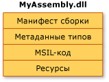
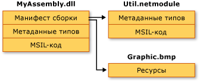

# Содержимое сборокAssembly Contents
В общем случае статическая сборка может состоять из четырех элементов.In general, a static assembly can consist of four elements:  
  
-   [Манифест сборки](../../../docs/framework/app-domains/assembly-manifest.md), который содержит метаданные сборки.The [assembly manifest](../../../docs/framework/app-domains/assembly-manifest.md), which contains assembly metadata.  
  
-   Метаданные типов.Type metadata.  
  
-   Реализующий типы код на промежуточном языке MSIL.Microsoft intermediate language (MSIL) code that implements the types.  
  
-   Набор ресурсов.A set of resources.  
  
 Обязательным является лишь манифест сборки, однако остальные типы ресурсов необходимы для обеспечения нужной функциональности сборки.Only the assembly manifest is required, but either types or resources are needed to give the assembly any meaningful functionality.  
  
 Существует несколько способов группировки этих элементов в сборку.There are several ways to group these elements in an assembly. Все эти элементы можно объединить в одном физическом файле, как показано на следующей иллюстрации.You can group all elements in a single physical file, which is shown in the following illustration.  
  
   
Сборка из одного файлаSingle-file assembly  
  
 Или элементы сборки могут находиться в нескольких файлах.Alternatively, the elements of an assembly can be contained in several files. Эти файлы могут быть модулями скомпилированного кода (.netmodule), ресурсами (например, файлами BMP или JPG) или иными файлами, необходимыми приложению.These files can be modules of compiled code (.netmodule), resources (such as .bmp or .jpg files), or other files required by the application. Сборка из нескольких файлов создается, если необходимо собрать модули, написанные на различных языках, и оптимизировать загрузку приложения, выделяя редко используемые пользовательские типы в модуль, который будет загружаться только при необходимости.Create a multifile assembly when you want to combine modules written in different languages and to optimize downloading an application by putting seldom used types in a module that is downloaded only when needed.  
  
 На следующем рисунке разработчик гипотетического приложения выделил в отдельный модуль некоторый вспомогательный код, а ресурс большого объема (BMP-рисунок) оставил в первоначальном файле.In the following illustration, the developer of a hypothetical application has chosen to separate some utility code into a different module and to keep a large resource file (in this case a .bmp image) in its original file. При использовании .NET Framework загрузка файла выполняется только при ссылке; процесс загрузки кода оптимизируется путем размещения в отдельном файле кода, ссылки на который используются редко.The .NET Framework downloads a file only when it is referenced; keeping infrequently referenced code in a separate file from the application optimizes code download.  
  
   
Сборка из нескольких файловMultifile assembly  
  
> [!NOTE]
>  Файлы, составляющие такую сборку, не являются физически связанными в файловой системе.The files that make up a multifile assembly are not physically linked by the file system. Скорее они связываются друг с другом с помощью манифеста сборки, а среда CLR управляет ими как одним целым.Rather, they are linked through the assembly manifest and the common language runtime manages them as a unit.  
  
 На этом рисунке все три принадлежащих сборке файла описаны в манифесте сборки, который находится в файле MyAssembly.dll.In this illustration, all three files belong to an assembly, as described in the assembly manifest contained in MyAssembly.dll. Для файловой системы они являются тремя различными файлами.To the file system, they are three separate files. Обратите внимание: Util.netmodule был скомпилирован как модуль, поскольку он не содержит данных о сборке.Note that the file Util.netmodule was compiled as a module because it contains no assembly information. При создании сборки ее манифест был добавлен в файл MyAssembly.dll, чтобы связать сборку с файлами Util.netmodule и Graphic.bmp.When the assembly was created, the assembly manifest was added to MyAssembly.dll, indicating its relationship with Util.netmodule and Graphic.bmp.  
  
 При проектировании исходного кода необходимо принять определенные решения о способе разделения функций приложения между одним или несколькими файлами.As you currently design your source code, you make explicit decisions about how to partition the functionality of your application into one or more files. При проектировании кода .NET Framework необходимо принять аналогичные решения о способе разделения функций между одной или несколькими сборками.When designing .NET Framework code, you will make similar decisions about how to partition the functionality into one or more assemblies.  
  
## См. такжеSee also
- [Сборки в среде CLRAssemblies in the Common Language Runtime](../../../docs/framework/app-domains/assemblies-in-the-common-language-runtime.md)
- [Манифест сборкиAssembly Manifest](../../../docs/framework/app-domains/assembly-manifest.md)
- [Вопросы безопасности сборокAssembly Security Considerations](../../../docs/framework/app-domains/assembly-security-considerations.md)
