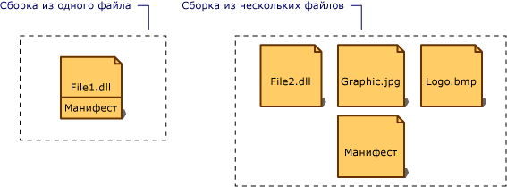

# Манифест сборки
Любая сборка, статическая или динамическая, содержит коллекцию данных с описанием того, как ее элементы связаны друг с другом. Эти метаданные содержатся в манифесте сборки. Манифест сборки содержит все метаданные, необходимые для задания требований сборки к версиям и удостоверения безопасности, а также все метаданные, необходимые для определения области действия сборки и разрешения ссылок на ресурсы и классы. Манифест сборки может храниться в PE-файле (EXE или DLL) с кодом MSIL или же в отдельном PE-файле, содержащем только данные манифеста.  
  
 На следующей иллюстрации показаны различные способы хранения манифеста сборки.  
  
   
Типы сборок  
  
 Для сборки с одним связанным файлом манифест включается в PE-файл, чтобы получить однофайловую сборку. Создать многофайловую сборку можно, включив в нее отдельный файл манифеста или же добавив манифест в один из PE-файлов сборки.  
  
 Манифест сборки предназначен для следующих задач:  
  
-   перечисление файлов, составляющих сборку;  
  
-   сопоставление ссылок на типы и ресурсы сборки с файлами, содержащими объявления и реализации этих типов и ресурсов;  
  
-   перечисление других сборок, от которых зависит эта сборка;  
  
-   обеспечение косвенного обращения пользователей сборки к подробностям ее реализации;  
  
-   предоставление собственного описания сборки;  
  
## Содержание манифеста сборки  
 В следующей таблице показаны данные, содержащиеся в манифесте сборки. Первые четыре элемента — имя сборки, номер версии, язык и региональные параметры и данные строгого имени — составляют удостоверение сборки.  
  
|Сведения|Описание:|  
|-----------------|-----------------|  
|Имя сборки|Текстовая строка, задающая имя сборки.|  
|Номер версии|Основной и дополнительный номера версии, номер редакции и номер построения. Среда CLR использует их для применения политики управления версиями.|  
|culture|Сведения о поддерживаемых сборкой языке или региональных параметрах. Эти сведения должны использоваться только для назначения сборки в качестве сопутствующей сборки, содержащей сведения о языке или региональных параметрах (сборка, содержащая сведения о языке и региональных параметрах, автоматически считается сопутствующей).|  
|Данные о строгом имени|Открытый ключ издателя, если для сборки задано строгое имя.|  
|Список всех файлов сборки|Хэш и имя каждого входящего в сборку файла. Обратите внимание, что все входящие в сборку файлы должны находиться в той же папке, что и файл с манифестом сборки.|  
|Сведения о ссылках на типы|Сведения, используемые средой выполнения для сопоставления ссылок на типы с файлами, содержащими их объявления и реализации. Это касается типов, которые экспортируются сборкой.|  
|Сведения о ссылках на сборки|Список других сборок, на которые имеются статические ссылки из данной сборки. Каждая ссылка включает в себя имя зависимой сборки, метаданные сборки (версию, язык и региональные параметры, операционную систему и т.д.) и открытый ключ, если у сборки есть строгое имя.|  
  
 С помощью задания атрибутов сборки в коде можно добавить или изменить некоторые данные в манифесте сборки. Можно изменить данные о версии и информационные атрибуты, включая сведения о товарном знаке, авторском праве, продукте, компании и информационной версии. Полный список атрибутов сборки см. в разделе [Настройка атрибутов сборки](../../../docs/framework/app-domains/set-assembly-attributes.md).  
  
## См. также  
 [Содержимое сборок](../../../docs/framework/app-domains/assembly-contents.md)  
 [Управление версиями сборок](../../../docs/framework/app-domains/assembly-versioning.md)  
 [Создание вспомогательных сборок](../../../docs/framework/resources/creating-satellite-assemblies-for-desktop-apps.md)  
 [Сборки со строгими именами](../../../docs/framework/app-domains/strong-named-assemblies.md)
