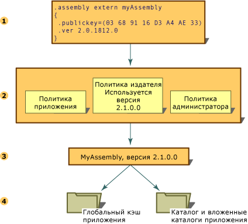

# Управление версиями сборок
Управление версиями сборок, использующих среду CLR, производится полностью на уровне сборки.  Конкретная версия сборки и версии зависимых от нее сборок указываются в манифесте сборки.  Политика управления версиями по умолчанию для среды выполнения заключается в том, что приложения могут выполняться только с версиями, с которыми они были разработаны и протестированы, если иное не переопределено явной политикой использования версий в файлах конфигурации \(в файле конфигурации приложения, файле политики издателя и файле конфигурации администратора компьютера\).  
  
> [!NOTE]
>  Управление версиями выполняется только для сборок со строгими именами.  
  
 Среда выполнения предпринимает несколько шагов для разрешения запроса привязки сборок.  
  
1.  Проверяет исходную ссылку на сборку для определения версии сборки, с которой будет связано приложение.  
  
2.  Проверяет все применимые файлы конфигурации для использования политики управления версиями.  
  
3.  Определяет правильную сборку на основании исходной ссылки на сборку и любого указанного в файлах конфигурации перенаправления, а также версию, которая должна связываться с вызывающей сборкой.  
  
4.  Проверяет глобальный кэш сборок и указанные в файлах конфигурации базы кода, а затем проверяет папку приложения и вложенные папки с помощью правил проверки, описанных в разделе [Обнаружение сборок в среде выполнения](../../../docs/framework/deployment/how-the-runtime-locates-assemblies.md).  
  
 Указанные шаги показаны на следующей иллюстрации.  
  
   
Разрешение запроса привязки сборки  
  
 Дополнительные сведения о настройке приложений см. в разделе [Настройка приложений](../../../docs/framework/configure-apps/index.md).  Дополнительные сведения о политике привязки см. в разделе [Обнаружение сборок в среде выполнения](../../../docs/framework/deployment/how-the-runtime-locates-assemblies.md).  
  
## Сведения о версии  
 В каждой сборке есть два различных способа задания сведений о версии.  
  
-   Номер версии сборки, который наряду с именем сборки и сведениями о языке и региональных параметрах является частью удостоверения сборки.  Это номер используется средой выполнения для применения политики управления версиями и играет ключевую роль в процессе разрешения типов на этапе выполнения.  
  
-   Информационная версия, которая представляет собой строку с дополнительными сведениями о версии, служащую исключительно в информационных целях.  
  
### Номер версии сборки  
 Каждая сборка имеет номер версии, являющийся частью ее удостоверения.  Следовательно, две сборки, имеющие разные номера версий, рассматриваются средой выполнения как совершенно разные сборки.  Этот номер версии физически представляется в виде строки из четырех частей следующего формата:  
  
 \<*основной номер версии*\>.\<*дополнительный номер версии*\>.\<*номер сборки*\>.\<*редакция*\>  
  
 Например, в версии "1.5.1254.0" число "1" представляет основную версию, "5" — младший номер версии, "1254" — номер построения, а "0" — номер редакции.  
  
 Номер версии сохраняется в манифесте сборки вместе с другими данными удостоверения, включая имя сборки и открытый ключ, а также сведения о связях и удостоверениях других подключаемых к приложению сборок.  
  
 При построении сборки средство разработки записывает сведения о зависимостях каждой сборки, на которую имеется ссылка, в манифест сборки.  Среда выполнения использует эти номера версий вместе с конфигурационными данными, установленными администратором, приложением или издателем для загрузки нужной версии сборки, на которую имеется ссылка.  
  
 С целью управления версиями среда выполнения разделяет обычные сборки и сборки со строгими именами.  Проверка версий производится только для сборок со строгими именами.  
  
 Сведения о политике привязки версий см. в разделе [Настройка приложений](../../../docs/framework/configure-apps/index.md).  Дополнительные сведения о способе использования средой выполнения сведений о версии для поиска определенной сборки см. в разделе [Обнаружение сборок в среде выполнения](../../../docs/framework/deployment/how-the-runtime-locates-assemblies.md).  
  
### Информационная версия сборки  
 Информационная версия сборки представляет собой строку, которая добавляет к сборке дополнительные данные и служит только для информации. Она не используется на этапе выполнения.  Информационная версия \(в текстовом формате\) соответствует описанию продукта на рынке, данным о комплектации или названии продукта. Эта версия не используется средой выполнения.  Так, информационная версия может быть задана как "Среда CLR версии 1.0" или "Элемент управления NET с пакетом обновления 2".  В Microsoft Windows эта информация отображается в элементе "Версия продукта" на вкладке "Версии" в диалоговом окне свойств файла.  
  
> [!NOTE]
>  Хотя можно задать любой текст, при компиляции появится предупреждение, если строка имеет формат отличный от формата номера версии сборки или если она имеет правильный формат, но содержит подстановочные знаки.  Это не опасное предупреждение.  
  
 Информационная версия представляется с помощью пользовательского атрибута <xref:System.Reflection.AssemblyInformationalVersionAttribute?displayProperty=fullName>.  Дополнительные сведения об атрибуте информационной версии см. в разделе [Настройка атрибутов сборки](../../../docs/framework/app-domains/set-assembly-attributes.md).  
  
## См. также  
 [Обнаружение сборок в среде выполнения](../../../docs/framework/deployment/how-the-runtime-locates-assemblies.md)   
 [Настройка приложений](../../../docs/framework/configure-apps/index.md)   
 [Настройка атрибутов сборки](../../../docs/framework/app-domains/set-assembly-attributes.md)   
 [Сборки в среде CLR](../../../docs/framework/app-domains/assemblies-in-the-common-language-runtime.md)