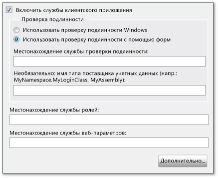
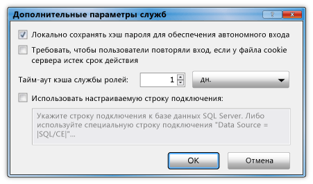

# <a name="how-to-configure-client-application-services"></a><span data-ttu-id="731b9-102">Практическое руководство. Настройка служб клиентских приложений</span><span class="sxs-lookup"><span data-stu-id="731b9-102">How to: Configure Client Application Services</span></span>
<span data-ttu-id="731b9-103">В этом разделе описывается использование [!INCLUDE[vsprvs](../../../includes/vsprvs-md.md)] **конструктора проектов** для включения и настройки служб клиентских приложений.</span><span class="sxs-lookup"><span data-stu-id="731b9-103">This topic describes how to use the [!INCLUDE[vsprvs](../../../includes/vsprvs-md.md)] **Project Designer** to enable and configure client application services.</span></span> <span data-ttu-id="731b9-104">Эти службы позволяют проверять подлинность пользователей, извлекать роли пользователей и параметры из существующей службы приложений [!INCLUDE[ajax_current_short](../../../includes/ajax-current-short-md.md)].</span><span class="sxs-lookup"><span data-stu-id="731b9-104">You can use client application services to validate users and retrieve user roles and settings from an existing [!INCLUDE[ajax_current_short](../../../includes/ajax-current-short-md.md)] application service.</span></span> <span data-ttu-id="731b9-105">После настройки можно получить доступ к включенным службам в коде приложения, как описано в разделе [Общие сведения о службах клиентских приложений](../../../docs/framework/common-client-technologies/client-application-services-overview.md).</span><span class="sxs-lookup"><span data-stu-id="731b9-105">After configuration, you can access the enabled services in your application code as described in [Client Application Services Overview](../../../docs/framework/common-client-technologies/client-application-services-overview.md).</span></span> <span data-ttu-id="731b9-106">Дополнительные сведения о службах приложений [!INCLUDE[ajax_current_short](../../../includes/ajax-current-short-md.md)] см. в разделе [Общие сведения о службах приложений ASP.NET](http://msdn.microsoft.com/library/1162e529-0d70-44b2-b3ab-83e60c695013).</span><span class="sxs-lookup"><span data-stu-id="731b9-106">For more information about the [!INCLUDE[ajax_current_short](../../../includes/ajax-current-short-md.md)] application services, see [ASP.NET Application Services Overview](http://msdn.microsoft.com/library/1162e529-0d70-44b2-b3ab-83e60c695013).</span></span>  
  
 <span data-ttu-id="731b9-107">Включать и настраивать службы клиентских приложений можно на странице **Службы** в **конструкторе проектов**.</span><span class="sxs-lookup"><span data-stu-id="731b9-107">You can enable and configure client application services on the **Services** page of the **Project Designer**.</span></span> <span data-ttu-id="731b9-108">Изменения значений в файле проекта App.config вносятся на странице **Службы**.</span><span class="sxs-lookup"><span data-stu-id="731b9-108">The **Services** page updates values in your project's App.config file.</span></span> <span data-ttu-id="731b9-109">Открыть **конструктор проектов** можно с помощью команды **Свойства** в меню **Проект**.</span><span class="sxs-lookup"><span data-stu-id="731b9-109">To access the **Project Designer**, use the **Properties** command on the **Project** menu.</span></span> <span data-ttu-id="731b9-110">Дополнительные сведения о странице **Службы** см. в разделе [Страница "Службы" в конструкторе проектов](https://msdn.microsoft.com/library/bb398109).</span><span class="sxs-lookup"><span data-stu-id="731b9-110">For more information about the **Services** page, see [Services Page, Project Designer](https://msdn.microsoft.com/library/bb398109).</span></span>  
  
 <span data-ttu-id="731b9-111">В следующей процедуре описывается базовая настройка служб клиентских приложений.</span><span class="sxs-lookup"><span data-stu-id="731b9-111">The following procedure describes how to perform basic configuration for client application services.</span></span> <span data-ttu-id="731b9-112">Расширенные параметры настройки описаны в дальнейших разделах.</span><span class="sxs-lookup"><span data-stu-id="731b9-112">Advanced configuration options are described in later sections.</span></span>  
  
### <a name="to-configure-client-application-services"></a><span data-ttu-id="731b9-113">Настройка служб клиентских приложений</span><span class="sxs-lookup"><span data-stu-id="731b9-113">To configure client application services</span></span>  
  
1.  <span data-ttu-id="731b9-114">В **обозревателе решений** выберите узел проекта, а затем в меню **Проект** щелкните пункт **Свойства**.</span><span class="sxs-lookup"><span data-stu-id="731b9-114">In **Solution Explorer**, select a project node and then on the **Project** menu, click **Properties**.</span></span>  
  
     <span data-ttu-id="731b9-115">Открывается **конструктор проектов**.</span><span class="sxs-lookup"><span data-stu-id="731b9-115">The **Project Designer** appears.</span></span>  
  
2.  <span data-ttu-id="731b9-116">Перейдите на вкладку **Службы**. Будет открыта страница **Службы**, как показано на следующем рисунке.</span><span class="sxs-lookup"><span data-stu-id="731b9-116">Click the **Services** tab. The **Services** page appears, as shown in the following illustration.</span></span>  
  
     <span data-ttu-id="731b9-117"></span><span class="sxs-lookup"><span data-stu-id="731b9-117"></span></span>  
  
3.  <span data-ttu-id="731b9-118">На странице **Службы** установите флажок **Включить службы клиентского приложения**.</span><span class="sxs-lookup"><span data-stu-id="731b9-118">On the **Services** page, select **Enable client application services**.</span></span>  
  
    > [!NOTE]
    >  <span data-ttu-id="731b9-119">Для служб клиентских приложений требуется полная версия .NET Framework, и они не поддерживаются в клиентском профиле .NET Framework.</span><span class="sxs-lookup"><span data-stu-id="731b9-119">Client application services require the full version of the .NET Framework, and are not supported in the .NET Framework Client Profile.</span></span> <span data-ttu-id="731b9-120">Если флажок **Включить службы клиентского приложения** снят, убедитесь, что **Целевая рабочая среда** имеет значение .NET Framework 3.5 или более поздней версии.</span><span class="sxs-lookup"><span data-stu-id="731b9-120">If the **Enable client application services** check box is disabled, verify that the **Target framework** is set to the .NET Framework 3.5 or later.</span></span> <span data-ttu-id="731b9-121">Чтобы просмотреть значение параметра **Целевая рабочая среда** в C#, откройте конструктор проектов и щелкните страницу **Приложение**.</span><span class="sxs-lookup"><span data-stu-id="731b9-121">To view the **Target framework** setting in C#, open the Project Designer and then click the **Application** page.</span></span> <span data-ttu-id="731b9-122">Чтобы просмотреть значение параметра **Целевая рабочая среда** в Visual Basic, откройте конструктор проектов, щелкните страницу **Компиляция** и выберите **Дополнительные параметры компиляции**.</span><span class="sxs-lookup"><span data-stu-id="731b9-122">To view the **Target framework** setting in Visual Basic, open the Project Designer, click the **Compile** page, and then click **Advanced Compile Options**.</span></span>  
  
4.  <span data-ttu-id="731b9-123">Выберите **Использовать проверку подлинности с помощью форм**, если планируется указать собственные элементы управления или окно входа, или выберите **Использовать проверку подлинности Windows**, чтобы использовать учетные данные, предоставляемые операционной системой.</span><span class="sxs-lookup"><span data-stu-id="731b9-123">Select **Use Forms authentication** if you plan to provide your own login controls or dialog box, or select **Use Windows authentication** to use the identity supplied by the operating system.</span></span> <span data-ttu-id="731b9-124">Дополнительные сведения см. в разделе [Общие сведения о службах клиентских приложений](../../../docs/framework/common-client-technologies/client-application-services-overview.md).</span><span class="sxs-lookup"><span data-stu-id="731b9-124">For more information, see [Client Application Services Overview](../../../docs/framework/common-client-technologies/client-application-services-overview.md).</span></span>  
  
    > [!NOTE]
    >  <span data-ttu-id="731b9-125">При выборе **Использовать проверку подлинности Windows** службы клиентских приложений будут автоматически настроены для использования базы данных SQL Server Compact.</span><span class="sxs-lookup"><span data-stu-id="731b9-125">If you select **Use Windows authentication**, client application services will automatically be configured to use a SQL Server Compact database.</span></span> <span data-ttu-id="731b9-126">Это указано в окне **Дополнительные параметры служб**, как описано в следующем разделе.</span><span class="sxs-lookup"><span data-stu-id="731b9-126">This is indicated in the **Advanced Settings for Services** dialog box as described in the next section.</span></span> <span data-ttu-id="731b9-127">Если выбрать **Использовать проверку подлинности с помощью форм**, параметр **Использовать настраиваемую строку подключения** не будет автоматически отключен.</span><span class="sxs-lookup"><span data-stu-id="731b9-127">If you then select **Use Forms authentication**, the **Use custom connection string** setting will not be cleared automatically.</span></span> <span data-ttu-id="731b9-128">Это может привести к ошибкам, если база данных [!INCLUDE[ssEW](../../../includes/ssew-md.md)] уже создана для проверки подлинности Windows.</span><span class="sxs-lookup"><span data-stu-id="731b9-128">This could result in errors if the [!INCLUDE[ssEW](../../../includes/ssew-md.md)] database has already been generated for use with Windows authentication.</span></span> <span data-ttu-id="731b9-129">Чтобы избежать этих ошибок, снимите флажок **Использовать настраиваемую строку подключения** в окне **Дополнительные параметры служб**.</span><span class="sxs-lookup"><span data-stu-id="731b9-129">To fix these errors, clear the **Use custom connection string** setting in the **Advanced Settings for Services** dialog box.</span></span>  
  
5.  <span data-ttu-id="731b9-130">Если выбран параметр **Использовать проверку подлинности с помощью форм**, в поле **Местонахождение службы проверки подлинности** укажите URL-адрес узла службы, не указывая имени файла.</span><span class="sxs-lookup"><span data-stu-id="731b9-130">If you selected **Use Forms authentication**, in the **Authentication service location** box, specify the URL of the service host, not including the file name.</span></span> <span data-ttu-id="731b9-131">Конструктор автоматически добавит стандартное имя файла (Authentication_JSON_AppService.axd) при записи значения в файл конфигурации.</span><span class="sxs-lookup"><span data-stu-id="731b9-131">The designer will automatically append the standard file name (Authentication_JSON_AppService.axd) when it writes the value to the configuration file.</span></span>  
  
6.  <span data-ttu-id="731b9-132">При необходимости, если выбран параметр **Использовать проверку подлинности с помощью форм**, можно указать значение в поле **Поставщик учетных данных**.</span><span class="sxs-lookup"><span data-stu-id="731b9-132">Optionally, if you selected **Use Forms authentication**, you can specify a value in the **Credentials provider** box.</span></span> <span data-ttu-id="731b9-133">Поставщик учетных данных должен реализовать интерфейс <xref:System.Web.ClientServices.Providers.IClientFormsAuthenticationCredentialsProvider>.</span><span class="sxs-lookup"><span data-stu-id="731b9-133">The credentials provider must implement the <xref:System.Web.ClientServices.Providers.IClientFormsAuthenticationCredentialsProvider> interface.</span></span> <span data-ttu-id="731b9-134">Используя поставщик учетных данных, можно отделить интерфейс входа от остального кода приложения.</span><span class="sxs-lookup"><span data-stu-id="731b9-134">By using a credentials provider, you can separate your login user interface from your other application code.</span></span> <span data-ttu-id="731b9-135">Это позволяет создать окно единого входа для использования в нескольких приложениях.</span><span class="sxs-lookup"><span data-stu-id="731b9-135">This enables you to create a single login dialog box for use in multiple applications.</span></span> <span data-ttu-id="731b9-136">Дополнительные сведения см. в разделе [Практическое руководство. Реализация входа пользователя с помощью служб клиентских приложений](../../../docs/framework/common-client-technologies/how-to-implement-user-login-with-client-application-services.md).</span><span class="sxs-lookup"><span data-stu-id="731b9-136">For more information, see [How to: Implement User Login with Client Application Services](../../../docs/framework/common-client-technologies/how-to-implement-user-login-with-client-application-services.md).</span></span>  
  
     <span data-ttu-id="731b9-137">Если указывать поставщика учетных данных, требуется ввести имя типа сборки.</span><span class="sxs-lookup"><span data-stu-id="731b9-137">If you specify a credentials provider, you must specify it as an assembly-qualified type name.</span></span> <span data-ttu-id="731b9-138">Дополнительные сведения см. в разделах <xref:System.Type.AssemblyQualifiedName%2A?displayProperty=nameWithType> и [Имена сборок](../../../docs/framework/app-domains/assembly-names.md).</span><span class="sxs-lookup"><span data-stu-id="731b9-138">For more information, see <xref:System.Type.AssemblyQualifiedName%2A?displayProperty=nameWithType> and [Assembly Names](../../../docs/framework/app-domains/assembly-names.md).</span></span> <span data-ttu-id="731b9-139">В простейшем виде имя типа сборки выглядит примерно так:</span><span class="sxs-lookup"><span data-stu-id="731b9-139">In its simplest form, an assembly-qualified type name looks similar to the following example:</span></span>  
  
    ```  
    MyNamespace.MyLoginClass, MyAssembly  
    ```  
  
7.  <span data-ttu-id="731b9-140">В полях **Местоположение службы ролей** и **Местоположение службы веб-параметров** укажите расположение каждой службы, не указывая имени файла.</span><span class="sxs-lookup"><span data-stu-id="731b9-140">In the **Roles service location** and **Web settings service location** text boxes, specify the service location for each service, not including the file name.</span></span> <span data-ttu-id="731b9-141">Конструктор автоматически добавит стандартные имена файлов (Role_JSON_AppService.axd и Profile_JSON_AppService.axd) при записи значения в файл конфигурации.</span><span class="sxs-lookup"><span data-stu-id="731b9-141">The designer will automatically append the standard file names (Role_JSON_AppService.axd and Profile_JSON_AppService.axd) when it writes the value to the configuration file.</span></span>  
  
8.  <span data-ttu-id="731b9-142">При необходимости нажмите кнопку **Дополнительно** для изменения дополнительных параметров, таких как поведение локального кэширования.</span><span class="sxs-lookup"><span data-stu-id="731b9-142">Optionally, click **Advanced** to modify advanced settings, such as the local caching behavior.</span></span> <span data-ttu-id="731b9-143">Дополнительные сведения см. в следующей процедуре.</span><span class="sxs-lookup"><span data-stu-id="731b9-143">For more information, see the next procedure.</span></span>  
  
## <a name="advanced-configuration"></a><span data-ttu-id="731b9-144">Расширенная конфигурация</span><span class="sxs-lookup"><span data-stu-id="731b9-144">Advanced Configuration</span></span>  
 <span data-ttu-id="731b9-145">В следующих процедурах описывается настройку служб клиентских приложений для менее распространенных сценариев.</span><span class="sxs-lookup"><span data-stu-id="731b9-145">The following procedures describe how to configure client application services for less common scenarios.</span></span> <span data-ttu-id="731b9-146">Например, эти параметры конфигурации можно использовать для приложений, развертываемых в общедоступных местах, или для использования зашифрованной базы данных SQL Server Compact в качестве локального кэша данных.</span><span class="sxs-lookup"><span data-stu-id="731b9-146">For example, you can use these configuration options for applications deployed in public locations, or to use an encrypted SQL Server Compact database as the local data cache.</span></span>  
  
#### <a name="to-configure-advanced-settings-for-client-application-services"></a><span data-ttu-id="731b9-147">Настройка дополнительных параметров для служб клиентских приложений</span><span class="sxs-lookup"><span data-stu-id="731b9-147">To configure advanced settings for client application services</span></span>  
  
1.  <span data-ttu-id="731b9-148">На странице **Службы** в **конструкторе проектов** нажмите кнопку **Дополнительно**.</span><span class="sxs-lookup"><span data-stu-id="731b9-148">On the **Services** page of the **Project Designer**, click **Advanced**.</span></span>  
  
     <span data-ttu-id="731b9-149">Откроется диалоговое окно **Дополнительные параметры служб**, как показано на следующем рисунке.</span><span class="sxs-lookup"><span data-stu-id="731b9-149">The **Advanced Settings for Services** dialog box appears, as shown in the following illustration.</span></span> <span data-ttu-id="731b9-150">Дополнительные сведения об этом диалоговом окне см. в разделе [Диалоговое окно "Дополнительные параметры служб"](/visualstudio/ide/reference/advanced-settings-for-services-dialog-box).</span><span class="sxs-lookup"><span data-stu-id="731b9-150">For more information about this dialog box, see [Advanced Settings for Services Dialog Box](/visualstudio/ide/reference/advanced-settings-for-services-dialog-box).</span></span>  
  
     <span data-ttu-id="731b9-151"></span><span class="sxs-lookup"><span data-stu-id="731b9-151"></span></span>  
  
2.  <span data-ttu-id="731b9-152">Установите или снимите флажок **Локально сохранять хэш пароля для обеспечения входа вне сети**.</span><span class="sxs-lookup"><span data-stu-id="731b9-152">Select or clear **Save password hash locally to enable offline login**.</span></span> <span data-ttu-id="731b9-153">При выборе этого параметра зашифрованный пароль пользователя будут кэширован локально.</span><span class="sxs-lookup"><span data-stu-id="731b9-153">When you select this option, an encrypted form of the user's password will be cached locally.</span></span> <span data-ttu-id="731b9-154">Это удобно при реализации автономного режима работы приложения.</span><span class="sxs-lookup"><span data-stu-id="731b9-154">This is useful if you implement offline mode for your application.</span></span> <span data-ttu-id="731b9-155">При выборе этого параметра можно выполнять проверку подлинности пользователей, даже если свойству <xref:System.Web.ClientServices.ConnectivityStatus.IsOffline%2A> было задано значение `true`.</span><span class="sxs-lookup"><span data-stu-id="731b9-155">With this option selected, you can validate users even when the <xref:System.Web.ClientServices.ConnectivityStatus.IsOffline%2A> property has been set to `true`.</span></span>  
  
3.  <span data-ttu-id="731b9-156">Установите или снимите флажок **Требовать, чтобы пользователи повторяли вход, если у файла cookie сервера истек срок действия**.</span><span class="sxs-lookup"><span data-stu-id="731b9-156">Select or clear **Require users to log on again whenever the server cookie expires**.</span></span> <span data-ttu-id="731b9-157">Файл cookie для проверки подлинности настраивается в удаленной службе и указывает, в течение какого времени действует учетная запись пользователя.</span><span class="sxs-lookup"><span data-stu-id="731b9-157">The authentication cookie is configured on the remote service, and indicates how long a user's login will remain active.</span></span> <span data-ttu-id="731b9-158">Дополнительные сведения о настройке файла cookie см. в атрибуте `timeout` в разделе [Элемент "forms" для проверки подлинности (схема параметров ASP.NET)](http://msdn.microsoft.com/library/8163b8b5-ea6c-46c8-b5a9-c4c3de31c0b3).</span><span class="sxs-lookup"><span data-stu-id="731b9-158">For more information about how to configure the cookie, see the `timeout` attribute in [forms Element for authentication (ASP.NET Settings Schema)](http://msdn.microsoft.com/library/8163b8b5-ea6c-46c8-b5a9-c4c3de31c0b3).</span></span>  
  
     <span data-ttu-id="731b9-159">Если установить этот флажок, то при попытке доступа к удаленным ролям или службам веб-параметров после истечения срока действия файла cookie для проверки подлинности возникнет исключение <xref:System.Net.WebException>.</span><span class="sxs-lookup"><span data-stu-id="731b9-159">If you select this option, attempting to access the remote roles or Web settings services after the authentication cookie has expired will throw a <xref:System.Net.WebException>.</span></span> <span data-ttu-id="731b9-160">Это исключение можно обработать и снова отобразить окно входа для повторной проверки пользователей.</span><span class="sxs-lookup"><span data-stu-id="731b9-160">You can handle this exception and display a login dialog box to revalidate users.</span></span> <span data-ttu-id="731b9-161">Пример этого поведения см. в разделе [Пошаговое руководство. Использование служб клиентских приложений](../../../docs/framework/common-client-technologies/walkthrough-using-client-application-services.md).</span><span class="sxs-lookup"><span data-stu-id="731b9-161">For an example of this behavior, see [Walkthrough: Using Client Application Services](../../../docs/framework/common-client-technologies/walkthrough-using-client-application-services.md).</span></span> <span data-ttu-id="731b9-162">Этот параметр полезен при развертывании приложений в общедоступных системах, чтобы пользователи, которые прекратили пользоваться приложением, не входили в систему автоматически.</span><span class="sxs-lookup"><span data-stu-id="731b9-162">This option is useful for applications deployed in public locations to make sure that users who leave the application running after use will not remain authenticated indefinitely.</span></span>  
  
     <span data-ttu-id="731b9-163">Если снять этот флажок, при попытке доступа к удаленным службам после истечения срока действия файла cookie для проверки подлинности будет автоматически выполнена проверка пользователя.</span><span class="sxs-lookup"><span data-stu-id="731b9-163">If you clear this option and attempt to access the remote services after the authentication cookie has expired, users will be revalidated automatically.</span></span>  
  
4.  <span data-ttu-id="731b9-164">Укажите значение для параметра **Тайм-аут кэша службы ролей**.</span><span class="sxs-lookup"><span data-stu-id="731b9-164">Specify a value for **Role service cache timeout**.</span></span> <span data-ttu-id="731b9-165">Установите небольшой срок действия для часто обновляемых ролей и более длительный срок для редко обновляемых ролей.</span><span class="sxs-lookup"><span data-stu-id="731b9-165">Set this time interval to a small value when roles are updated frequently or to a larger value when roles are updated infrequently.</span></span> <span data-ttu-id="731b9-166">При реализации автономного режима установите длительный срок, чтобы срок действия сведений о ролях не истек, пока приложение находится в автономном режиме.</span><span class="sxs-lookup"><span data-stu-id="731b9-166">If you implement offline mode, set the time interval to a large value to prevent the role information from expiring while the application is offline.</span></span>  
  
     <span data-ttu-id="731b9-167">Поставщик ролей получает кэшированные значения ролей или службы ролей при вызове метода <xref:System.Web.Security.RolePrincipal.IsInRole%2A>.</span><span class="sxs-lookup"><span data-stu-id="731b9-167">The role provider accesses the cached role values or the roles service when you call the <xref:System.Web.Security.RolePrincipal.IsInRole%2A> method.</span></span> <span data-ttu-id="731b9-168">Для программного сброса кэша и принудительного доступа к удаленной службе требуется вызвать метод <xref:System.Web.ClientServices.Providers.ClientRoleProvider.ResetCache%2A>.</span><span class="sxs-lookup"><span data-stu-id="731b9-168">To programmatically reset the cache and force this method to access the remote service, call the <xref:System.Web.ClientServices.Providers.ClientRoleProvider.ResetCache%2A> method.</span></span>  
  
5.  <span data-ttu-id="731b9-169">Установите или снимите флажок **Использовать настраиваемую строку подключения**.</span><span class="sxs-lookup"><span data-stu-id="731b9-169">Select or clear **Use custom connection string**.</span></span> <span data-ttu-id="731b9-170">Дополнительные сведения см. в следующей процедуре.</span><span class="sxs-lookup"><span data-stu-id="731b9-170">For more information, see the next procedure.</span></span>  
  
#### <a name="to-configure-client-application-services-to-use-a-database-for-the-local-cache"></a><span data-ttu-id="731b9-171">Настройка служб клиентских приложений для использования базы данных локального кэша</span><span class="sxs-lookup"><span data-stu-id="731b9-171">To configure client application services to use a database for the local cache</span></span>  
  
1.  <span data-ttu-id="731b9-172">На странице **Службы** в **конструкторе проектов** нажмите кнопку **Дополнительно**.</span><span class="sxs-lookup"><span data-stu-id="731b9-172">On the **Services** page of the **Project Designer**, click **Advanced**.</span></span>  
  
     <span data-ttu-id="731b9-173">Откроется диалоговое окно **Дополнительные параметры служб**.</span><span class="sxs-lookup"><span data-stu-id="731b9-173">The **Advanced Settings for Services** dialog box appears.</span></span>  
  
2.  <span data-ttu-id="731b9-174">Выберите параметр **Использовать настраиваемую строку подключения**.</span><span class="sxs-lookup"><span data-stu-id="731b9-174">Select **Use custom connection string**.</span></span>  
  
     <span data-ttu-id="731b9-175">В текстовом поле отобразится значение по умолчанию `Data Source = |SQL/CE|`.</span><span class="sxs-lookup"><span data-stu-id="731b9-175">The default value of `Data Source = |SQL/CE|` appears in the text box.</span></span>  
  
3.  <span data-ttu-id="731b9-176">Для создания и использования базы данных SQL Server Compact оставьте значение по умолчанию строки подключения.</span><span class="sxs-lookup"><span data-stu-id="731b9-176">To generate and use a SQL Server Compact database, keep the default connection string value.</span></span> [!INCLUDE[vsprvs](../../../includes/vsprvs-md.md)]<span data-ttu-id="731b9-177"> создаст файл базы данных и поместит его в каталог, указанный свойством <xref:System.Windows.Forms.Application.UserAppDataPath%2A?displayProperty=nameWithType>.</span><span class="sxs-lookup"><span data-stu-id="731b9-177"> will generate a database file and put it in the directory indicated by the <xref:System.Windows.Forms.Application.UserAppDataPath%2A?displayProperty=nameWithType> property.</span></span>  
  
4.  <span data-ttu-id="731b9-178">Для создания и использования зашифрованной базы данных [!INCLUDE[ssEW](../../../includes/ssew-md.md)] добавьте значения `password` и `encrypt database` в строку подключения, как показано в следующем примере.</span><span class="sxs-lookup"><span data-stu-id="731b9-178">To generate and use an encrypted [!INCLUDE[ssEW](../../../includes/ssew-md.md)] database, add `password` and `encrypt database` values to the connection string as shown in the following example.</span></span>  
  
    > [!NOTE]
    >  <span data-ttu-id="731b9-179">Обязательно используйте надежный пароль.</span><span class="sxs-lookup"><span data-stu-id="731b9-179">Be sure to specify a strong password.</span></span> <span data-ttu-id="731b9-180">После создания базы данных изменить пароль нельзя.</span><span class="sxs-lookup"><span data-stu-id="731b9-180">You cannot change the password after the database is generated.</span></span>  
  
    ```  
    Data Source = |SQL/CE|;password=<password>;encrypt database=true  
    ```  
  
5.  <span data-ttu-id="731b9-181">Чтобы использовать собственную базу данных [!INCLUDE[ssNoVersion](../../../includes/ssnoversion-md.md)], укажите собственную строку подключения.</span><span class="sxs-lookup"><span data-stu-id="731b9-181">To use your own [!INCLUDE[ssNoVersion](../../../includes/ssnoversion-md.md)] database, specify your own connection string.</span></span> <span data-ttu-id="731b9-182">Дополнительные сведения о форматах строки подключения см. в документации к [!INCLUDE[ssNoVersion](../../../includes/ssnoversion-md.md)].</span><span class="sxs-lookup"><span data-stu-id="731b9-182">For information about valid connection string formats, see the [!INCLUDE[ssNoVersion](../../../includes/ssnoversion-md.md)] documentation.</span></span> <span data-ttu-id="731b9-183">Эта база данных не создается автоматически.</span><span class="sxs-lookup"><span data-stu-id="731b9-183">This database is not generated automatically.</span></span> <span data-ttu-id="731b9-184">Строка подключения должна ссылаться на существующую базу данных, которую можно создать с помощью следующих инструкций SQL.</span><span class="sxs-lookup"><span data-stu-id="731b9-184">The connection string must refer to an existing database that you can create using the following SQL statements.</span></span>  
  
    ```  
    CREATE TABLE ApplicationProperties (PropertyName nvarchar(256),  
        PropertyValue nvarchar(256))  
    CREATE TABLE UserProperties (PropertyName nvarchar(256),  
        PropertyValue nvarchar(256))  
    CREATE TABLE Roles (UserName nvarchar(256),   
        RoleName nvarchar(256))  
    CREATE TABLE Settings (PropertyName nvarchar(256),   
        PropertyStoredAs nvarchar(1), PropertyValue nvarchar(2048))  
    ```  
  
## <a name="using-custom-providers"></a><span data-ttu-id="731b9-185">Использование настраиваемых поставщиков</span><span class="sxs-lookup"><span data-stu-id="731b9-185">Using Custom Providers</span></span>  
 <span data-ttu-id="731b9-186">По умолчанию компонент служб клиентских приложений использует поставщиков в пространстве имен <xref:System.Web.ClientServices.Providers?displayProperty=nameWithType>.</span><span class="sxs-lookup"><span data-stu-id="731b9-186">By default, the client application services feature uses the providers in the <xref:System.Web.ClientServices.Providers?displayProperty=nameWithType> namespace.</span></span> <span data-ttu-id="731b9-187">При настройке приложения с помощью страницы **Службы** в **конструкторе проектов** ссылки на этих поставщиков добавляются в файл App.config.</span><span class="sxs-lookup"><span data-stu-id="731b9-187">When you configure your application by using the **Services** page of the **Project Designer**, references to these providers are added to your App.config file.</span></span> <span data-ttu-id="731b9-188">Эти поставщики по умолчанию получают доступ к соответствующим поставщикам на сервере.</span><span class="sxs-lookup"><span data-stu-id="731b9-188">These default providers access corresponding providers on the server.</span></span> <span data-ttu-id="731b9-189">Веб-службы часто настраивается для доступа к данным пользователя через поставщиков, таких как <xref:System.Web.Security.SqlMembershipProvider> и <xref:System.Web.Security.SqlRoleProvider>.</span><span class="sxs-lookup"><span data-stu-id="731b9-189">Web services are often configured to access user data through providers such as <xref:System.Web.Security.SqlMembershipProvider> and <xref:System.Web.Security.SqlRoleProvider>.</span></span>  
  
 <span data-ttu-id="731b9-190">Если нужно использовать других поставщиков, обычно следует изменить поставщиков на стороне сервера, чтобы изменения действовали для всех клиентских приложений, получающих доступ к серверу.</span><span class="sxs-lookup"><span data-stu-id="731b9-190">If you want to use custom service providers, you will typically change the providers on the server side so that they affect all client applications that access the server.</span></span> <span data-ttu-id="731b9-191">Впрочем, есть возможность использовать других поставщиков и на стороне клиента.</span><span class="sxs-lookup"><span data-stu-id="731b9-191">However, you do have the option of using non-default providers on the client side.</span></span> <span data-ttu-id="731b9-192">В файле App.config можно указать настраиваемых поставщиков проверки подлинности и поставщиков ролей.</span><span class="sxs-lookup"><span data-stu-id="731b9-192">You can specify custom authentication or roles providers in your project's App.config file, as shown in the following procedure.</span></span> <span data-ttu-id="731b9-193">Сведения о создании пользовательской проверки подлинности и поставщиков служб см. в разделах [Реализация поставщика членства](http://msdn.microsoft.com/library/d8658b8e-c962-4f64-95e1-4acce35e4582) и [Реализация поставщика ролей](http://msdn.microsoft.com/library/851671ce-bf9b-43f2-aba4-bc9d28b11c7d).</span><span class="sxs-lookup"><span data-stu-id="731b9-193">For information about how to create custom authentication and role providers, see [Implementing a Membership Provider](http://msdn.microsoft.com/library/d8658b8e-c962-4f64-95e1-4acce35e4582) and [Implementing a Role Provider](http://msdn.microsoft.com/library/851671ce-bf9b-43f2-aba4-bc9d28b11c7d).</span></span> <span data-ttu-id="731b9-194">Также можно использовать настраиваемый поставщик параметров, изменив в проекте класс `Settings` (доступен как `Properties.Settings.Default` в C# и `My.Settings` в [!INCLUDE[vbprvb](../../../includes/vbprvb-md.md)]).</span><span class="sxs-lookup"><span data-stu-id="731b9-194">You can also use a custom settings provider by modifying your project's `Settings` class (accessed as `Properties.Settings.Default` in C# and `My.Settings` in [!INCLUDE[vbprvb](../../../includes/vbprvb-md.md)]).</span></span> <span data-ttu-id="731b9-195">Дополнительные сведения см. в разделе [Архитектура параметров приложения](../../../docs/framework/winforms/advanced/application-settings-architecture.md).</span><span class="sxs-lookup"><span data-stu-id="731b9-195">For more information, see [Application Settings Architecture](../../../docs/framework/winforms/advanced/application-settings-architecture.md).</span></span>  
  
#### <a name="to-configure-client-application-services-to-use-non-default-providers"></a><span data-ttu-id="731b9-196">Настройка служб клиентских приложений для использования поставщиков, отличных от поставщиков по умолчанию</span><span class="sxs-lookup"><span data-stu-id="731b9-196">To configure client application services to use non-default providers</span></span>  
  
1.  <span data-ttu-id="731b9-197">Для использования настраиваемых поставщиков проверки подлинности или служб ролей сначала нужно задать значения прочим параметрам на странице **Службы**.</span><span class="sxs-lookup"><span data-stu-id="731b9-197">To use a non-default authentication or roles service provider, first complete all other configuration settings by using the **Services** page.</span></span>  
  
2.  <span data-ttu-id="731b9-198">Закройте **конструктор проектов**.</span><span class="sxs-lookup"><span data-stu-id="731b9-198">Close the **Project Designer**.</span></span> <span data-ttu-id="731b9-199">Это необходимо, так как страница **Службы** будет автоматически обновлять файл App.config, даже если вы не меняете никакие параметры.</span><span class="sxs-lookup"><span data-stu-id="731b9-199">This is necessary because the **Services** page will automatically update your App.config file even if you do not modify any settings.</span></span> <span data-ttu-id="731b9-200">Если изменить файл App.config вручную, как описано в этой процедуре, и затем вернуться на страницу **Службы**, все изменения будут сброшены.</span><span class="sxs-lookup"><span data-stu-id="731b9-200">If you manually modify your App.config file as described in this procedure and then return to the **Services** page, your modifications will be reset.</span></span>  
  
3.  <span data-ttu-id="731b9-201">В **обозревателе решений** дважды щелкните файл App.config.</span><span class="sxs-lookup"><span data-stu-id="731b9-201">In **Solution Explorer**, double-click App.config.</span></span>  
  
     <span data-ttu-id="731b9-202">Файл конфигурации приложения откроется в текстовом редакторе.</span><span class="sxs-lookup"><span data-stu-id="731b9-202">The application configuration file opens in the text editor.</span></span>  
  
4.  <span data-ttu-id="731b9-203">Найдите элемент `<providers>` в элементе `<membership>` или `<roleManager>`.</span><span class="sxs-lookup"><span data-stu-id="731b9-203">Find the `<providers>` element within the `<membership>` or `<roleManager>` element.</span></span> <span data-ttu-id="731b9-204">Это дочерние элементы элемента `<system.web>`.</span><span class="sxs-lookup"><span data-stu-id="731b9-204">These elements are children of the `<system.web>` element.</span></span> <span data-ttu-id="731b9-205">Элемент `<membership>` используется для указания поставщиков проверки подлинности, а элемент `<roleManager>` — для указания поставщиков ролей.</span><span class="sxs-lookup"><span data-stu-id="731b9-205">The `<membership>` element is used to specify authentication providers, and the `<roleManager>` element is used to specify role providers.</span></span>  
  
5.  <span data-ttu-id="731b9-206">Добавьте элемент `<add>` в качестве дочернего для элемента `<providers>`.</span><span class="sxs-lookup"><span data-stu-id="731b9-206">Add an `<add>` element as a child of the `<providers>` element.</span></span> <span data-ttu-id="731b9-207">Необходимо указать атрибуты `name` и `type`, как показано в следующем примере.</span><span class="sxs-lookup"><span data-stu-id="731b9-207">You must specify `name` and `type` attributes as shown in the following example.</span></span> <span data-ttu-id="731b9-208">Значение атрибута `type` должно представлять собой имя типа сборки.</span><span class="sxs-lookup"><span data-stu-id="731b9-208">The `type` attribute value must be an assembly-qualified type name.</span></span> <span data-ttu-id="731b9-209">Дополнительные сведения см. в разделах <xref:System.Type.AssemblyQualifiedName%2A?displayProperty=nameWithType> и [Имена сборок](../../../docs/framework/app-domains/assembly-names.md).</span><span class="sxs-lookup"><span data-stu-id="731b9-209">For more information, see <xref:System.Type.AssemblyQualifiedName%2A?displayProperty=nameWithType> and [Assembly Names](../../../docs/framework/app-domains/assembly-names.md).</span></span>  
  
    ```xml  
    <add name="MyCustomRoleProvider" type="MyNamespace.MyRoleProvider, MyAssembly" />  
    ```  
  
6.  <span data-ttu-id="731b9-210">Измените атрибут `defaultProvider` элемента `<membership>` или `<roleManager>`, чтобы указать значение имени элемента `<add>`, добавленного на предыдущем шаге.</span><span class="sxs-lookup"><span data-stu-id="731b9-210">Modify the `defaultProvider` attribute of the `<membership>` or `<roleManager>` element to specify the name value from the `<add>` element that you added in the previous step.</span></span>  
  
    ```xml  
    <roleManager enabled="true" defaultProvider="MyCustomRoleProvider">  
    ```  
  
## <a name="see-also"></a><span data-ttu-id="731b9-211">См. также</span><span class="sxs-lookup"><span data-stu-id="731b9-211">See Also</span></span>  
 [<span data-ttu-id="731b9-212">Службы клиентских приложений</span><span class="sxs-lookup"><span data-stu-id="731b9-212">Client Application Services</span></span>](../../../docs/framework/common-client-technologies/client-application-services.md)  
 [<span data-ttu-id="731b9-213">Общие сведения о службах клиентских приложений</span><span class="sxs-lookup"><span data-stu-id="731b9-213">Client Application Services Overview</span></span>](../../../docs/framework/common-client-technologies/client-application-services-overview.md)  
 [<span data-ttu-id="731b9-214">Страница "Службы" в конструкторе проектов</span><span class="sxs-lookup"><span data-stu-id="731b9-214">Services Page, Project Designer</span></span>](https://msdn.microsoft.com/library/bb398109)  
 [<span data-ttu-id="731b9-215">Диалоговое окно "Дополнительные параметры служб"</span><span class="sxs-lookup"><span data-stu-id="731b9-215">Advanced Settings for Services Dialog Box</span></span>](/visualstudio/ide/reference/advanced-settings-for-services-dialog-box)  
 [<span data-ttu-id="731b9-216">Практическое руководство. Реализация входа пользователя с помощью служб клиентских приложений</span><span class="sxs-lookup"><span data-stu-id="731b9-216">How to: Implement User Login with Client Application Services</span></span>](../../../docs/framework/common-client-technologies/how-to-implement-user-login-with-client-application-services.md)  
 [<span data-ttu-id="731b9-217">Пошаговое руководство. Использование служб клиентских приложений</span><span class="sxs-lookup"><span data-stu-id="731b9-217">Walkthrough: Using Client Application Services</span></span>](../../../docs/framework/common-client-technologies/walkthrough-using-client-application-services.md)  
 [<span data-ttu-id="731b9-218">Реализация поставщика членства</span><span class="sxs-lookup"><span data-stu-id="731b9-218">Implementing a Membership Provider</span></span>](http://msdn.microsoft.com/library/d8658b8e-c962-4f64-95e1-4acce35e4582)  
 [<span data-ttu-id="731b9-219">Реализация поставщика ролей</span><span class="sxs-lookup"><span data-stu-id="731b9-219">Implementing a Role Provider</span></span>](http://msdn.microsoft.com/library/851671ce-bf9b-43f2-aba4-bc9d28b11c7d)  
 [<span data-ttu-id="731b9-220">Архитектура параметров приложения</span><span class="sxs-lookup"><span data-stu-id="731b9-220">Application Settings Architecture</span></span>](../../../docs/framework/winforms/advanced/application-settings-architecture.md)  
 [<span data-ttu-id="731b9-221">Создание и настройка базы данных служб приложений для SQL Server</span><span class="sxs-lookup"><span data-stu-id="731b9-221">Creating and Configuring the Application Services Database for SQL Server</span></span>](http://msdn.microsoft.com/library/ab894e83-7e2f-4af8-a116-b1bff8f815b2)
