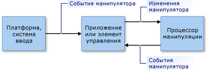

# Общие сведения о манипуляциях и инерции
*Манипуляции* предоставляют пользователям возможность перемещать, поворачивать и изменять размеры элементов пользовательского интерфейса с помощью *манипуляторов*. Манипулятором является мышь или (в сценарии с поддержкой сенсорного ввода) перо либо палец.  
  
 *Инерция* моделирует поведение, характерное для реального мира, для движущихся элементов пользовательского интерфейса, имитируя силы трения в элементах. Это позволяет элементам постепенно замедлять свое движение (линейное и угловое) перед остановкой. В этой статье содержатся вводные сведения о манипуляциях и инерции для .NET Framework.  
  
## Манипуляции  
 Манипуляция воспринимает набор манипуляторов как составной объект. Приложение может отслеживать изменения этого составного объекта вместо отдельных компонентов.  
  
 Рассмотрим следующую иллюстрацию. Пользователь может использовать два манипулятора для перемещения, поворота и масштабирования изображения. Изменения каждого манипулятора интерпретируются вместе с другими манипуляторами.  
  
 Например, если на изображении есть два манипулятора (1 и 2) и манипулятор 1 перемещается в направлении +Y (вниз), изменение изображения зависит от того, что происходит с манипулятором 2. Если манипулятор 2 также перемещается в направлении +Y (вниз), изображение просто перемещается в направлении +Y. Но если манипулятор 2 не изменяется или перемещается в направлении -Y (вверх), изображение становится меньше или поворачивается.  
  
   
  
 Изображение, управляемое двумя манипуляторами  
  
 Обработка манипуляции обеспечивает инфраструктуру, которая наблюдает за подмножеством манипуляторов и интерпретирует их, как если бы они действовали вместе, а не независимо друг от друга. Можно создать несколько объектов обработчика манипуляции одновременно, по одному для каждого элемента пользовательского интерфейса, с которым выполняются манипуляции в приложении. Обработчик манипуляции информирован о том, какие устройства ввода следует наблюдать, и сообщает о манипуляциях с помощью [событий .NET](http://msdn.microsoft.com/library/17sde2xt.aspx).  
  
 Обработчик манипуляции не имеет сведений о конкретном элементе, с которым выполняется манипуляция. Приложение по отдельности применяет изменения к элементу конкретного приложения. Например, приложение применяет преобразования к изображению или перерисовывает его для отображения в новом месте или с новыми размерами или ориентацией.  
  
 Манипуляции предназначены для двумерных (2-D) [аффинных преобразований](http://msdn.microsoft.com/library/ms533810\(VS.85\).aspx). Эти преобразования включают перемещение, поворот и масштабирование.  
  
### Части манипуляции  
 Манипуляция представляет собой коллекцию объектов <xref:System.Windows.Input.Manipulations.Manipulator2D>. Эта агрегатная манипуляция представляется исходной точкой и эллипсом. Исходная точка — это среднее положение всех манипуляторов, используемых для манипуляции элементом. Эллипс имеет радиус, представляющий собой среднее расстояние от исходной точки до каждого из объектов <xref:System.Windows.Input.Manipulations.Manipulator2D>.  
  
   
  
 Манипуляция задается двумя манипуляторами (1 и 2), исходной точкой и эллипсом.  
  
 Когда манипуляторы добавляются, перемещаются или удаляются для элемента пользовательского интерфейса, приложение обновляет объект <xref:System.Windows.Input.Manipulations.ManipulationProcessor2D> путем вызова метода <xref:System.Windows.Input.Manipulations.ManipulationProcessor2D.ProcessManipulators%2A>. В начале манипуляции возникает событие <xref:System.Windows.Input.Manipulations.ManipulationProcessor2D.Started>.  
  
> [!NOTE]
>  Обработка манипуляции более эффективна при использовании в среде фреймового обновления. При использовании обработки манипуляции в приложении Microsoft XNA это не имеет значения, так как инфраструктура XNA предоставляет фреймовые обновления с помощью метода [Game.Update](http://msdn.microsoft.com/library/microsoft.xna.framework.game.update.aspx). В другой среде (например, в WinForms) может понадобиться предоставить собственную фреймовую логику для сбора манипуляций и их периодической отправки в метод <xref:System.Windows.Input.Manipulations.ManipulationProcessor2D.ProcessManipulators%2A> в виде пакета.  
  
 При изменении числа манипуляторов или их положения возникает событие <xref:System.Windows.Input.Manipulations.ManipulationProcessor2D.Delta>. Свойства объекта <xref:System.Windows.Input.Manipulations.Manipulation2DDeltaEventArgs>, который передается в обработчик события <xref:System.Windows.Input.Manipulations.ManipulationProcessor2D.Delta>, определяют изменения в исходной точке, масштабе, повороте и перемещении, произошедшие с момента последнего события. Исходная точка манипуляции изменяется при перемещении манипуляторов, а также при добавлении или удалении манипуляторов. Значения перемещения указывают, какое перемещение по оси X или Y включает эта манипуляция.  
  
 С помощью этих новых значений приложение перерисовывает элемент пользовательского интерфейса.  
  
   
  
 Манипулятор 1 перемещается и приводит к изменению исходной точки.  
  
 Когда последний манипулятор, связанный с манипуляцией, удаляется из объекта <xref:System.Windows.Input.Manipulations.ManipulationProcessor2D>, возникает событие <xref:System.Windows.Input.Manipulations.ManipulationProcessor2D.Completed>  
  
### Модель обработки манипуляции  
 Обработчик манипуляции использует модель прямого использования. В этой простой модели приложение должно передавать обработчику манипуляции все сведения о событиях ввода. Событие ввода может быть вызвано любым примитивом ввода, таким как устройство мыши, перо или палец. Этот процесс обеспечивает механизм прямой фильтрации и простую модель использования, поэтому приложение при необходимости может объединять события ввода в пакет.  
  
 Чтобы приложение включило примитив ввода в процесс манипуляции, создается структура <xref:System.Windows.Input.Manipulations.Manipulator2D> из сведений примитива ввода, а затем эта структура передается в обработчик манипуляции с помощью метода <xref:System.Windows.Input.Manipulations.ManipulationProcessor2D.ProcessManipulators%2A>. Затем обработчик манипуляции инициирует события, которые приложение должно обработать, чтобы обновить визуальный компонент соответствующим образом.  
  
   
  
 Модель обработки манипуляции  
  
## Инерция  
 Обработчик инерции позволяет приложениям экстраполировать расположение, ориентацию и другие свойства элемента пользовательского интерфейса, имитируя поведение, существующее в реальном мире.  
  
 Например, когда пользователь ударяет элемент, он может продолжить движение, замедлиться и затем медленно остановиться. Обработчик инерции реализует это поведение, вызывая изменение аффинных двумерных значений (исходной точки, масштаба, перемещения и поворота) в течение указанного времени с заданной скоростью замедления.  
  
 Как и при обработке манипуляции, обработчик инерции не имеет сведений ни об одном конкретном элементе пользовательского интерфейса. В ответ на события, возникающие в объекте <xref:System.Windows.Input.Manipulations.InertiaProcessor2D>, приложение по-отдельности применяет изменения к элементу конкретного приложения.  
  
 Обработка инерции и обработка манипуляции часто используются совместно. Их интерфейсы аналогичны, и события, которые они вызывают, идентичны (в некоторых случаях). Обычно обработка инерции начинается после завершения манипуляции с элементом пользовательского интерфейса. Это достигается путем прослушивания события <xref:System.Windows.Input.Manipulations.ManipulationProcessor2D.Completed> и запуска обработки инерции из обработчика этого события.  
  
## См. также  
 <xref:System.Windows.Input.Manipulations>
