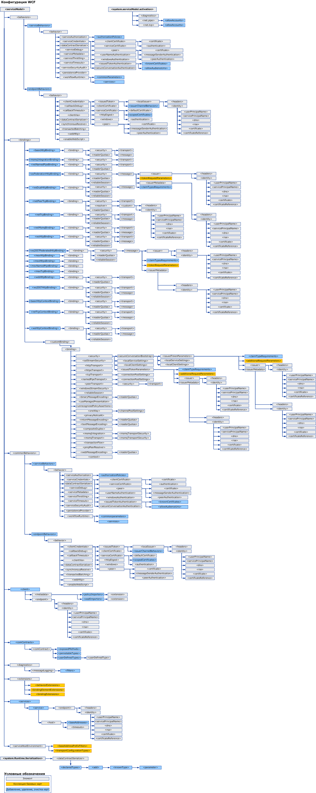

# Схем конфигурации WCF
Элементы конфигурации [!INCLUDE[indigo1](../../../../../includes/indigo1-md.md)] позволяют настроить службу [!INCLUDE[indigo2](../../../../../includes/indigo2-md.md)] и клиентские приложения. [Средство редактирования конфигурации (SvcConfigEditor.exe)](../../../../../docs/framework/wcf/configuration-editor-tool-svcconfigeditor-exe.md) можно использовать для создания и изменения файлов конфигурации для клиентов и служб. Поскольку файлы конфигурации имеют формат XML, для их изменения вручную с помощью текстового редактора необходимо уметь работать с XML-кодом. В противном случае возможно возникновение проблем, таких как отсутствие тега или атрибута элемента XML. Это обусловлено тем, что в тегах и атрибутах элементов XML учитывается регистр символов.  
  
 Система конфигурации [!INCLUDE[indigo2](../../../../../includes/indigo2-md.md)] основана на пространстве имен <xref:System.Configuration>. Поэтому можно использовать все стандартные функции, имеющиеся в пространстве имен <xref:System.Configuration>, например блокировку, шифрование и объединение конфигурации для повышения безопасности приложения и его конфигурации. Дополнительные сведения об этих возможностях см. в следующих разделах:  
  
 [Шифрование данных конфигурации](http://go.microsoft.com/fwlink/?LinkId=95337)  
  
 [Блокировка параметров конфигурации](http://go.microsoft.com/fwlink/?LinkId=95338)  
  
 В этом разделе описаны все возможные значения каждого элемента конфигурации и их взаимодействие с другими элементами конфигурации WCF. На следующей иллюстрации показана схема конфигурации WCF.  
  
   
  
> [!CAUTION]
>  Необходимо защищать разделы конфигурации [!INCLUDE[indigo2](../../../../../includes/indigo2-md.md)] в файлах конфигурации приложения (app.config) с помощью соответствующих списков управления доступом (ACL), чтобы предотвратить потенциальные угрозы безопасности.  Например, необходимо гарантировать, что иметь доступ или изменять параметры безопасности в привязках приложения или разделе модели службы в файле конфигурации для службы смогут только определенные лица.  
  
## Содержание  
 [\<system.serviceModel>](../../../../../docs/framework/configure-apps/file-schema/wcf/system-servicemodel.md)  
 Приводится описание элемента `ServiceModel`.  
  
 [\<system.serviceModel.activation>](../../../../../docs/framework/configure-apps/file-schema/wcf/system-servicemodel-activation.md)  
 Настраивает средство SMSvcHost.exe.  
  
 [\<system.runtime.serialization>](../../../../../docs/framework/configure-apps/file-schema/wcf/system-runtime-serialization.md)  
 Элемент верхнего уровня для установки параметров при использовании сериализаторов, таких как <xref:System.Runtime.Serialization.DataContractSerializer>.  
  
## Связанные разделы  
 [Настройка приложений Windows Communication Foundation](http://msdn.microsoft.com/en-us/13cb368e-88d4-4c61-8eed-2af0361c6d7a)  
 Описывает настройку служб и клиентов [!INCLUDE[indigo2](../../../../../includes/indigo2-md.md)].
