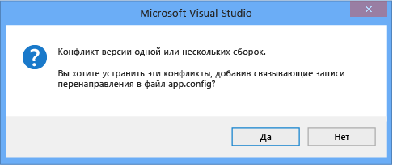

# <a name="how-to-enable-and-disable-automatic-binding-redirection"></a><span data-ttu-id="0137d-102">Практическое руководство. Включение и отключение автоматического перенаправления привязки</span><span class="sxs-lookup"><span data-stu-id="0137d-102">How to: Enable and Disable Automatic Binding Redirection</span></span>

<span data-ttu-id="0137d-103">При компиляции приложения в Visual Studio, предназначенных [!INCLUDE[net_v451](../../../includes/net-v451-md.md)] и более поздних версиях перенаправление привязки могут быть автоматически добавлены в файл конфигурации приложения для переопределения унификации сборок.</span><span class="sxs-lookup"><span data-stu-id="0137d-103">When you compile apps in Visual Studio that target the [!INCLUDE[net_v451](../../../includes/net-v451-md.md)] and later versions, binding redirects may be automatically added to the app configuration file to override assembly unification.</span></span> <span data-ttu-id="0137d-104">Переадресации привязок добавляются, если приложение или его компоненты ссылаются на несколько версий одной сборки, даже если вручную указать переадресации привязок в файле конфигурации приложения.</span><span class="sxs-lookup"><span data-stu-id="0137d-104">Binding redirects are added if your app or its components reference more than one version of the same assembly, even if you manually specify binding redirects in the configuration file for your app.</span></span> <span data-ttu-id="0137d-105">Возможность автоматической переадресации привязки затрагивает Классические приложения и веб-приложения, предназначенные [!INCLUDE[net_v451](../../../includes/net-v451-md.md)] или более поздней версии, несмотря на то, что поведение несколько отличается для веб-приложения.</span><span class="sxs-lookup"><span data-stu-id="0137d-105">The automatic binding redirection feature affects desktop apps and web apps that target the [!INCLUDE[net_v451](../../../includes/net-v451-md.md)] or a later version, although the behavior is slightly different for a web app.</span></span> <span data-ttu-id="0137d-106">Вы можете включить автоматическое перенаправление привязки, при наличии существующих приложений, нацеленных на предыдущие версии платформы .NET Framework, или можно отключить эту функцию, если вы хотите вручную создавать переадресации привязок.</span><span class="sxs-lookup"><span data-stu-id="0137d-106">You can enable automatic binding redirection if you have existing apps that target previous versions of the .NET Framework, or you can disable this feature if you want to manually author binding redirects.</span></span>

## <a name="disable-automatic-binding-redirects-in-desktop-apps"></a><span data-ttu-id="0137d-107">Отключить автоматические переадресации привязок в классических приложениях</span><span class="sxs-lookup"><span data-stu-id="0137d-107">Disable automatic binding redirects in desktop apps</span></span>

<span data-ttu-id="0137d-108">Автоматические переадресации привязки включены по умолчанию для классических приложений Windows, предназначенных для [!INCLUDE[net_v451](../../../includes/net-v451-md.md)] и более поздних версий.</span><span class="sxs-lookup"><span data-stu-id="0137d-108">Automatic binding redirects are enabled by default for Windows desktop apps that target the [!INCLUDE[net_v451](../../../includes/net-v451-md.md)] and later versions.</span></span> <span data-ttu-id="0137d-109">Переадресации привязок добавляются в выходные данные конфигурацию (**app.config**) файла, при компиляции приложения и переопределить унификацию сборок, которая в противном случае может иметь место.</span><span class="sxs-lookup"><span data-stu-id="0137d-109">The binding redirects are added to the output configuration (**app.config**) file when the app is compiled and override the assembly unification that might otherwise take place.</span></span> <span data-ttu-id="0137d-110">Источник **app.config** файл не изменяется.</span><span class="sxs-lookup"><span data-stu-id="0137d-110">The source **app.config** file is not modified.</span></span> <span data-ttu-id="0137d-111">Эту функцию можно отключить, изменив файл проекта для приложения или сняв флажок в свойствах проекта в Visual Studio.</span><span class="sxs-lookup"><span data-stu-id="0137d-111">You can disable this feature by modifying the project file for the app or by deselecting a checkbox in the project's properties in Visual Studio.</span></span>

### <a name="disable-through-project-properties"></a><span data-ttu-id="0137d-112">Отключение через свойства проекта</span><span class="sxs-lookup"><span data-stu-id="0137d-112">Disable through project properties</span></span>

<span data-ttu-id="0137d-113">Если у вас есть Visual Studio 2017 версии 15.7 или более поздней версии, автоматически созданные переадресации привязок в страницах свойств проекта можно легко отключить.</span><span class="sxs-lookup"><span data-stu-id="0137d-113">If you have Visual Studio 2017 version 15.7 or later, you can easily disable autogenerated binding redirects in the project's property pages.</span></span>

1. <span data-ttu-id="0137d-114">В **обозревателе решений** щелкните проект правой кнопкой мыши и выберите пункт **Свойства**.</span><span class="sxs-lookup"><span data-stu-id="0137d-114">Right-click the project in **Solution Explorer** and select **Properties**.</span></span>

2. <span data-ttu-id="0137d-115">На **приложения** странице, снимите флажок **автоматического создания переадресации привязок** параметр.</span><span class="sxs-lookup"><span data-stu-id="0137d-115">On the **Application** page, uncheck the **Auto-generate binding redirects** option.</span></span>

3. <span data-ttu-id="0137d-116">Нажмите клавишу **Ctrl**+**S** для сохранения изменений.</span><span class="sxs-lookup"><span data-stu-id="0137d-116">Press **Ctrl**+**S** to save the change.</span></span>

### <a name="disable-manually-in-the-project-file"></a><span data-ttu-id="0137d-117">Отключить вручную в файле проекта</span><span class="sxs-lookup"><span data-stu-id="0137d-117">Disable manually in the project file</span></span>

1. <span data-ttu-id="0137d-118">Откройте файл проекта для редактирования с помощью одного из следующих методов:</span><span class="sxs-lookup"><span data-stu-id="0137d-118">Open the project file for editing using one of the following methods:</span></span>

   - <span data-ttu-id="0137d-119">В Visual Studio выберите проект в **обозревателе решений**, а затем выберите **открыть папку в проводнике** в контекстном меню.</span><span class="sxs-lookup"><span data-stu-id="0137d-119">In Visual Studio, select the project in **Solution Explorer**, and then choose **Open Folder in File Explorer** from the shortcut menu.</span></span> <span data-ttu-id="0137d-120">В проводнике найдите файл проекта (CSPROJ или VBPROJ) и откройте его в блокноте.</span><span class="sxs-lookup"><span data-stu-id="0137d-120">In File Explorer, find the project (.csproj or .vbproj) file and open it in Notepad.</span></span>
   - <span data-ttu-id="0137d-121">В Visual Studio в **обозревателе решений**, щелкните правой кнопкой мыши проект и выберите пункт **выгрузить проект**.</span><span class="sxs-lookup"><span data-stu-id="0137d-121">In Visual Studio, in **Solution Explorer**, right-click the project and choose **Unload Project**.</span></span> <span data-ttu-id="0137d-122">Щелкните правой кнопкой мыши выгруженного проекта, а затем выберите **изменить [projectname.csproj]**.</span><span class="sxs-lookup"><span data-stu-id="0137d-122">Right-click the unloaded project again, and then choose **Edit [projectname.csproj]**.</span></span>

2. <span data-ttu-id="0137d-123">Найдите в файле проекта следующую запись свойства:</span><span class="sxs-lookup"><span data-stu-id="0137d-123">In the project file, find the following property entry:</span></span>

   ```xml
   <AutoGenerateBindingRedirects>true</AutoGenerateBindingRedirects>
   ```

3. <span data-ttu-id="0137d-124">Измените `true` на `false`:</span><span class="sxs-lookup"><span data-stu-id="0137d-124">Change `true` to `false`:</span></span>

   ```xml
   <AutoGenerateBindingRedirects>false</AutoGenerateBindingRedirects>
   ```

## <a name="enable-automatic-binding-redirects-manually"></a><span data-ttu-id="0137d-125">Вручную включить автоматические переадресации привязок</span><span class="sxs-lookup"><span data-stu-id="0137d-125">Enable automatic binding redirects manually</span></span>

<span data-ttu-id="0137d-126">Вы можете включить автоматические переадресации привязок в существующих приложениях, целевой объект более старые версии платформы .NET Framework, а также в случаях, где вам будет предложено автоматически Добавление переадресации.</span><span class="sxs-lookup"><span data-stu-id="0137d-126">You can enable automatic binding redirects in existing apps that target older versions of the .NET Framework, or in cases where you're not automatically prompted to add a redirect.</span></span> <span data-ttu-id="0137d-127">Если целевой платформой является более новой версии платформы, но не получаю автоматически запрос на добавление переадресации, скорее всего появится выходные данные сборки, пересопоставить сборки.</span><span class="sxs-lookup"><span data-stu-id="0137d-127">If you're targeting a newer version of the framework but do not get automatically prompted to add a redirect, you'll likely get build output that suggests you remap assemblies.</span></span>

1. <span data-ttu-id="0137d-128">Откройте файл проекта для редактирования с помощью одного из следующих методов:</span><span class="sxs-lookup"><span data-stu-id="0137d-128">Open the project file for editing using one of the following methods:</span></span>

   - <span data-ttu-id="0137d-129">В Visual Studio выберите проект в **обозревателе решений**, а затем выберите **открыть папку в проводнике** в контекстном меню.</span><span class="sxs-lookup"><span data-stu-id="0137d-129">In Visual Studio, select the project in **Solution Explorer**, and then choose **Open Folder in File Explorer** from the shortcut menu.</span></span> <span data-ttu-id="0137d-130">В проводнике найдите файл проекта (CSPROJ или VBPROJ) и откройте его в блокноте.</span><span class="sxs-lookup"><span data-stu-id="0137d-130">In File Explorer, find the project (.csproj or .vbproj) file and open it in Notepad.</span></span>
   - <span data-ttu-id="0137d-131">В Visual Studio в **обозревателе решений**, щелкните правой кнопкой мыши проект и выберите пункт **выгрузить проект**.</span><span class="sxs-lookup"><span data-stu-id="0137d-131">In Visual Studio, in **Solution Explorer**, right-click the project and choose **Unload Project**.</span></span> <span data-ttu-id="0137d-132">Щелкните правой кнопкой мыши выгруженного проекта, а затем выберите **изменить [projectname.csproj]**.</span><span class="sxs-lookup"><span data-stu-id="0137d-132">Right-click the unloaded project again, and then choose **Edit [projectname.csproj]**.</span></span>

2. <span data-ttu-id="0137d-133">Добавьте следующий элемент в первую группу свойств конфигурации (в разделе \<PropertyGroup > тег):</span><span class="sxs-lookup"><span data-stu-id="0137d-133">Add the following element to the first configuration property group (under the \<PropertyGroup> tag):</span></span>

   ```xml
   <AutoGenerateBindingRedirects>true</AutoGenerateBindingRedirects>
   ```

   <span data-ttu-id="0137d-134">Ниже показан пример файла проекта со вставленным элементом:</span><span class="sxs-lookup"><span data-stu-id="0137d-134">The following shows an example project file with the element inserted:</span></span>

   ```xml
   <?xml version="1.0" encoding="utf-8"?>
   <Project ToolsVersion="12.0" DefaultTargets="Build" xmlns="http://schemas.microsoft.com/developer/msbuild/2003">
     <Import Project="$(MSBuildExtensionsPath)\$(MSBuildToolsVersion)\Microsoft.Common.props" Condition="Exists('$(MSBuildExtensionsPath)\$(MSBuildToolsVersion)\Microsoft.Common.props')" />
       <PropertyGroup>
         <Configuration Condition=" '$(Configuration)' == ''     ">Debug</Configuration>
         <Platform Condition=" '$(Platform)' == '' ">AnyCPU</Platform>
         <ProjectGuid>{123334}</ProjectGuid>
         ...
         <AutoGenerateBindingRedirects>true</AutoGenerateBindingRedirects>
       </PropertyGroup>
     ...
   </Project>
   ```

3. <span data-ttu-id="0137d-135">Скомпилируйте приложение.</span><span class="sxs-lookup"><span data-stu-id="0137d-135">Compile your app.</span></span>

## <a name="enable-automatic-binding-redirects-in-web-apps"></a><span data-ttu-id="0137d-136">Включить автоматические переадресации привязок в веб-приложениях</span><span class="sxs-lookup"><span data-stu-id="0137d-136">Enable automatic binding redirects in web apps</span></span>

<span data-ttu-id="0137d-137">Для веб-приложений автоматические переадресации привязок реализованы иным образом.</span><span class="sxs-lookup"><span data-stu-id="0137d-137">Automatic binding redirects are implemented differently for web apps.</span></span> <span data-ttu-id="0137d-138">Так как исходной конфигурации (**web.config**) файл необходимо изменить для веб-приложений, переадресации привязки не добавляются автоматически в файле конфигурации.</span><span class="sxs-lookup"><span data-stu-id="0137d-138">Because the source configuration (**web.config**) file must be modified for web apps, binding redirects are not automatically added to the configuration file.</span></span> <span data-ttu-id="0137d-139">Однако Visual Studio уведомляет вас о конфликтах привязки, и вы можете добавлять переадресации привязок для разрешения конфликтов.</span><span class="sxs-lookup"><span data-stu-id="0137d-139">However, Visual Studio notifies you of binding conflicts, and you can add binding redirects to resolve the conflicts.</span></span> <span data-ttu-id="0137d-140">Так как всегда, будет предложено добавить переадресации привязок, не нужно явно отключить эту функцию для веб-приложения.</span><span class="sxs-lookup"><span data-stu-id="0137d-140">Because you're always prompted to add binding redirects, you don't need to explicitly disable this feature for a web app.</span></span>

<span data-ttu-id="0137d-141">Добавление переадресаций привязок к **web.config** файла:</span><span class="sxs-lookup"><span data-stu-id="0137d-141">To add binding redirects to a **web.config** file:</span></span>

1. <span data-ttu-id="0137d-142">В Visual Studio скомпилируйте приложение и проверьте его на наличие предупреждений сборки.</span><span class="sxs-lookup"><span data-stu-id="0137d-142">In Visual Studio, compile the app, and check for build warnings.</span></span>

   <span data-ttu-id="0137d-143"></span><span class="sxs-lookup"><span data-stu-id="0137d-143"></span></span>

2. <span data-ttu-id="0137d-144">При наличии конфликтов привязки сборок выводится предупреждение.</span><span class="sxs-lookup"><span data-stu-id="0137d-144">If there are assembly binding conflicts, a warning appears.</span></span> <span data-ttu-id="0137d-145">Дважды щелкните предупреждение, или выберите предупреждение и нажмите клавишу **ввод**.</span><span class="sxs-lookup"><span data-stu-id="0137d-145">Double-click the warning, or select the warning and press **Enter**.</span></span>

   <span data-ttu-id="0137d-146">Перенаправляет диалоговое окно, которое позволяет автоматически добавить необходимые привязки к источнику **web.config** появится файл.</span><span class="sxs-lookup"><span data-stu-id="0137d-146">A dialog box that enables you to automatically add the necessary binding redirects to the source **web.config** file appears.</span></span>

   <span data-ttu-id="0137d-147"></span><span class="sxs-lookup"><span data-stu-id="0137d-147"></span></span>

## <a name="see-also"></a><span data-ttu-id="0137d-148">См. также</span><span class="sxs-lookup"><span data-stu-id="0137d-148">See also</span></span>

- [<span data-ttu-id="0137d-149">\<bindingRedirect > элемент</span><span class="sxs-lookup"><span data-stu-id="0137d-149">\<bindingRedirect> Element</span></span>](../../../docs/framework/configure-apps/file-schema/runtime/bindingredirect-element.md)
- [<span data-ttu-id="0137d-150">Перенаправление версий сборки</span><span class="sxs-lookup"><span data-stu-id="0137d-150">Redirecting Assembly Versions</span></span>](../../../docs/framework/configure-apps/redirect-assembly-versions.md)
