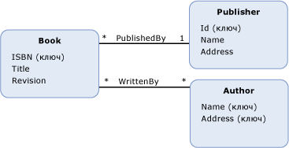
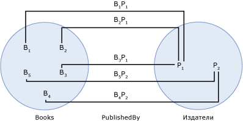

# набор ассоциацийassociation set
*Набора ассоциаций* — это логический контейнер для [ассоциации](../../../../docs/framework/data/adonet/association-type.md) экземпляров того же типа.An *association set* is a logical container for [association](../../../../docs/framework/data/adonet/association-type.md) instances of the same type. Набор ассоциаций не является конструктом моделирования данных, то есть не описывает структуру данных или связи.An association set is not a data modeling construct; that is, it does not describe the structure of data or relationships. Вместо этого ассоциация обеспечивает конструкт для среды размещения или хранения (например, для среды CLR или базы данных сервера SQL), позволяя группировать экземпляры ассоциаций так, чтобы они были сопоставлены хранилищу данных.Instead, an association set provides a construct for a hosting or storage environment (such as the common language runtime or a SQL Server database) to group association instances so that they can be mapped to a data store.  
  
 Набор ассоциаций определяется внутри [контейнер сущностей](../../../../docs/framework/data/adonet/entity-container.md), который является логической группой [наборов сущностей](../../../../docs/framework/data/adonet/entity-set.md) и наборы ассоциаций.An association set is defined within an [entity container](../../../../docs/framework/data/adonet/entity-container.md), which is a logical grouping of [entity sets](../../../../docs/framework/data/adonet/entity-set.md) and association sets.  
  
 Определение набора ассоциаций содержит следующую информацию.A definition for an association set contains the following information:  
  
-   Имя набора ассоциаций.The association set name. (Обязательный атрибут).(Required)  
  
-   Ассоциация, экземпляры которой будут являться содержимым.The association of which it will contain instances. (Обязательный атрибут).(Required)  
  
-   Два [конечные точки набора ассоциаций](../../../../docs/framework/data/adonet/association-set-end.md).Two [association set ends](../../../../docs/framework/data/adonet/association-set-end.md).  
  
## ПримерExample  
 На приведенной ниже схеме показана концептуальная модель с двумя ассоциациями: `PublishedBy` и `WrittenBy`.The diagram below shows a conceptual model with two associations: `PublishedBy`, and `WrittenBy`. Информации о наборах ассоциаций не содержится в схеме, однако на следующей схеме показан пример наборов ассоциаций и наборов сущностей на основе этой модели.Although information about association sets is not conveyed in the diagram, the next diagram shows an example of association sets and entity sets based on this model.  
  
   
  
 В следующем примере показан набор ассоциаций (`PublishedBy`) и два набора сущностей (`Books` и `Publishers`) на основе приведенной выше концептуальной модели.The following example shows an association set (`PublishedBy`) and two entity sets (`Books` and `Publishers`) based on the conceptual model shown above. Бизнес-аналитики в `Books` набор сущностей представляет экземпляр `Book` тип сущности во время выполнения.Bi in the `Books` entity set represents an instance of the `Book` entity type at run time. Аналогичным образом представляет Pj `Publisher` экземпляра в `Publishers` набора сущностей.Similarly, Pj represents a `Publisher` instance in the `Publishers` entity set. BiPj представляет экземпляр `PublishedBy` ассоциации в `PublishedBy` набора ассоциаций.BiPj represents an instance of the `PublishedBy` association in the `PublishedBy` association set.  
  
   
  
 [ADO.NET Entity Framework](../../../../docs/framework/data/adonet/ef/index.md) использует доменный язык (DSL), называемый языком определения концептуальной схемы ([CSDL](../../../../docs/framework/data/adonet/ef/language-reference/csdl-specification.md)) для определения концептуальных моделей.The [ADO.NET Entity Framework](../../../../docs/framework/data/adonet/ef/index.md) uses a domain-specific language (DSL) called conceptual schema definition language ([CSDL](../../../../docs/framework/data/adonet/ef/language-reference/csdl-specification.md)) to define conceptual models. Далее на языке CSDL определяется контейнер сущностей с одним набором ассоциаций для каждой ассоциации на приведенной выше схеме.The following CSDL defines an entity container with one association set for each association in the diagram above. Обратите внимание, что имя и ассоциация для каждого набора ассоциаций определены при помощи атрибутов XML.Note that the name and association for each association set are defined using XML attributes.  
  
 [!code-xml[EDM_Example_Model#EntityContainerExample](../../../../samples/snippets/xml/VS_Snippets_Data/edm_example_model/xml/books.edmx#entitycontainerexample)]  
  
 Можно определить несколько наборов ассоциаций на одну ассоциацию, при условии, что нет общей папки связи двух наборов [конечная точка набора ассоциаций](../../../../docs/framework/data/adonet/association-set-end.md).It is possible to define multiple association sets per association, as long as no two association sets share an [association set end](../../../../docs/framework/data/adonet/association-set-end.md). Далее на языке CSDL определяется контейнер сущностей с двумя наборами ассоциаций для ассоциации `WrittenBy`:The following CSDL defines an entity container with two association sets for the `WrittenBy` association. Обратите внимание, что несколько наборов сущностей были определены для типов сущностей `Book` и `Author` и что наборы ассоциаций не имеют одной и той же конечной точки ассоциации.Notice that multiple entity sets have been defined for the `Book` and `Author` entity types and that no association set shares an association set end.  
  
 [!code-xml[EDM_Example_Model#MultipleAssociationSets](../../../../samples/snippets/xml/VS_Snippets_Data/edm_example_model/xml/books3.edmx#multipleassociationsets)]  
  
## См. такжеSee Also  
 [Основные понятия модели данных сущностиEntity Data Model Key Concepts](../../../../docs/framework/data/adonet/entity-data-model-key-concepts.md)  
 [Модель EDMEntity Data Model](../../../../docs/framework/data/adonet/entity-data-model.md)  
 [Свойство внешнего ключаforeign key property](../../../../docs/framework/data/adonet/foreign-key-property.md)
