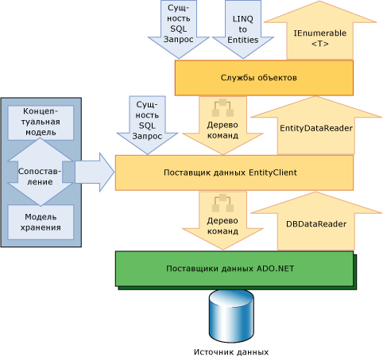

# Обзор Entity FrameworkEntity Framework overview

Entity Framework — это набор технологий в ADO.NET, которые поддерживают разработку программных приложений, ориентированных на данные.The Entity Framework is a set of technologies in ADO.NET that support the development of data-oriented software applications. Архитекторам и разработчикам приложений, ориентированных на обработку данных, приходится учитывать необходимость достижения двух совершенно различных целей.Architects and developers of data-oriented applications have struggled with the need to achieve two very different objectives. Они должны моделировать сущности, связи и логику решаемых бизнес-задач, а также работать с ядрами СУБД, используемыми для сохранения и получения данных.They must model the entities, relationships, and logic of the business problems they are solving, and they must also work with the data engines used to store and retrieve the data. Данные могут распределяться по нескольким системам хранения данных, в каждой из которых применяются свои протоколы, но даже в приложениях, работающих с одной системой хранения данных, необходимо поддерживать баланс между требованиями системы хранения данных и требованиями написания эффективного и удобного для обслуживания кода приложения.The data may span multiple storage systems, each with its own protocols; even applications that work with a single storage system must balance the requirements of the storage system against the requirements of writing efficient and maintainable application code.

Entity Framework позволяет разработчикам работать с данными в форме объектов и свойств, относящихся к домену, таких как клиенты и адреса клиентов, без необходимости связываться с базовыми таблицами и столбцами базы данных, где эти данные сохранял.The Entity Framework enables developers to work with data in the form of domain-specific objects and properties, such as customers and customer addresses, without having to concern themselves with the underlying database tables and columns where this data is stored. Entity Framework дает разработчикам возможность работать с данными на более высоком уровне абстракции, создавать и сопровождать приложения, ориентированные на работу с данными, одновременно с этим сокращая объем кода по сравнению с традиционными приложениями.With the Entity Framework, developers can work at a higher level of abstraction when they deal with data, and can create and maintain data-oriented applications with less code than in traditional applications. Поскольку Entity Framework является компонентом .NET Framework, Entity Framework приложения могут работать на любом компьютере, на котором установлена .NET Framework с пакетом обновления 1 (SP1) версии 3,5.Because the Entity Framework is a component of the .NET Framework, Entity Framework applications can run on any computer on which the .NET Framework starting with version 3.5 SP1 is installed.

## Предоставление жизненного цикла моделямGive life to models
 Многолетним и общим подходом к разработке является подход, при котором построение приложения или службы представляет собой его разделение на три части: модель домена, логическую модель и физическую модель.A longstanding and common design approach when building an application or service is the division of the application or service into three parts: a domain model, a logical model, and a physical model. Модель домена определяет сущности и связи в моделируемой системе.The domain model defines the entities and relationships in the system that is being modeled. Логическая модель для реляционной базы данных обеспечивает нормализацию сущностей и связей в целях создания таблиц с ограничениями внешнего ключа.The logical model for a relational database normalizes the entities and relationships into tables with foreign key constraints. В физической модели учитываются возможности конкретной системы обработки данных путем определения зависящих от ядра базы данных подробных сведений о хранении данных, которые касаются секционирования и индексирование.The physical model addresses the capabilities of a particular data engine by specifying storage details such as partitioning and indexing.

 Физическая модель совершенствуется администраторами базы данных в целях повышения производительности, но программисты, которые разрабатывают код приложения, в основном вынуждены ограничиваться работой с логической моделью, подготавливая SQL-запросы и вызывая хранимые процедуры.The physical model is refined by database administrators to improve performance, but programmers writing application code primarily confine themselves to working with the logical model by writing SQL queries and calling stored procedures. Модели домена в основном используются как инструмент для представления и обмена мнениями о требованиях к приложению, поэтому чаще всего служат в качестве практически не изменяющихся схем, которые рассматриваются и обсуждаются на ранних стадиях проекта, после чего выходят из сферы внимания.Domain models are generally used as a tool for capturing and communicating the requirements of an application, frequently as inert diagrams that are viewed and discussed in the early stages of a project and then abandoned. Во многих коллективах разработчиков принято пропускать этап создания концептуальной модели и начинать с определения таблиц, столбцов и ключей в реляционной базе данных.Many development teams skip creating a conceptual model and begin by specifying tables, columns, and keys in a relational database.

 Entity Framework дает жизнь модели, позволяя разработчикам запрашивать сущности и связи в модели предметной области (называемой *концептуальной* моделью в Entity Framework), используя Entity Framework преобразования этих операций в источник данных. — конкретные команды.The Entity Framework gives life to models by enabling developers to query entities and relationships in the domain model (called a *conceptual* model in the Entity Framework) while relying on the Entity Framework to translate those operations to data source–specific commands. Это позволяет отказаться от применения в приложениях жестко заданных зависимостей от конкретного источника данных.This frees applications from hard-coded dependencies on a particular data source.

 При работе в режиме Code First концептуальная модель сопоставлена с режимом хранения в коде.When working with Code First, the conceptual model is mapped to the storage model in code. Entity Framework может вычислять концептуальную модель на основе типов объектов и дополнительных конфигураций, которые вы определяете.The Entity Framework can infer the conceptual model based on the object types and additional configurations that you define. Метаданные сопоставления формируются во время выполнения на основе сочетания определений типов домена и дополнительной информации о конфигурации, которая указана в коде.The mapping metadata is generated during run time based on a combination of how you defined your domain types and additional configuration information that you provide in code. Entity Framework создает базу данных по мере необходимости на основе метаданных.Entity Framework generates the database as needed based on the metadata. Дополнительные сведения см. [в разделе Создание и сопоставление концептуальной модели](https://go.microsoft.com/fwlink/?LinkID=235382).For more information, see [Creating and Mapping a Conceptual Model](https://go.microsoft.com/fwlink/?LinkID=235382).

 При работе со средствами работы с моделью EDM концептуальная модель, модель хранения и сопоставление между ними выражены в схемах на основе XML и определены в файлах с именами с соответствующими расширениями.When working with the Entity Data Model Tools, the conceptual model, the storage model, and the mappings between the two are expressed in XML-based schemas and defined in files that have corresponding name extensions:

- Язык CSDL определяет концептуальную модель.Conceptual schema definition language (CSDL) defines the conceptual model. Язык CSDL — это реализация [EDM](../entity-data-model.md)Entity Framework.CSDL is the Entity Framework's implementation of the [Entity Data Model](../entity-data-model.md). Расширение файла - CSDL.The file extension is .csdl.

- Язык SSDL определяет модель хранения данных, которая также называется логической моделью.Store schema definition language (SSDL) defines the storage model, which is also called the logical model. Расширение файла - SSDL.The file extension is .ssdl.

- Язык MSL определяет сопоставление модели хранения и концептуальной модели.Mapping specification language (MSL) defines the mappings between the storage and conceptual models. Расширение файла - MSL.The file extension is .msl.

Модель хранения и сопоставления при необходимости могут быть изменены без изменения концептуальной модели, классов данных и кода приложения.The storage model and mappings can change as needed without requiring changes to the conceptual model, data classes, or application code. Модели хранения зависят от поставщика, поэтому можно работать с согласованной концептуальной моделью через различные источники данных.Because storage models are provider-specific, you can work with a consistent conceptual model across various data sources.

Entity Framework использует эти файлы модели и сопоставления для создания, чтения, обновления и удаления операций с сущностями и связями в концептуальной модели в эквивалентных операциях в источнике данных.The Entity Framework uses these model and mapping files to create, read, update, and delete operations against entities and relationships in the conceptual model to equivalent operations in the data source. Entity Framework даже поддерживает сопоставление сущностей в концептуальной модели с хранимыми процедурами в источнике данных.The Entity Framework even supports mapping entities in the conceptual model to stored procedures in the data source. Дополнительные сведения см. в статье [спецификации на языке CSDL, SSDL и MSL](/ef/ef6/modeling/designer/advanced/edmx/csdl-spec).For more information, see [CSDL, SSDL, and MSL Specifications](/ef/ef6/modeling/designer/advanced/edmx/csdl-spec).

## Сопоставьте объекты с даннымиMap objects to data
 При использовании объектно-ориентированного программирования для взаимодействия с системами хранения данных возникают сложности.Object-oriented programming poses a challenge for interacting with data storage systems. Безусловно, организация классов часто напоминает организацию таблиц реляционной базы данных, но такое соответствие неидеально.Although the organization of classes frequently mirrors the organization of relational database tables, the fit is not perfect. Несколько нормализованных таблиц часто соответствуют единственному классу, а связи между классами представлены не так, как связи между таблицами.Multiple normalized tables frequently correspond to a single class, and relationships between classes are often represented differently than relationships between tables are represented. Например, для представления клиенту заказа на продажу в классе `Order` может использоваться свойство, содержащее ссылку на экземпляр класса `Customer`, но строка таблицы `Order` базы данных содержит столбец внешнего ключа (или набор столбцов) со значением, которое соответствует первичному ключу в таблице `Customer`.For example, to represent the customer for a sales order, an `Order` class might use a property that contains a reference to an instance of a `Customer` class, while an `Order` table row in a database contains a foreign key column (or set of columns) with a value that corresponds to a primary key value in the `Customer` table. Класс `Customer` может включать свойство с именем `Orders`, содержащее коллекцию экземпляров класса `Order`, но таблица `Customer` базы данных не содержит сравнимого столбца.A `Customer` class might have a property named `Orders` that contains a collection of instances of the `Order` class, while the `Customer` table in a database has no comparable column. Entity Framework предоставляет разработчикам гибкие возможности для представления связей таким образом или для более тесной связи между моделями, как они представлены в базе данных.The Entity Framework provides developers with the flexibility to represent relationships in this way, or to more closely model relationships as they are represented in the database.

 В существующих решениях была предпринята попытка устранить этот разрыв, часто называемый «несоответствием типов данных» (impedance mismatch), путем сопоставления с реляционными таблицами и столбцами только объектно-ориентированных классов и свойств.Existing solutions have tried to bridge this gap, which is frequently called an "impedance mismatch", by only mapping object-oriented classes and properties to relational tables and columns. Вместо использования этого традиционного подхода Entity Framework сопоставляет реляционные таблицы, столбцы и ограничения внешнего ключа в логических моделях с сущностями и связями в концептуальных моделях.Instead of taking this traditional approach, the Entity Framework maps relational tables, columns, and foreign key constraints in logical models to entities and relationships in conceptual models. Это позволяет достичь большей гибкости при определении объектов и оптимизации логической модели.This enables greater flexibility both in defining objects and optimizing the logical model. Средства EDM создают расширяемые классы данных на основе концептуальной модели.The Entity Data Model tools generate extensible data classes based on the conceptual model. Эти классы являются разделяемыми классами, которые могут быть расширены с помощью дополнительных членов, добавленных разработчиком.These classes are partial classes that can be extended with additional members that the developer adds. По умолчанию классы, сформированные для определенной концептуальной модели, являются производными от базовых классов, предоставляющих службы для материализации сущностей в виде объектов, а также для отслеживания и сохранения изменений.By default, the classes that are generated for a particular conceptual model derive from base classes that provide services for materializing entities as objects and for tracking and saving changes. Разработчики могут использовать эти три класса для работы с сущностями и связями как с объектами, относящимися к ассоциациям.Developers can use these classes to work with the entities and relationships as objects related by associations. Разработчики смогут также настраивать классы, сформированные для концептуальной модели.Developers can also customize the classes that are generated for a conceptual model. Дополнительные сведения см. в разделе [Работа с объектами](working-with-objects.md).For more information, see [Working with Objects](working-with-objects.md).

## Доступ и изменение данных сущностиAccess and change entity data

Платформа Entity Framework — это не просто еще одно средство объектно-реляционного сопоставления. Ее цель — предоставить приложениям возможность чтения и изменения данных, представленных в виде сущностей и связей в концептуальной модели.More than just another object-relational mapping solution, the Entity Framework is fundamentally about enabling applications to access and change data that is represented as entities and relationships in the conceptual model. Entity Framework использует сведения в файлах модели и сопоставления для преобразования запросов объектов в типы сущностей, представленные в концептуальной модели, в запросы, относящиеся к источникам данных.The Entity Framework uses information in the model and mapping files to translate object queries against entity types represented in the conceptual model into data source-specific queries. Результаты запроса собиваются на объекты, которыми управляет Entity Framework.Query results are materialized into objects that the Entity Framework manages. Entity Framework предоставляет следующие способы запроса концептуальной модели и возврата объектов.The Entity Framework provides the following ways to query a conceptual model and return objects:

- LINQ to Entities.LINQ to Entities. Обеспечивает поддержку LINQ для запросов к типам сущностей, определенным в концептуальной модели.Provides Language-Integrated Query (LINQ) support for querying entity types that are defined in a conceptual model. Дополнительные сведения см. в разделе [LINQ to Entities](./language-reference/linq-to-entities.md).For more information, see [LINQ to Entities](./language-reference/linq-to-entities.md).

- [!INCLUDE[esql](../../../../../includes/esql-md.md)] Независимый от хранилища диалект SQL, который работает непосредственно с сущностями в концептуальной модели и поддерживает EDM концепции.A storage-independent dialect of SQL that works directly with entities in the conceptual model and that supports Entity Data Model concepts. [!INCLUDE[esql](../../../../../includes/esql-md.md)] используется как с запросами объектов, так и с запросами, которые выполняются с помощью поставщика EntityClient.is used both with object queries and queries that are executed by using the EntityClient provider. Дополнительные сведения см. в разделе [Entity SQL обзор](./language-reference/entity-sql-overview.md).For more information, see [Entity SQL Overview](./language-reference/entity-sql-overview.md).

Entity Framework включает поставщик данных EntityClient.The Entity Framework includes the EntityClient data provider. Этот поставщик управляет соединениями, преобразует запросы сущностей в запросы, зависящие от источника данных, и возвращает модуль чтения данных, который Entity Framework использует для материализации данных сущности в объекты.This provider manages connections, translates entity queries into data source-specific queries, and returns a data reader that the Entity Framework uses to materialize entity data into objects. Если материализация объектов не требуется, поставщик EntityClient может также использоваться как стандартный поставщик данных ADO.NET, который позволяет приложениям выполнять запросы [!INCLUDE[esql](../../../../../includes/esql-md.md)] и получать предназначенные только для чтения данные, возвращаемые модулем чтения данных.When object materialization is not required, the EntityClient provider can also be used like a standard ADO.NET data provider by enabling applications to execute [!INCLUDE[esql](../../../../../includes/esql-md.md)] queries and consume the returned read-only data reader. Дополнительные сведения см. [в разделе Поставщик EntityClient для Entity Framework](entityclient-provider-for-the-entity-framework.md).For more information, see [EntityClient Provider for the Entity Framework](entityclient-provider-for-the-entity-framework.md).

На следующей схеме показана архитектура, применяемая в платформе Entity Framework для доступа к данным.The following diagram illustrates the Entity Framework architecture for accessing data:

Средства EDM могут создавать класс, производный от `System.Data.Objects.ObjectContext` или `System.Data.Entity.DbContext`, представляющий контейнер сущностей в концептуальной модели.The Entity Data Model Tools can generate a class derived from `System.Data.Objects.ObjectContext` or `System.Data.Entity.DbContext` that represents the entity container in the conceptual model. Контекст объекта предоставляет средства для отслеживания изменений и управления идентификаторами, параллелизмом и связями.This object context provides the facilities for tracking changes and managing identities, concurrency, and relationships. Этот класс представляет также доступ к методу `SaveChanges`, который записывает результаты вставки, обновления и удаления данных в источник данных.This class also exposes a `SaveChanges` method that writes inserts, updates, and deletes to the data source. Подобно запросам, эти изменения производятся либо командами, автоматически сформированными системой, либо хранимыми процедурами, указанными разработчиком.Like queries, these changes are either made by commands automatically generated by the system or by stored procedures that are specified by the developer.

## Поставщики данныхData providers

Поставщик `EntityClient` расширяет модель поставщика ADO.NET путем доступа к данным с точки зрения концептуальных сущностей и связей.The `EntityClient` provider extends the ADO.NET provider model by accessing data in terms of conceptual entities and relationships. Выполняет запросы на языке [!INCLUDE[esql](../../../../../includes/esql-md.md)].It executes queries that use [!INCLUDE[esql](../../../../../includes/esql-md.md)]. [!INCLUDE[esql](../../../../../includes/esql-md.md)] представляет базовый язык запросов, с помощью которого `EntityClient` обменивается данными с базой данных.provides the underlying query language that enables `EntityClient` to communicate with the database. Дополнительные сведения см. [в разделе Поставщик EntityClient для Entity Framework](entityclient-provider-for-the-entity-framework.md).For more information, see [EntityClient Provider for the Entity Framework](entityclient-provider-for-the-entity-framework.md).

Entity Framework включает обновленный поставщик данных SqlClient, который поддерживает канонические деревья команд.The Entity Framework includes an updated SqlClient Data Provider that supports canonical command trees. Дополнительные сведения см. [в разделе SqlClient для Entity Framework](sqlclient-for-the-entity-framework.md).For more information, see [SqlClient for the Entity Framework](sqlclient-for-the-entity-framework.md).

## Средства модели EDMEntity data model tools

Наряду со средой выполнения Entity Framework Visual Studio включает средства сопоставления и моделирования.Together with the Entity Framework runtime, Visual Studio includes the mapping and modeling tools. Дополнительные сведения см. в разделе [моделирование и сопоставление](modeling-and-mapping.md).For more information, see [Modeling and Mapping](modeling-and-mapping.md).

## Дополнительные сведенияLearn more

Дополнительные сведения о Entity Framework см. в следующих статьях:To learn more about the Entity Framework, see:

[Начало работы](getting-started.md) — содержит сведения о том, как быстро начать работу с помощью [краткого руководства](https://docs.microsoft.com/previous-versions/dotnet/netframework-4.0/bb399182(v=vs.100)), в котором показано, как создать простое приложение Entity Framework.[Getting Started](getting-started.md) - Provides information about how to get up and running quickly using the [Quickstart](https://docs.microsoft.com/previous-versions/dotnet/netframework-4.0/bb399182(v=vs.100)), which shows how to create a simple Entity Framework application.

[Entity Framework терминология](terminology.md) определяет множество терминов, которые появились EDM и Entity Framework и используются в документации Entity Framework.[Entity Framework Terminology](terminology.md) - Defines many of the terms that are introduced by the Entity Data Model and the Entity Framework and that are used in Entity Framework documentation.

[Entity Framework ресурсы](resources.md) — ссылки на основные разделы и ссылки на внешние разделы и ресурсы для создания Entity Framework приложений.[Entity Framework Resources](resources.md) - Provides links to conceptual topics and links to external topics and resources for building Entity Framework applications.

## См. такжеSee also

- [ADO.NET Entity FrameworkADO.NET Entity Framework](index.md)
