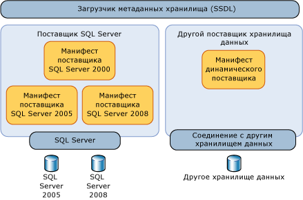
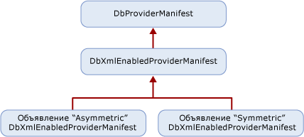

# <a name="provider-manifest-specification"></a>Спецификация манифеста поставщика
В этом разделе описывается поддержка типов и функций в хранилище данных, представляемая поставщиком хранилища данных.  
  
 Службы сущностей работают независимо от поставщика хранилища данных, однако позволяют поставщику явно определять порядок взаимодействия моделей, сопоставлений и запросов с базовым хранилищем данных. Без реализованного уровня абстракции службы сущностей могли бы работать только с поставщиком данных или хранилищем данных определенного типа.  
  
 Типы, поддерживаемые поставщиком, явно или неявно поддерживаются базовой базой данных. Эти типы не обязательно являются точными типами хранилища, но типы, которые провайдер использует для поддержки Рамочной системы сущности. Типы поставщика и хранилища описываются в терминах модели EDM.  
  
 Типы параметров и возвращаемых значений для функций, поддерживаемые хранилищем данных, выражаются в терминах модели EDM.  
  
## <a name="requirements"></a>Требования  
 Рамки сущности и хранилище данных должны иметь возможность передавать данные взад и вперед в известных типах без потери или усечения данных.  
  
 Манифест поставщика должен загружаться средствами во время разработки без необходимости установления соединения с хранилищем данных.  
  
 Рамочная сущность является конфиденциальной, но базовый хранилище данных может и не быть. Когда артефакты EDM (например, идентификаторы и имена типов) определяются и используются в манифесте, они должны использовать чувствительность случая Сущности. Если в манифесте поставщика встречаются элементы хранилища данных, в которых может учитываться регистр, то в манифесте поставщика необходимо сохранять регистр.  
  
 Рамочная система сущности требует манифеста поставщика для всех поставщиков данных. Если вы попытаетесь использовать провайдера, у которого нет манифеста поставщика с рамочой entity, вы получите ошибку.  
  
 В следующей таблице описаны виды исключений, которые может быть внесена рамочная система entity, когда в результате взаимодействия с поставщиком возникают исключения:  
  
|Проблема|Исключение|  
|-----------|---------------|  
|Поставщик не поддерживает GetProviderManifest в DbProviderServices.|ProviderIncompatibleException|  
|Отсутствует манифест поставщика: поставщик возвращает значение `null` при попытке получить манифест поставщика.|ProviderIncompatibleException|  
|Недопустимый манифест поставщика: поставщик возвращает недопустимый XML-код при попытке получить манифест поставщика.|ProviderIncompatibleException|  
  
## <a name="scenarios"></a>Сценарии  
 Поставщик должен поддерживать следующие сценарии:  
  
### <a name="writing-a-provider-with-symmetric-type-mapping"></a>Разработка поставщика с симметричным сопоставлением типов  
 Вы можете написать поставщика для рамочной системы сущности, где каждый тип хранения имеет карты для одного типа EDM, независимо от направления отображения. Для типа поставщика, имеющего простое сопоставление с типом модели EDM, можно использовать симметричное решение, поскольку система типов проста или совпадает с системой типов модели EDM.  
  
 В случае простой структуры домена можно создать статический манифест поставщика в декларативном стиле.  
  
 Создайте XML-файл с двумя разделами.  
  
- Список типов поставщика в терминах эквивалентов EDM для типа или функции хранилища. Для типов хранилища имеются эквиваленты в модели EDM. Для функций хранилища имеются соответствующие функции в модели EDM. Например, тип varchar является типом SQL Server, а в модели EDM ему соответствует тип string.  
  
- Список функций, поддерживаемых поставщиком, с указанием типов параметров и возвращаемых значений в терминах модели EDM.  
  
### <a name="writing-a-provider-with-asymmetric-type-mapping"></a>Разработка поставщика с асимметричным сопоставлением типов  
 При написании поставщика хранилища данных для системы Entity для типов EDM для некоторых типов может отличаться от отображения типа от поставщика к типу EDM. Например, непривязанный тип EDM PrimitiveTypeKind.String может сопоставляться с типом nvarchar(4000) в поставщике, а тип nvarchar(4000) сопоставляется с типом EDM PrimitiveTypeKind.String(MaxLength=4000).  
  
 Создайте XML-файл с двумя разделами.  
  
- Список типов поставщика в терминах модели EDM и определение сопоставления в обоих направлениях: от модели EDM к поставщику и наоборот.  
  
- Список функций, поддерживаемых поставщиком, с указанием типов параметров и возвращаемых значений в терминах модели EDM.  
  
## <a name="provider-manifest-discoverability"></a>Возможность обнаружения манифеста поставщика  
 Манифест неявно используется несколькими типами компонентов в службах сущностей (например, средствами и запросами), а также непосредственно используется в метаданных с помощью загрузчика метаданных хранилища.  
  
   
  
 При этом заданный поставщик может поддерживать различные хранилища или различные версии одного хранилища. Поэтому поставщик должен передавать различный манифест для каждого из поддерживаемых хранилищ данных.  
  
### <a name="provider-manifest-token"></a>Маркер манифеста поставщика  
 Если установлено соединение с хранилищем данных, поставщик может запросить сведения, чтобы вернуть правильный манифест. Это может быть невозможно при автономном использовании, когда недоступны сведения о соединении или невозможно подключиться к хранилищу. Определите манифест с помощью атрибута `ProviderManifestToken` элемента `Schema` в SSDL-файле. Формат этого атрибута не задан жестко. Поставщик выбирает минимально необходимые сведения для определения манифеста без соединения с хранилищем.  
  
 Пример:  
  
```xml  
<Schema Namespace="Northwind" Provider="System.Data.SqlClient" ProviderManifestToken="2005" xmlns:edm="http://schemas.microsoft.com/ado/2006/04/edm/ssdl" xmlns="http://schemas.microsoft.com/ado/2006/04/edm/ssdl">  
```  
  
## <a name="provider-manifest-programming-model"></a>Модель программирования манифеста поставщика  
 Поставщики являются производными от класса <xref:System.Data.Common.DbXmlEnabledProviderManifest> и поэтому могут указывать манифесты декларативно. На следующем рисунке показана иерархия классов поставщика.  
  
   
  
### <a name="discoverability-api"></a>API обнаружения  
 Манифест поставщика загружается загрузчиком метаданных хранилища (StoreItemCollection) с помощью соединения с хранилищем данных или маркера манифеста поставщика.  
  
#### <a name="using-a-data-store-connection"></a>Использование соединения с хранилищем данных  
 При наличии подключения к <xref:System.Data.Common.DbProviderServices.GetProviderManifestToken%2A?displayProperty=nameWithType> хранилику данных звоните, <xref:System.Data.Common.DbProviderServices.GetProviderManifest%2A> чтобы вернуть <xref:System.Data.Common.DbProviderManifest>токен, который передается методу, который возвращается. Этот метод делегирует на `GetDbProviderManifestToken`реализацию провайдера .  
  
```csharp
public string GetProviderManifestToken(DbConnection connection);  
public DbProviderManifest GetProviderManifest(string manifestToken);  
```  
  
#### <a name="using-a-provider-manifest-token"></a>Использование маркера манифеста поставщика  
 В случае автономной работы маркер берется из представления SSDL. SSDL позволяет указать ProviderManifestToken (см. [Элемент Schema (SSDL)](/ef/ef6/modeling/designer/advanced/edmx/ssdl-spec#schema-element-ssdl) для получения дополнительной информации). Например, если не удается открыть соединение, то в SSDL используется маркер манифеста поставщика, в котором указываются сведения о манифесте.  
  
```csharp
public DbProviderManifest GetProviderManifest(string manifestToken);  
```  
  
### <a name="provider-manifest-schema"></a>Схема манифеста поставщика  
 Схема данных, определенных для каждого поставщика, содержит статические данные для обработки в метаданных.  
  
```xml  
<?xml version="1.0" encoding="utf-8"?>  
<xs:schema elementFormDefault="qualified"  
   xmlns:xs="http://www.w3.org/2001/XMLSchema"  
   targetNamespace="http://schemas.microsoft.com/ado/2006/04/edm/providermanifest"  
   xmlns:pm="http://schemas.microsoft.com/ado/2006/04/edm/providermanifest">  
  
  <xs:element name="ProviderManifest">  
    <xs:complexType>  
      <xs:sequence>  
        <xs:element name="Types" type="pm:TTypes" minOccurs="1" maxOccurs="1" />  
        <xs:element name="Functions" type="pm:TFunctions" minOccurs="0" maxOccurs="1"/>  
      </xs:sequence>  
      <xs:attribute name="Namespace" type="xs:string" use="required"/>  
    </xs:complexType>  
  </xs:element>  
  <xs:complexType name="TVersion">  
    <xs:attribute name="Major" type="xs:int" use="required" />  
    <xs:attribute name="Minor" type="xs:int" use="required" />  
    <xs:attribute name="Build" type="xs:int" use="required" />  
    <xs:attribute name="Revision" type="xs:int" use="required" />  
  </xs:complexType>  
  
  <xs:complexType name="TIntegerFacetDescription">  
    <xs:attribute name="Minimum" type="xs:int" use="optional" />  
    <xs:attribute name="Maximum" type="xs:int" use="optional" />  
    <xs:attribute name="DefaultValue" type="xs:int" use="optional" />  
    <xs:attribute name="Constant" type="xs:boolean" default="false" />  
  </xs:complexType>  
  
  <xs:complexType name="TBooleanFacetDescription">  
    <xs:attribute name="DefaultValue" type="xs:boolean" use="optional" />  
    <xs:attribute name="Constant" type="xs:boolean" default="true" />  
  </xs:complexType>  
  
  <xs:complexType name="TDateTimeFacetDescription">  
    <xs:attribute name="Constant" type="xs:boolean" default="false" />  
  </xs:complexType>  
  
  <xs:complexType name="TFacetDescriptions">  
    <xs:choice maxOccurs="unbounded">  
      <xs:element name="Precision" minOccurs="0" maxOccurs="1" type="pm:TIntegerFacetDescription"/>  
      <xs:element name="Scale" minOccurs="0" maxOccurs="1" type="pm:TIntegerFacetDescription"/>  
      <xs:element name="MaxLength" minOccurs="0" maxOccurs="1" type="pm:TIntegerFacetDescription"/>  
      <xs:element name="Unicode" minOccurs="0" maxOccurs="1" type="pm:TBooleanFacetDescription"/>  
      <xs:element name="FixedLength" minOccurs="0" maxOccurs="1" type="pm:TBooleanFacetDescription"/>  
    </xs:choice>  
  </xs:complexType>  
  
  <xs:complexType name="TType">  
    <xs:sequence>  
      <xs:element name="FacetDescriptions" type="pm:TFacetDescriptions" minOccurs="0" maxOccurs="1"/>  
    </xs:sequence>  
    <xs:attribute name="Name" type="xs:string" use="required"/>  
    <xs:attribute name="PrimitiveTypeKind" type="pm:TPrimitiveTypeKind" use="required" />  
  </xs:complexType>  
  
  <xs:complexType name="TTypes">  
    <xs:sequence>  
      <xs:element name="Type" type="pm:TType" minOccurs="0" maxOccurs="unbounded"/>  
    </xs:sequence>  
  </xs:complexType>  
  
  <xs:attributeGroup name="TFacetAttribute">  
    <xs:attribute name="Precision" type="xs:int" use="optional"/>  
    <xs:attribute name="Scale" type="xs:int" use="optional"/>  
    <xs:attribute name="MaxLength" type="xs:int" use="optional"/>  
    <xs:attribute name="Unicode" type="xs:boolean" use="optional"/>  
    <xs:attribute name="FixedLength" type="xs:boolean" use="optional"/>  
  </xs:attributeGroup>  
  
  <xs:complexType name="TFunctionParameter">  
    <xs:attribute name="Name" type="xs:string" use="required" />  
    <xs:attribute name="Type" type="xs:string" use="required" />  
    <xs:attributeGroup ref="pm:TFacetAttribute" />  
    <xs:attribute name="Mode" type="pm:TParameterDirection" use="required" />  
  </xs:complexType>  
  
  <xs:complexType name="TReturnType">  
    <xs:attribute name="Type" type="xs:string" use="required" />  
    <xs:attributeGroup ref="pm:TFacetAttribute" />  
  </xs:complexType>  
  
  <xs:complexType name="TFunction">  
    <xs:choice minOccurs="0" maxOccurs ="unbounded">  
      <xs:element name ="ReturnType" type="pm:TReturnType" minOccurs="0" maxOccurs="1" />  
      <xs:element name="Parameter" type="pm:TFunctionParameter" minOccurs="0" maxOccurs="unbounded"/>  
    </xs:choice>  
    <xs:attribute name="Name" type="xs:string" use="required" />  
    <xs:attribute name="Aggregate" type="xs:boolean" use="optional" />  
    <xs:attribute name="BuiltIn" type="xs:boolean" use="optional" />  
    <xs:attribute name="StoreFunctionName" type="xs:string" use="optional" />  
    <xs:attribute name="NiladicFunction" type="xs:boolean" use="optional" />  
    <xs:attribute name="ParameterTypeSemantics" type="pm:TParameterTypeSemantics" use="optional" default="AllowImplicitConversion" />  
  </xs:complexType>  
  
  <xs:complexType name="TFunctions">  
    <xs:sequence>  
      <xs:element name="Function" type="pm:TFunction" minOccurs="0" maxOccurs="unbounded"/>  
    </xs:sequence>  
  </xs:complexType>  
  
  <xs:simpleType name="TPrimitiveTypeKind">  
    <xs:restriction base="xs:string">  
      <xs:enumeration value="Binary"/>  
      <xs:enumeration value="Boolean"/>  
      <xs:enumeration value="Byte"/>  
      <xs:enumeration value="Decimal"/>  
      <xs:enumeration value="DateTime"/>  
      <xs:enumeration value="Time"/>  
      <xs:enumeration value="DateTimeOffset"/>
      <xs:enumeration value="Double"/>  
      <xs:enumeration value="Guid"/>  
      <xs:enumeration value="Single"/>  
      <xs:enumeration value="SByte"/>  
      <xs:enumeration value="Int16"/>  
      <xs:enumeration value="Int32"/>  
      <xs:enumeration value="Int64"/>  
      <xs:enumeration value="String"/>  
    </xs:restriction>  
  </xs:simpleType>  
  
  <xs:simpleType name="TParameterDirection">  
    <xs:restriction base="xs:string">  
      <xs:enumeration value="In"/>  
      <xs:enumeration value="Out"/>  
      <xs:enumeration value="InOut"/>  
    </xs:restriction>  
  </xs:simpleType>  
  
  <xs:simpleType name="TParameterTypeSemantics">  
    <xs:restriction base="xs:string">  
      <xs:enumeration value="ExactMatchOnly" />  
      <xs:enumeration value="AllowImplicitPromotion" />  
      <xs:enumeration value="AllowImplicitConversion" />  
    </xs:restriction>  
  </xs:simpleType>  
</xs:schema>  
```  
  
#### <a name="types-node"></a>Узел типов  
 Узел типов в манифесте поставщика содержит сведения о типах, которые поддерживаются хранилищем данных непосредственно или с помощью поставщика.  
  
##### <a name="type-node"></a>Узел типа  
 В каждом узле типа определяется тип поставщика в терминах модели EDM. В узле типа описывается имя типа поставщика и сведения, связанные с типом модели, который сопоставляется с типом поставщика, и с аспектами, описывающими это сопоставление.  
  
 Для выражения этих сведений о типе в манифесте поставщика каждое определение TypeInformation должно определять несколько аспектов для каждого типа.  
  
|Имя атрибута|Тип данных|Обязательно|Значение по умолчанию|Описание|  
|--------------------|---------------|--------------|-------------------|-----------------|  
|Имя|Строка|Да|Недоступно|Имя типа данных, зависящего от поставщика|  
|PrimitiveTypeKind|PrimitiveTypeKind|Да|Недоступно|Имя типа в модели EDM|  
  
###### <a name="function-node"></a>Узел функции  
 В каждом узле функции определяется функция, доступная посредством поставщика.  
  
|Имя атрибута|Тип данных|Обязательно|Значение по умолчанию|Описание|  
|--------------------|---------------|--------------|-------------------|-----------------|  
|Имя|Строка|Да|Недоступно|Идентификатор или имя функции|  
|ReturnType|Строка|нет|Void|Тип возвращаемого значения функции в модели EDM|  
|Статистическое|Логическое|нет|False|Значение True, если функция является агрегатной|  
|BuiltIn|Логическое|нет|True|Значение True, если функция встроена в хранилище данных|  
|StoreFunctionName|Строка|нет|\<Name>|Имя функции в хранилище данных.  Реализует уровень перенаправления для имен функций.|  
|NiladicFunction|Логическое|нет|False|Значение True, если функция не требует параметров и вызывается без параметров|  
|ParameterType<br /><br /> Семантика|ParameterSemantics|нет|AllowImplicit<br /><br /> Преобразование|Выберите, как конвейер запросов должен обрабатывать замену типов параметров:<br /><br /> - ExactMatchТолько<br />- AllowImplicitPromotion<br />- AllowImplicitConversion|  
  
 **Узел параметров**  
  
 Каждая функция имеет коллекцию из одного или нескольких узлов параметров.  
  
|Имя атрибута|Тип данных|Обязательно|Значение по умолчанию|Описание|  
|--------------------|---------------|--------------|-------------------|-----------------|  
|Имя|Строка|Да|Недоступно|Идентификатор или имя параметра.|  
|Тип|Строка|Да|Недоступно|Тип параметра в модели EDM.|  
|Режим|Параметр<br /><br /> Направление|Да|Недоступно|Направление параметра:<br /><br /> - в<br />- из<br />- inout|  
  
##### <a name="namespace-attribute"></a>Атрибут Namespace  
 В каждом поставщике хранилища данных должно определяться пространство имен или группа пространств имен для сведений, определяемых в манифесте. Это пространство имен можно использовать в запросах Entity SQL для разрешения имен функций и типов. Пример: SqlServer. Это пространство имен должно отличаться от канонического пространства имен EDM, определенного в службах сущностей для стандартных функций, поддерживаемых запросами Entity SQL.  
  
## <a name="see-also"></a>См. также раздел

- [Создание поставщика данных Entity Framework](writing-an-ef-data-provider.md)
