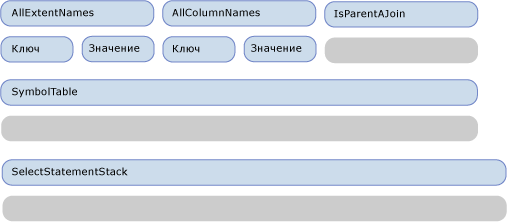
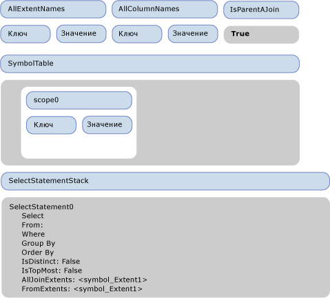
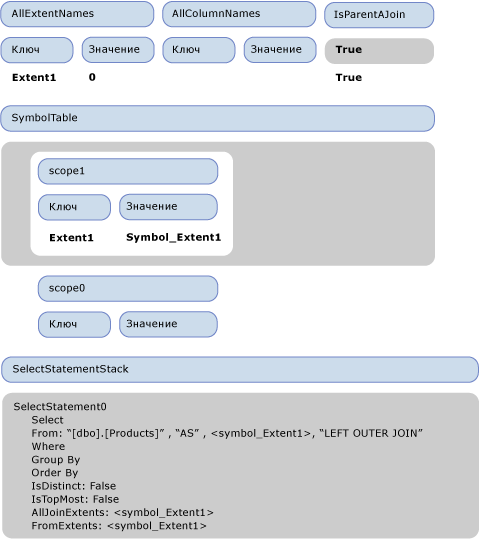
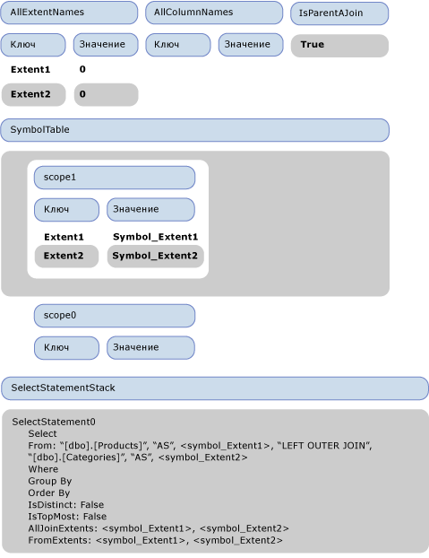
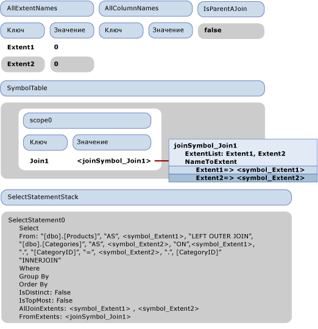
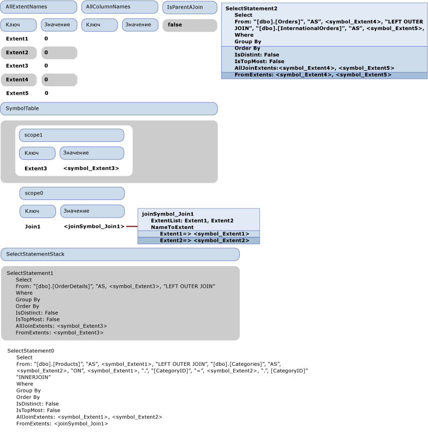
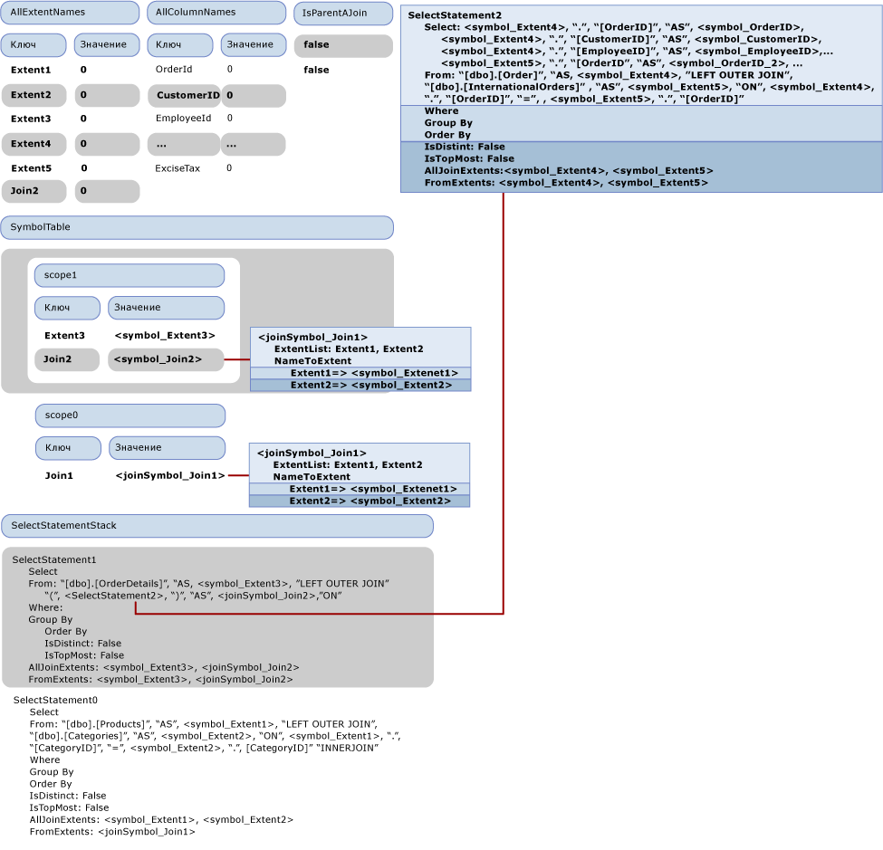

# <a name="walkthrough-sql-generation"></a>Пошаговое руководство. Создание кода SQL

В этом разделе показано, как в [примере поставщика](https://code.msdn.microsoft.com/windowsdesktop/Entity-Framework-Sample-6a9801d0)происходит создание SQL. В следующем запросе Entity SQL используется модель, которая прилагается к образцу поставщика.

```sql
SELECT  j1.ProductId, j1.ProductName, j1.CategoryName, j2.ShipCountry, j2.ProductId
FROM (  SELECT P.ProductName, P.ProductId, P.Category.CategoryName
        FROM NorthwindEntities.Products AS P) as j1
INNER JOIN (SELECT OD.ProductId, OD.Order.ShipCountry as ShipCountry
            FROM NorthwindEntities.OrderDetails AS OD) as j2
            ON j1.ProductId == j2.ProductId
```

Запрос формирует следующее выходное дерево команд, которое передается поставщику.

```output
DbQueryCommandTree
|_Parameters
|_Query : Collection{Record['C1'=Edm.Int32, 'ProductID'=Edm.Int32, 'ProductName'=Edm.String, 'CategoryName'=Edm.String, 'ShipCountry'=Edm.String, 'ProductID1'=Edm.Int32]}
  |_Project
    |_Input : 'Join4'
    | |_InnerJoin
    |   |_Left : 'Join1'
    |   | |_LeftOuterJoin
    |   |   |_Left : 'Extent1'
    |   |   | |_Scan : dbo.Products
    |   |   |_Right : 'Extent2'
    |   |   | |_Scan : dbo.Categories
    |   |   |_JoinCondition
    |   |     |_
    |   |       |_Var(Extent1).CategoryID
    |   |       |_=
    |   |       |_Var(Extent2).CategoryID
    |   |_Right : 'Join3'
    |   | |_LeftOuterJoin
    |   |   |_Left : 'Extent3'
    |   |   | |_Scan : dbo.OrderDetails
    |   |   |_Right : 'Join2'
    |   |   | |_LeftOuterJoin
    |   |   |   |_Left : 'Extent4'
    |   |   |   | |_Scan : dbo.Orders
    |   |   |   |_Right : 'Extent5'
    |   |   |   | |_Scan : dbo.InternationalOrders
    |   |   |   |_JoinCondition
    |   |   |     |_
    |   |   |       |_Var(Extent4).OrderID
    |   |   |       |_=
    |   |   |       |_Var(Extent5).OrderID
    |   |   |_JoinCondition
    |   |     |_
    |   |       |_Var(Extent3).OrderID
    |   |       |_=
    |   |       |_Var(Join2).Extent4.OrderID
    |   |_JoinCondition
    |     |_
    |       |_Var(Join1).Extent1.ProductID
    |       |_=
    |       |_Var(Join3).Extent3.ProductID
    |_Projection
      |_NewInstance : Record['C1'=Edm.Int32, 'ProductID'=Edm.Int32, 'ProductName'=Edm.String, 'CategoryName'=Edm.String, 'ShipCountry'=Edm.String, 'ProductID1'=Edm.Int32]
        |_Column : 'C1'
        | |_1
        |_Column : 'ProductID'
        | |_Var(Join4).Join1.Extent1.ProductID
        |_Column : 'ProductName'
        | |_Var(Join4).Join1.Extent1.ProductName
        |_Column : 'CategoryName'
        | |_Var(Join4).Join1.Extent2.CategoryName
        |_Column : 'ShipCountry'
        | |_Var(Join4).Join3.Join2.Extent4.ShipCountry
        |_Column : 'ProductID1'
          |_Var(Join4).Join3.Extent3.ProductID
```

 В этом разделе описывается порядок перевода выходного дерева команд в следующие инструкции SQL.

```sql
SELECT
1 AS [C1],
[Extent1].[ProductID] AS [ProductID],
[Extent1].[ProductName] AS [ProductName],
[Extent2].[CategoryName] AS [CategoryName],
[Join3].[ShipCountry] AS [ShipCountry],
[Join3].[ProductID] AS [ProductID1]
FROM   [dbo].[Products] AS [Extent1]
LEFT OUTER JOIN [dbo].[Categories] AS [Extent2] ON [Extent1].[CategoryID] = [Extent2].[CategoryID]
INNER JOIN
(SELECT [Extent3].[OrderID] AS [OrderID1], [Extent3].[ProductID] AS [ProductID], [Extent3].[UnitPrice] AS [UnitPrice], [Extent3].[Quantity] AS [Quantity], [Extent3].[Discount] AS [Discount], [Join2].[OrderID2], [Join2].[CustomerID], [Join2].[EmployeeID], [Join2].[OrderDate], [Join2].[RequiredDate], [Join2].[ShippedDate], [Join2].[Freight], [Join2].[ShipName], [Join2].[ShipAddress], [Join2].[ShipCity], [Join2].[ShipRegion], [Join2].[ShipPostalCode], [Join2].[ShipCountry], [Join2].[OrderID3], [Join2].[CustomsDescription], [Join2].[ExciseTax]
FROM  [dbo].[OrderDetails] AS [Extent3]
LEFT OUTER JOIN
      (SELECT [Extent4].[OrderID] AS [OrderID2], [Extent4].[CustomerID] AS [CustomerID], [Extent4].[EmployeeID] AS [EmployeeID], [Extent4].[OrderDate] AS [OrderDate], [Extent4].[RequiredDate] AS [RequiredDate], [Extent4].[ShippedDate] AS [ShippedDate], [Extent4].[Freight] AS [Freight], [Extent4].[ShipName] AS [ShipName], [Extent4].[ShipAddress] AS [ShipAddress], [Extent4].[ShipCity] AS [ShipCity], [Extent4].[ShipRegion] AS [ShipRegion], [Extent4].[ShipPostalCode] AS [ShipPostalCode], [Extent4].[ShipCountry] AS [ShipCountry], [Extent5].[OrderID] AS [OrderID3], [Extent5].[CustomsDescription] AS [CustomsDescription], [Extent5].[ExciseTax] AS [ExciseTax]
FROM  [dbo].[Orders] AS [Extent4]
LEFT OUTER JOIN [dbo].[InternationalOrders] AS [Extent5] ON [Extent4].[OrderID] = [Extent5].[OrderID]
      ) AS [Join2] ON [Extent3].[OrderID] = [Join2].[OrderID2]
   ) AS [Join3] ON [Extent1].[ProductID] = [Join3].[ProductID]
```

## <a name="first-phase-of-sql-generation-visiting-the-expression-tree"></a>Первый этап формирования кода SQL: обход дерева выражений

На следующем рисунке показано начальное пустое состояние посетителя.  В рамках данного раздела описываются только свойства, требуемые для наглядности пошагового руководства.



При посещении узла проекта поверх ввода (Join4) вызывается метод VisitInputExpression, активизирующий посещение Join4 методом VisitJoinExpression. Поскольку это самое верхнее соединение, параметр IsParentAJoin возвращает значение false, а новый объект SqlSelectStatement (SelectStatement0) создается и передается в стек инструкций SELECT. Кроме того, в таблицу символов вводится новая область (scope0). Перед посещением первого (левого) входного сигнала соединения в стек IsParentAJoin передается значение true. Перед посещением Join1, левого входного сигнала Join4, посетитель входит в состояние, показанное на следующем рисунке.



Когда метод посещения соединения вызывается по отношению к Join4, IsParentAJoin принимает значение true, таким образом, текущая инструкция выбора SelectStatement0 используется повторно. Вводится новая область (scope1). Перед посещением левого дочернего элемента Extent1 в стек IsParentAJoin передается еще одно значение true.

При посещении Extent1, поскольку IsParentAJoin возвращает значение true, он возвращает SqlBuilder, содержащий «[dbo].[Products]». Элемент управления возвращается методу, посещающему Join4. Из IsParentAJoin удаляется запись, вызывается метод ProcessJoinInputResult, прибавляющий результат посещения Extent1 к предложению From инструкции SelectStatement0. Создается новый символ from, symbol_Extent1, для входного сигнала. Он добавляется к FromExtents инструкции SelectStatement0, а к предложению from добавляются «As» и symbol_Extent1. К AllExtentNames добавляется новая запись со значением 0 для «Extent1». В символьную таблицу текущей области добавляется новая запись, чтобы связать «Extent1» с его символом symbol_Extent1. Symbol_Extent1 также добавляется к AllJoinExtents инструкции SqlSelectStatement.

Перед посещением правого входного сигнала Join1 к предложению From инструкции SelectStatement0. добавляется «LEFT OUTER JOIN». Поскольку правый входной сигнал является выражением Scan, в стек IsParentAJoin снова передается значение true. Состояние перед посещением правого входного сигнала показано на следующем рисунке.



Правый входной сигнал обрабатывается так же, как и левый. Состояние после посещения правого входного сигнала показано на следующем рисунке.



Следующее значение false передается в стек IsParentAJoin, и обрабатывается условие соединения Var(Extent1).CategoryID == Var(Extent2).CategoryID. Var (Extent1) разрешается в \<symbol_Extent1 > после поиска в таблице символов. Так как экземпляр разрешается в простой символ, в результате обработки var (Extent1). КодТипа, Склбуилдер с \<symbol1 >». КодТипа». Схожим образом обрабатывается другая сторона сравнения, результат посещения условия соединения добавляется к предложению FROM инструкции SelectStatement1, а из стека IsParentAJoin удаляется значение false.

На этом обработка Join1 завершается, а область удаляется из символьной таблицы.

Элемент управления возвращается к обработке Join4, родительского элемента Join1. Так как дочерний элемент повторно использовал инструкцию SELECT, экстенты Join1 заменяются одним символом объединения \<joinSymbol_Join1 >. Кроме того, в таблицу символов добавляется новая запись для связывания Join1 с >ом \<joinSymbol_Join1.

Следующим обрабатывается узел Join3 - второй дочерний элемент Join4. Поскольку он правый, в стек IsParentAJoin передается значение false. Состояние посетителя в этот момент показано на следующем рисунке.



Для Join3 IsParentAJoin возвращает значение false, требует начать новую инструкцию SqlSelectStatement (SelectStatement1) и передать ее в стек. Обработка продолжается, как и с предыдущими соединениями, новая область передается в стек, и проводится обработка дочерних элементов. Область (Extent3) является левым дочерним элементом, а соединение (Join2) - правым, которое также требует начать новую инструкцию SqlSelectStatement: SelectStatement2. Дочерние элементы Join2 также являются областями, и они собраны в инструкции SelectStatement2.

Состояние посетителя после посещения Join2, но перед выполнением последующей обработки (ProcessJoinInputResult) показано на следующем рисунке.



На предыдущем рисунке инструкция SelectStatement2 показана в формате с плавающей запятой, поскольку она удалена из стека, но еще не обработана родительским элементом. Его нужно добавить к части FROM родительского элемента, но оно не является законченной инструкцией SQL без предложения SELECT. Поэтому в этот момент по умолчанию столбцы (все столбцы, созданные его входными сигналами) добавляются к списку выбора методом AddDefaultColumns. AddDefaultColumns проходит по символам из FromExtents и для каждого символа добавляет все столбцы, внесенные в область. В случае простого символа выполняется проверка типа символа для извлечения всех его свойств, которые нужно добавить. Он также вносит имена столбцов в словарь AllColumnNames. Завершенная инструкция SelectStatement2 прибавляется к предложению FROM инструкции SelectStatement1.

Затем создается новый символ соединения для представления Join2. Он помечается как вложенное соединение, добавляется к AllJoinExtents инструкции SelectStatement1 и в таблицу символов.  Теперь условие соединения Join3, Var(Extent3).OrderID = Var(Join2).Extent4.OrderID, необходимо обработать. Обработка левой стороны схожа с условием соединения Join1. Тем не менее обработка правой стороны «Var(Join2).Extent4.OrderID» отличается, поскольку требуется объединение соединения.

На следующем рисунке показано состояние посетителя прямо перед обработкой DbPropertyExpression «Var(Join2).Extent4.OrderID».

Рассмотрим порядок посещения «Var(Join2).Extent4.OrderID». Сначала посещается свойство экземпляра «Var(Join2).Extent4», которое является очередным DbPropertyExpression и посещает в первую очередь свой экземпляр «Var(Join2)». В самой верхней области в таблице символов "Join2" разрешается в \<joinSymbol_join2 >. В методе посещения для обработки DbPropertyExpression «Var(Join2).Extent4» отмечает, что при посещении экземпляра был возвращен символ соединения и требуется объединение.

Так как это вложенное соединение, мы будем искать свойство «Extent4» в словаре Наметоекстент символа объединения, разрешать его \<symbol_Extent4 > и возвращать новый SymbolPair (\<joinSymbol_join2 >, \<symbol_Extent4 >). Так как пара символов возвращается при обработке экземпляра "var (Join2)". Extent4. OrderID "свойство OrderID разрешается из Колумнпарт этой пары символов (\<symbol_Extent4 >), которая содержит список столбцов экстента, который он представляет. Итак, «var (Join2). Extent4. OrderID разрешается в {\<joinSymbol_Join2 >, ".", \<symbol_OrderID >}.

Условие соединения Join4 обрабатывается схожим образом. Элемент управления возвращается к методу VisitInputExpression, обрабатывавшему самый верхний проект. Судя по FromExtents возвращенного SelectStatement0, входной сигнал идентифицируется как соединение, удаляет исходные области и замещает их новой областью с символом Join. Также происходит обновление таблицы символов и обработка следующей части проекции проекта. Разрешение свойств и объединение областей соединения происходит, как описано выше.



Наконец, создается следующая инструкция SqlSelectStatement.

```sql
SELECT:
  "1", " AS ", "[C1]",
  <symbol_Extent1>, ".", "[ProductID]", " AS ", "[ProductID]",
  <symbol_Extent1>, ".", "[ProductName]", " AS ", "[ProductName]",
  <symbol_Extent2>, ".", "[CategoryName]", " AS ", "[CategoryName]",
  <joinSymbol_Join3>, ".", <symbol_ShipCountry>, " AS ", "[ShipCountry]",
  <joinSymbol_Join3>, ".", <symbol_ProductID>, " AS ", "[ProductID1]"
FROM: "[dbo].[Products]", " AS ", <symbol_Extent1>,
        "LEFT OUTER JOIN ""[dbo].[Categories]", " AS ", <symbol_Extent2>, " ON ", <symbol_Extent1>, ".", "[CategoryID]", " = ", <symbol_Extent2>, ".", "[CategoryID]",
        "INNER JOIN ",
        " (", SELECT:
           <symbol_Extent3>, ".", "[OrderID]", " AS ", <symbol_OrderID>, ",
              <symbol_Extent3>, ".", "[ProductID]", " AS ", <symbol_ProductID>, ...,
         <joinSymbol_Join2>, ".", <symbol_OrderID_2>, ", ",
           <joinSymbol_Join2>, ".", <symbol_CustomerID>, ....,
        <joinSymbol_Join2>, ".", <symbol_OrderID_3>,
<joinSymbol_Join2>, ".", <symbol_CustomsDescription>,
<joinSymbol_Join2>, ".", <symbol_ExciseTax>
FROM: "[dbo].[OrderDetails]", " AS ", <symbol_Extent3>,
"LEFT OUTER JOIN ",
" (", SELECT:
<symbol_Extent4>, ".", "[OrderID]", " AS ", <symbol_OrderID_2>,
<symbol_Extent4>, ".", "[CustomerID]", " AS ", <symbol_CustomerID>, ...
<symbol_Extent5>, ".", "[OrderID]", " AS ", <symbol_OrderID_3>,
<symbol_Extent5>, ".", "[CustomsDescription]", " AS ", <symbol_CustomsDescription>,
<symbol_Extent5>, ".", "[ExciseTax]", " AS ", <symbol_ExciseTax>
FROM: "[dbo].[Orders]", " AS ", <symbol_Extent4>,
"LEFT OUTER JOIN ", , "[dbo].[InternationalOrders]", " AS ", <symbol_Extent5>,
" ON ", <symbol_Extent4>, ".", "[OrderID]", " = ", , <symbol_Extent5>, ".", "[OrderID]"
" )", " AS ", <joinSymbol_Join2>, " ON ", , , <symbol_Extent3>, ".", "[OrderID]", " = ", , <joinSymbol_Join2>, ".", <symbol_OrderID_2>
" )", " AS ", <joinSymbol_Join3>, " ON ", , , <symbol_Extent1>, ".", "[ProductID]", " = ", , <joinSymbol_Join3>, ".", <symbol_ProductID>
```

### <a name="second-phase-of-sql-generation-generating-the-string-command"></a>Второй этап формирования SQL: создание строковой команды

На втором этапе создаются фактические имена символов. Внимание уделяется только символам, представляющим столбцы под названиями «OrderID», поскольку в данном случае необходимо разрешить конфликт. Они выделены в инструкции SqlSelectStatement. Следует отметить, что показанные на рисунке суффиксы служат только для того, чтобы подчеркнуть наличие разных экземпляров, но не для представления новых имен, поскольку на этой стадии им еще не были приписаны окончательные имена (возможно, отличные от исходных).

Первый найденный символ, который необходимо переименовать, \<symbol_OrderID >. Ему присваивается новое имя «OrderID1», 1 отмечается как последний использованный суффикс для «OrderID», а символ отмечается как не требующий переименования. После этого будет найден первый способ использования \<symbol_OrderID_2 >. Он переименовывается с использованием следующего свободного суффикса («OrderID2») и вновь отмечается как не требующий переименования, чтобы при следующем использовании оно не производилось. Это делается и для \<symbol_OrderID_3 >.

В конце второго этапа создается окончательная инструкция SQL.

## <a name="see-also"></a>См. также

- [Создание кода SQL в образце поставщика](sql-generation-in-the-sample-provider.md)
