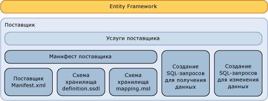

# Создание поставщика данных Entity Framework
В этом разделе описывается написание [!INCLUDE[adonet_ef](../../../../../includes/adonet-ef-md.md)] поставщика для поддержки источника данных, отличного от SQL Server. [!INCLUDE[adonet_ef](../../../../../includes/adonet-ef-md.md)] Включает поставщик, который поддерживает SQL Server.  
  
## Знакомство с моделью поставщика Entity Framework  
 [!INCLUDE[adonet_ef](../../../../../includes/adonet-ef-md.md)] не зависит от баз данных, написать поставщика для подключения к различным источникам данных можно при помощи модели поставщика ADO.NE.  
  
 Поставщик данных Entity Framework (созданный при помощи модели поставщика ADO.NET) выполняет следующие функции.  
  
- Сопоставляет примитивные типы модели EDM с типами поставщика.  
  
- Предоставляет функции данного поставщика.  
  
- Создает команды определенного поставщика для поддержки запросов [!INCLUDE[adonet_ef](../../../../../includes/adonet-ef-md.md)] в данном DbQueryCommandTree.  
  
- Формирует команды обновления для определенного поставщика для поддержки обновлений через [!INCLUDE[adonet_ef](../../../../../includes/adonet-ef-md.md)] в данном DbModificationCommandTree.  
  
- Предоставляет файлы сопоставления для определения схемы хранения для поддержки создания основанной на базе данных модели.  
  
- Предоставляет метаданные (например, таблицы и представления) посредством концептуальной модели.  
  
   
  
## Пример  
 Пример[!INCLUDE[adonet_ef](../../../../../includes/adonet-ef-md.md)] поставщика, который поддерживает источник данных, отличный от SQL Server, см. в [Entity Framework примере поставщика](https://code.msdn.microsoft.com/windowsdesktop/Entity-Framework-Sample-6a9801d0) .  
  
## В этом разделе  
 [Создание SQL](sql-generation.md)  
  
 [Создание кода SQL для изменения данных](modification-sql-generation.md)  
  
 [Спецификация манифеста поставщика](provider-manifest-specification.md)  
  
## См. также

- [Работа с поставщиками данных](working-with-data-providers.md)
