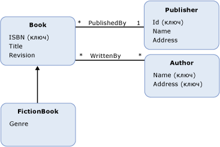

# Модель EDM. Наследование
Entity Data Model (EDM) поддерживает наследование для [типы сущностей](../../../../docs/framework/data/adonet/entity-type.md). Наследование в модели (EDM) схоже с наследованием для классов в языках объектно-ориентированного программирования. Как и с классами в объектно ориентированных языках, в концептуальной модели можно определить тип сущности ( *производный тип*), наследуемый от другого типа сущности ( *базовый тип*). Тем не менее, в отличие от классов в объектно ориентированного программирования, в концептуальной модели производный тип всегда наследует все [свойства](../../../../docs/framework/data/adonet/property.md) и [свойства навигации](../../../../docs/framework/data/adonet/navigation-property.md) базового типа. В производном типе нельзя отменить унаследованные свойства.  
  
 В концептуальной модели можно построить иерархию наследования, в которой один производный тип наследует свойства другого производного типа. Тип в верхней части иерархии (одного типа в иерархии, который не является производным типом) называется *корневой тип*. В иерархии наследования [ключ сущности](../../../../docs/framework/data/adonet/entity-key.md) должен быть определен в корневом типе.  
  
 Нельзя построить иерархии наследования, в которых один производный тип наследует свойства более чем одного типа. Например, в концептуальной модели с типом сущности `Book` можно определить производные типы `FictionBook` и `NonFictionBook`, из которых каждый наследует свойства `Book`. Тем не менее, в дальнейшем нельзя определить тип, который бы наследовал свойства обоих типов `FictionBook` и `NonFictionBook`.  
  
## Пример  
 На приведенной ниже схеме показана концептуальная модель с четырьмя типами сущностей: `Book`, `FictionBook`, `Publisher` и `Author`. Тип сущности `FictionBook` является производным типом, который наследует свойства от типа сущности `Book`. Тип `FictionBook` наследует свойства `ISBN (Key)`, `Title` и `Revision`, а также определяет дополнительное свойство `Genre`.  
  
   
  
 [ADO.NET Entity Framework](../../../../docs/framework/data/adonet/ef/index.md) использует доменный язык (DSL), называемый языком определения концептуальной схемы ([CSDL](../../../../docs/framework/data/adonet/ef/language-reference/csdl-specification.md)) для определения концептуальных моделей. Далее язык CSDL определяет тип сущности, `FictionBook`, который наследует свойства типа `Book` (как показано на схеме выше).  
  
 [!code-xml[EDM_Example_Model#DerivedType](../../../../samples/snippets/xml/VS_Snippets_Data/edm_example_model/xml/books5.edmx#derivedtype)]  
  
## См. также
- [Основные понятия модели EDM](../../../../docs/framework/data/adonet/entity-data-model-key-concepts.md)
- [Сущностная модель данных](../../../../docs/framework/data/adonet/entity-data-model.md)
