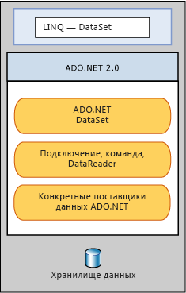

# LINQ to DataSetLINQ to DataSet
[!INCLUDE[linq_dataset](../../../../includes/linq-dataset-md.md)] упрощает и ускоряет запросы к данным, кэшированным в объекте <xref:System.Data.DataSet>. makes it easier and faster to query over data cached in a <xref:System.Data.DataSet> object. В частности [!INCLUDE[linq_dataset](../../../../includes/linq-dataset-md.md)] упрощает создание запросов, позволяет разработчикам писать запросы на языке программирования, а не с помощью отдельный язык запросов.Specifically, [!INCLUDE[linq_dataset](../../../../includes/linq-dataset-md.md)] simplifies querying by enabling developers to write queries from the programming language itself, instead of by using a separate query language. Это особенно полезно для [!INCLUDE[vsprvs](../../../../includes/vsprvs-md.md)] разработчиков, которые теперь могут воспользоваться преимуществами проверки синтаксиса во время компиляции, статическую типизацию и поддержку технологии IntelliSense, предоставляемые [!INCLUDE[vsprvs](../../../../includes/vsprvs-md.md)] в запросах.This is especially useful for [!INCLUDE[vsprvs](../../../../includes/vsprvs-md.md)] developers, who can now take advantage of the compile-time syntax checking, static typing, and IntelliSense support provided by the [!INCLUDE[vsprvs](../../../../includes/vsprvs-md.md)] in their queries.  
  
 Технология [!INCLUDE[linq_dataset](../../../../includes/linq-dataset-md.md)] также может использоваться для запросов к данным, находящимся в одном или нескольких источниках.[!INCLUDE[linq_dataset](../../../../includes/linq-dataset-md.md)] can also be used to query over data that has been consolidated from one or more data sources. Это удовлетворяет многим сценариям, требующим гибкости при представлении и обработке данных, таких как запросы к данным, прошедшим локальную агрегатную обработку, и кэширование на среднем уровне в веб-приложениях.This enables many scenarios that require flexibility in how data is represented and handled, such as querying locally aggregated data and middle-tier caching in Web applications. В частности, этот метод обработки требуется для универсальных приложений отчетности, анализа и бизнес-аналитики.In particular, generic reporting, analysis, and business intelligence applications require this method of manipulation.  
  
 [!INCLUDE[linq_dataset](../../../../includes/linq-dataset-md.md)] Функциональные возможности представлены в основном через методы расширения в <xref:System.Data.DataRowExtensions> и <xref:System.Data.DataTableExtensions> классы.The [!INCLUDE[linq_dataset](../../../../includes/linq-dataset-md.md)] functionality is exposed primarily through the extension methods in the <xref:System.Data.DataRowExtensions> and <xref:System.Data.DataTableExtensions> classes. [!INCLUDE[linq_dataset](../../../../includes/linq-dataset-md.md)]выполняет построение на и использует ее [!INCLUDE[ado_whidbey_long](../../../../includes/ado-whidbey-long-md.md)] архитектуры и не предназначен для замены [!INCLUDE[ado_whidbey_long](../../../../includes/ado-whidbey-long-md.md)] в коде приложения. builds on and uses the existing [!INCLUDE[ado_whidbey_long](../../../../includes/ado-whidbey-long-md.md)] architecture, and is not meant to replace [!INCLUDE[ado_whidbey_long](../../../../includes/ado-whidbey-long-md.md)] in application code. Существующий код ADO.NET 2.0 продолжит работать в приложении [!INCLUDE[linq_dataset](../../../../includes/linq-dataset-md.md)].Existing ADO.NET 2.0 code will continue to function in a [!INCLUDE[linq_dataset](../../../../includes/linq-dataset-md.md)] application. Связь между [!INCLUDE[linq_dataset](../../../../includes/linq-dataset-md.md)] и [!INCLUDE[ado_whidbey_long](../../../../includes/ado-whidbey-long-md.md)] и хранилищем данных показана на следующей схеме.The relationship of [!INCLUDE[linq_dataset](../../../../includes/linq-dataset-md.md)] to [!INCLUDE[ado_whidbey_long](../../../../includes/ado-whidbey-long-md.md)] and the data store is illustrated in the following diagram.  
  
   
  
## СодержаниеIn This Section  
 [Начало работыGetting Started](../../../../docs/framework/data/adonet/getting-started-linq-to-dataset.md)  
  
 [Руководство по программированиюProgramming Guide](../../../../docs/framework/data/adonet/programming-guide-linq-to-dataset.md)  
  
## СсылкаReference  
 <xref:System.Data.DataTableExtensions>  
  
 <xref:System.Data.DataRowExtensions>  
  
 <xref:System.Data.DataRowComparer>  
  
## См. такжеSee Also  
 [Встроенный язык запросов LINQLINQ (Language-Integrated Query)](http://msdn.microsoft.com/library/a73c4aec-5d15-4e98-b962-1274021ea93d)  
 [LINQ и ADO.NETLINQ and ADO.NET](../../../../docs/framework/data/adonet/linq-and-ado-net.md)  
 [ADO.NETADO.NET](../../../../docs/framework/data/adonet/index.md)
