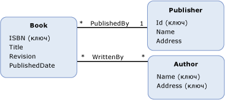

# функция определенной модели
Объект *определяемой моделью функции* — это функция, которая определена в концептуальной модели. Тело функции, определенной модели представляется в формате [Entity SQL](../../../../docs/framework/data/adonet/ef/language-reference/entity-sql-language.md), что позволяет выполнять функцию должна быть представлена независимо от правил или языков, поддерживаемых в источнике данных.  
  
 Определение определяемой моделью функции содержит следующие сведения.  
  
-   Имя функции. (Обязательный атрибут).  
  
-   Тип возвращаемого значения. (Необязательный параметр).  
  
    > [!NOTE]
    >  Если тип возвращаемого значения не задан, возвращаемого значения не будет.  
  
-   Сведения о параметрах. (Необязательный параметр).  
  
-   [Entity SQL](../../../../docs/framework/data/adonet/ef/language-reference/entity-sql-language.md) выражение, определяющее тела функции.  
  
 Обратите внимание, что определяемые моделью функции не поддерживают выходные параметры. Это ограничение введено, чтобы определяемые моделью функции можно было сочетать.  
  
## Пример  
 На приведенной ниже схеме показана концептуальная модель с тремя типами сущностей: `Book`, `Publisher` и `Author`.  
  
   
  
 [ADO.NET Entity Framework](../../../../docs/framework/data/adonet/ef/index.md) использует доменный язык (DSL), называемый языком определения концептуальной схемы ([CSDL](../../../../docs/framework/data/adonet/ef/language-reference/csdl-specification.md)) для определения концептуальных моделей. Следующий язык CSDL определяет функцию в концептуальной модели, которая возвращает числа лет с момента публикации экземпляра `Book` (ранее приведенного на схеме).  
  
 [!code-xml[EDM_Example_Model#ModelDefinedFunction](../../../../samples/snippets/xml/VS_Snippets_Data/edm_example_model/xml/books4.edmx#modeldefinedfunction)]  
  
## См. также  
 [Основные понятия модели данных сущности](../../../../docs/framework/data/adonet/entity-data-model-key-concepts.md)  
 [Модель EDM](../../../../docs/framework/data/adonet/entity-data-model.md)  
 [Модель данных сущности: Примитивные типы данных](../../../../docs/framework/data/adonet/entity-data-model-primitive-data-types.md)
