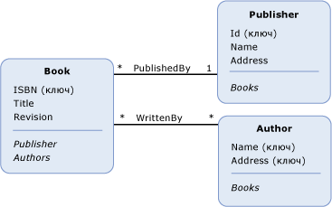

# свойство навигацииnavigation property
Объект *свойство навигации* — это необязательное свойство на [тип сущности](../../../../docs/framework/data/adonet/entity-type.md) , позволяет переходить от одной [окончания](../../../../docs/framework/data/adonet/association-end.md) из [ассоциации](../../../../docs/framework/data/adonet/association-type.md) для другой конец.A *navigation property* is an optional property on an [entity type](../../../../docs/framework/data/adonet/entity-type.md) that allows for navigation from one [end](../../../../docs/framework/data/adonet/association-end.md) of an [association](../../../../docs/framework/data/adonet/association-type.md) to the other end. В отличие от других [свойства](../../../../docs/framework/data/adonet/property.md), свойства навигации не содержат данных.Unlike other [properties](../../../../docs/framework/data/adonet/property.md), navigation properties do not carry data.  
  
 Определение свойства навигации содержит следующую информацию.A navigation property definition includes the following:  
  
-   Имя.A name. (Обязательный атрибут).(Required)  
  
-   Ассоциация, для которой осуществляется переход.The association that it navigates. (Обязательный атрибут).(Required)  
  
-   Конечные точки ассоциации, для которой осуществляется переход.The ends of the association that it navigates. (Обязательный атрибут).(Required)  
  
 Обратите внимание, что свойства навигации являются необязательными для обоих типов сущностей, расположенных в конечных элементах ассоциации.Note that navigation properties are optional on both entity types at the ends of an association. Если свойство навигации было определено для типа сущности на одном конечном элементе ассоциации, то определять его для типа сущности на другом конечном элементе необязательно.If you define a navigation property on one entity type at the end of an association, you do not have to define a navigation property on the entity type at the other end of the association.  
  
 Тип данных свойства навигации определяется [кратность](../../../../docs/framework/data/adonet/association-end-multiplicity.md) его удаленной [ассоциации](../../../../docs/framework/data/adonet/association-end.md).The data type of a navigation property is determined by the [multiplicity](../../../../docs/framework/data/adonet/association-end-multiplicity.md) of its remote [association end](../../../../docs/framework/data/adonet/association-end.md). Например, предположим, что свойство навигации `OrdersNavProp` существует для типа сущности `Customer` и осуществляет навигацию по ассоциации «один ко многим» между `Customer` и `Order`.For example, suppose a navigation property, `OrdersNavProp`, exists on a `Customer` entity type and navigates a one-to-many association between `Customer` and `Order`. Поскольку конечная точка удаленной ассоциации для свойства навигации имеет кратность «много» (*), его тип данных - коллекция (элемент `Order`).Because the remote association end for the navigation property has multiplicity of many (*), its data type is a collection (of `Order`). Аналогично, если свойство навигации `CustomerNavProp` существует для типа сущности `Order`, то его тип данных будет `Customer`, поскольку кратность удаленного конечного элемента - «один» (1).Similarly, if a navigation property, `CustomerNavProp`, exists on the `Order` entity type, its data type would be `Customer`, because the multiplicity of the remote end is one (1).  
  
## ПримерExample  
 На приведенной ниже схеме показана концептуальная модель с тремя типами сущностей: `Book`, `Publisher` и `Author`.The diagram below shows a conceptual model with three entity types: `Book`, `Publisher`, and `Author`. Свойства навигации, `Publisher` и `Authors`, определены относительно типа сущности «Book».Navigation properties, `Publisher` and `Authors`, are defined on the Book entity type. Свойство навигации `Books` определено как относительно типа сущности «Publisher», так и относительно типа сущности `Author`.Navigation property `Books` is defined on both the Publisher entity type and the `Author` entity type.  
  
   
  
 [ADO.NET Entity Framework](../../../../docs/framework/data/adonet/ef/index.md) использует доменный язык (DSL), называемый языком определения концептуальной схемы ([CSDL](../../../../docs/framework/data/adonet/ef/language-reference/csdl-specification.md)) для определения концептуальных моделей.The [ADO.NET Entity Framework](../../../../docs/framework/data/adonet/ef/index.md) uses a domain-specific language (DSL) called conceptual schema definition language ([CSDL](../../../../docs/framework/data/adonet/ef/language-reference/csdl-specification.md)) to define conceptual models. Ниже на языке CSDL определяется тип сущности `Book`, который ранее приводился в схеме.The following CSDL defines the `Book` entity type shown in the diagram above:  
  
 [!code-xml[EDM_Example_Model#EntityExample](../../../../samples/snippets/xml/VS_Snippets_Data/edm_example_model/xml/books.edmx#entityexample)]  
  
 Обратите внимание, что атрибуты XML используются для сообщения сведений, необходимых для определения свойства навигации: атрибут `Name` содержит имя свойства, `Relationship` содержит имя ассоциации, для которой осуществляется переход, и `FromRole` и `ToRole` содержат конечные точки ассоциации.Note that XML attributes are used to communicate the information necessary to define a navigation property: The attribute `Name` contains the name of the property, `Relationship` contains the name of the association it navigates, and `FromRole` and `ToRole` contain the ends of the association.  
  
## См. такжеSee Also  
 [Основные понятия модели данных сущностиEntity Data Model Key Concepts](../../../../docs/framework/data/adonet/entity-data-model-key-concepts.md)  
 [Модель EDMEntity Data Model](../../../../docs/framework/data/adonet/entity-data-model.md)
