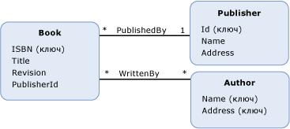

# ограничение ссылочной целостности
*Ограничение ссылочной целостности* в модели EDM схоже с ограничением ссылочной целостности в реляционной базе данных.  Так же как столбец \(или столбцы\) из таблицы базы данных может иметь ссылку на первичный ключ другой таблицы, [свойство](../../../../docs/framework/data/adonet/property.md) \(или свойства\) [типа сущности](../../../../docs/framework/data/adonet/entity-type.md) может иметь ссылки на [ключ сущности](../../../../docs/framework/data/adonet/entity-key.md) другого типа сущности.  Тип сущности, на которую ссылаются, называется *основным элементом* ограничения.  Тип сущности, которая ссылается на основной элемент, называется *зависимым элементом* ограничения.  
  
 Ограничение ссылочной целостности определяется как часть [ассоциации](../../../../docs/framework/data/adonet/association-type.md) между двумя типами сущностей.  Определение ограничения ссылочной целостности включает следующую информацию.  
  
-   Основной конец ограничения.  \(Тип сущности, ключ сущности которого имеет ссылку на зависимый конец.\)  
  
-   Ключ сущности основного конца.  
  
-   Зависимый конец ограничения.  \(Тип сущности, который имеет свойство или свойства, ссылающиеся на ключ сущности основного конца.\)  
  
-   Ссылка на свойство или свойства зависимого конца.  
  
 Целью ограничения ссылочной целостности в модели EDM является обеспечение постоянного существования допустимых ассоциаций.  Для получения дополнительной информации см. [свойство внешнего ключа](../../../../docs/framework/data/adonet/foreign-key-property.md).  
  
## Пример  
 На приведенной ниже схеме показана концептуальная модель с двумя ассоциациями: `WrittenBy` и `PublishedBy`.  Тип сущности `Book` имеет свойство `PublisherId`, которое ссылается на ключ сущности типа сущности `Publisher` при определении ограничения ссылочной целостности ассоциации `PublishedBy`.  
  
   
  
 Платформа [Платформа ADO.NET Entity Framework](../../../../docs/framework/data/adonet/ef/index.md) использует доменный язык DSL, называемый языком CSDL \([CSDL](../../../../docs/framework/data/adonet/ef/language-reference/csdl-specification.md)\), для определения концептуальных моделей.  Далее на языке CSDL определяется ограничение ссылочной целостности для ассоциации `PublishedBy`, которая ранее приводилась в концептуальной модели.  
  
 [!code-xml[EDM_Example_Model#RefConstraint](../../../../samples/snippets/xml/VS_Snippets_Data/edm_example_model/xml/books4.edmx#refconstraint)]  
  
## См. также  
 [Основные понятия модели EDM](../../../../docs/framework/data/adonet/entity-data-model-key-concepts.md)   
 [Модель EDM](../../../../docs/framework/data/adonet/entity-data-model.md)