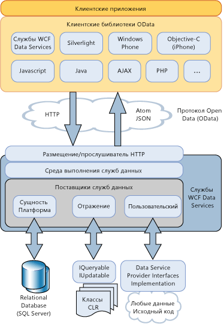

# Общие сведения о службах данных WCF
[!INCLUDE[ssAstoria](../../../../includes/ssastoria-md.md)]позволяют создавать и использовать службы данных для Интернета или интрасети с помощью [!INCLUDE[ssODataFull](../../../../includes/ssodatafull-md.md)]. [!INCLUDE[ssODataShort](../../../../includes/ssodatashort-md.md)]дает возможность предоставления данных в виде ресурсов, которые адресуются по URI. Это позволяет обращаться к данным и изменять их с использованием семантики REST, в частности стандартных команд HTTP, таких как GET, PUT, POST и DELETE. В этом разделе приведены общие сведения о шаблонах и методиках, определенных службами [!INCLUDE[ssODataShort](../../../../includes/ssodatashort-md.md)], а также о функциях, предоставляемых службами [!INCLUDE[ssAstoria](../../../../includes/ssastoria-md.md)] для использования [!INCLUDE[ssODataShort](../../../../includes/ssodatashort-md.md)] в приложениях на базе .NET Framework.  
  
## Адресация данных в виде ресурсов  
 Службы [!INCLUDE[ssODataShort](../../../../includes/ssodatashort-md.md)] предоставляют данные как ресурсы, адресуемые с помощью URI. Пути к ресурсам формируются на основе соглашений о связи сущностей, описанных в модели EDM. Сущности в этой модели представляют операционные единицы данных в домене приложения, такие как клиенты, заказы, элементы и продукты. Дополнительные сведения см. в разделе [модели EDM](../../../../docs/framework/data/adonet/entity-data-model.md).  
  
 Адресация ресурсов сущностей в службах [!INCLUDE[ssODataShort](../../../../includes/ssodatashort-md.md)] осуществляется в виде набора сущностей, содержащего экземпляры типов сущностей. Например, URI `http://services.odata.org/Northwind/Northwind.svc/Customers('ALFKI')/Orders` возвращает все заказы из `Northwind` службы данных, которые связаны с клиентом `CustomerID` значение`ALFKI.`  
  
 Выражения запросов позволяют выполнять традиционные операции с запросами к ресурсам, такие как фильтрация, сортировка и подкачка страниц. Например, URI `http://services.odata.org/Northwind/Northwind.svc/Customers('ALFKI')/Orders?$filter=Freight gt 50` фильтрует ресурсы, возвращая только заказы со стоимостью транспортировки, превышающей 50 долларов. Дополнительные сведения см. в разделе [доступ к ресурсам службы данных](../../../../docs/framework/data/wcf/accessing-data-service-resources-wcf-data-services.md).  
  
## Доступ к данным с возможностью взаимодействия  
 [!INCLUDE[ssODataShort](../../../../includes/ssodatashort-md.md)]выполняет построение на стандартных протоколах Интернета, для обеспечения взаимодействия с приложениями, которые не используют платформу .NET Framework службы данных. Так как возможность использования стандартных URI для адресации данных, приложение может получить доступ к и изменение данных с помощью семантики передачи репрезентативного состояния (REST), в частности стандартных команд HTTP, таких GET, PUT, POST и удаления. Это позволяет обращаться к службам из любого клиента, поддерживающего синтаксический анализ и доступ к данным, передаваемым по стандартным протоколам HTTP.  
  
 Службы [!INCLUDE[ssODataShort](../../../../includes/ssodatashort-md.md)] определяют набор расширений для протокола публикации Atom (AtomPub). Они поддерживают запросы и ответы HTTP в нескольких форматах данных, что позволяет использовать различные клиентские приложения и платформы. Канал [!INCLUDE[ssODataShort](../../../../includes/ssodatashort-md.md)] может представлять данные в формате Atom, формате нотации объектов JavaScript (JSON) и в виде простого XML. Atom является форматом по умолчанию. Формат канала указывается в заголовке HTTP-запроса. Дополнительные сведения см. в разделе [OData: формат Atom](http://go.microsoft.com/fwlink/?LinkID=185794) и [OData: формат JSON](http://go.microsoft.com/fwlink/?LinkID=185795).  
  
 При публикации данных в виде [!INCLUDE[ssODataShort](../../../../includes/ssodatashort-md.md)] веб-канал, [!INCLUDE[ssAstoria](../../../../includes/ssastoria-md.md)] использует другие существующие возможности Интернета для таких операций, как кэширование и проверка подлинности. Чтобы выполнить это, [!INCLUDE[ssAstoria](../../../../includes/ssastoria-md.md)] интегрируется с существующими ведущими приложениями и службами, например ASP.NET, Windows Communication Foundation (WCF) и Internet Information Services (IIS).  
  
## Независимость хранилища  
 Хотя ресурсы адресуются на основе модели связей сущностей, службы [!INCLUDE[ssAstoria](../../../../includes/ssastoria-md.md)] предоставляют каналы [!INCLUDE[ssODataShort](../../../../includes/ssodatashort-md.md)] независимо от базового источника данных. После того как службы [!INCLUDE[ssAstoria](../../../../includes/ssastoria-md.md)] принимают запрос HTTP к ресурсу, идентифицируемому URI, запрос десериализуется и его представление передается поставщику [!INCLUDE[ssAstoria](../../../../includes/ssastoria-md.md)]. Поставщик преобразует запрос в формат, зависящий от источника данных, и выполняет его на базовом источнике данных. В службах [!INCLUDE[ssAstoria](../../../../includes/ssastoria-md.md)] независимость от хранилища достигается путем отделения концептуальной модели адресации ресурсов, указанных [!INCLUDE[ssODataShort](../../../../includes/ssodatashort-md.md)], от конкретной схемы базового источника данных.  
  
 Службы [!INCLUDE[ssAstoria](../../../../includes/ssastoria-md.md)] интегрируются со средой ADO.NET Entity Framework, позволяя создавать службы данных, предоставляющие реляционные данные. Для создания модели данных, содержащей адресуемые ресурсы в виде сущностей и в то же время определяющей сопоставление между этой моделью и таблицами нижележащей базы данных, можно использовать программы для работы с моделью EDM. Дополнительные сведения см. в разделе [поставщика Entity Framework](../../../../docs/framework/data/wcf/entity-framework-provider-wcf-data-services.md).  
  
 [!INCLUDE[ssAstoria](../../../../includes/ssastoria-md.md)]также позволяет создавать службы данных, предоставляющие любые структуры данных, которые возвращают реализацию <xref:System.Linq.IQueryable%601> интерфейса. Это позволяет создавать службы данных, предоставляющие данные из типов .NET Framework. Для поддержки операций создания, обновления и удаления должен быть также реализован интерфейс <xref:System.Data.Services.IUpdatable>. Дополнительные сведения см. в разделе [поставщик отражения](../../../../docs/framework/data/wcf/reflection-provider-wcf-data-services.md).  
  
 Дополнительные сведения о том, как [!INCLUDE[ssAstoria](../../../../includes/ssastoria-md.md)] интегрируется с этими поставщиками данных проиллюстрирована на архитектурной диаграмме далее в этом разделе.  
  
## Пользовательская бизнес-логика  
 [!INCLUDE[ssAstoria](../../../../includes/ssastoria-md.md)]позволяет легко добавить пользовательской бизнес-логики в службу данных с помощью перехватчиков и операций службы. Операции службы — это методы, определенные на сервере и адресуемые с помощью URI в том же формате, что и ресурсы данных. Операции службы могут также использовать синтаксис выражений запросов для фильтрации, упорядочения и разбиения на страницы данных, возвращаемых операцией. Например, URI `http://localhost:12345/Northwind.svc/GetOrdersByCity?city='London'&$orderby=OrderDate&$top=10&$skip=10` представляет вызов служебной операции с именем `GetOrdersByCity` для службы данных Northwind, возвращающей заказы клиентов из Лондона, разбитые на страницы и отсортированные по значению `OrderDate`. Дополнительные сведения см. в разделе [операций службы](../../../../docs/framework/data/wcf/service-operations-wcf-data-services.md).  
  
 Перехватчики позволяют разработчику интегрировать настраиваемую прикладную логику в процесс обработки запросов и ответов службы данных. Перехватчики вызываются при выполнении операции запроса, вставки, обновления или удаления над указанным набором сущностей. При этом перехватчик может изменить данные, применить политику проверки подлинности и даже преждевременно завершить операцию. Методы перехватчика необходимо явно регистрировать для конкретного набора сущностей, предоставляемого службой данных. Дополнительные сведения см. в разделе [перехватчики](../../../../docs/framework/data/wcf/interceptors-wcf-data-services.md).  
  
## Клиентские библиотеки  
 [!INCLUDE[ssODataShort](../../../../includes/ssodatashort-md.md)]Определяет набор универсальных шаблонов для взаимодействия со службами данных. Это дает возможность создавать многократно используемые компоненты, основанные на этих служб, включая клиентские библиотеки, которые упрощают использование служб данных.  
  
 Службы [!INCLUDE[ssAstoria](../../../../includes/ssastoria-md.md)] включают клиентские библиотеки для клиентских приложений как на основе .NET Framework, так и на основе Silverlight. Эти клиентские библиотеки позволяют взаимодействовать со службами данных с помощью объектов .NET Framework. Они также поддерживают запросы на базе объектов и запросы LINQ, загрузку связанных объектов, отслеживание изменений и разрешение идентификаторов. Дополнительные сведения см. в разделе [клиентскую библиотеку служб данных WCF](../../../../docs/framework/data/wcf/wcf-data-services-client-library.md).  
  
 В дополнение к [!INCLUDE[ssODataShort](../../../../includes/ssodatashort-md.md)] клиентских библиотек, поставляемых с платформой .NET Framework и Silverlight, имеются другие клиентские библиотеки, позволяющие использовать [!INCLUDE[ssODataShort](../../../../includes/ssodatashort-md.md)] веб-канала в клиентских приложениях, таких как приложения PHP, AJAX и Java. Дополнительные сведения см. в разделе [OData SDK](http://go.microsoft.com/fwlink/?LinkID=185796).  
  
## Общие сведения об архитектуре  
 На следующей схеме показана [!INCLUDE[ssAstoria](../../../../includes/ssastoria-md.md)] архитектуры для предоставления [!INCLUDE[ssODataShort](../../../../includes/ssodatashort-md.md)] веб-каналы и их использования в [!INCLUDE[ssODataShort](../../../../includes/ssodatashort-md.md)]-включены клиентские библиотеки:  
  
   
  
## См. также  
 [Службы данных WCF 4.5](../../../../docs/framework/data/wcf/index.md)  
 [Начало работы](../../../../docs/framework/data/wcf/getting-started-with-wcf-data-services.md)  
 [Определение служб данных WCF](../../../../docs/framework/data/wcf/defining-wcf-data-services.md)  
 [Доступ к службе данных (службы данных WCF)](http://msdn.microsoft.com/en-us/1e54a2b9-2ec6-4002-b8f8-c1d8df37c350)  
 [Библиотека клиентов служб данных WCF](../../../../docs/framework/data/wcf/wcf-data-services-client-library.md)  
 [Передача состояния представления (REST)](http://go.microsoft.com/fwlink/?LinkId=113919)
