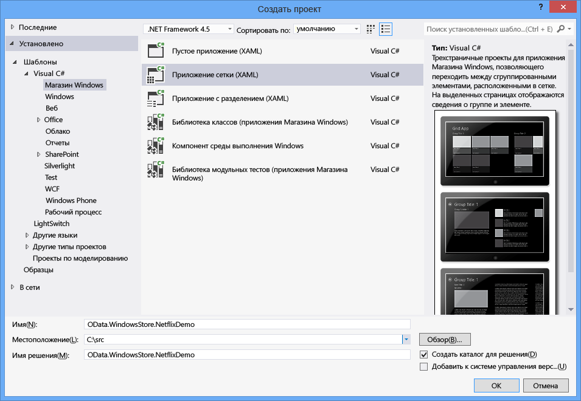
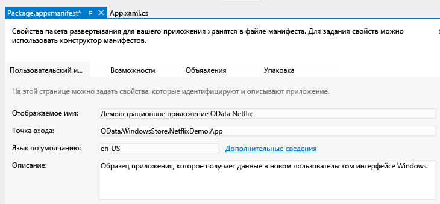
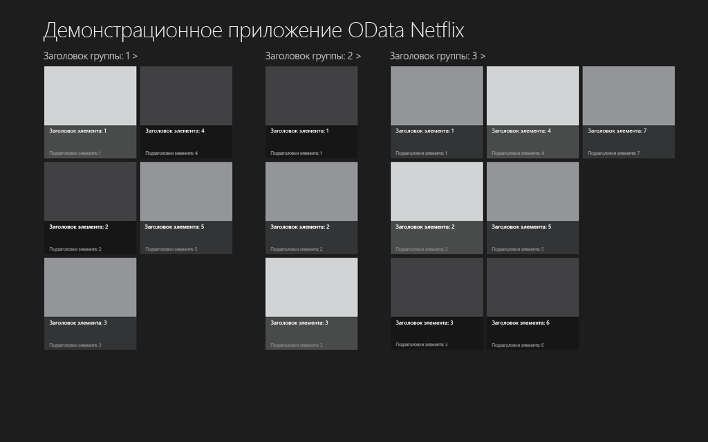
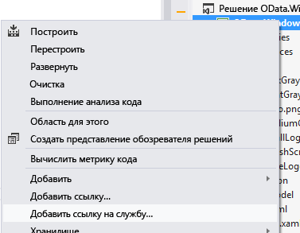
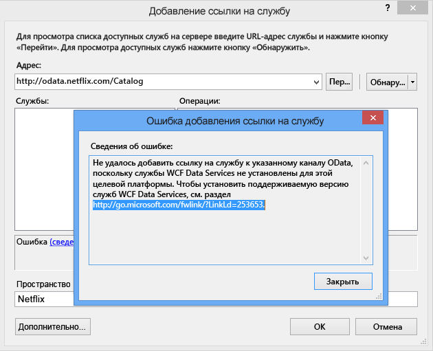
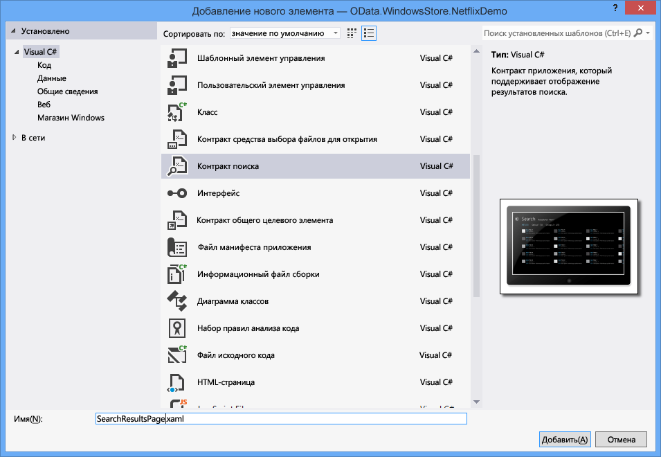

# <a name="writing-a-windows-store-app-that-consumes-an-odata-service"></a>Создание приложения Магазина Windows, работающего со службой OData
Windows 8 появился новый тип приложения: приложение для магазина Windows. Приложения Магазина Windows имеют новый внешний вид, выполняются на различных устройствах и доступны в Магазине Windows. В этом разделе описывается процесс создания приложения Магазина Windows, использующего службу OData, а именно, службу OData NetFlix Catalog. Дополнительные сведения о приложениях для магазина Windows, ознакомьтесь с [Приступая к работе с приложениями магазина Windows](http://msdn.microsoft.com/library/windows/apps/br211386.aspx).  
  
## <a name="prerequisites"></a>Предварительные требования  
  
1.  [Microsoft Windows 8](http://go.microsoft.com/fwlink/p/?LinkId=266654)  
  
2.  [Microsoft Visual Studio 2012](http://go.microsoft.com/fwlink/p/?LinkId=266655)  
  
3.  [Службы данных WCF](http://msdn.microsoft.com/data/bb931106)  
  
#### <a name="creating-the-default-windows-store-grid-application"></a>Создание приложения Магазина Windows с сеткой по умолчанию  
  
1.  Создайте новое приложение Магазина Windows с сеткой с помощью C# и XAML. Назовите приложение OData.WindowsStore.NetflixDemo:  
  
       
  
2.  Откройте Package.appxmanifest и введите понятное имя в текстовом поле «Отображаемое имя». Оно задает имя приложения, используемое функциями поиска Windows 8.  
  
       
  
3.  Введите понятное имя в \<AppName > в файле App.xaml. Оно определяет имя приложения, которое будет отображаться при запуске приложения:  
  
       
  
4.  Соберите и запустите приложение. Сначала отобразится заставка приложения. Заставка по умолчанию представлена на снимке экрана ниже. Используемое изображение хранится в папке проекта «Assets».  
  
       
  
     Затем появится приложение.  
  
       
  
     Приложение по умолчанию определяет набор классов в SampleDataSource.cs: SampleDataGroup и SampleDataItem, которые являются производными от SampleDataCommon, который, в свою очередь, является производным от BindableBase. SampleDataGroup и SampleDataItem привязаны к GridView по умолчанию. SampleDataSource.cs расположен в папке DataModel в проекте NetflixDemo. Приложение отображает сгруппированную коллекцию. Каждая группа содержит произвольное количество элементов; их представляют SampleDataGroup и SampleDataItem соответственно. На предыдущем снимке экрана можно увидеть группу, озаглавленную как @@@Group Title 1, и все элементы в группе, отображаемые вместе.  
  
     Главная страница приложения — GroupedItemsPage.xaml. Она содержит GridView, отображающий образец данных, созданный классом SampleDataSource.cs. GroupedItemsPage загружается App.xaml.cs в вызове к rootFrame.Navigate:  
  
    ```csharp  
    if (!rootFrame.Navigate(typeof(GroupedItemsPage), "AllGroups"))  
    {  
        throw new Exception("Failed to create initial page");  
    }  
    ```  
  
     Это приводит к созданию GroupedItemsPage и вызову ее метода LoadState. LoadState вызывает создание статического экземпляра SampleDataSource, который создает коллекцию объектов SampleDataGroup. Каждый объект SampleDataGroup содержит коллекцию объектов SampleDataItem. LoadState хранит коллекцию объектов SampleDataGroup в DefaultViewModel:  
  
    ```csharp  
    protected override void LoadState(Object navigationParameter, Dictionary<String, Object> pageState)  
    {  
        var sampleDataGroups = SampleDataSource.GetGroups((String)navigationParameter);  
        this.DefaultViewModel["Groups"] = sampleDataGroups;  
    }  
    ```  
  
     Затем DefaultViewModel привязывается к GridView. При конфигурации привязки данных на него создается ссылка в файле GroupedItemsPage.xaml.  
  
    ```xaml
    <CollectionViewSource  
                x:Name="groupedItemsViewSource"  
                Source="{Binding Groups}"  
                IsSourceGrouped="true"  
                ItemsPath="TopItems"  
                d:Source="{Binding AllGroups, Source={d:DesignInstance Type=data:SampleDataSource, IsDesignTimeCreatable=True}}"/>  
    ```  
  
     CollectionViewSource используется в качестве посредника для обработки сгруппированных коллекций. Когда происходит привязка, он проходит по коллекции объектов SampleDataGroup, заполняя GridView.  Атрибут ItemsPath указывает CollectionViewSource, какое свойство каждого объекта SampleDataGroup использовать для нахождения объектов SampleDataItem, которые он содержит. В этом случае каждый объект SampleDataGroup содержит коллекцию TopItems объектов SampleDataItem.  
  
     Для приложения Netflix фильмы группируются по жанру. Таким образом, приложение отображает несколько жанров и список фильмов в этом жанре.  
  
#### <a name="add-a-service-reference-to-the-netflix-odata-service"></a>Добавить ссылку на службу в службу Netflix OData  
  
1.  Прежде чем можно будет совершать вызовы к службе Netflix OData, необходимо добавить ссылку на службу. В обозревателе решений щелкните проект правой кнопкой мыши и выберите команду «Добавить ссылку на службу...»  
  
       
  
2.  Введите URL-адрес для службы Netflix OData в адресную строку и нажмите кнопку «Перейти». Задайте пространство имен ссылки на службу в Netflix и нажмите кнопку «ОК».  
  
       
  
    > [!NOTE]
    >  Если вы еще не установили [WCF данных службы средств для приложений магазина Windows](http://go.microsoft.com/fwlink/p/?LinkId=266652), появится сообщение, подобное показанному выше. Для продолжения необходимо будет загрузить и установить средства по приведенной ссылке.  
  
 Добавление ссылки на службы создает строго типизированные классы, которые службы WCF Data Services будут использовать для синтаксического анализа OData возвращаемых службой Netflix OData. Классы, определенные в SampleDataSource.cs, можно привязать к GridView, поэтому необходимо передать данные из созданных клиентских классов OData в поддерживающие привязку классы, определенные в SampleDataSource.cs.  Чтобы сделать это, необходимо внести некоторые изменения в модель данных, определенную в SampleDataSource.cs.  
  
#### <a name="update-the-data-model-for-the-application"></a>Обновление модели данных для приложения  
  
1.  Замените существующий код в SampleDataSource.cs кодом из [этой страницы](https://gist.github.com/3419288). Обновленный код добавляет метод LoadMovies (в класс SampleDataSource), который выполняет запрос к службе Netflix OData и заполняет список жанров (allGroups), а в каждом жанре — список фильмов. Класс SampleDataGroup используется для представления жанра, а класс SampleDataItem — для представления фильма.  
  
    ```csharp  
    public static async void LoadMovies()  
    {  
        IEnumerable<Title> titles = await ((DataServiceQuery<Title>)Context.Titles  
            .Expand("Genres,AudioFormats,AudioFormats/Language,Awards,Cast")  
            .Where(t => t.Rating == "PG")  
            .OrderByDescending(t => t.ReleaseYear)  
            .Take(300)).ExecuteAsync();  
  
        foreach (Title title in titles)  
        {  
            foreach (Genre netflixGenre in title.Genres)  
            {  
                SampleDataGroup genre = GetGroup(netflixGenre.Name);  
                if (genre == null)  
                {  
                    genre = new SampleDataGroup(netflixGenre.Name, netflixGenre.Name, String.Empty, title.BoxArt.LargeUrl, String.Empty);  
                    Instance.AllGroups.Add(genre);  
                }  
                var content = new StringBuilder();  
                // Write additional things to content here if you want them to display in the item detail.  
                genre.Items.Add(new SampleDataItem(title.Id, title.Name, String.Format("{0}rnrn{1} ({2})", title.Synopsis, title.Rating, title.ReleaseYear), title.BoxArt.HighDefinitionUrl ?? title.BoxArt.LargeUrl, "Description", content.ToString()));  
            }  
        }  
    }  
    ```  
  
     [Асинхронная модель на основе задач](http://go.microsoft.com/fwlink/p/?LinkId=266651) (TAP) используется для асинхронного получения 300 (Take) последних (OrderByDescending) PG-рейтингом фильмы обратно из Netflix. Оставшаяся часть кода создает SimpleDataItems и SimpleDataGroups из сущностей, которые были возвращены в канале OData.  
  
     Класс SampleDataSource также реализует простой метод поиска. В этом случае он выполняет простой поиск загруженных фильмов в памяти.  
  
    ```csharp  
    public static IEnumerable<SampleDataItem> Search(string searchString)  
    {  
            var regex = new Regex(searchString, RegexOptions.CultureInvariant | RegexOptions.IgnoreCase | RegexOptions.IgnorePatternWhitespace);  
            return Instance.AllGroups  
                .SelectMany(g => g.Items)  
                .Where(m => regex.IsMatch(m.Title) || regex.IsMatch(m.Subtitle))  
                    .Distinct(new SampleDataItemComparer());  
    }  
    ```  
  
     Также в SampleDataSource.cs определяется класс ExtensionMethods. Каждый из этих методов расширения использует шаблон TAP, чтобы разрешить SampleDataSource выполнить запрос OData без блокировки пользовательского интерфейса. Например, следующий код использует для реализации TAP метод Task.Factory.FromAsync.  
  
    ```csharp  
    public static async Task<IEnumerable<T>> ExecuteAsync<T>(this DataServiceQuery<T> query)  
    {  
        return await Task.Factory.FromAsync<IEnumerable<T>>(query.BeginExecute(null, null), query.EndExecute);  
    }  
    ```  
  
     Как и в приложении по умолчанию, главная страница приложения — GroupedItemsPage. В этот раз, однако, на ней отображаются фильмы, полученные из Netflix и сгруппированные по жанру.  После создания GroupedItemsPage вызывается его метода LoadState. LoadState вызывает создание статического экземпляра SampleDataSource путем обращения к службе Netflix OData, как описано выше. LoadState хранит коллекцию жанров (объектов SampleDataGroup) в DefaultViewModel:  
  
    ```csharp  
    protected override void LoadState(Object navigationParameter, Dictionary<String, Object> pageState)  
    {  
  
        var sampleDataGroups = SampleDataSource.GetGroups((String)navigationParameter);  
        this.DefaultViewModel["Groups"] = sampleDataGroups;  
    }  
    ```  
  
     Как описано выше, после этого используется DefaultViewModel для привязки данных к GridView.  
  
#### <a name="add-a-search-contract-to-allow-the-application-to-participate-in-windows-search"></a>Добавьте контракт поиска, чтобы разрешить приложению участвовать в поиске Windows  
  
1.  Добавьте контракт поиска в приложение. Это даст приложению возможность интеграции с интерфейсом поиска Windows 8. Назовите контракт поиска SearchResultsPage.xaml  
  
       
  
2.  Измените строку 58 в SearchResultsPage.xaml.cs, удалив внутренние кавычки, в которые взят queryText.  
  
    ```csharp  
    // Communicate results through the view model  
    this.DefaultViewModel["QueryText"] = queryText;  
    this.DefaultViewModel["Filters"] = filterList;  
    this.DefaultViewModel["ShowFilters"] = filterList.Count > 1;  
    ```  
  
3.  Вставьте следующие две строки кода в строку 81 в SearchResultsPage.xaml.cs для получения результатов поиска.  
  
    ```csharp  
    // TODO: Respond to the change in active filter by setting this.DefaultViewModel["Results"]  
                    //       to a collection of items with bindable Image, Title, Subtitle, and Description properties  
                    var searchValue = (string)this.DefaultViewModel["QueryText"];  
                    this.DefaultViewModel["Results"] = new List<SampleDataItem>(SampleDataSource.Search(searchValue));  
    ```  
  
 Когда пользователь вызовет поиск Windows, введет поисковый запрос и нажмет значок демонстрационного приложения Netflix на панели поиска, будет выполнен метод LoadState в SearchResultsPage. Параметр навигации, отправляемый в LoadState, содержит поисковый запрос. После этого будет вызван метод Filter_SelectionChanged, который вызовет метод Search класса SampleDataSource. Возвращенные результаты будут выведены на странице SearchResultsPage.xaml.  
  
```csharp  
/// <summary>  
        /// Invoked when a filter is selected using the ComboBox in snapped view state.  
        /// </summary>  
        /// <param name="sender">The ComboBox instance.</param>  
        /// <param name="e">Event data describing how the selected filter was changed.</param>  
        void Filter_SelectionChanged(object sender, SelectionChangedEventArgs e)  
        {  
            // Determine what filter was selected  
            var selectedFilter = e.AddedItems.FirstOrDefault() as Filter;  
            if (selectedFilter != null)  
            {  
                // Mirror the results into the corresponding Filter object to allow the  
                // RadioButton representation used when not snapped to reflect the change  
                selectedFilter.Active = true;  
  
                // TODO: Respond to the change in active filter by setting this.DefaultViewModel["Results"]  
                //       to a collection of items with bindable Image, Title, Subtitle, and Description properties  
                var searchValue = (string)this.DefaultViewModel["QueryText"];  
                this.DefaultViewModel["Results"] = new List<SampleDataItem>(SampleDataSource.Search(searchValue));  
  
                // Ensure results are found  
                object results;  
                ICollection resultsCollection;  
                if (this.DefaultViewModel.TryGetValue("Results", out results) &&  
                    (resultsCollection = results as ICollection) != null &&  
                    resultsCollection.Count != 0)  
                {  
                    VisualStateManager.GoToState(this, "ResultsFound", true);  
                    return;  
                }  
            }  
  
            // Display informational text when there are no search results.  
            VisualStateManager.GoToState(this, "NoResultsFound", true);  
        }  
```  
  
 Дополнительные сведения об интеграции поиска в приложение см [поиск: интеграция в интерфейс поиска Windows 8](http://go.microsoft.com/fwlink/p/?LinkId=266650).  
  
## <a name="run-the-application"></a>Запуск приложения  
 Запустите приложение, нажав клавишу F5. Обратите внимание, что загрузка изображений при запуске приложения занимает несколько секунд. Кроме того, первая попытка поиска может не вернуть никаких результатов. В реальном приложении возникнет необходимость устранить обе эти проблемы.  
  
 Приложение вызывает службу Netflix OData, получает данные в создаваемых клиентских классах OData, а затем передает эти данные в поддерживающие привязку классы данных (SampleDataSource, SampleDataGroup и SampleDataItem). Оно использует эти поддерживающие привязку классы для привязки данных к GridView. Если вы не знакомы с принципами работы системы привязки данных для XAML см. в разделе [как группировать элементы в списке или сетке (приложения магазина Windows с помощью C#, VB, C++ и XAML)](http://msdn.microsoft.com/library/windows/apps/xaml/hh780627).
