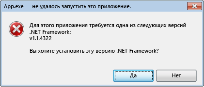

# Ошибки инициализации платформы .NET Framework. Управление взаимодействием с пользователем.NET Framework Initialization Errors: Managing the User Experience
Система активации среды CLR определяет версию среды CLR, которая будет использоваться для выполнения управляемого кода приложения.The common language runtime (CLR) activation system determines the version of the CLR that will be used to run managed application code. В некоторых случаях система активации может не найти версию среды CLR для загрузки.In some cases, the activation system might not be able to find a version of the CLR to load. Эта ситуация обычно возникает в том случае, если приложение требует версии среды CLR, которая недопустима или не установлена на данном компьютере.This situation typically occurs when an application requires a CLR version that is invalid or not installed on a given computer. Если запрошенная версия не найдена, то система активации среды CLR получает код ошибки HRESULT из вызванных функции или интерфейса и может отобразить сообщение об ошибке для пользователя, запустившего приложение.If the requested version is not found, the CLR activation system returns an HRESULT error code from the function or interface that was called, and may display an error message to the user who is running the application. В этой статье приводится список кодов HRESULT и объясняется, как можно запретить отображение сообщения об ошибке.This article provides a list of HRESULT codes and explains how you can prevent the error message from being displayed.  
  
 Среда CLR предоставляет инфраструктуру ведения журнала для облегчения отладки проблем активации среды CLR, как описано в разделе [Практическое руководство. Отладка проблем при активации среды CLR](../../../docs/framework/deployment/how-to-debug-clr-activation-issues.md).The CLR provides logging infrastructure to help you debug CLR activation issues, as described in [How to: Debug CLR Activation Issues](../../../docs/framework/deployment/how-to-debug-clr-activation-issues.md). Эту инфраструктуру не следует путать с [журналами привязки сборок](../../../docs/framework/tools/fuslogvw-exe-assembly-binding-log-viewer.md), которая полностью отличается.This infrastructure should not be confused with [assembly binding logs](../../../docs/framework/tools/fuslogvw-exe-assembly-binding-log-viewer.md), which are entirely different.  
  
## Коды HRESULT активации CLRCLR Activation HRESULT Codes  
 Интерфейсы API активации среды CLR возвращают коды HRESULT, чтобы сообщить о результатах операции активации основному приложению.The CLR activation APIs return HRESULT codes to report the result of an activation operation to a host. Основные приложения среды CLR должны всегда обращаться к этими возвращаемым значениям, прежде чем предпринимать какие-либо дополнительные действия.CLR hosts should always consult these return values before proceeding with additional operations.  
  
-   CLR_E_SHIM_RUNTIMELOADCLR_E_SHIM_RUNTIMELOAD  
  
-   CLR_E_SHIM_RUNTIMEEXPORTCLR_E_SHIM_RUNTIMEEXPORT  
  
-   CLR_E_SHIM_INSTALLROOTCLR_E_SHIM_INSTALLROOT  
  
-   CLR_E_SHIM_INSTALLCOMPCLR_E_SHIM_INSTALLCOMP  
  
-   CLR_E_SHIM_LEGACYRUNTIMEALREADYBOUNDCLR_E_SHIM_LEGACYRUNTIMEALREADYBOUND  
  
-   CLR_E_SHIM_SHUTDOWNINPROGRESSCLR_E_SHIM_SHUTDOWNINPROGRESS  
  
## Пользовательский интерфейс для ошибок инициализацииUI for Initialization Errors  
 Если системе активации среды CLR не удается загрузить правильную версию среды выполнения, которая требуется приложению, она отображает сообщение об ошибке, чтобы уведомить пользователя, что компьютер не настроен должным образом для запуска приложения, и предоставить с возможность исправить ситуацию.If the CLR activation system cannot load the correct version of the runtime that is required by an application, it displays an error message to users to inform them that their computer is not properly configured to run the application, and provides them with an opportunity to remedy the situation. Обычно в такой ситуации отображается следующее сообщение об ошибке.The following error message is typically presented in this situation. Пользователь может выбрать **Да**, чтобы перейти к веб-сайту Майкрософт, где он может загрузить правильную версию платформы .NET Framework для приложения.The user can choose **Yes** to go to a Microsoft website where they can download the correct .NET Framework version for the application.  
  
   
Типичное сообщение об ошибке инициализацииTypical error message for initialization errors  
  
## Устранение ошибок инициализацииResolving the Initialization Error  
 В распоряжении разработчика имеются различные параметры для контроля сообщений об ошибках инициализации платформы .NET Framework.As a developer, you have a variety of options for controlling the .NET Framework initialization error message. Например, можно использовать флаг API для запрета отображения сообщения, как описано в следующем разделе.For example, you can use an API flag to prevent the message from being displayed, as discussed in the next section. Тем не менее причину, по которой приложение не смогло загрузить нужную среду выполнения, нужно устранить.However, you still have to resolve the issue that prevented your application from loading the requested runtime. В противном случае приложение не сможет работать либо часть функций будет недоступна.Otherwise, your application may not run at all, or some functionality may not be available.  
  
 Для разрешения проблем и наилучшего взаимодействия с пользователем (меньшее количество сообщений об ошибках), рекомендуется следующее:To resolve the underlying issues and provide the best user experience (fewer error messages), we recommend the following:  
  
-   Для приложений .NET Framework 3.5 (и более ранних версий): настройте приложение так, чтобы оно поддерживало платформы .NET Framework 4 или 4.5 (см. [инструкции](../../../docs/framework/migration-guide/how-to-configure-an-app-to-support-net-framework-4-or-4-5.md)).For .NET Framework 3.5 (and earlier) applications: Configure your application to support the .NET Framework 4 or 4.5 (see [instructions](../../../docs/framework/migration-guide/how-to-configure-an-app-to-support-net-framework-4-or-4-5.md)).  
  
-   Для приложений .NET Framework версии 4: установите распространяемый пакет платформы .NET Framework 4 в составе установки приложения.For .NET Framework 4 applications: Install the .NET Framework 4 redistributable package as part of your application setup. См. раздел [Руководство по развертыванию для разработчиков](../../../docs/framework/deployment/deployment-guide-for-developers.md).See [Deployment Guide for Developers](../../../docs/framework/deployment/deployment-guide-for-developers.md).  
  
## Управление сообщениями об ошибкахControlling the Error Message  
 Отображение сообщения об ошибках для уведомления о том, что запрошенная версия платформы .NET Framework не найдена, можно рассматривать как полезную услугу или источник раздражения для пользователя.Displaying an error message to communicate that a requested .NET Framework version was not found can be viewed as either a helpful service or a minor annoyance to users. В любом случае этим пользовательским интерфейсом можно управлять, передавая флаги в API активации.In either case, you can control this UI by passing flags to the activation APIs.  
  
 Метод [ICLRMetaHostPolicy::GetRequestedRuntime](../../../docs/framework/unmanaged-api/hosting/iclrmetahostpolicy-getrequestedruntime-method.md) принимает в качестве входных данных элемент перечисления [METAHOST_POLICY_FLAGS](../../../docs/framework/unmanaged-api/hosting/metahost-policy-flags-enumeration.md).The [ICLRMetaHostPolicy::GetRequestedRuntime](../../../docs/framework/unmanaged-api/hosting/iclrmetahostpolicy-getrequestedruntime-method.md) method accepts a [METAHOST_POLICY_FLAGS](../../../docs/framework/unmanaged-api/hosting/metahost-policy-flags-enumeration.md) enumeration member as input. Можно включить флаг METAHOST_POLICY_SHOW_ERROR_DIALOG для запроса сообщения об ошибке, если запрошенная версия среды CLR не будет найдена.You can include the METAHOST_POLICY_SHOW_ERROR_DIALOG flag to request an error message if the requested version of the CLR is not found. По умолчанию сообщение об ошибке не отображается.By default, the error message is not displayed. (Метод [ICLRMetaHost::GetRuntime](../../../docs/framework/unmanaged-api/hosting/iclrmetahost-getruntime-method.md) не поддерживает этот флаг и не предоставляет иных способов отобразить сообщение об ошибке.)(The [ICLRMetaHost::GetRuntime](../../../docs/framework/unmanaged-api/hosting/iclrmetahost-getruntime-method.md) method does not accept this flag, and does not provide any other way to display the error message.)  
  
 Windows предоставляет функцию [SetErrorMode](https://go.microsoft.com/fwlink/p/?LinkID=255242), с помощью которой можно объявить, должны ли сообщения об ошибках отображаться как результат выполнения кода, выполняемого внутри процесса.Windows provides a [SetErrorMode](https://go.microsoft.com/fwlink/p/?LinkID=255242) function that you can use to declare whether you want error messages to be shown as a result of code that runs within your process. Можно указать флаг SEM_FAILCRITICALERRORS, чтобы запретить отображение сообщения об ошибке.You can specify the SEM_FAILCRITICALERRORS flag to prevent the error message from being displayed.  
  
 Но в некоторых случаях важно переопределить параметр SEM_FAILCRITICALERRORS, установленный процессом приложения.However, in some scenarios, it is important to override the SEM_FAILCRITICALERRORS setting set by an application process. Например, если имеется собственный компонент COM, в котором находится среда CLR и расположенный в процессе, для которого установлен флаг SEM_FAILCRITICALERRORS, можно переопределить флаг в зависимости от влияния отображения сообщений об ошибках в пределах данного процесса приложения.For example, if you have a native COM component that hosts the CLR and that is hosted in a process where SEM_FAILCRITICALERRORS is set, you may want to override the flag, depending on the impact of displaying error messages within that particular application process. В этом случае для переопределения SEM_FAILCRITICALERRORS можно воспользоваться одним из следующих флагов:In this case, you can use one of the following flags to override SEM_FAILCRITICALERRORS:  
  
-   Используйте METAHOST_POLICY_IGNORE_ERROR_MODE с методом [ICLRMetaHostPolicy::GetRequestedRuntime](../../../docs/framework/unmanaged-api/hosting/iclrmetahostpolicy-getrequestedruntime-method.md).Use METAHOST_POLICY_IGNORE_ERROR_MODE with the [ICLRMetaHostPolicy::GetRequestedRuntime](../../../docs/framework/unmanaged-api/hosting/iclrmetahostpolicy-getrequestedruntime-method.md) method.  
  
-   Используйте RUNTIME_INFO_IGNORE_ERROR_MODE с функцией [GetRequestedRuntimeInfo](../../../docs/framework/unmanaged-api/hosting/getrequestedruntimeinfo-function.md).Use RUNTIME_INFO_IGNORE_ERROR_MODE with the [GetRequestedRuntimeInfo](../../../docs/framework/unmanaged-api/hosting/getrequestedruntimeinfo-function.md) function.  
  
## Политика пользовательского интерфейса для узлов в среде CLRUI Policy for CLR-Provided Hosts  
 Среда CLR включает в себя набор узлов для различных сценариев. Все эти узлы отображают сообщение об ошибке при возникновении проблем с загрузкой необходимой версии среды выполнения.The CLR includes a set of hosts for a variety of scenarios, and these hosts all display an error message when they encounter problems loading the required version of the runtime. В следующей таблице приводится список узлов и их политик сообщений об ошибках.The following table provides a list of hosts and their error message policies.  
  
|Узел CLRCLR host|Описание:Description|Политика сообщения об ошибкахError message policy|Можно ли отключить сообщение об ошибке?Can error message be disabled?|  
|--------------|-----------------|--------------------------|------------------------------------|  
|Узел управляемых EXE-файловManaged EXE host|Запускает управляемые EXE-файлы.Launches managed EXEs.|Отображается в случае отсутствия версии платформы .NET FrameworkIs shown in case of a missing .NET Framework version|НетNo|  
|Узел управляемого COMManaged COM host|Загружает управляемые компоненты COM в процесс.Loads managed COM components into a process.|Отображается в случае отсутствия версии платформы .NET FrameworkIs shown in case of a missing .NET Framework version|Да, установив флаг SEM_FAILCRITICALERRORSYes, by setting the SEM_FAILCRITICALERRORS flag|  
|Узел ClickOnceClickOnce host|Запускает приложения ClickOnce.Launches ClickOnce applications.|Отображается в случае отсутствия версии платформы .NET Framework, начиная с [!INCLUDE[net_v45](../../../includes/net-v45-md.md)]Is shown in case of a missing .NET Framework version, starting with the [!INCLUDE[net_v45](../../../includes/net-v45-md.md)]|НетNo|  
|Узел XBAPXBAP host|Запускает приложения WPF XBAP.Launches WPF XBAP applications.|Отображается в случае отсутствия версии платформы .NET Framework, начиная с [!INCLUDE[net_v45](../../../includes/net-v45-md.md)]Is shown in case of a missing .NET Framework version, starting with the [!INCLUDE[net_v45](../../../includes/net-v45-md.md)]|НетNo|  
  
## Поведение [!INCLUDE[win8](../../../includes/win8-md.md)] и пользовательский интерфейс[!INCLUDE[win8](../../../includes/win8-md.md)] Behavior and UI  
 Система активации CLR обеспечивает такое же поведение и пользовательского интерфейса в [!INCLUDE[win8](../../../includes/win8-md.md)], как и в других версиях операционной системы Windows, за исключением случаев возникновения проблем при загрузке CLR 2.0.The CLR activation system provides the same behavior and UI on [!INCLUDE[win8](../../../includes/win8-md.md)] as it does on other versions of the Windows operating system, except when it encounters issues loading CLR 2.0. В [!INCLUDE[win8](../../../includes/win8-md.md)] входит платформа [!INCLUDE[net_v45](../../../includes/net-v45-md.md)], использующая среду CLR 4.5.[!INCLUDE[win8](../../../includes/win8-md.md)] includes the [!INCLUDE[net_v45](../../../includes/net-v45-md.md)], which uses CLR 4.5. Но [!INCLUDE[win8](../../../includes/win8-md.md)] не включает в себя .NET Framework 2.0, 3.0 или 3.5, где используется среда CLR 2.0.However, [!INCLUDE[win8](../../../includes/win8-md.md)] does not include the .NET Framework 2.0, 3.0, or 3.5, which all use CLR 2.0. В результате приложения, зависящие от среды CLR 2.0, по умолчанию не будут работать в [!INCLUDE[win8](../../../includes/win8-md.md)].As a result, applications that depend on CLR 2.0 do not run on [!INCLUDE[win8](../../../includes/win8-md.md)] by default. Вместо этого выводится следующее диалоговое окно, позволяющее установить платформу .NET Framework 3.5.Instead, they display the following dialog box to enable users to install the .NET Framework 3.5. Пользователи также могут включить платформу .NET Framework 3.5 из панели управления.Users can also enable the .NET Framework 3.5 in Control Panel. Обе возможности рассматриваются в статье [Установка платформы .NET Framework 3.5 в Windows 10, Windows 8.1 и Windows 8](../../../docs/framework/install/dotnet-35-windows-10.md).Both options are discussed in the article [Install the .NET Framework 3.5 on Windows 10, Windows 8.1, and Windows 8](../../../docs/framework/install/dotnet-35-windows-10.md).  
  
   
Приглашение для установки .NET Framework 3.5 по запросуPrompt for installing the .NET Framework 3.5 on demand  
  
> [!NOTE]
>  [!INCLUDE[net_v45](../../../includes/net-v45-md.md)] заменяет .NET Framework 4 (среда CLR 4) на компьютере пользователя.The [!INCLUDE[net_v45](../../../includes/net-v45-md.md)] replaces the .NET Framework 4 (CLR 4) on the user's computer. Поэтому приложения платформы .NET Framework версии 4 без проблем выполняются в [!INCLUDE[win8](../../../includes/win8-md.md)] без отображения этого диалогового окна.Therefore, .NET Framework 4 applications run seamlessly, without displaying this dialog box, on [!INCLUDE[win8](../../../includes/win8-md.md)].  
  
 В случае установки .NET Framework 3.5 пользователи могут запускать на своих компьютерах с [!INCLUDE[win8](../../../includes/win8-md.md)] приложения, которые зависят от платформ .NET Framework 2.0, 3.0 или 3.5.When the .NET Framework 3.5 is installed, users can run applications that depend on the .NET Framework 2.0, 3.0, or 3.5 on their [!INCLUDE[win8](../../../includes/win8-md.md)] computers. Они также могут запускать приложения платформы .NET Framework 1.0 и 1.1, если эти приложения не настроены явным образом для запуска только на платформе .NET Framework 1.0 или 1.1.They can also run .NET Framework 1.0 and 1.1 applications, provided that those applications are not explicitly configured to run only on the .NET Framework 1.0 or 1.1. См. раздел [Миграция с платформы .NET Framework 1.1](../../../docs/framework/migration-guide/migrating-from-the-net-framework-1-1.md).See [Migrating from the .NET Framework 1.1](../../../docs/framework/migration-guide/migrating-from-the-net-framework-1-1.md).  
  
 Начиная с [!INCLUDE[net_v45](../../../includes/net-v45-md.md)], ведение журналов активации среды CLR было улучшено для включения записи журнала, которые записывают, когда и почему было отображено сообщение об ошибке инициализации.Starting with the [!INCLUDE[net_v45](../../../includes/net-v45-md.md)], CLR activation logging has been improved to include log entries that record when and why the initialization error message is displayed. Дополнительные сведения см. в разделе [Практическое руководство. Отладка проблем при активации CLR](../../../docs/framework/deployment/how-to-debug-clr-activation-issues.md).For more information, see [How to: Debug CLR Activation Issues](../../../docs/framework/deployment/how-to-debug-clr-activation-issues.md).  
  
## См. такжеSee Also  
 [Руководство по развертыванию для разработчиковDeployment Guide for Developers](../../../docs/framework/deployment/deployment-guide-for-developers.md)  
 [Практическое руководство. Настройка приложения для поддержки платформы .NET Framework 4 или 4.5How to: Configure an App to Support .NET Framework 4 or 4.5](../../../docs/framework/migration-guide/how-to-configure-an-app-to-support-net-framework-4-or-4-5.md)  
 [Практическое руководство. Решение проблем при активации среды CLRHow to: Debug CLR Activation Issues](../../../docs/framework/deployment/how-to-debug-clr-activation-issues.md)  
 [Установка .NET Framework 3.5 на Windows 10, Windows 8.1 и Windows 8Install the .NET Framework 3.5 on Windows 10, Windows 8.1, and Windows 8](../../../docs/framework/install/dotnet-35-windows-10.md)
