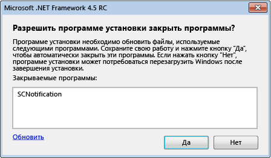

# Уменьшение числа перезагрузок при установке платформы .NET Framework 4.5
Установщик [!INCLUDE[net_v45](../../../includes/net-v45-md.md)] использует [Диспетчер перезагрузки](http://go.microsoft.com/fwlink/?LinkId=231425) для предотвращения перезагрузки системы во время установки, если это возможно.  Если программа установки устанавливает платформу .NET Framework, она может взаимодействовать с диспетчером перезапуска, чтобы воспользоваться преимуществами этой функции.  Для получения дополнительной информации см. [Практическое руководство. Получение хода выполнения установщика .NET Framework 4.5](../../../docs/framework/deployment/how-to-get-progress-from-the-dotnet-installer.md).  
  
## Причины для перезапуска  
 Установка [!INCLUDE[net_v45](../../../includes/net-v45-md.md)] требует перезапуска системы, если во время установки запущено приложение платформы .NET Framework 4.  Это происходит потому, что [!INCLUDE[net_v45](../../../includes/net-v45-md.md)] заменяет файлы платформы .NET Framework 4 и требует, чтобы эти файлы были доступны во время установки.  Во многих случаях можно избежать перезапуска путем обнаружения и закрытия работающих приложения .NET Framework 4.  Однако некоторые системные приложения не могут быть закрыты.  В этих случаях не удается избежать перезапуска.  
  
## Взаимодействие с пользователем  
 Пользователю, который выполняет полную установку [!INCLUDE[net_v45](../../../includes/net-v45-md.md)] предоставляется возможность избежать перезапуска системы, если программа установки обнаружит запущенные приложения платформы .NET Framework 4.  В сообщении будут перечислены все запущенные приложения на платформе .NET Framework версии 4 и будет предоставлена возможность закрыть эти приложения перед установкой.  В случае согласия пользователя, эти приложения будут закрыты установщиком, и перезапуска системы удастся избежать.  Если пользователь не отвечает на сообщение в течение отведенного времени, то установка продолжается без закрытия приложений.  
  
 Если диспетчер перезапуска обнаруживает ситуацию, которая потребует перезапуска системы, даже если выполняемые приложения будут закрыты, сообщение не отображается.  
  
   
Запрос на закрытие запущенных приложений платформы .NET Framework  
  
## Использование цепочечного установщика  
 Если нужно распространять платформы .NET Framework с приложением, но необходимо использовать собственную программу установки и пользовательского интерфейса можно включить установку платформы .NET Framework в процесс установки.  Дополнительные сведения о подобных случаях установки см. в разделе [Руководство по развертыванию для разработчиков](../../../docs/framework/deployment/deployment-guide-for-developers.md).  Для уменьшения перезапусков системы при цепочечной установке установщик платформы .NET Framework предоставляет вашей программе установки список приложений, которые нужно закрыть.  Программа установки должна предоставить эти данные пользователю через пользовательский интерфейс, такой как окно сообщения, получить ответ пользователя, а затем передать ответ установщику платформы .NET Framework.  Пример цепочечного установщика см. в статье [Практическое руководство. Получение хода выполнения установщика .NET Framework 4.5](../../../docs/framework/deployment/how-to-get-progress-from-the-dotnet-installer.md).  
  
 При использовании цепочечного установщика, если не требуется предоставлять собственное окно сообщения для завершения приложений, можно использовать параметры `/showrmui` и `/passive` в командной строке при добавлении платформы .NET Framework в процесс установки.  При использовании этих параметров вместе, установщик отображает окно сообщения для закрытия приложений чтобы избежать перезапуска системы.  Это диалоговое окно работает в пассивном режиме так же, как и при полном пользовательском интерфейсе.  См. раздел [Руководство по развертыванию для разработчиков](../../../docs/framework/deployment/deployment-guide-for-developers.md) для полного набора параметров командной строки для распространяемого пакета .NET Framework.  
  
## См. также  
 [Развертывание](../../../docs/framework/deployment/net-framework-and-applications.md)   
 [Руководство по развертыванию для разработчиков](../../../docs/framework/deployment/deployment-guide-for-developers.md)   
 [Практическое руководство. Получение хода выполнения установщика .NET Framework 4.5](../../../docs/framework/deployment/how-to-get-progress-from-the-dotnet-installer.md)