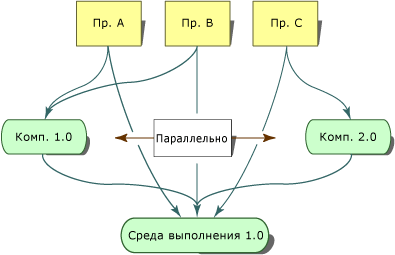

# <a name="side-by-side-execution-in-the-net-framework"></a><span data-ttu-id="2d874-102">Параллельное выполнение в .NET Framework</span><span class="sxs-lookup"><span data-stu-id="2d874-102">Side-by-Side Execution in the .NET Framework</span></span>
<span data-ttu-id="2d874-103">Параллельное выполнение представляет собой возможность запускать несколько версий приложения или компонента с одного и того же компьютера.</span><span class="sxs-lookup"><span data-stu-id="2d874-103">Side-by-side execution is the ability to run multiple versions of an application or component on the same computer.</span></span> <span data-ttu-id="2d874-104">В одно и то же время на одном компьютере можно запускать несколько версий среды CLR, а также несколько версий приложений и компонентов, использующих одну из версий среды выполнения.</span><span class="sxs-lookup"><span data-stu-id="2d874-104">You can have multiple versions of the common language runtime, and multiple versions of applications and components that use a version of the runtime, on the same computer at the same time.</span></span>  
  
 <span data-ttu-id="2d874-105">На следующем рисунке показаны несколько приложений, которые используют две разные версии среды выполнения на одном компьютере.</span><span class="sxs-lookup"><span data-stu-id="2d874-105">The following illustration shows several applications using two different versions of the runtime on the same computer.</span></span> <span data-ttu-id="2d874-106">Приложения A, B и C используют среду выполнения версии 1.0, а приложение D использует версию 1.1.</span><span class="sxs-lookup"><span data-stu-id="2d874-106">Applications A, B, and C use runtime version 1.0, while application D uses runtime version 1.1.</span></span>  
  
 <span data-ttu-id="2d874-107"></span><span class="sxs-lookup"><span data-stu-id="2d874-107"></span></span>  
<span data-ttu-id="2d874-108">Параллельное выполнение двух версий среды выполнения</span><span class="sxs-lookup"><span data-stu-id="2d874-108">Side-by-side execution of two versions of the runtime</span></span>  
  
 <span data-ttu-id="2d874-109">.NET Framework состоит из среды CLR и набора сборок, содержащих типы API.</span><span class="sxs-lookup"><span data-stu-id="2d874-109">The .NET Framework consists of the common language runtime and a collection of assemblies that contain the API types.</span></span> <span data-ttu-id="2d874-110">Версии среды выполнения и сборок платформы .NET Framework устанавливаются раздельно.</span><span class="sxs-lookup"><span data-stu-id="2d874-110">The runtime and the .NET Framework assemblies are versioned separately.</span></span> <span data-ttu-id="2d874-111">Например, версия среды выполнения 4.0 на самом деле является версией 4.0.319, в то время как версия 1.0 сборок платформы .NET Framework — версией 1.0.3300.0.</span><span class="sxs-lookup"><span data-stu-id="2d874-111">For example, version 4.0 of the runtime is actually version 4.0.319, while version 1.0 of the .NET Framework assemblies is version 1.0.3300.0.</span></span>  
  
 <span data-ttu-id="2d874-112">На следующем рисунке показаны несколько приложений, которые используют две разных версии компонента на одном компьютере.</span><span class="sxs-lookup"><span data-stu-id="2d874-112">The following illustration shows several applications using two different versions of a component on the same computer.</span></span> <span data-ttu-id="2d874-113">Приложения A и B используют компонент версии 1.0, а приложение C использует версию 2.0 того же компонента.</span><span class="sxs-lookup"><span data-stu-id="2d874-113">Application A and B use version 1.0 of the component while Application C uses version 2.0 of the same component.</span></span>  
  
 <span data-ttu-id="2d874-114"></span><span class="sxs-lookup"><span data-stu-id="2d874-114"></span></span>  
<span data-ttu-id="2d874-115">Параллельное выполнение двух версий компонента</span><span class="sxs-lookup"><span data-stu-id="2d874-115">Side-by-side execution of two versions of a component</span></span>  
  
 <span data-ttu-id="2d874-116">Параллельное выполнение позволяет более строго контролировать, к каким версиям компонента привязывается приложение и какую версию среды выполнения оно использует.</span><span class="sxs-lookup"><span data-stu-id="2d874-116">Side-by-side execution gives you more control over which versions of a component an application binds to, and more control over which version of the runtime an application uses.</span></span>  
  
## <a name="benefits-of-side-by-side-execution"></a><span data-ttu-id="2d874-117">Преимущества параллельного выполнения</span><span class="sxs-lookup"><span data-stu-id="2d874-117">Benefits of Side-by-Side Execution</span></span>  
 <span data-ttu-id="2d874-118">До появления Microsoft Windows XP и платформы .NET Framework возникали конфликты библиотек DLL, поскольку приложения были не в состоянии различить несовместимые между собой версии одного и того же кода.</span><span class="sxs-lookup"><span data-stu-id="2d874-118">Prior to Windows XP and the .NET Framework, DLL conflicts occurred because applications were unable to distinguish between incompatible versions of the same code.</span></span> <span data-ttu-id="2d874-119">Сведения о типах, содержавшиеся в библиотеках DLL, были ограничены именем файла.</span><span class="sxs-lookup"><span data-stu-id="2d874-119">Type information contained in a DLL was bound only to a file name.</span></span> <span data-ttu-id="2d874-120">Приложение не могло различить, были ли типы в библиотеке DLL теми же, что применялись в приложении.</span><span class="sxs-lookup"><span data-stu-id="2d874-120">An application had no way of knowing if the types contained in a DLL were the same types that the application was built with.</span></span> <span data-ttu-id="2d874-121">В результате новая версия компонента могла перезаписать старую и привести к сбою в работе приложений.</span><span class="sxs-lookup"><span data-stu-id="2d874-121">As a result, a new version of a component could overwrite an older version and break applications.</span></span>  
  
 <span data-ttu-id="2d874-122">Следующие возможности параллельного выполнения и платформы .NET Framework исключают конфликты библиотек DLL:</span><span class="sxs-lookup"><span data-stu-id="2d874-122">Side-by-side execution and the .NET Framework provide the following features to eliminate DLL conflicts:</span></span>  
  
-   <span data-ttu-id="2d874-123">Сборки со строгими именами.</span><span class="sxs-lookup"><span data-stu-id="2d874-123">Strong-named assemblies.</span></span>  
  
     <span data-ttu-id="2d874-124">Параллельное выполнение использует сборки со строгими именами, чтобы привязать сведения о типе к определенной версии сборки.</span><span class="sxs-lookup"><span data-stu-id="2d874-124">Side-by-side execution uses strong-named assemblies to bind type information to a specific version of an assembly.</span></span> <span data-ttu-id="2d874-125">Это исключает возможность того, что приложение или компонент будут привязаны к неправильной версии сборки.</span><span class="sxs-lookup"><span data-stu-id="2d874-125">This prevents an application or component from binding to an invalid version of an assembly.</span></span> <span data-ttu-id="2d874-126">Сборки со строгими именами также позволяют нескольким версиям файла располагаться на одном компьютере и использоваться приложениями.</span><span class="sxs-lookup"><span data-stu-id="2d874-126">Strong-named assemblies also allow multiple versions of a file to exist on the same computer and to be used by applications.</span></span> <span data-ttu-id="2d874-127">Подробнее см. в статье [Сборки со строгими именами](../../../docs/framework/app-domains/strong-named-assemblies.md).</span><span class="sxs-lookup"><span data-stu-id="2d874-127">For more information, see [Strong-Named Assemblies](../../../docs/framework/app-domains/strong-named-assemblies.md).</span></span>  
  
-   <span data-ttu-id="2d874-128">Хранилище, следящее за версией кода.</span><span class="sxs-lookup"><span data-stu-id="2d874-128">Version-aware code storage.</span></span>  
  
     <span data-ttu-id="2d874-129">Платформа .NET Framework предоставляет хранилище, следящее за версией кода, в глобальном кэше сборок.</span><span class="sxs-lookup"><span data-stu-id="2d874-129">The .NET Framework provides version-aware code storage in the global assembly cache.</span></span> <span data-ttu-id="2d874-130">Глобальный кэш сборок — это кэш, в котором хранится используемый всеми приложениями на компьютере код. Подобный кэш есть на всех компьютерах, где установлена платформа .NET Framework.</span><span class="sxs-lookup"><span data-stu-id="2d874-130">The global assembly cache is a computer-wide code cache present on all computers with the .NET Framework installed.</span></span> <span data-ttu-id="2d874-131">Он хранит сборки на основании версии, языка и региональных параметров и сведений об издателе, а также поддерживает одновременное хранение разных версий одного и того же компонента или приложения.</span><span class="sxs-lookup"><span data-stu-id="2d874-131">It stores assemblies based on version, culture, and publisher information, and supports multiple versions of components and applications.</span></span> <span data-ttu-id="2d874-132">Дополнительные сведения см. в разделе [Глобальный кэш сборок](../../../docs/framework/app-domains/gac.md).</span><span class="sxs-lookup"><span data-stu-id="2d874-132">For more information, see [Global Assembly Cache](../../../docs/framework/app-domains/gac.md).</span></span>  
  
-   <span data-ttu-id="2d874-133">Изоляция.</span><span class="sxs-lookup"><span data-stu-id="2d874-133">Isolation.</span></span>  
  
     <span data-ttu-id="2d874-134">С помощью платформы .NET Framework можно создавать приложения и компоненты, которые работают изолированно.</span><span class="sxs-lookup"><span data-stu-id="2d874-134">Using the .NET Framework, you can create applications and components that execute in isolation.</span></span> <span data-ttu-id="2d874-135">Изоляция является неотъемлемой частью параллельного выполнения.</span><span class="sxs-lookup"><span data-stu-id="2d874-135">Isolation is an essential component of side-by-side execution.</span></span> <span data-ttu-id="2d874-136">Изоляция предполагает сбор сведений о задействованных ресурсах и безопасное совместное использование ресурсов несколькими версиями приложения или компонента.</span><span class="sxs-lookup"><span data-stu-id="2d874-136">It involves being aware of the resources you are using and sharing resources with confidence among multiple versions of an application or component.</span></span> <span data-ttu-id="2d874-137">Изоляция также предполагает сохранение файла с указанием версии.</span><span class="sxs-lookup"><span data-stu-id="2d874-137">Isolation also includes storing files in a version-specific way.</span></span> <span data-ttu-id="2d874-138">Дополнительные сведения об изоляции см. в разделе [Рекомендации по созданию компонентов для параллельного выполнения](../../../docs/framework/deployment/guidelines-for-creating-components-for-side-by-side-execution.md).</span><span class="sxs-lookup"><span data-stu-id="2d874-138">For more information about isolation, see [Guidelines for Creating Components for Side-by-Side Execution](../../../docs/framework/deployment/guidelines-for-creating-components-for-side-by-side-execution.md).</span></span>  
  
## <a name="version-compatibility"></a><span data-ttu-id="2d874-139">Совместимость версий</span><span class="sxs-lookup"><span data-stu-id="2d874-139">Version Compatibility</span></span>  
 <span data-ttu-id="2d874-140">Версии платформы .NET Framework 1.0 и 1.1 совместимы.</span><span class="sxs-lookup"><span data-stu-id="2d874-140">Versions 1.0 and 1.1 of the .NET Framework are designed to be compatible with one another.</span></span> <span data-ttu-id="2d874-141">Приложение, разработанное с помощью платформы .NET Framework версии 1.0, работает с версией 1.1, и наоборот.</span><span class="sxs-lookup"><span data-stu-id="2d874-141">An application built with the .NET Framework version 1.0 should run on version 1.1, and an application built with the .NET Framework version 1.1 should run on version 1.0.</span></span> <span data-ttu-id="2d874-142">Однако следует отметить, что функции API, добавленные в платформу .NET Framework версии 1.1, не будут работать в платформе .NET Framework версии 1.0.</span><span class="sxs-lookup"><span data-stu-id="2d874-142">Note, however, that API features added in version 1.1 of the .NET Framework will not work with version 1.0 of the .NET Framework.</span></span> <span data-ttu-id="2d874-143">Приложения, созданные с помощью версии 2.0, будут выполняться только в версии 2.0.</span><span class="sxs-lookup"><span data-stu-id="2d874-143">Applications created with version 2.0 will run on version 2.0 only.</span></span> <span data-ttu-id="2d874-144">Приложения версии 2.0 не будут выполняться в версии 1.1 или в более ранней версии.</span><span class="sxs-lookup"><span data-stu-id="2d874-144">Version 2.0 applications will not run on version 1.1 or earlier.</span></span>  
  
 <span data-ttu-id="2d874-145">В платформе .NET Framework версии рассматриваются как единые блоки, состоящие из среды выполнения и связанных с ней сборок платформы .NET Framework (концепция, называемая "унификацией сборок").</span><span class="sxs-lookup"><span data-stu-id="2d874-145">Versions of the .NET Framework are treated as a single unit consisting of the runtime and its associated .NET Framework assemblies (a concept referred to as assembly unification).</span></span> <span data-ttu-id="2d874-146">Можно перенаправлять привязку сборок, чтобы включить другие версии сборок платформы .NET Framework, но переопределение привязки по умолчанию рискованно и должно быть тщательно протестировано до развертывания.</span><span class="sxs-lookup"><span data-stu-id="2d874-146">You can redirect assembly binding to include other versions of the .NET Framework assemblies, but overriding the default assembly binding can be risky and must be rigorously tested before deployment.</span></span>  
  
## <a name="locating-runtime-version-information"></a><span data-ttu-id="2d874-147">Обнаружение сведений о версии среды выполнения</span><span class="sxs-lookup"><span data-stu-id="2d874-147">Locating Runtime Version Information</span></span>  
 <span data-ttu-id="2d874-148">Сведения о том, в какой версии среды выполнения было скомпилировано приложение или компонент, а также о том, какие версии среды выполнения необходимы для запуска приложения, хранятся в двух местах.</span><span class="sxs-lookup"><span data-stu-id="2d874-148">Information on which runtime version an application or component was compiled with and which versions of the runtime the application requires to run are stored in two locations.</span></span> <span data-ttu-id="2d874-149">После компиляции приложения или компонента сведения о версии среды выполнения, использованной для этой компиляции, хранятся в управляемом исполняемом файле.</span><span class="sxs-lookup"><span data-stu-id="2d874-149">When an application or component is compiled, information on the runtime version used to compile it is stored in the managed executable.</span></span> <span data-ttu-id="2d874-150">Сведения о версиях среды выполнения, необходимых для приложения или компонента, хранятся в файле конфигурации приложения.</span><span class="sxs-lookup"><span data-stu-id="2d874-150">Information on the runtime versions the application or component requires is stored in the application configuration file.</span></span>  
  
### <a name="runtime-version-information-in-the-managed-executable"></a><span data-ttu-id="2d874-151">Сведения о версии среды выполнения в управляемом исполняемом файле</span><span class="sxs-lookup"><span data-stu-id="2d874-151">Runtime Version Information in the Managed Executable</span></span>  
 <span data-ttu-id="2d874-152">Заголовок переносимого исполняемого (PE) файла каждого управляемого приложения и компонента содержит сведения о версии среды выполнения, в которой он был создан.</span><span class="sxs-lookup"><span data-stu-id="2d874-152">The portable executable (PE) file header of each managed application and component contains information about the runtime version it was built with.</span></span> <span data-ttu-id="2d874-153">Среда CLR использует эти сведения, чтобы определить наиболее вероятную версию среды выполнения, необходимую для запуска приложения.</span><span class="sxs-lookup"><span data-stu-id="2d874-153">The common language runtime uses this information to determine the most likely version of the runtime the application needs to run.</span></span>  
  
### <a name="runtime-version-information-in-the-application-configuration-file"></a><span data-ttu-id="2d874-154">Сведения о версии среды выполнения в файле конфигурации приложения</span><span class="sxs-lookup"><span data-stu-id="2d874-154">Runtime Version Information in the Application Configuration File</span></span>  
 <span data-ttu-id="2d874-155">Кроме сведений в заголовке PE-файла приложение можно развернуть с использованием файла конфигурации приложения, в котором содержатся сведения о версии среды выполнения.</span><span class="sxs-lookup"><span data-stu-id="2d874-155">In addition to the information in the PE file header, an application can be deployed with an application configuration file that provides runtime version information.</span></span> <span data-ttu-id="2d874-156">Файл конфигурации приложения — это XML-файл, который создается разработчиком приложения и поставляется вместе с приложением.</span><span class="sxs-lookup"><span data-stu-id="2d874-156">The application configuration file is an XML-based file that is created by the application developer and that ships with an application.</span></span> <span data-ttu-id="2d874-157">[Элемент \<requiredRuntime>](../../../docs/framework/configure-apps/file-schema/startup/requiredruntime-element.md) [раздела \<startup>](../../../docs/framework/configure-apps/file-schema/startup/startup-element.md), если таковой присутствует в этом файле, указывает, какие версии среды выполнения и какие версии компонента поддерживает приложение.</span><span class="sxs-lookup"><span data-stu-id="2d874-157">The [\<requiredRuntime> Element](../../../docs/framework/configure-apps/file-schema/startup/requiredruntime-element.md) of the [\<startup> section](../../../docs/framework/configure-apps/file-schema/startup/startup-element.md), if it is present in this file, specifies which versions of the runtime and which versions of a component the application supports.</span></span> <span data-ttu-id="2d874-158">Его также можно использовать для тестирования совместимости приложения с разными версиями среды выполнения.</span><span class="sxs-lookup"><span data-stu-id="2d874-158">You can also use this file in testing to test an application's compatibility with different versions of the runtime.</span></span>  
  
 <span data-ttu-id="2d874-159">Неуправляемый код (включая приложения COM и COM+) может иметь файлы конфигурации приложения, используемые средой выполнения для взаимодействия с управляемым кодом.</span><span class="sxs-lookup"><span data-stu-id="2d874-159">Unmanaged code, including COM and COM+ applications, can have application configuration files that the runtime uses for interacting with managed code.</span></span> <span data-ttu-id="2d874-160">Файл конфигурации приложения влияет на любой управляемый код, активированный через COM.</span><span class="sxs-lookup"><span data-stu-id="2d874-160">The application configuration file affects any managed code that you activate through COM.</span></span> <span data-ttu-id="2d874-161">В файле можно указать, какие версии среды выполнения он поддерживает, а также какие сборки перенаправляет.</span><span class="sxs-lookup"><span data-stu-id="2d874-161">The file can specify which runtime versions it supports, as well as assembly redirects.</span></span> <span data-ttu-id="2d874-162">По умолчанию приложения COM-взаимодействия, вызывающие управляемый код, используют последнюю версию среды выполнения, установленную на компьютере.</span><span class="sxs-lookup"><span data-stu-id="2d874-162">By default, COM interop applications calling to managed code use the latest version of the runtime installed on the computer.</span></span>  
  
 <span data-ttu-id="2d874-163">Подробнее о файлах конфигурации приложений см. в разделе [Настройка приложений](../../../docs/framework/configure-apps/index.md).</span><span class="sxs-lookup"><span data-stu-id="2d874-163">For more information about the application configuration files, see [Configuring Apps](../../../docs/framework/configure-apps/index.md).</span></span>  
  
## <a name="determining-which-version-of-the-runtime-to-load"></a><span data-ttu-id="2d874-164">Определение загружаемой версии среды выполнения</span><span class="sxs-lookup"><span data-stu-id="2d874-164">Determining Which Version of the Runtime to Load</span></span>  
 <span data-ttu-id="2d874-165">Среда CLR использует следующие сведения, чтобы определить, какую версию среды выполнения необходимо загрузить для приложения:</span><span class="sxs-lookup"><span data-stu-id="2d874-165">The common language runtime uses the following information to determine which version of the runtime to load for an application:</span></span>  
  
-   <span data-ttu-id="2d874-166">доступные версии среды выполнения;</span><span class="sxs-lookup"><span data-stu-id="2d874-166">The runtime versions that are available.</span></span>  
  
-   <span data-ttu-id="2d874-167">версии среды выполнения, поддерживаемые приложением.</span><span class="sxs-lookup"><span data-stu-id="2d874-167">The runtime versions that an application supports.</span></span>  
  
### <a name="supported-runtime-versions"></a><span data-ttu-id="2d874-168">Поддерживаемые версии среды выполнения</span><span class="sxs-lookup"><span data-stu-id="2d874-168">Supported Runtime Versions</span></span>  
 <span data-ttu-id="2d874-169">Для определения версии среды выполнения, поддерживаемой приложением, среда выполнения использует файл конфигурации приложения и заголовок переносимого исполняемого (PE) файла.</span><span class="sxs-lookup"><span data-stu-id="2d874-169">The runtime uses the application configuration file and the portable executable (PE) file header to determine which version of the runtime an application supports.</span></span> <span data-ttu-id="2d874-170">Если файл конфигурации приложения отсутствует, среда выполнения загружает версию, указанную в заголовке PE-файла приложения, при ее наличии.</span><span class="sxs-lookup"><span data-stu-id="2d874-170">If no application configuration file is present, the runtime loads the runtime version specified in the application's PE file header, if that version is available.</span></span>  
  
 <span data-ttu-id="2d874-171">Если файл конфигурации приложения имеется, среда выполнения определяет подходящую версию для загрузки с помощью описанной ниже процедуры.</span><span class="sxs-lookup"><span data-stu-id="2d874-171">If an application configuration file is present, the runtime determines the appropriate runtime version to load based on the results of the following process:</span></span>  
  
1.  <span data-ttu-id="2d874-172">Среда выполнения проверяет элемент [\<supportedRuntime>](../../../docs/framework/configure-apps/file-schema/startup/supportedruntime-element.md) в файле конфигурации приложения.</span><span class="sxs-lookup"><span data-stu-id="2d874-172">The runtime examines the [\<supportedRuntime> Element](../../../docs/framework/configure-apps/file-schema/startup/supportedruntime-element.md) element in the application configuration file.</span></span> <span data-ttu-id="2d874-173">Если в элементе **\<supportedRuntime>** указана одна поддерживаемая версия или несколько, среда выполнения загружает версию, указанную в первом элементе **\<supportedRuntime>**.</span><span class="sxs-lookup"><span data-stu-id="2d874-173">If one or more of the supported runtime versions specified in the **\<supportedRuntime>** element are present, the runtime loads the runtime version specified by the first **\<supportedRuntime>** element.</span></span> <span data-ttu-id="2d874-174">Если эта версия недоступна, среда выполнения проверяет следующий элемент **\<supportedRuntime>** и предпринимает попытку загрузить указанную версию.</span><span class="sxs-lookup"><span data-stu-id="2d874-174">If this version is not available, the runtime examines the next **\<supportedRuntime>** element and attempts to load the runtime version specified.</span></span> <span data-ttu-id="2d874-175">Если эта версия среды выполнения недоступна, проверяются следующие элементы **\<supportedRuntime>**.</span><span class="sxs-lookup"><span data-stu-id="2d874-175">If this runtime version is not available, subsequent **\<supportedRuntime>** elements are examined.</span></span> <span data-ttu-id="2d874-176">Если ни одна из поддерживаемых версий среды выполнения недоступна, среде выполнения не удается загрузить версию, и она выводит соответствующее сообщение (см. шаг 3).</span><span class="sxs-lookup"><span data-stu-id="2d874-176">If none of the supported runtime versions are available, the runtime fails to load a runtime version and displays a message to the user (see step 3).</span></span>  
  
2.  <span data-ttu-id="2d874-177">Среда выполнения считывает заголовок PE-файла исполняемого файла приложения.</span><span class="sxs-lookup"><span data-stu-id="2d874-177">The runtime reads the PE file header of the application's executable file.</span></span> <span data-ttu-id="2d874-178">Если версия среды выполнения, указанная в этом заголовке, доступна, среда выполнения загружает ее.</span><span class="sxs-lookup"><span data-stu-id="2d874-178">If the runtime version specified by the PE file header is available, the runtime loads that version.</span></span> <span data-ttu-id="2d874-179">Если указанная версия недоступна, среда выполнения ищет версию, которая определена Майкрософт как совместимая с указанной в заголовке PE-файла.</span><span class="sxs-lookup"><span data-stu-id="2d874-179">If the runtime version specified is not available, the runtime searches for a runtime version determined by Microsoft to be compatible with the runtime version in the PE header.</span></span> <span data-ttu-id="2d874-180">Если эту версию найти не удается, процедура переходит к шагу 3.</span><span class="sxs-lookup"><span data-stu-id="2d874-180">If that version is not found, the process continues to step 3.</span></span>  
  
3.  <span data-ttu-id="2d874-181">Среда выполнения выводит сообщение о том, что версия среды выполнения, поддерживаемая приложением, недоступна.</span><span class="sxs-lookup"><span data-stu-id="2d874-181">The runtime displays a message stating that the runtime version supported by the application is unavailable.</span></span> <span data-ttu-id="2d874-182">Среда выполнения не загружается.</span><span class="sxs-lookup"><span data-stu-id="2d874-182">The runtime is not loaded.</span></span>  
  
    > [!NOTE]
    >  <span data-ttu-id="2d874-183">Вы можете отключить вывод сообщения, используя параметр NoGuiFromShim в разделе реестра HKLM\Software\Microsoft\\.NETFramework или переменную среды COMPLUS_NoGuiFromShim.</span><span class="sxs-lookup"><span data-stu-id="2d874-183">You can suppress the display of this message by using the NoGuiFromShim value under the registry key HKLM\Software\Microsoft\\.NETFramework or using the environment variable COMPLUS_NoGuiFromShim.</span></span> <span data-ttu-id="2d874-184">Например, можно отключить сообщение для приложений, которые обычно не взаимодействуют с пользователем, таких как автоматически устанавливаемые компоненты или службы Windows.</span><span class="sxs-lookup"><span data-stu-id="2d874-184">For example, you can suppress the message for applications that do not typically interact with the user, such as unattended installations or Windows services.</span></span> <span data-ttu-id="2d874-185">Если вывод сообщения отключен, среда выполнения записывает сообщение в журнал событий.</span><span class="sxs-lookup"><span data-stu-id="2d874-185">When this message display is suppressed, the runtime writes a message to the event log.</span></span>  <span data-ttu-id="2d874-186">Чтобы отключить это сообщение для всех приложений на компьютере, присвойте параметру реестра NoGuiFromShim значение 1.</span><span class="sxs-lookup"><span data-stu-id="2d874-186">Set the registry value NoGuiFromShim to 1 to suppress this message for all applications on a computer.</span></span> <span data-ttu-id="2d874-187">Аналогично присвойте переменной среды COMPLUS_NoGuiFromShim значение 1, чтобы отключить сообщение для приложений, выполняющихся в контексте определенного пользователя.</span><span class="sxs-lookup"><span data-stu-id="2d874-187">Alternately, set the COMPLUS_NoGuiFromShim environment variable to 1 to suppress the message for applications running in a particular user context.</span></span>  
  
> [!NOTE]
>  <span data-ttu-id="2d874-188">После загрузки версии среды выполнения перенаправления привязки сборок могут указывать, что будет загружена другая версия отдельной сборки .NET Framework.</span><span class="sxs-lookup"><span data-stu-id="2d874-188">After a runtime version is loaded, assembly binding redirects can specify that a different version of an individual .NET Framework assembly be loaded.</span></span> <span data-ttu-id="2d874-189">Такие перенаправления привязки влияют только на конкретную перенаправляемую сборку.</span><span class="sxs-lookup"><span data-stu-id="2d874-189">These binding redirects affect only the specific assembly that is redirected.</span></span>  
  
## <a name="partially-qualified-assembly-names-and-side-by-side-execution"></a><span data-ttu-id="2d874-190">Частичные имена сборок и параллельное выполнение</span><span class="sxs-lookup"><span data-stu-id="2d874-190">Partially Qualified Assembly Names and Side-by-Side Execution</span></span>  
 <span data-ttu-id="2d874-191">Так как частичные ссылки на сборки потенциально являются источником проблем при параллельном выполнении, их следует применять только для привязки к сборкам в пределах каталога приложения.</span><span class="sxs-lookup"><span data-stu-id="2d874-191">Because they are a potential source of side-by-side problems, partially qualified assembly references can be used only to bind to assemblies within an application directory.</span></span> <span data-ttu-id="2d874-192">Использовать частичные ссылки на сборки в коде не рекомендуется.</span><span class="sxs-lookup"><span data-stu-id="2d874-192">Avoid partially qualified assembly references in your code.</span></span>  
  
 <span data-ttu-id="2d874-193">Чтобы снизить возможную опасность от частичных ссылок на сборки, при их применении в коде можно использовать элемент [\<qualifyAssembly>](../../../docs/framework/configure-apps/file-schema/runtime/qualifyassembly-element.md) в файле конфигурации приложения и дать полные определения частичных ссылок на сборки.</span><span class="sxs-lookup"><span data-stu-id="2d874-193">To mitigate partially qualified assembly references in code, you can use the [\<qualifyAssembly>](../../../docs/framework/configure-apps/file-schema/runtime/qualifyassembly-element.md) element in an application configuration file to fully qualify partially qualified assembly references that occur in code.</span></span> <span data-ttu-id="2d874-194">При использовании элемента **\<qualifyAssembly>** следует указывать только те поля, которые не указаны в частичной ссылке.</span><span class="sxs-lookup"><span data-stu-id="2d874-194">Use the **\<qualifyAssembly>** element to specify only fields that were not set in the partial reference.</span></span> <span data-ttu-id="2d874-195">Идентификатор сборки, указанный в атрибуте **fullName**, должен содержать все сведения, необходимые для задания полного имени сборки: имя, открытый ключ, язык и региональные параметры и версию сборки.</span><span class="sxs-lookup"><span data-stu-id="2d874-195">The assembly identity listed in the **fullName** attribute must contain all the information needed to fully qualify the assembly name: assembly name, public key, culture, and version.</span></span>  
  
 <span data-ttu-id="2d874-196">В примере ниже показана запись в файле конфигурации приложения для задания полного имени сборки `myAssembly`.</span><span class="sxs-lookup"><span data-stu-id="2d874-196">The following example shows the application configuration file entry to fully qualify an assembly called `myAssembly`.</span></span>  
  
```xml  
<assemblyBinding xmlns="urn:schemas-microsoft-com:asm.v1">   
<qualifyAssembly partialName="myAssembly"   
fullName="myAssembly,  
      version=1.0.0.0,   
publicKeyToken=...,   
      culture=neutral"/>   
</assemblyBinding>   
```  
  
 <span data-ttu-id="2d874-197">Если оператор загрузки сборки ссылается на `myAssembly`, эти параметры файла конфигурации заставляют среду выполнения автоматически преобразовывать частичную ссылку на `myAssembly` в полную ссылку.</span><span class="sxs-lookup"><span data-stu-id="2d874-197">Whenever an assembly load statement references `myAssembly`, these configuration file settings cause the runtime to automatically translate the partially qualified `myAssembly` reference to a fully qualified reference.</span></span> <span data-ttu-id="2d874-198">Например, Assembly.Load("myAssembly") преобразуется в Assembly.Load("myAssembly, version=1.0.0.0, publicKeyToken=..., culture=neutral").</span><span class="sxs-lookup"><span data-stu-id="2d874-198">For example, Assembly.Load("myAssembly") becomes Assembly.Load("myAssembly, version=1.0.0.0, publicKeyToken=..., culture=neutral").</span></span>  
  
> [!NOTE]
>  <span data-ttu-id="2d874-199">С помощью метода **LoadWithPartialName** можно обойти ограничение среды CLR, которое запрещает загрузку сборок с частичными ссылками из глобального кэша сборок.</span><span class="sxs-lookup"><span data-stu-id="2d874-199">You can use the **LoadWithPartialName** method to bypass the common language runtime restriction that prohibits partially referenced assemblies from being loaded from the global assembly cache.</span></span> <span data-ttu-id="2d874-200">Этот метод следует использовать только в сценариях удаленного взаимодействия, так как он может привести к проблемам, связанным с параллельным выполнением.</span><span class="sxs-lookup"><span data-stu-id="2d874-200">This method should be used only in remoting scenarios as it can easily cause problems in side-by-side execution.</span></span>  
  
## <a name="related-topics"></a><span data-ttu-id="2d874-201">См. также</span><span class="sxs-lookup"><span data-stu-id="2d874-201">Related Topics</span></span>  
  
|<span data-ttu-id="2d874-202">Заголовок</span><span class="sxs-lookup"><span data-stu-id="2d874-202">Title</span></span>|<span data-ttu-id="2d874-203">Описание:</span><span class="sxs-lookup"><span data-stu-id="2d874-203">Description</span></span>|  
|-----------|-----------------|  
|[<span data-ttu-id="2d874-204">Практическое руководство. Включение и отключение автоматического перенаправления привязки</span><span class="sxs-lookup"><span data-stu-id="2d874-204">How to: Enable and Disable Automatic Binding Redirection</span></span>](../../../docs/framework/configure-apps/how-to-enable-and-disable-automatic-binding-redirection.md)|<span data-ttu-id="2d874-205">Описание способов привязки приложения к определенной версии сборки.</span><span class="sxs-lookup"><span data-stu-id="2d874-205">Describes how to bind an application to a specific version of an assembly.</span></span>|  
|[<span data-ttu-id="2d874-206">Настройка перенаправления привязки сборок</span><span class="sxs-lookup"><span data-stu-id="2d874-206">Configuring Assembly Binding Redirection</span></span>](../../../docs/framework/deployment/configuring-assembly-binding-redirection.md)|<span data-ttu-id="2d874-207">Рассматривается перенаправление ссылок на привязки сборок на определенную версию сборок .NET Framework.</span><span class="sxs-lookup"><span data-stu-id="2d874-207">Explains how to redirect assembly binding references to a specific version of the .NET Framework assemblies.</span></span>|  
|[<span data-ttu-id="2d874-208">Внутрипроцессное параллельное выполнение</span><span class="sxs-lookup"><span data-stu-id="2d874-208">In-Process Side-by-Side Execution</span></span>](../../../docs/framework/deployment/in-process-side-by-side-execution.md)|<span data-ttu-id="2d874-209">Описание порядка использования внутрипроцессной параллельной активации хост-приложения среды выполнения для запуска нескольких версий среды CLR в одном процессе.</span><span class="sxs-lookup"><span data-stu-id="2d874-209">Discusses how you can use in-process side-by-side runtime host activation to run multiple versions of the CLR in a single process.</span></span>|  
|[<span data-ttu-id="2d874-210">Сборки в среде CLR</span><span class="sxs-lookup"><span data-stu-id="2d874-210">Assemblies in the Common Language Runtime</span></span>](../../../docs/framework/app-domains/assemblies-in-the-common-language-runtime.md)|<span data-ttu-id="2d874-211">Общие сведения о сборках.</span><span class="sxs-lookup"><span data-stu-id="2d874-211">Provides a conceptual overview of assemblies.</span></span>|  
|[<span data-ttu-id="2d874-212">Домены приложений</span><span class="sxs-lookup"><span data-stu-id="2d874-212">Application Domains</span></span>](../../../docs/framework/app-domains/application-domains.md)|<span data-ttu-id="2d874-213">Общие сведения о доменах приложений.</span><span class="sxs-lookup"><span data-stu-id="2d874-213">Provides a conceptual overview of application domains.</span></span>|  
  
## <a name="reference"></a><span data-ttu-id="2d874-214">Ссылка</span><span class="sxs-lookup"><span data-stu-id="2d874-214">Reference</span></span>  
 [<span data-ttu-id="2d874-215">\<Поддерживаемый элемент среды выполнения</span><span class="sxs-lookup"><span data-stu-id="2d874-215">\<supportedRuntime> Element</span></span>](../../../docs/framework/configure-apps/file-schema/startup/supportedruntime-element.md)
