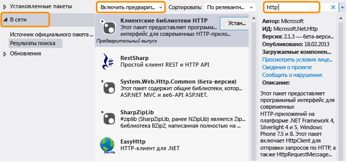

# .NET Framework и внештатные выпуски
.NET Framework эволюционирует, чтобы обеспечивать поддержку различных платформ, например приложений Windows Phone и Магазина Windows, традиционных приложений для настольных компьютеров \(классических приложений\) и веб\-приложений, а также чтобы сделать возможным максимальное повторное использование кода.  В дополнение к обычным выпускам .NET Framework, мы выпускаем новые функции в виде внештатных выпусков \(OOB\) для совершенствования кроссплатформенной разработки или добавления новых функциональных возможностей.  В этом разделе обсуждаются направления развития платформы .NET Framework и ее внештатных выпусков.  
  
## Преимущества внештатных выпусков  
 Поставка новых компонентов или обновлений к компонентам в виде внештатных выпусков позволяет Microsoft чаще предоставлять обновления платформы .NET Framework.  Кроме того, мы можем собрать данные и отреагировать на отзыв клиента быстрее.  
  
 При использовании в приложении функций внештатных выпусков, пользователям не требуется устанавливать последнюю версию платформы .NET Framework для выполнения приложения, поскольку внештатные сборки развертываются вместе с пакетом приложения.  
  
## Распространение внештатных пакетов  
 Внештатные выпуски для среды CLR доставляются через [Диспетчер пакетов NuGet](http://nuget.codeplex.com/), который представляет собой расширение Visual Studio с открытым кодом.  NuGet позволяет легко просматривать и добавлять библиотеки в проекты .NET Framework из обозревателя решений в Visual Studio.  NuGet входит в состав всех выпусков Visual Studio, начиная с Visual Studio 2012.  Чтобы определить, установлен ли NuGet, найдите в Visual Studio элемент **Диспетчер библиотеки пакетов** в меню **Сервис**.  Если он не установлен:  
  
1.  В строке меню Visual Studio выберите **Сервис**, **Расширения и обновления** \(в Visual Studio 2010 выберите **Диспетчер расширений**\).  
  
     Появится диалоговое окно **Расширения и обновления**.  
  
2.  Выберите **В сети**, **Диспетчер пакетов NuGet**, а затем выберите **Загрузить**.  
  
3.  После завершения загрузки, перезапустите Visual Studio.  
  
 Дополнительные сведения см. в статье [Installing NuGet \(Установка NuGet\)](http://docs.nuget.org/docs/start-here/installing-nuget) на веб\-сайте NuGet Docs.  Дополнительные сведения о NuGet см. в [документации по NuGet](http://docs.nuget.org/).  
  
## Использование внештатного пакета NuGet  
 После установки NuGet можно просмотреть и добавить ссылки на пакеты NuGet с помощью обозревателя решений в Visual Studio:  
  
1.  В Visual Studio откройте контекстное меню для проекта, а затем выберите **Управлять пакетами NuGet**.  \(Этот параметр также доступен из меню **Проект**.\)  
  
2.  В левой области выберите пункт **В сети**.  
  
3.  Если требуется использовать пакеты предварительного выпуска, в раскрывающемся списке в средней области, выберите команду **Включить предварительный выпуск** вместо **Только стабильный**.  
  
4.  В правой области используйте окно **Поиск**, чтобы найти пакет, который требуется использовать.  Некоторые пакеты Microsoft обозначены логотипом Microsoft .NET Framework; для всех из них корпорация Microsoft указана в качестве издателя.  
  
   
  
 Как упоминалось ранее, при развертывании приложения, использующего внештатный пакет, вместе с пакетом приложения поставляются внештатные сборки.  
  
## Типы внештатных выпусков  
 Обычно внештатный пакет имеет одну или несколько предварительных версий и стабильную версию.  Лицензия, сопровождающая предварительный выпуск, обычно не разрешает распространение, но позволяет опробовать пакет и предоставить свой отзыв.  Отзыв включается во все обновления пакета.  Окончательный выпуск распространяется с NuGet в качестве стабильного пакета и включает лицензию, которая позволяет распространять пакет NuGet вместе с приложением.  Стабильные пакеты поддерживаются корпорацией Майкрософт.  Корпорация Майкрософт предоставляет поддержку IntelliSense, а также других типов документации, таких как публикации в блогах и ответы на форумах, для всех пакетов.  Кроме того, исходный код может быть доступен с некоторыми, но не всеми, пакетами.  Объявления о новых и обновленных пакетах можно просматривать, подписавшись на [блог по .NET Framework](http://blogs.msdn.com/b/dotnet/).  
  
 Чтобы найти как стабильные пакеты, так и пакеты с предварительным выпуском, в диспетчере пакетов NuGet выберите вариант **Включить предварительный выпуск**  
  
 Чтобы получать уведомления о выпуске стабильных пакетов, подпишитесь на [веб\-канал .NET Framework](https://nuget.org/api/v2/curated-feeds/dotnetframework/Packages/).  
  
## См. также  
 [Начало работы](../../../docs/framework/get-started/index.md)