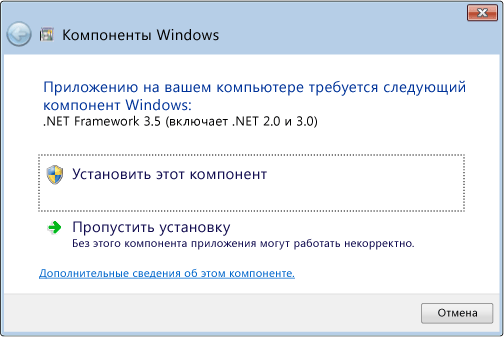

# Установка платформы .NET Framework 3.5 в Windows 8, Windows 8.1 и Windows 10
Платформа .NET Framework является неотъемлемой частью многих приложений, запущенных на Windows и предоставляет общие функциональные возможности для запуска этих приложений. Платформа.NET Framework предоставляет разработчикам согласованную модель программирования для создания приложений. Если используется операционная система Windows,то платформа .NET Framework, возможно, уже установлена на компьютере. В частности, версия [!INCLUDE[net_v45](../../../includes/net-v45-md.md)] входит в состав [!INCLUDE[win8](../../../includes/win8-md.md)], версия [!INCLUDE[net_v451](../../../includes/net-v451-md.md)] входит в состав [!INCLUDE[win81](../../../includes/win81-md.md)] и версия [!INCLUDE[net_v46](../../../includes/net-v46-md.md)] входит в состав Windows 10.  
  
 Однако платформа .NET Framework 3.5 не устанавливается автоматически вместе с [!INCLUDE[win8](../../../includes/win8-md.md)], [!INCLUDE[win81](../../../includes/win81-md.md)] или Windows 10, и ее необходимо включить отдельно, чтобы зависящие от нее приложения работали. Для этого следует использовать Центр обновления Windows, который можно открыть одним из трех способов. Во всех случаях требуется подключение к Интернету.  
  
-   [Установка платформы .NET Framework 3.5 по запросу](#OnDemand)  
  
-   [Включение платформы .NET Framework 3.5 в панели управления](#ControlPanel)  
  
-   [Загрузка установщика .NET Framework 3.5](http://www.microsoft.com/en-us/download/details.aspx?id=21) (Примечание. В этом случае не происходит непосредственная загрузка .NET Framework. Это установщик, который вызывает Центр обновления Windows.)  
  
 Во время установки могут возникнуть ошибки 0x800f0906, 0x800f0907 или 0x800f081f. В этом случае см. статью [Ошибка установки .NET Framework 3.5: 0x800f0906, 0x800f0907 или 0x800f081f](https://support.microsoft.com/en-us/kb/2734782). Обратите внимание, что их можно устранить, установив [обновление системы безопасности 3005628](https://support.microsoft.com/kb/3005628).  
  
 Если ни один из указанных способов не подходит или у вас нет подключения к Интернету, необходимо использовать установочный носитель Windows. Подробные сведения о разрешении для кода ошибки 0x800f0906 см. в разделе "Метод 3" в [статье об ошибках установки .NET Framework 3.5](https://support.microsoft.com/en-us/kb/2734782). Если нет установочного носителя, см. раздел [Создание установочного носителя Windows 8.1](http://windows.microsoft.com/en-US/windows-8/create-reset-refresh-media?woldogcb=0).  
  
 Важные примечания:  
  
-   В общем случае не рекомендуется удалять какие-либо версии платформы .NET Framework, установленные на компьютере. Различные приложения зависят от разных версий платформы, при этом на один компьютер можно загрузить несколько версий платформы .NET Framework одновременно.  
  
-   Платформа .NET Framework 3.5 также используется приложениями, созданными для версий 2.0 и 3.0.  
  
-   Установка языкового пакета Windows до установки .NET Framework 3.5 может вызвать сбой установки .NET Framework 3.5. При установке .NET Framework 3.5 после языкового пакета Windows возникает ошибка.  
  
-   Компонент Windows CardSpace не поддерживается .NET Framework 3.5 в [!INCLUDE[win8](../../../includes/win8-md.md)].  
  
-   К сожалению, сложности, связанные с установкой платформы .NET Framework 3.5, не позволяют применять отдельный автономный установщик, который может выполняться независимо от Центра обновления Windows. Если все остальные способы завершаются ошибкой, необходимо использовать установочный носитель, как описано выше.  
  
   
## Установка платформы .NET Framework 3.5 по запросу  
 Если приложению требуется .NET Framework 3.5 и оно не находит эту версию на компьютере, во время установки или при первом запуске приложения отображается следующее диалоговое окно. Выберите в окне **Установить этот компонент** , чтобы включить .NET Framework 3.5. Для использования этого варианта требуется подключение к Интернету.  
  
   
  
   
## Включение платформы .NET Framework 3.5 в панели управления  
 Вы можете самостоятельно включить .NET Framework 3.5 через панель управления. Для использования этого варианта требуется подключение к Интернету.  
  
1.  Нажмите клавишу  на клавиатуре, введите "Компоненты Windows" и нажмите клавишу ВВОД. Появится диалоговое окно **Включение или отключение компонентов Windows** . Или откройте панель управления, щелкните элементы «Программы», а затем в разделе «Программы и компоненты» щелкните ссылку «Включение или отключение компонентов Windows».  
  
2.  Установите флажок **.NET Framework 3.5 (включает .NET 2.0 и 3.0)** , нажмите кнопку "OK" и перезагрузите компьютер при появлении соответствующего запроса.  
  
 Дочерние элементы, активирующие Windows Communication Foundation (WCF) HTTP, предназначены для разработчиков, которым необходимы функции сопоставления обработчика и скриптов WCF. В других случаях их выбирать не требуется.  
  
 В следующем видео показано, как это сделать:  
  
   
  
## См. также  
 [Руководство по установке](../../../docs/framework/get-started/index.md)
