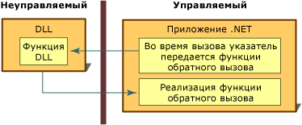

# Функции обратного вызоваCallback Functions
Функция обратного вызова — это программный код в управляемом приложении, который помогает неуправляемой функции DLL выполнить задачу.A callback function is code within a managed application that helps an unmanaged DLL function complete a task. Вызовы функции обратного вызова косвенно, через функцию DLL, передаются из управляемого приложения и возвращаются в управляемую реализацию.Calls to a callback function pass indirectly from a managed application, through a DLL function, and back to the managed implementation. Лишь некоторые из многих функций DLL, вызываемых в вызове неуправляемого кода, требуют для своего выполнения наличия в управляемом коде функции обратного вызова.Some of the many DLL functions called with platform invoke require a callback function in managed code to run properly.  
  
 Для вызова большинства функций DLL из управляемого кода нужно создать управляемое определение функции и затем выполнить сам вызов.To call most DLL functions from managed code, you create a managed definition of the function and then call it. Этот процесс достаточно прост.The process is straightforward.  
  
 Применение функции DLL, требующей наличия функции обратного вызова, предполагает выполнение некоторых дополнительных шагов.Using a DLL function that requires a callback function has some additional steps. Во-первых, необходимо определить, требуется ли для функции обратный вызов. Это можно выяснить в документации по функции.First, you must determine whether the function requires a callback by looking at the documentation for the function. Далее нужно создать функцию обратного вызова в управляемом приложении.Next, you have to create the callback function in your managed application. И, наконец, вы вызываете функцию DLL, передавая указатель на функцию обратного вызова в качестве аргумента.Finally, you call the DLL function, passing a pointer to the callback function as an argument. Перечисленные действия показаны на приведенной ниже иллюстрации.The following illustration summarizes these steps.  
  
   
Функция обратного вызова и реализацияCallback function and implementation  
  
 Функции обратного вызова — идеальное средство для многократного выполнения некоторой задачи.Callback functions are ideal for use in situations in which a task is performed repeatedly. Другая область их применения — с функциями перечисления интерфейса Win32 API, такими как **EnumFontFamilies**, **EnumPrinters** и **EnumWindows**.Another common usage is with enumeration functions, such as **EnumFontFamilies**, **EnumPrinters**, and **EnumWindows** in the Win32 API. Функция **EnumWindows** выполняет перечисление всех существующих на компьютере окон, используя функцию обратного вызова, чтобы выполнить задачу для каждого окна.The **EnumWindows** function enumerates through all existing windows on your computer, calling the callback function to perform a task on each window. Инструкции и пример см. в разделе [Практическое руководство. Реализация функций обратного вызова](../../../docs/framework/interop/how-to-implement-callback-functions.md).For instructions and an example, see [How to: Implement Callback Functions](../../../docs/framework/interop/how-to-implement-callback-functions.md).  
  
## См. такжеSee Also  
 [Практическое руководство. Реализация функций обратного вызоваHow to: Implement Callback Functions](../../../docs/framework/interop/how-to-implement-callback-functions.md)  
 [Вызов функции DLLCalling a DLL Function](../../../docs/framework/interop/calling-a-dll-function.md)
