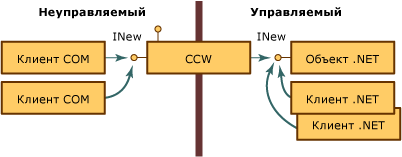
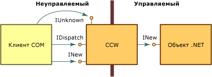

# <a name="com-callable-wrapper"></a><span data-ttu-id="fb3ee-102">Вызываемая оболочка COM</span><span class="sxs-lookup"><span data-stu-id="fb3ee-102">COM Callable Wrapper</span></span>
<span data-ttu-id="fb3ee-103">Когда клиент COM вызывает объект .NET, среда CLR создает для этого объекта управляемый объект и вызываемую оболочку COM.</span><span class="sxs-lookup"><span data-stu-id="fb3ee-103">When a COM client calls a .NET object, the common language runtime creates the managed object and a COM callable wrapper (CCW) for the object.</span></span> <span data-ttu-id="fb3ee-104">Не имея возможности обращаться к объекту .NET напрямую, клиенты COM используют вызываемую оболочку COM в качестве посредника для управляемого объекта.</span><span class="sxs-lookup"><span data-stu-id="fb3ee-104">Unable to reference a .NET object directly, COM clients use the CCW as a proxy for the managed object.</span></span>  
  
 <span data-ttu-id="fb3ee-105">Среда выполнения создает одну вызываемую оболочку COM для управляемого объекта независимо от числа клиентов COM, которым требуются его службы.</span><span class="sxs-lookup"><span data-stu-id="fb3ee-105">The runtime creates exactly one CCW for a managed object, regardless of the number of COM clients requesting its services.</span></span> <span data-ttu-id="fb3ee-106">Как показано на рисунке ниже, несколько клиентов COM могут содержать ссылку на вызываемую оболочку COM, предоставляющую интерфейс INew.</span><span class="sxs-lookup"><span data-stu-id="fb3ee-106">As the following illustration shows, multiple COM clients can hold a reference to the CCW that exposes the INew interface.</span></span> <span data-ttu-id="fb3ee-107">Вызываемая оболочка COM, в свою очередь, содержит единственную ссылку на управляемый объект, который реализует интерфейс и обрабатывается сборщиком мусора.</span><span class="sxs-lookup"><span data-stu-id="fb3ee-107">The CCW, in turn, holds a single reference to the managed object that implements the interface and is garbage collected.</span></span> <span data-ttu-id="fb3ee-108">Клиенты COM и .NET могут одновременно выполнять запросы к одному и тому же управляемому объекту.</span><span class="sxs-lookup"><span data-stu-id="fb3ee-108">Both COM and .NET clients can make requests on the same managed object simultaneously.</span></span>  
  
 <span data-ttu-id="fb3ee-109"></span><span class="sxs-lookup"><span data-stu-id="fb3ee-109"></span></span>  
<span data-ttu-id="fb3ee-110">Доступ к объектам .NET с помощью вызываемой оболочки COM</span><span class="sxs-lookup"><span data-stu-id="fb3ee-110">Accessing .NET objects through COM callable wrapper</span></span>  
  
 <span data-ttu-id="fb3ee-111">Вызываемые оболочки COM невидимы для других классов, работающих в среде .NET Framework.</span><span class="sxs-lookup"><span data-stu-id="fb3ee-111">COM callable wrappers are invisible to other classes running within the .NET Framework.</span></span> <span data-ttu-id="fb3ee-112">Их основной целью является маршалинг вызовов между управляемым и неуправляемым кодом. Однако вызываемые оболочки COM также управляют идентификацией и временем жизни управляемых объектов, которые в них упакованы.</span><span class="sxs-lookup"><span data-stu-id="fb3ee-112">Their primary purpose is to marshal calls between managed and unmanaged code; however, CCWs also manage the object identity and object lifetime of the managed objects they wrap.</span></span>  
  
## <a name="object-identity"></a><span data-ttu-id="fb3ee-113">Идентификация объектов</span><span class="sxs-lookup"><span data-stu-id="fb3ee-113">Object Identity</span></span>  
 <span data-ttu-id="fb3ee-114">Для объекта .NET среда выполнения выделяет память  в куче, обработанной сборщиком мусора, что позволяет при необходимости перемещать объект в памяти.</span><span class="sxs-lookup"><span data-stu-id="fb3ee-114">The runtime allocates memory for the .NET object from its garbage-collected heap, which enables the runtime to move the object around in memory as necessary.</span></span> <span data-ttu-id="fb3ee-115">Для вызываемой же оболочки COM среда выполнения выделяет память из кучи, не обработанной сборщиком мусора, благодаря чему клиенты COM могут напрямую обращаться к оболочке.</span><span class="sxs-lookup"><span data-stu-id="fb3ee-115">In contrast, the runtime allocates memory for the CCW from a noncollected heap, making it possible for COM clients to reference the wrapper directly.</span></span>  
  
## <a name="object-lifetime"></a><span data-ttu-id="fb3ee-116">Время жизни объекта</span><span class="sxs-lookup"><span data-stu-id="fb3ee-116">Object Lifetime</span></span>  
 <span data-ttu-id="fb3ee-117">В отличие от клиента .NET, учет ссылок для вызываемой оболочки COM, в которую инкапсулирован клиент, ведется обычным для модели COM образом.</span><span class="sxs-lookup"><span data-stu-id="fb3ee-117">Unlike the .NET client it wraps, the CCW is reference-counted in traditional COM fashion.</span></span> <span data-ttu-id="fb3ee-118">Когда счетчик ссылок на вызываемую оболочку COM достигает нуля, оболочка освобождает свою ссылку на управляемый объект.</span><span class="sxs-lookup"><span data-stu-id="fb3ee-118">When the reference count on the CCW reaches zero, the wrapper releases its reference on the managed object.</span></span> <span data-ttu-id="fb3ee-119">Управляемый объект, на который не осталось ссылок, обрабатывается сборщиком мусора в течение следующего цикла.</span><span class="sxs-lookup"><span data-stu-id="fb3ee-119">A managed object with no remaining references is collected during the next garbage-collection cycle.</span></span>  
  
## <a name="simulating-com-interfaces"></a><span data-ttu-id="fb3ee-120">Имитация COM-интерфейсов</span><span class="sxs-lookup"><span data-stu-id="fb3ee-120">Simulating COM interfaces</span></span>  
 <span data-ttu-id="fb3ee-121">[Вызываемая оболочка COM](../../../docs/framework/interop/com-callable-wrapper.md) предоставляет клиентам COM доступ ко всем открытым и видимым COM-интерфейсам, типам данных и возвращаемым значениям способом, совместимым с реализацией средствами COM взаимодействия на основе интерфейсов.</span><span class="sxs-lookup"><span data-stu-id="fb3ee-121">The [COM callable wrapper](../../../docs/framework/interop/com-callable-wrapper.md) (CCW) exposes all public, COM-visible interfaces, data types, and return values to COM clients in a manner that is consistent with COM's enforcement of interface-based interaction.</span></span> <span data-ttu-id="fb3ee-122">Для клиента COM вызов методов в объекте .NET Framework идентичен вызову методов в COM-объекте.</span><span class="sxs-lookup"><span data-stu-id="fb3ee-122">For a COM client, invoking methods on a .NET Framework object is identical to invoking methods on a COM object.</span></span>  
  
 <span data-ttu-id="fb3ee-123">Для обеспечения такой унификации вызываемая оболочка COM создает традиционные COM-интерфейсы, такие как **IUnknown** и **IDispatch**.</span><span class="sxs-lookup"><span data-stu-id="fb3ee-123">To create this seamless approach, the CCW manufactures traditional COM interfaces, such as **IUnknown** and **IDispatch**.</span></span> <span data-ttu-id="fb3ee-124">Как показано на рисунке ниже, вызываемая оболочка COM содержит единственную ссылку на инкапсулируемый в нее объект .NET.</span><span class="sxs-lookup"><span data-stu-id="fb3ee-124">As the following illustration shows, the CCW maintains a single reference on the .NET object that it wraps.</span></span> <span data-ttu-id="fb3ee-125">Клиент COM и объект .NET взаимодействуют друг с другом с помощью посредника и создания заглушки вызываемой оболочки COM.</span><span class="sxs-lookup"><span data-stu-id="fb3ee-125">Both the COM client and .NET object interact with each other through the proxy and stub construction of the CCW.</span></span>  
  
 <span data-ttu-id="fb3ee-126"></span><span class="sxs-lookup"><span data-stu-id="fb3ee-126"></span></span>  
<span data-ttu-id="fb3ee-127">COM-интерфейсы и вызываемая оболочка COM</span><span class="sxs-lookup"><span data-stu-id="fb3ee-127">Com interfaces and the COM callable wrapper</span></span>  
  
 <span data-ttu-id="fb3ee-128">Платформа .NET Framework не только обеспечивает доступ к интерфейсам, которые явным образом реализуются классом в управляемой среде, но и от имени объекта предоставляет реализации COM-интерфейсов, перечисленных в таблице ниже.</span><span class="sxs-lookup"><span data-stu-id="fb3ee-128">In addition to exposing the interfaces that are explicitly implemented by a class in the managed environment, the .NET Framework supplies implementations of the COM interfaces listed in the following table on behalf of the object.</span></span> <span data-ttu-id="fb3ee-129">Класс .NET может переопределять заданное по умолчанию поведение, предоставляя собственную реализацию этих интерфейсов.</span><span class="sxs-lookup"><span data-stu-id="fb3ee-129">A .NET class can override the default behavior by providing its own implementation of these interfaces.</span></span> <span data-ttu-id="fb3ee-130">Однако среда выполнения всегда предоставляет реализацию интерфейсов **IUnknown** и **IDispatch**.</span><span class="sxs-lookup"><span data-stu-id="fb3ee-130">However, the runtime always provides the implementation for the **IUnknown** and **IDispatch** interfaces.</span></span>  
  
|<span data-ttu-id="fb3ee-131">Интерфейс</span><span class="sxs-lookup"><span data-stu-id="fb3ee-131">Interface</span></span>|<span data-ttu-id="fb3ee-132">Описание</span><span class="sxs-lookup"><span data-stu-id="fb3ee-132">Description</span></span>|  
|---------------|-----------------|  
|<span data-ttu-id="fb3ee-133">**Idispatch**</span><span class="sxs-lookup"><span data-stu-id="fb3ee-133">**Idispatch**</span></span>|<span data-ttu-id="fb3ee-134">Предоставляет механизм позднего связывания с типом.</span><span class="sxs-lookup"><span data-stu-id="fb3ee-134">Provides a mechanism for late binding to type.</span></span>|  
|<span data-ttu-id="fb3ee-135">**IerrorInfo**</span><span class="sxs-lookup"><span data-stu-id="fb3ee-135">**IerrorInfo**</span></span>|<span data-ttu-id="fb3ee-136">Предоставляет текстовое описание ошибки, ее источник, файл справки, контекст справки и идентификатор GUID интерфейса, определившего ошибку (для классов .NET всегда **GUID_NULL**).</span><span class="sxs-lookup"><span data-stu-id="fb3ee-136">Provides a textual description of the error, its source, a Help file, Help context, and the GUID of the interface that defined the error (always **GUID_NULL** for .NET classes).</span></span>|  
|<span data-ttu-id="fb3ee-137">**IprovideClassInfo**</span><span class="sxs-lookup"><span data-stu-id="fb3ee-137">**IprovideClassInfo**</span></span>|<span data-ttu-id="fb3ee-138">Позволяет клиентам COM получать доступ к интерфейсу **ITypeInfo**, реализованному управляемым классом.</span><span class="sxs-lookup"><span data-stu-id="fb3ee-138">Enables COM clients to gain access to the **ITypeInfo** interface implemented by a managed class.</span></span>|  
|<span data-ttu-id="fb3ee-139">**IsupportErrorInfo**</span><span class="sxs-lookup"><span data-stu-id="fb3ee-139">**IsupportErrorInfo**</span></span>|<span data-ttu-id="fb3ee-140">Позволяет клиенту COM определить, поддерживает ли управляемый объект интерфейс **IErrorInfo**.</span><span class="sxs-lookup"><span data-stu-id="fb3ee-140">Enables a COM client to determine whether the managed object supports the **IErrorInfo** interface.</span></span> <span data-ttu-id="fb3ee-141">Если это так, то клиент может получить указатель на последний по времени объект исключения.</span><span class="sxs-lookup"><span data-stu-id="fb3ee-141">If so, enables the client to obtain a pointer to the latest exception object.</span></span> <span data-ttu-id="fb3ee-142">Все управляемые типы поддерживают интерфейс **IErrorInfo**.</span><span class="sxs-lookup"><span data-stu-id="fb3ee-142">All managed types support the **IErrorInfo** interface.</span></span>|  
|<span data-ttu-id="fb3ee-143">**ItypeInfo**</span><span class="sxs-lookup"><span data-stu-id="fb3ee-143">**ItypeInfo**</span></span>|<span data-ttu-id="fb3ee-144">Предоставляет для класса сведения о типе, которые совпадают со сведениями о типе, предоставленными Tlbexp.exe.</span><span class="sxs-lookup"><span data-stu-id="fb3ee-144">Provides type information for a class that is exactly the same as the type information produced by Tlbexp.exe.</span></span>|  
|<span data-ttu-id="fb3ee-145">**Iunknown**</span><span class="sxs-lookup"><span data-stu-id="fb3ee-145">**Iunknown**</span></span>|<span data-ttu-id="fb3ee-146">Предоставляет стандартную реализацию интерфейса **IUnknown**, с помощью которой клиент COM управляет временем жизни вызываемой оболочки COM и обеспечивает приведение типов.</span><span class="sxs-lookup"><span data-stu-id="fb3ee-146">Provides the standard implementation of the **IUnknown** interface with which the COM client manages the lifetime of the CCW and provides type coercion.</span></span>|  
  
 <span data-ttu-id="fb3ee-147">Управляемый класс также может предоставлять COM-интерфейсы, описанные в таблице ниже.</span><span class="sxs-lookup"><span data-stu-id="fb3ee-147">A managed class can also provide the COM interfaces described in the following table.</span></span>  
  
|<span data-ttu-id="fb3ee-148">Интерфейс</span><span class="sxs-lookup"><span data-stu-id="fb3ee-148">Interface</span></span>|<span data-ttu-id="fb3ee-149">Описание</span><span class="sxs-lookup"><span data-stu-id="fb3ee-149">Description</span></span>|  
|---------------|-----------------|  
|<span data-ttu-id="fb3ee-150">Интерфейс класса (_*classname*)</span><span class="sxs-lookup"><span data-stu-id="fb3ee-150">The (_*classname*) class interface</span></span>|<span data-ttu-id="fb3ee-151">Интерфейс, предоставляемый средой выполнения и не определенный явным образом, который обеспечивает доступ ко всем открытым интерфейсам, методам, свойствам и полям, явно предоставляемым в управляемом объекте.</span><span class="sxs-lookup"><span data-stu-id="fb3ee-151">Interface, exposed by the runtime and not explicitly defined, that exposes all public interfaces, methods, properties, and fields that are explicitly exposed on a managed object.</span></span>|  
|<span data-ttu-id="fb3ee-152">**IConnectionPoint** и **IconnectionPointContainer**</span><span class="sxs-lookup"><span data-stu-id="fb3ee-152">**IConnectionPoint** and **IconnectionPointContainer**</span></span>|<span data-ttu-id="fb3ee-153">Интерфейс для объектов, которые являются источниками событий на основе делегатов (интерфейс для регистрации подписчиков событий).</span><span class="sxs-lookup"><span data-stu-id="fb3ee-153">Interface for objects that source delegate-based events (an interface for registering event subscribers).</span></span>|  
|<span data-ttu-id="fb3ee-154">**IdispatchEx**</span><span class="sxs-lookup"><span data-stu-id="fb3ee-154">**IdispatchEx**</span></span>|<span data-ttu-id="fb3ee-155">Интерфейс, предоставляемый средой выполнения, если класс реализует интерфейс **IExpando**.</span><span class="sxs-lookup"><span data-stu-id="fb3ee-155">Interface supplied by the runtime if the class implements **IExpando**.</span></span> <span data-ttu-id="fb3ee-156">Интерфейс **IDispatchEx** является расширением интерфейса **IDispatch**, который, в отличие от интерфейса **IDispatch**, позволяет перечислять, добавлять, удалять и вызывать члены с учетом регистра.</span><span class="sxs-lookup"><span data-stu-id="fb3ee-156">The **IDispatchEx** interface is an extension of the **IDispatch** interface that, unlike **IDispatch**, enables enumeration, addition, deletion, and case-sensitive calling of members.</span></span>|  
|<span data-ttu-id="fb3ee-157">**IEnumVARIANT**</span><span class="sxs-lookup"><span data-stu-id="fb3ee-157">**IEnumVARIANT**</span></span>|<span data-ttu-id="fb3ee-158">Интерфейс для классов типа коллекции, в которых перечислены ее объекты, если класс реализует интерфейс **IEnumerable**.</span><span class="sxs-lookup"><span data-stu-id="fb3ee-158">Interface for collection-type classes, which enumerates the objects in the collection if the class implements **IEnumerable**.</span></span>|  
  
## <a name="introducing-the-class-interface"></a><span data-ttu-id="fb3ee-159">Введение в интерфейс класса</span><span class="sxs-lookup"><span data-stu-id="fb3ee-159">Introducing the class interface</span></span>  
 <span data-ttu-id="fb3ee-160">Интерфейс класса, не определенный явным образом в управляемом коде, — это интерфейс, который предоставляет доступ ко всем открытым методам, свойствам, полям и событиям, к которым предоставлен явный доступ в объекте .NET.</span><span class="sxs-lookup"><span data-stu-id="fb3ee-160">The class interface, which is not explicitly defined in managed code, is an interface that exposes all public methods, properties, fields, and events that are explicitly exposed on the .NET object.</span></span> <span data-ttu-id="fb3ee-161">Этот интерфейс может быть сдвоенным или интерфейсом диспетчеризации.</span><span class="sxs-lookup"><span data-stu-id="fb3ee-161">This interface can be a dual or dispatch-only interface.</span></span> <span data-ttu-id="fb3ee-162">Интерфейс класса получает имя самого класса .NET с символом подчеркивания впереди.</span><span class="sxs-lookup"><span data-stu-id="fb3ee-162">The class interface receives the name of the .NET class itself, preceded by an underscore.</span></span> <span data-ttu-id="fb3ee-163">Например, если имя класса — Mammal, интерфейс класса получит имя _Mammal.</span><span class="sxs-lookup"><span data-stu-id="fb3ee-163">For example, for class Mammal, the class interface is _Mammal.</span></span>  
  
 <span data-ttu-id="fb3ee-164">В случае с производными классами интерфейс класса также предоставляет доступ ко всем открытым методам, свойствам и полям базового класса.</span><span class="sxs-lookup"><span data-stu-id="fb3ee-164">For derived classes, the class interface also exposes all public methods, properties, and fields of the base class.</span></span> <span data-ttu-id="fb3ee-165">Производный класс также предоставляет доступ к интерфейсу класса для каждого базового класса.</span><span class="sxs-lookup"><span data-stu-id="fb3ee-165">The derived class also exposes a class interface for each base class.</span></span> <span data-ttu-id="fb3ee-166">Например, если класс Mammal является расширением класса MammalSuperclass, который, в свою очередь, является расширением класса System.Object, объект .NET предоставляет клиентам COM доступ к трем интерфейсам классов с именами _Mammal, _MammalSuperclass и _Object.</span><span class="sxs-lookup"><span data-stu-id="fb3ee-166">For example, if class Mammal extends class MammalSuperclass, which itself extends System.Object, the .NET object exposes to COM clients three class interfaces named _Mammal, _MammalSuperclass, and _Object.</span></span>  
  
 <span data-ttu-id="fb3ee-167">Например, рассмотрим приведенный ниже класс .NET.</span><span class="sxs-lookup"><span data-stu-id="fb3ee-167">For example, consider the following .NET class:</span></span>  
  
```vb  
' Applies the ClassInterfaceAttribute to set the interface to dual.  
<ClassInterface(ClassInterfaceType.AutoDual)> _  
' Implicitly extends System.Object.  
Public Class Mammal  
    Sub Eat()  
    Sub Breathe()  
    Sub Sleep()  
End Class  
```  
  
```csharp  
// Applies the ClassInterfaceAttribute to set the interface to dual.  
[ClassInterface(ClassInterfaceType.AutoDual)]  
// Implicitly extends System.Object.  
public class Mammal  
{  
    void  Eat();  
    void  Breathe():  
    void  Sleep();  
}  
```  
  
 <span data-ttu-id="fb3ee-168">Клиент COM может получить указатель на интерфейс класса с именем `_Mammal`, который описан в библиотеке типов, созданной [программой экспорта библиотек типов (Tlbexp.exe)](../../../docs/framework/tools/tlbexp-exe-type-library-exporter.md).</span><span class="sxs-lookup"><span data-stu-id="fb3ee-168">The COM client can obtain a pointer to a class interface named `_Mammal`, which is described in the type library that the [Type Library Exporter (Tlbexp.exe)](../../../docs/framework/tools/tlbexp-exe-type-library-exporter.md) tool generates.</span></span> <span data-ttu-id="fb3ee-169">Если класс `Mammal` реализовал один или несколько интерфейсов, они будут отображены в коклассе.</span><span class="sxs-lookup"><span data-stu-id="fb3ee-169">If the `Mammal` class implemented one or more interfaces, the interfaces would appear under the coclass.</span></span>  
  
```  
[odl, uuid(…), hidden, dual, nonextensible, oleautomation]  
interface _Mammal : IDispatch  
{  
    [id(0x00000000), propget] HRESULT ToString([out, retval] BSTR*  
        pRetVal);  
    [id(0x60020001)] HRESULT Equals([in] VARIANT obj, [out, retval]  
        VARIANT_BOOL* pRetVal);  
    [id(0x60020002)] HRESULT GetHashCode([out, retval] short* pRetVal);  
    [id(0x60020003)] HRESULT GetType([out, retval] _Type** pRetVal);  
    [id(0x6002000d)] HRESULT Eat();  
    [id(0x6002000e)] HRESULT Breathe();  
    [id(0x6002000f)] HRESULT Sleep();  
}  
[uuid(…)]  
coclass Mammal   
{  
    [default] interface _Mammal;  
}  
```  
  
 <span data-ttu-id="fb3ee-170">Создавать интерфейс класса необязательно.</span><span class="sxs-lookup"><span data-stu-id="fb3ee-170">Generating the class interface is optional.</span></span> <span data-ttu-id="fb3ee-171">По умолчанию COM-взаимодействие создает для каждого класса, экспортируемого в библиотеку типов, интерфейс диспетчеризации.</span><span class="sxs-lookup"><span data-stu-id="fb3ee-171">By default, COM interop generates a dispatch-only interface for each class you export to a type library.</span></span> <span data-ttu-id="fb3ee-172">Автоматическое создание этого интерфейса можно предотвратить или изменить, применив к классу атрибут <xref:System.Runtime.InteropServices.ClassInterfaceAttribute>.</span><span class="sxs-lookup"><span data-stu-id="fb3ee-172">You can prevent or modify the automatic creation of this interface by applying the <xref:System.Runtime.InteropServices.ClassInterfaceAttribute> to your class.</span></span> <span data-ttu-id="fb3ee-173">Хотя интерфейс класса и может упростить задачу обеспечения доступа из COM к управляемым классам, возможности его использования ограничены.</span><span class="sxs-lookup"><span data-stu-id="fb3ee-173">Although the class interface can ease the task of exposing managed classes to COM, its uses are limited.</span></span>  
  
> [!CAUTION]
>  <span data-ttu-id="fb3ee-174">Использование интерфейса класса вместо явного определения собственного интерфейса может усложнить управление версиями управляемого класса в будущем.</span><span class="sxs-lookup"><span data-stu-id="fb3ee-174">Using the class interface, instead of explicitly defining your own, can complicate the future versioning of your managed class.</span></span> <span data-ttu-id="fb3ee-175">Перед использованием интерфейса класса следует ознакомиться с приведенными ниже рекомендациями.</span><span class="sxs-lookup"><span data-stu-id="fb3ee-175">Please read the following guidelines before using the class interface.</span></span>  
  
### <a name="define-an-explicit-interface-for-com-clients-to-use-rather-than-generating-the-class-interface"></a><span data-ttu-id="fb3ee-176">Вместо создания интерфейса класса лучше определить явный интерфейс, который могли бы использовать клиенты COM.</span><span class="sxs-lookup"><span data-stu-id="fb3ee-176">Define an explicit interface for COM clients to use rather than generating the class interface.</span></span>  
 <span data-ttu-id="fb3ee-177">Так как COM-взаимодействие создает интерфейс класса автоматически, изменения, вносимые в класс в следующих версиях, могут повлиять на компоновку интерфейса класса, предоставляемого средой CLR.</span><span class="sxs-lookup"><span data-stu-id="fb3ee-177">Because COM interop generates a class interface automatically, post-version changes to your class can alter the layout of the class interface exposed by the common language runtime.</span></span> <span data-ttu-id="fb3ee-178">Так как клиенты COM обычно не готовы к изменениям в компоновке интерфейса, изменение компоновки членов класса вызовет сбой в их работе.</span><span class="sxs-lookup"><span data-stu-id="fb3ee-178">Since COM clients are typically unprepared to handle changes in the layout of an interface, they break if you change the member layout of the class.</span></span>  
  
 <span data-ttu-id="fb3ee-179">Эта рекомендация подкрепляет представление о том, что интерфейсы, предоставляемые клиентам COM, лучше оставлять неизменными.</span><span class="sxs-lookup"><span data-stu-id="fb3ee-179">This guideline reinforces the notion that interfaces exposed to COM clients must remain unchangeable.</span></span> <span data-ttu-id="fb3ee-180">Чтобы снизить риск сбоя в работе клиентов COM в результате непреднамеренного изменения компоновки интерфейса, нужно изолировать все изменения, вносимые в класс, от интерфейса путем его явного определения.</span><span class="sxs-lookup"><span data-stu-id="fb3ee-180">To reduce the risk of breaking COM clients by inadvertently reordering the interface layout, isolate all changes to the class from the interface layout by explicitly defining interfaces.</span></span>  
  
 <span data-ttu-id="fb3ee-181">С помощью атрибута **ClassInterfaceAttribute** отключите автоматическое создание интерфейса класса и реализуйте для класса явный интерфейс, как показано во фрагменте программы ниже:</span><span class="sxs-lookup"><span data-stu-id="fb3ee-181">Use the **ClassInterfaceAttribute** to disengage the automatic generation of the class interface and implement an explicit interface for the class, as the following code fragment shows:</span></span>  
  
```vb  
<ClassInterface(ClassInterfaceType.None)>Public Class LoanApp  
    Implements IExplicit  
    Sub M() Implements IExplicit.M  
…  
End Class  
```  
  
```csharp  
[ClassInterface(ClassInterfaceType.None)]  
public class LoanApp : IExplicit {  
    void M();  
}  
```  
  
 <span data-ttu-id="fb3ee-182">Значение **ClassInterfaceType.None** предотвращает создание интерфейса класса при экспорте метаданных класса в библиотеку типов.</span><span class="sxs-lookup"><span data-stu-id="fb3ee-182">The **ClassInterfaceType.None** value prevents the class interface from being generated when the class metadata is exported to a type library.</span></span> <span data-ttu-id="fb3ee-183">В предыдущем примере клиенты COM могут получить доступ к классу `LoanApp` только через интерфейс `IExplicit`.</span><span class="sxs-lookup"><span data-stu-id="fb3ee-183">In the preceding example, COM clients can access the `LoanApp` class only through the `IExplicit` interface.</span></span>  
  
### <a name="avoid-caching-dispatch-identifiers-dispids"></a><span data-ttu-id="fb3ee-184">Избегайте кэширования идентификаторов диспетчеризации (DispId).</span><span class="sxs-lookup"><span data-stu-id="fb3ee-184">Avoid caching dispatch identifiers (DispIds).</span></span>  
 <span data-ttu-id="fb3ee-185">Использование интерфейса класса является допустимым вариантом для клиентов со сценариями, клиентов Microsoft Visual Basic 6.0, а также клиентов с поздним связыванием, которые не кэшируют идентификаторы DispId членов интерфейса.</span><span class="sxs-lookup"><span data-stu-id="fb3ee-185">Using the class interface is an acceptable option for scripted clients, Microsoft Visual Basic 6.0 clients, or any late-bound client that does not cache the DispIds of interface members.</span></span> <span data-ttu-id="fb3ee-186">Идентификаторы DispId определяют члены интерфейса, разрешающие позднее связывание.</span><span class="sxs-lookup"><span data-stu-id="fb3ee-186">DispIds identify interface members to enable late binding.</span></span>  
  
 <span data-ttu-id="fb3ee-187">Для интерфейса класса идентификаторы DispId создаются на основе позиции члена в интерфейсе.</span><span class="sxs-lookup"><span data-stu-id="fb3ee-187">For the class interface, generation of DispIds is based on the position of the member in the interface.</span></span> <span data-ttu-id="fb3ee-188">Если вы изменяете порядок членов и экспортируете класс в библиотеку типов, меняются и идентификаторы DispId, созданные в интерфейсе класса.</span><span class="sxs-lookup"><span data-stu-id="fb3ee-188">If you change the order of the member and export the class to a type library, you will alter the DispIds generated in the class interface.</span></span>  
  
 <span data-ttu-id="fb3ee-189">Чтобы избежать нарушений в работе клиентов COM с поздним связыванием при использовании интерфейса класса, примените атрибут **ClassInterfaceAttribute** со значением **ClassInterfaceType.AutoDispatch**.</span><span class="sxs-lookup"><span data-stu-id="fb3ee-189">To avoid breaking late-bound COM clients when using the class interface, apply the **ClassInterfaceAttribute** with the **ClassInterfaceType.AutoDispatch** value.</span></span> <span data-ttu-id="fb3ee-190">Это значение реализует интерфейс диспетчеризации класса, но пропускает описание интерфейса в библиотеке типов.</span><span class="sxs-lookup"><span data-stu-id="fb3ee-190">This value implements a dispatch-only class interface, but omits the interface description from the type library.</span></span> <span data-ttu-id="fb3ee-191">Без описания интерфейса клиенты не могут кэшировать идентификаторы DispId во время компиляции.</span><span class="sxs-lookup"><span data-stu-id="fb3ee-191">Without an interface description, clients are unable to cache DispIds at compile time.</span></span> <span data-ttu-id="fb3ee-192">Хотя это тип интерфейса по умолчанию для интерфейса класса, значение атрибута можно задать явным образом.</span><span class="sxs-lookup"><span data-stu-id="fb3ee-192">Although this is the default interface type for the class interface, you can apply the attribute value explicitly.</span></span>  
  
```vb  
<ClassInterface(ClassInterfaceType.AutoDispatch)> Public Class LoanApp  
    Implements IAnother  
    Sub M() Implements IAnother.M  
…  
End Class  
```  
  
```csharp  
[ClassInterface(ClassInterfaceType.AutoDispatch]  
public class LoanApp : IAnother {  
    void M();  
}  
```  
  
 <span data-ttu-id="fb3ee-193">Чтобы получить идентификатор DispId члена интерфейса во время выполнения, клиент COM может вызвать метод **IDispatch.GetIdsOfNames**.</span><span class="sxs-lookup"><span data-stu-id="fb3ee-193">To get the DispId of an interface member at run time, COM clients can call **IDispatch.GetIdsOfNames**.</span></span> <span data-ttu-id="fb3ee-194">Чтобы вызвать метод для интерфейса, передайте возвращенный идентификатор DispId в качестве аргумента для **IDispatch.Invoke**.</span><span class="sxs-lookup"><span data-stu-id="fb3ee-194">To invoke a method on the interface, pass the returned DispId as an argument to **IDispatch.Invoke**.</span></span>  
  
### <a name="restrict-using-the-dual-interface-option-for-the-class-interface"></a><span data-ttu-id="fb3ee-195">Ограничьте использование сдвоенного интерфейса для интерфейса класса.</span><span class="sxs-lookup"><span data-stu-id="fb3ee-195">Restrict using the dual interface option for the class interface.</span></span>  
 <span data-ttu-id="fb3ee-196">Сдвоенные интерфейсы позволяют клиентам COM выполнять раннее и позднее связывание с членами интерфейсов.</span><span class="sxs-lookup"><span data-stu-id="fb3ee-196">Dual interfaces enable early and late binding to interface members by COM clients.</span></span> <span data-ttu-id="fb3ee-197">Во время разработки и тестирования может оказаться полезным сделать интерфейс класса сдвоенным.</span><span class="sxs-lookup"><span data-stu-id="fb3ee-197">At design time and during testing, you might find it useful to set the class interface to dual.</span></span> <span data-ttu-id="fb3ee-198">Этот вариант также допустим и для управляемого класса (и его базовых классов), который никогда не будет изменяться.</span><span class="sxs-lookup"><span data-stu-id="fb3ee-198">For a managed class (and its base classes) that will never be modified, this option is also acceptable.</span></span> <span data-ttu-id="fb3ee-199">Во всех остальных случаях следует воздержаться от использования сдвоенного интерфейса класса.</span><span class="sxs-lookup"><span data-stu-id="fb3ee-199">In all other cases, avoid setting the class interface to dual.</span></span>  
  
 <span data-ttu-id="fb3ee-200">Изредка автоматически созданный сдвоенный интерфейс может оказаться полезным, но чаще он создает трудности при работе с версиями.</span><span class="sxs-lookup"><span data-stu-id="fb3ee-200">An automatically generated dual interface might be appropriate in rare cases; however, more often it creates version-related complexity.</span></span> <span data-ttu-id="fb3ee-201">Например, внесение изменений в базовый класс легко может нарушить работу клиентов COM, использующих интерфейс производного класса.</span><span class="sxs-lookup"><span data-stu-id="fb3ee-201">For example, COM clients using the class interface of a derived class can easily break with changes to the base class.</span></span> <span data-ttu-id="fb3ee-202">Если базовый класс предоставляется сторонним поставщиком, вы не можете контролировать компоновку интерфейса класса.</span><span class="sxs-lookup"><span data-stu-id="fb3ee-202">When a third party provides the base class, the layout of the class interface is out of your control.</span></span> <span data-ttu-id="fb3ee-203">Кроме того, в отличие от интерфейса диспетчеризации сдвоенный интерфейс (**ClassInterface.AutoDual**) предоставляет описание интерфейса класса в экспортированной библиотеке типов.</span><span class="sxs-lookup"><span data-stu-id="fb3ee-203">Further, unlike a dispatch-only interface, a dual interface (**ClassInterface.AutoDual**) provides a description of the class interface in the exported type library.</span></span> <span data-ttu-id="fb3ee-204">Это описание стимулирует клиентов с поздним связыванием кэшировать идентификаторы DispId во время выполнения.</span><span class="sxs-lookup"><span data-stu-id="fb3ee-204">Such a description encourages late-bound clients to cache DispIds at run time.</span></span>  
  
## <a name="see-also"></a><span data-ttu-id="fb3ee-205">См. также</span><span class="sxs-lookup"><span data-stu-id="fb3ee-205">See Also</span></span>  
 <xref:System.Runtime.InteropServices.ClassInterfaceAttribute>  
 [<span data-ttu-id="fb3ee-206">Вызываемая оболочка COM</span><span class="sxs-lookup"><span data-stu-id="fb3ee-206">COM Callable Wrapper</span></span>](../../../docs/framework/interop/com-callable-wrapper.md)  
 [<span data-ttu-id="fb3ee-207">Oболочки COM</span><span class="sxs-lookup"><span data-stu-id="fb3ee-207">COM Wrappers</span></span>](../../../docs/framework/interop/com-wrappers.md)  
 [<span data-ttu-id="fb3ee-208">Предоставление компонентов .NET Framework клиентам COM</span><span class="sxs-lookup"><span data-stu-id="fb3ee-208">Exposing .NET Framework Components to COM</span></span>](../../../docs/framework/interop/exposing-dotnet-components-to-com.md)  
 [<span data-ttu-id="fb3ee-209">Имитация COM-интерфейсов</span><span class="sxs-lookup"><span data-stu-id="fb3ee-209">Simulating COM Interfaces</span></span>](http://msdn.microsoft.com/en-us/ad2ab959-e2be-411b-aaff-275c3fba606c)  
 [<span data-ttu-id="fb3ee-210">Oпределение типов .NET для взаимодействия</span><span class="sxs-lookup"><span data-stu-id="fb3ee-210">Qualifying .NET Types for Interoperation</span></span>](../../../docs/framework/interop/qualifying-net-types-for-interoperation.md)  
 [<span data-ttu-id="fb3ee-211">Вызываемая оболочка времени выполнения</span><span class="sxs-lookup"><span data-stu-id="fb3ee-211">Runtime Callable Wrapper</span></span>](../../../docs/framework/interop/runtime-callable-wrapper.md)
