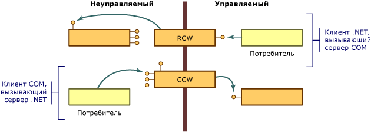

# Оболочки COMCOM Wrappers
Модель COM имеет несколько важных отличий от объектной модели .NET Framework:COM differs from the .NET Framework object model in several important ways:  
  
-   Клиенты COM-объектов должны управлять временем существования этих объектов. В общеязыковой среде выполнения управление временем существования объектов осуществляет сама среда.Clients of COM objects must manage the lifetime of those objects; the common language runtime manages the lifetime of objects in its environment.  
  
-   Клиенты COM-объектов определяют доступность службы, запрашивая интерфейс, который ее предоставляет, в результате чего возвращается или не возвращается указатель на интерфейс.Clients of COM objects discover whether a service is available by requesting an interface that provides that service and getting back an interface pointer, or not. Клиенты объектов .NET могут получать описание функциональных возможностей объекта с помощью отражения.Clients of .NET objects can obtain a description of an object's functionality using reflection.  
  
-   Объекты .NET располагаются в памяти под управлением среды выполнения .NET Framework.NET objects reside in memory managed by the .NET Framework execution environment. Среда выполнения может перемещать объекты в памяти в целях оптимизации производительности и обновлять все ссылки на перемещаемые объекты.The execution environment can move objects around in memory for performance reasons and update all references to the objects it moves. Неуправляемые клиенты после получения указателя на объект работают с объектом, находящимся в указанном расположении.Unmanaged clients, having obtained a pointer to an object, rely on the object to remain at the same location. У этих клиентов отсутствуют механизмы для работы с объектами, не имеющими фиксированного расположения.These clients have no mechanism for dealing with an object whose location is not fixed.  
  
 Чтобы обойти эти различия, среда выполнения предоставляет классы-оболочки, которые моделируют вызов объектов в соответствующих им средах для управляемых и неуправляемых клиентов.To overcome these differences, the runtime provides wrapper classes to make both managed and unmanaged clients think they are calling objects within their respective environment. Каждый раз, когда управляемый клиент вызывает метод для COM-объекта, среда выполнения создает [вызываемую оболочку времени выполнения](runtime-callable-wrapper.md) (RCW).Whenever your managed client calls a method on a COM object, the runtime creates a [runtime callable wrapper](runtime-callable-wrapper.md) (RCW). Помимо прочего, вызываемая оболочка времени выполнения позволяет абстрагировать различия между управляемыми и неуправляемыми механизмами ссылок.RCWs abstract the differences between managed and unmanaged reference mechanisms, among other things. Среда выполнения также создает [вызываемую оболочку COM](com-callable-wrapper.md) (CCW) для работы в обратном направлении, когда COM-клиенту требуется вызвать метод для объекта .NET.The runtime also creates a [COM callable wrapper](com-callable-wrapper.md) (CCW) to reverse the process, enabling a COM client to seamlessly call a method on a .NET object. Как показано на следующем рисунке, класс-оболочка, который создается средой выполнения, зависит от контекста вызывающего кода.As the following illustration shows, the perspective of the calling code determines which wrapper class the runtime creates.  
  
   
Общие сведения об оболочках COMCOM wrapper overview  
  
 В большинстве случаев стандартная вызываемая оболочка времени выполнения или вызываемая оболочка COM, создаваемая средой выполнения, реализует маршалинг вызовов, которые выполняются между средами COM и .NET Framework.In most cases, the standard RCW or CCW generated by the runtime provides adequate marshaling for calls that cross the boundary between COM and the .NET Framework. С помощью настраиваемых атрибутов при необходимости можно определить способ представления управляемого и неуправляемого кода в среде выполнения.Using custom attributes, you can optionally adjust the way the runtime represents managed and unmanaged code.  
  
## См. такжеSee Also  
 [Расширенное COM-взаимодействие](https://msdn.microsoft.com/library/3ada36e5-2390-4d70-b490-6ad8de92f2fb(v=vs.100))[Advanced COM Interoperability](https://msdn.microsoft.com/library/3ada36e5-2390-4d70-b490-6ad8de92f2fb(v=vs.100))  
 [Вызываемая оболочка времени выполненияRuntime Callable Wrapper](runtime-callable-wrapper.md)  
 [Вызываемая оболочка COMCOM Callable Wrapper](com-callable-wrapper.md)  
 [Customizing Standard Wrappers](https://msdn.microsoft.com/library/c40d089b-6a3c-41b5-a20d-d760c215e49d(v=vs.100)) (Настройка стандартных оболочек)[Customizing Standard Wrappers](https://msdn.microsoft.com/library/c40d089b-6a3c-41b5-a20d-d760c215e49d(v=vs.100))  
 [Практическое руководство. Настройка вызываемых оболочек времени выполнения](https://msdn.microsoft.com/library/4a4bb3da-4d60-4517-99f2-78d46a681732(v=vs.100))[How to: Customize Runtime Callable Wrappers](https://msdn.microsoft.com/library/4a4bb3da-4d60-4517-99f2-78d46a681732(v=vs.100))
