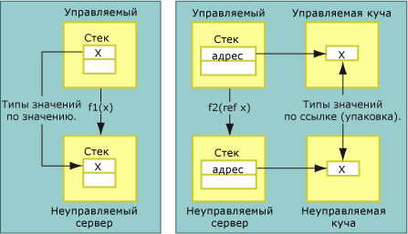
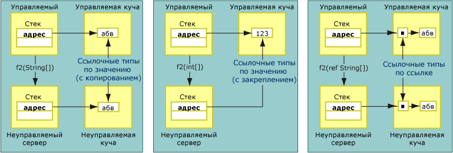

# Copying and Pinning
При маршалинге данных маршалер взаимодействия может копировать или фиксировать маршалируемые данные.  При копировании копия данных из одной группы ячеек памяти помещается в другую группу ячеек памяти.  На следующем рисунке показаны различия между копированием для типа, передаваемого по значению, и для типа, передаваемого по ссылке, из управляемой в неуправляемую память.  
  
   
Типы значений, передаваемые по значению и по ссылке  
  
 Аргументы методов, передаваемые по значению, маршалируются в неуправляемый код как значения в стеке.  Процесс копирования является прямым.  Аргументы, передаваемые по ссылке, передаются в стек как указатели.  Ссылочные типы также передаются по значению и по ссылке.  Как показано на следующих рисунках, ссылочные типы, передаваемые по значению, либо копируются, либо закрепляются.  
  
   
Ссылочные типы, передаваемые по значению и по ссылке  
  
 При закреплении данные временно фиксируются в текущем месте памяти, что предотвращает их перемещение сборщиком мусора среды CLR.  Упаковщик закрепляет данные, чтобы уменьшить дополнительные издержки на копирование и улучшить производительность.  Будут ли данные копироваться или фиксироваться при маршалинге — зависит от типа данных.  Для таких объектов, как <xref:System.String>, закрепление во время маршалинга выполняется автоматически, но память также можно закрепить вручную при помощи класса <xref:System.Runtime.InteropServices.GCHandle>.  
  
## Форматированные преобразуемые классы  
 Для форматированных [преобразуемых](../../../docs/framework/interop/blittable-and-non-blittable-types.md) классов используется фиксированное размещение в памяти \(форматирование\) и единое представление данных как в управляемой, так и в неуправляемой памяти.  Когда для таких типов требуется маршалинг, указатель на объект в куче передается непосредственно вызываемому объекту.  Вызываемый объект может изменить содержимое области памяти, на которую ссылается указатель.  
  
> [!NOTE]
>  Вызываемый объект может изменять содержимое памяти, если этот параметр помечен как Out или In\/Out.  Напротив, вызываемый объект не должен вносить изменения в содержимое, когда при упаковке и передаче этот параметр установлен равным In, что является значением по умолчанию для форматированных преобразуемых типов.  Изменение объекта с меткой In создает проблемы, когда один и тот же класс экспортируется в библиотеку типов и используется для межконтейнерных вызовов.  
  
## Форматированные непреобразуемые классы  
 Для форматированных [непреобразуемых](../../../docs/framework/interop/blittable-and-non-blittable-types.md) классов используется фиксированное размещение в памяти \(форматирование\), но представление данных в управляемой и неуправляемой памяти оказывается различным.  Преобразование этих данных может потребоваться при следующих условиях:  
  
-   Если для непреобразуемого класса выполняется маршалинг по значению, вызываемый объект получает указатель на копию структуры данных.  
  
-   Если для непреобразуемого класса выполняется маршалинг по ссылке, вызываемый объект получает указатель на указатель на копию структуры данных.  
  
-   Если установлен атрибут <xref:System.Runtime.InteropServices.InAttribute>, эта копия всегда инициализируется с помощью состояния экземпляра, при необходимости выполняется маршалинг.  
  
-   Если установлен атрибут <xref:System.Runtime.InteropServices.OutAttribute>, состояние всегда копируется обратно в экземпляр при возвращении, при необходимости выполняется маршалинг.  
  
-   Если установлены оба атрибута, **InAttribute** и **OutAttribute**, требуются обе копии.  Если любой из атрибутов опущен, упаковщик может выполнить оптимизацию и удалить любую копию.  
  
## Ссылочные типы  
 Ссылочные типы могут быть переданы по значению и по ссылке.  При передаче по значению указатель на тип.  При передаче по ссылке в стек передается указатель на указатель на тип.  
  
 Ссылочные типы обладают следующим условным поведением:  
  
-   Если ссылочный тип передается по значению, а его члены являются непреобразуемыми типами, преобразование этих типов происходит дважды:  
  
    -   При передаче аргумента на неуправляемую сторону.  
  
    -   При возврате из вызова.  
  
     Для предотвращения необязательного копирования и преобразования маршалинг таких типов производится как маршалинг параметров In.  Чтобы вызывающий объект увидел изменения, произведенные вызываемым объектом, к аргументу необходимо в явном виде применить атрибуты **InAttribute** и **OutAttribute**.  
  
-   Если ссылочный тип передан по значению и содержит элементы только преобразуемых типов, во время маршалинга он может быть зафиксирован, и любые изменения, внесенные в его элементы вызываемым объектом, будут видны вызывающему объекту.  Если требуется такое поведение, можно применять атрибуты **InAttribute** и **OutAttribute** в явном виде.  Без таких атрибутов направления маршалер взаимодействия не экспортирует сведения о направлении в библиотеку типов \(он устанавливает все значения в In, что является значением по умолчанию\), а это может вызвать проблемы с кросс\-апартаментным маршалингом COM.  
  
-   Если ссылочный тип передается по ссылке, по умолчанию он будет маршалироваться как In\/Out.  
  
## System.String и System.Text.StringBuilder  
 При маршалинге данных в неуправляемый код по значению или по ссылке маршалер обычно копирует данные во вторичный буфер \(возможно, преобразуя при копировании кодировку\) и передает вызываемому объекту ссылку на этот буфер.  Если ссылка не является ссылкой a **BSTR**, выделяемой с помощью **SysAllocString**, соответствующая память всегда выделяется с помощью **CoTaskMemAlloc**.  
  
 С целью оптимизации при маршалинге любого строкового типа по значению \(такого, как символьная строка в кодировке Юникод\) маршалер передает вызываемому объекту прямой указатель на управляемые строки во внутреннем буфере с кодировкой Юникод вместо копирования строк в новый буфер.  
  
> [!CAUTION]
>  При передаче строки по значению вызываемый объект никогда не должен изменять ссылку, переданную упаковщиком.  В противном случае может управляемая куча может быть повреждена.  
  
 При передаче строки <xref:System.String?displayProperty=fullName> по ссылке упаковщик перед вызовом копирует содержимое этой строки во вторичный буфер.  Затем, при возврате из вызова, содержимое буфера копируется в новую строку.  Этот прием гарантирует, что неизменяемая управляемая строка не будет изменена.  
  
 При передаче <xref:System.Text.StringBuilder?displayProperty=fullName> по значению упаковщик передает ссылку на внутренний буфер **StringBuilder** прямо в вызывающий объект.  Вызывающий и вызываемый объекты должны согласовать размер этого буфера.  Вызывающий объект отвечает за создание **StringBuilder** нужной длины.  Вызываемый объект должен соблюдать необходимые меры предосторожности и не превышать границы этого буфера.  **StringBuilder** — это исключение из правила, в соответствии с которым ссылочные типы, переданные по значению, передаются по умолчанию как параметры In.  Этот тип всегда передается как In\/Out.  
  
## См. также  
 [Default Marshaling Behavior](../../../docs/framework/interop/default-marshaling-behavior.md)   
 [Memory Management with the Interop Marshaler](http://msdn.microsoft.com/ru-ru/417206ce-ee3e-4619-9529-0c0b686c7bee)   
 [Directional Attributes](http://msdn.microsoft.com/ru-ru/241ac5b5-928e-4969-8f58-1dbc048f9ea2)   
 [Interop Marshaling](../../../docs/framework/interop/interop-marshaling.md)