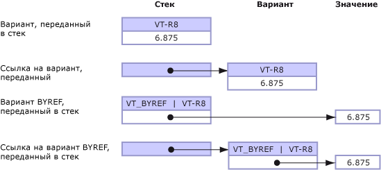

# Default Marshaling for Objects
Параметры и поля, приведенные к типу <xref:System.Object?displayProperty=fullName>, могут быть предоставлены неуправляемому коду как один из следующих типов:  
  
-   Тип variant, когда объект является параметром.  
  
-   Интерфейс, когда объект является полем структуры.  
  
 Маршалинг для объектных типов поддерживается только COM\-взаимодействием.  По умолчанию выполняется маршалинг объектов в типы variant модели COM.  Эти правила применимы только к типу **Object** и не применимы для объектов со строгим типом, производных из класса **Object**.  
  
 В данном разделе представлены следующие дополнительные сведения о маршалинге типов объектов.  
  
-   [Параметры маршалинга](#cpcondefaultmarshalingforobjectsanchor7)  
  
-   [Маршалинг объекта в интерфейс](#cpcondefaultmarshalingforobjectsanchor2)  
  
-   [Маршалинг объекта в тип Variant](#cpcondefaultmarshalingforobjectsanchor3)  
  
-   [Маршалинг типа Variant в объект](#cpcondefaultmarshalingforobjectsanchor4)  
  
-   [Маршалинг типа Variant по ссылке](#cpcondefaultmarshalingforobjectsanchor6)  
  
<a name="cpcondefaultmarshalingforobjectsanchor7"></a>   
## Параметры маршалинга  
 В следующей таблице показаны варианты маршалинга для типа данных **Object**.  Атрибут <xref:System.Runtime.InteropServices.MarshalAsAttribute> предоставляет определенные значения перечисления <xref:System.Runtime.InteropServices.UnmanagedType> для маршалинга объектов.  
  
|Тип перечисления|Описание неуправляемого формата|  
|----------------------|-------------------------------------|  
|**UnmanagedType.Struct**<br /><br /> \(параметры по умолчанию\)|Тип Variant в стиле COM.|  
|**UnmanagedType.Interface**|Если возможно — интерфейс **IDispatch**, в противном случае — интерфейс **IUnknown**.|  
|**UnmanagedType.IUnknown**<br /><br /> \(поля по умолчанию\)|Интерфейс **IUnknown**.|  
|**UnmanagedType.IDispatch**|Интерфейс **IDispatch**.|  
  
 В следующем примере показано соответствующее определение управляемого интерфейса для `MarshalObject`.  
  
```vb  
Interface MarshalObject  
   Sub SetVariant(o As Object)  
   Sub SetVariantRef(ByRef o As Object)  
   Function GetVariant() As Object  
  
   Sub SetIDispatch( <MarshalAs(UnmanagedType.IDispatch)> o As Object)  
   Sub SetIDispatchRef(ByRef <MarshalAs(UnmanagedType.IDispatch)> o _  
      As Object)  
   Function GetIDispatch() As <MarshalAs(UnmanagedType.IDispatch)> Object  
   Sub SetIUnknown( <MarshalAs(UnmanagedType.IUnknown)> o As Object)  
   Sub SetIUnknownRef(ByRef <MarshalAs(UnmanagedType.IUnknown)> o _  
      As Object)  
   Function GetIUnknown() As <MarshalAs(UnmanagedType.IUnknown)> Object  
End Interface  
  
```  
  
```csharp  
interface MarshalObject {  
   void SetVariant(Object o);  
   void SetVariantRef(ref Object o);  
   Object GetVariant();  
  
   void SetIDispatch ([MarshalAs(UnmanagedType.IDispatch)]Object o);  
   void SetIDispatchRef([MarshalAs(UnmanagedType.IDispatch)]ref Object o);  
   [MarshalAs(UnmanagedType.IDispatch)] Object GetIDispatch();  
   void SetIUnknown ([MarshalAs(UnmanagedType.IUnknown)]Object o);  
   void SetIUnknownRef([MarshalAs(UnmanagedType.IUnknown)]ref Object o);  
   [MarshalAs(UnmanagedType.IUnknown)] Object GetIUnknown();  
}  
```  
  
 Следующий код выполняет экспорт интерфейса `MarshalObject` в библиотеку типов.  
  
```  
interface MarshalObject {  
   HRESULT SetVariant([in] VARIANT o);  
   HRESULT SetVariantRef([in,out] VARIANT *o);  
   HRESULT GetVariant([out,retval] VARIANT *o)   
   HRESULT SetIDispatch([in] IDispatch *o);  
   HRESULT SetIDispatchRef([in,out] IDispatch **o);  
   HRESULT GetIDispatch([out,retval] IDispatch **o)   
   HRESULT SetIUnknown([in] IUnknown *o);  
   HRESULT SetIUnknownRef([in,out] IUnknown **o);  
   HRESULT GetIUnknown([out,retval] IUnknown **o)   
}  
```  
  
> [!NOTE]
>  Упаковщик взаимодействия после вызова автоматически освобождает любой объект, распределенный внутри типа Variant.  
  
 В следующем примере показан форматированный тип значения.  
  
```vb  
Public Structure ObjectHolder  
   Dim o1 As Object  
   <MarshalAs(UnmanagedType.IDispatch)> Public o2 As Object  
End Structure  
  
```  
  
```csharp  
public struct ObjectHolder {  
   Object o1;  
   [MarshalAs(UnmanagedType.IDispatch)]public Object o2;  
}  
```  
  
 В следующем коде выполняется экспорт форматированного типа в библиотеку типов.  
  
```  
struct ObjectHolder {  
   VARIANT o1;  
   IDispatch *o2;  
}  
```  
  
<a name="cpcondefaultmarshalingforobjectsanchor2"></a>   
## Маршалинг объекта в интерфейс  
 Когда объект предоставляется модели COM как интерфейс, этот интерфейс является интерфейсом класса для управляемого типа <xref:System.Object> \(интерфейс **\_Object**\).  Этот интерфейс в полученной библиотеке типов типизируется как **IDispatch** \([UnmanagedType.IDispatch](frlrfSystemRuntimeInteropServicesUnmanagedTypeClassTopic)\) или **IUnknown** \(**UnmanagedType.IUnknown**\).  COM\-клиенты могут динамически обращаться к членам управляемого класса или любым членам, реализованным его производными классами через интерфейс **\_Object**.  Клиент может также вызывать **QueryInterface** для получения любого другого интерфейса, в явном виде реализованного управляемым типом.  
  
<a name="cpcondefaultmarshalingforobjectsanchor3"></a>   
## Маршалинг объекта в тип Variant  
 При маршалинге объекта в тип Variant внутренний тип Variant определяется во время выполнения с использованием следующих правил:  
  
-   Если ссылка объекта равна null \(**Nothing** в Visual Basic\), выполняется маршалинг объекта в Variant типа **VT\_EMPTY**.  
  
-   Если объект — это экземпляр любого типа из перечисленных в следующей таблице, результирующий тип Variant определяется в соответствии с правилами, встроенными в упаковщик и показанными в таблице.  
  
-   Другие объекты, которым нужно явно управлять характеристиками маршалинга, могут реализовать интерфейс <xref:System.IConvertible>.  В этом случае тип Variant определяется кодом типа, возвращенным методом <xref:System.IConvertible.GetTypeCode%2A?displayProperty=fullName>.  В остальных случаях объект маршалируется как Variant типа **VT\_UNKNOWN**.  
  
### Маршалинг системных типов в тип Variant  
 В следующей таблице показаны типы управляемых объектов и соответствующие им типы Variant модели COM.  Преобразование этих типов выполняется, только когда сигнатура вызываемого метода относится к типу <xref:System.Object?displayProperty=fullName>.  
  
|Тип объекта|Тип Variant модели COM|  
|-----------------|----------------------------|  
|Ссылка на пустой объект \(**Nothing** в Visual Basic\).|**VT\_EMPTY**|  
|<xref:System.DBNull?displayProperty=fullName>|**VT\_NULL**|  
|<xref:System.Runtime.InteropServices.ErrorWrapper?displayProperty=fullName>|**VT\_ERROR**|  
|<xref:System.Reflection.Missing?displayProperty=fullName>|**VT\_ERROR** c **E\_PARAMNOTFOUND**|  
|<xref:System.Runtime.InteropServices.DispatchWrapper?displayProperty=fullName>|**VT\_DISPATCH**|  
|<xref:System.Runtime.InteropServices.UnknownWrapper?displayProperty=fullName>|**VT\_UNKNOWN**|  
|<xref:System.Runtime.InteropServices.CurrencyWrapper?displayProperty=fullName>|**VT\_CY**|  
|<xref:System.Boolean?displayProperty=fullName>|**VT\_BOOL**|  
|<xref:System.SByte?displayProperty=fullName>|**VT\_I1**|  
|<xref:System.Byte?displayProperty=fullName>|**VT\_UI1**|  
|<xref:System.Int16?displayProperty=fullName>|**VT\_I2**|  
|<xref:System.UInt16?displayProperty=fullName>|**VT\_UI2**|  
|<xref:System.Int32?displayProperty=fullName>|**VT\_I4**|  
|<xref:System.UInt32?displayProperty=fullName>|**VT\_UI4**|  
|<xref:System.Int64?displayProperty=fullName>|**VT\_I8**|  
|<xref:System.UInt64?displayProperty=fullName>|**VT\_UI8**|  
|<xref:System.Single?displayProperty=fullName>|**VT\_R4**|  
|<xref:System.Double?displayProperty=fullName>|**VT\_R8**|  
|<xref:System.Decimal?displayProperty=fullName>|**VT\_DECIMAL**|  
|<xref:System.DateTime?displayProperty=fullName>|**VT\_DATE**|  
|<xref:System.String?displayProperty=fullName>|**VT\_BSTR**|  
|<xref:System.IntPtr?displayProperty=fullName>|**VT\_INT**|  
|<xref:System.UIntPtr?displayProperty=fullName>|**VT\_UINT**|  
|<xref:System.Array?displayProperty=fullName>|**VT\_ARRAY**|  
  
 В следующем примере кода с использованием интерфейса `MarshalObject`, определенного в предыдущем примере, демонстрируется передача различных типов Variant в COM\-сервер.  
  
```vb  
Dim mo As New MarshalObject()  
mo.SetVariant(Nothing)         ' Marshal as variant of type VT_EMPTY.  
mo.SetVariant(System.DBNull.Value) ' Marshal as variant of type VT_NULL.  
mo.SetVariant(CInt(27))        ' Marshal as variant of type VT_I2.  
mo.SetVariant(CLng(27))        ' Marshal as variant of type VT_I4.  
mo.SetVariant(CSng(27.0))      ' Marshal as variant of type VT_R4.  
mo.SetVariant(CDbl(27.0))      ' Marshal as variant of type VT_R8.  
  
```  
  
```csharp  
MarshalObject mo = new MarshalObject();  
mo.SetVariant(null);            // Marshal as variant of type VT_EMPTY.  
mo.SetVariant(System.DBNull.Value); // Marshal as variant of type VT_NULL.  
mo.SetVariant((int)27);          // Marshal as variant of type VT_I2.  
mo.SetVariant((long)27);          // Marshal as variant of type VT_I4.  
mo.SetVariant((single)27.0);   // Marshal as variant of type VT_R4.  
mo.SetVariant((double)27.0);   // Marshal as variant of type VT_R8.  
```  
  
 Маршалинг COM\-типов, для которых отсутствуют соответствующие управляемые типы, может быть выполнен с помощью классов\-оболочек, таких как <xref:System.Runtime.InteropServices.ErrorWrapper>, <xref:System.Runtime.InteropServices.DispatchWrapper>, <xref:System.Runtime.InteropServices.UnknownWrapper> и <xref:System.Runtime.InteropServices.CurrencyWrapper>.  В следующем примере кода демонстрируется использование этих оболочек для передачи различных типов Variant COM\-серверу.  
  
```vb  
Imports System.Runtime.InteropServices  
' Pass inew as a variant of type VT_UNKNOWN interface.  
mo.SetVariant(New UnknownWrapper(inew))  
' Pass inew as a variant of type VT_DISPATCH interface.  
mo.SetVariant(New DispatchWrapper(inew))  
' Pass a value as a variant of type VT_ERROR interface.  
mo.SetVariant(New ErrorWrapper(&H80054002))  
' Pass a value as a variant of type VT_CURRENCY interface.  
mo.SetVariant(New CurrencyWrapper(New Decimal(5.25)))  
  
```  
  
```csharp  
using System.Runtime.InteropServices;  
// Pass inew as a variant of type VT_UNKNOWN interface.  
mo.SetVariant(new UnknownWrapper(inew));  
// Pass inew as a variant of type VT_DISPATCH interface.  
mo.SetVariant(new DispatchWrapper(inew));  
// Pass a value as a variant of type VT_ERROR interface.  
mo.SetVariant(new ErrorWrapper(0x80054002));  
// Pass a value as a variant of type VT_CURRENCY interface.  
mo.SetVariant(new CurrencyWrapper(new Decimal(5.25)));  
```  
  
 Классы программы\-оболочки определяются в пространстве имен <xref:System.Runtime.InteropServices>.  
  
### Маршалинг интерфейса IConvertible в тип Variant  
 Типы, отличающиеся от перечисленных в предыдущем разделе, могут управлять своим маршалингом, реализуя интерфейс <xref:System.IConvertible>.  Если объект реализует интерфейс **IConvertible**, тип Variant модели COM определяется во время выполнения значением перечисления <xref:System.TypeCode>, возвращенным методом <xref:System.IConvertible.GetTypeCode%2A?displayProperty=fullName>.  
  
 В следующей таблице показаны возможные значения перечисления **TypeCode** и соответствующие типы Variant модели СОМ для каждого из этих значений.  
  
|TypeCode|Тип Variant модели COM|  
|--------------|----------------------------|  
|**TypeCode.Empty**|**VT\_EMPTY**|  
|**TypeCode.Object**|**VT\_UNKNOWN**|  
|**TypeCode.DBNull**|**VT\_NULL**|  
|**TypeCode.Boolean**|**VT\_BOOL**|  
|**TypeCode.Char**|**VT\_UI2**|  
|**TypeCode.Sbyte**|**VT\_I1**|  
|**TypeCode.Byte**|**VT\_UI1**|  
|**TypeCode.Int16**|**VT\_I2**|  
|**TypeCode.UInt16**|**VT\_UI2**|  
|**TypeCode.Int32**|**VT\_I4**|  
|**TypeCode.UInt32**|**VT\_UI4**|  
|**TypeCode.Int64**|**VT\_I8**|  
|**TypeCode.UInt64**|**VT\_UI8**|  
|**TypeCode.Single**|**VT\_R4**|  
|**TypeCode.Double**|**VT\_R8**|  
|**TypeCode.Decimal**|**VT\_DECIMAL**|  
|**TypeCode.DateTime**|**VT\_DATE**|  
|**TypeCode.String**|**VT\_BSTR**|  
|Не поддерживается.|**VT\_INT**|  
|Не поддерживается.|**VT\_UINT**|  
|Не поддерживается.|**VT\_ARRAY**|  
|Не поддерживается.|**VT\_RECORD**|  
|Не поддерживается.|**VT\_CY**|  
|Не поддерживается.|**VT\_VARIANT**|  
  
 Значение типа Variant модели COM определяется с помощью вызова интерфейса **IConvertible.To** *Тип*, где **To** *Тип* — это процедура преобразования, соответствующая типу, который был возвращен из интерфейса **IConvertible.GetTypeCode**.  Например, объект, возвращающий **TypeCode.Double** из **IConvertible.GetTypeCode**, маршалируется как тип Variant **VT\_R8** модели COM.  Значение типа Variant \(хранящееся в поле **dblVal** типа Variant модели COM variant\) можно получить, выполняя приведение к интерфейсу **IConvertible** и вызывая метод <xref:System.IConvertible.ToDouble%2A>.  
  
<a name="cpcondefaultmarshalingforobjectsanchor4"></a>   
## Маршалинг типа Variant в объект  
 При маршалинге типа Variant в объект тип \(и иногда значение\) маршалируемого типа Variant определяет тип получаемого объекта.  В следующей таблице показаны каждый тип Variant и тип соответствующего объекта, создаваемого упаковщиком при передаче типа Variant из COM в .NET Framework.  
  
|Тип Variant модели COM|Тип объекта|  
|----------------------------|-----------------|  
|**VT\_EMPTY**|Ссылка на пустой объект \(**Nothing** в Visual Basic\).|  
|**VT\_NULL**|<xref:System.DBNull?displayProperty=fullName>|  
|**VT\_DISPATCH**|**System.\_\_ComObject** или null, если \(pdispVal \=\= null\)|  
|**VT\_UNKNOWN**|**System.\_\_ComObject** или null, если \(punkVal \=\= null\)|  
|**VT\_ERROR**|<xref:System.UInt32?displayProperty=fullName>|  
|**VT\_BOOL**|<xref:System.Boolean?displayProperty=fullName>|  
|**VT\_I1**|<xref:System.SByte?displayProperty=fullName>|  
|**VT\_UI1**|<xref:System.Byte?displayProperty=fullName>|  
|**VT\_I2**|<xref:System.Int16?displayProperty=fullName>|  
|**VT\_UI2**|<xref:System.UInt16?displayProperty=fullName>|  
|**VT\_I4**|<xref:System.Int32?displayProperty=fullName>|  
|**VT\_UI4**|<xref:System.UInt32?displayProperty=fullName>|  
|**VT\_I8**|<xref:System.Int64?displayProperty=fullName>|  
|**VT\_UI8**|<xref:System.UInt64?displayProperty=fullName>|  
|**VT\_R4**|<xref:System.Single?displayProperty=fullName>|  
|**VT\_R8**|<xref:System.Double?displayProperty=fullName>|  
|**VT\_DECIMAL**|<xref:System.Decimal?displayProperty=fullName>|  
|**VT\_DATE**|<xref:System.DateTime?displayProperty=fullName>|  
|**VT\_BSTR**|<xref:System.String?displayProperty=fullName>|  
|**VT\_INT**|<xref:System.Int32?displayProperty=fullName>|  
|**VT\_UINT**|<xref:System.UInt32?displayProperty=fullName>|  
|**VT\_ARRAY** &#124; **VT\_\***|<xref:System.Array?displayProperty=fullName>|  
|**VT\_CY**|<xref:System.Decimal?displayProperty=fullName>|  
|**VT\_RECORD**|Соответствующий тип упакованного значения.|  
|**VT\_VARIANT**|Не поддерживается.|  
  
 Типы Variant, переданные из COM в управляемый код и затем обратно в COM, могут не сохранять исходный тип Variant в течение вызова.  Рассмотрим, что произойдет при передаче типа Variant **VT\_DISPATCH** из COM в .NET Framework.  При маршалинге тип Variant преобразуется в <xref:System.Object?displayProperty=fullName>.  Если затем этот **Object** передается назад в COM, при маршалинге он преобразуется в тип Variant **VT\_UNKNOWN**.  Нет никаких гарантий, что тип Variant, созданный при маршалинге объекта из управляемого кода в COM, будет совпадать с типом variant, первоначально использованным для получения этого объекта.  
  
<a name="cpcondefaultmarshalingforobjectsanchor6"></a>   
## Маршалинг типа Variant по ссылке  
 Хотя сами типы Variant можно передавать по значению или по ссылке, с любым типом Variant можно также использовать флаг **VT\_BYREF** для указания, что содержимое данного типа передается по ссылке, а не по значению.  Различия между маршалингом типа Variant по ссылке и маршалингом типа Variant с установленным флагом **VT\_BYREF** могут привести к путанице.  Эти различия разъясняются на следующем рисунке.  
  
   
Передача типа Variant по значению и по ссылке  
  
 **Стандартные характеристики маршалинга объектов и типов Variant по значению**  
  
-   При передаче объектов из управляемого кода в COM содержимое объекта копируется в новый тип Variant, созданный упаковщиком, в соответствии с правилами, определенными в разделе [Маршалинг объекта в тип Variant](#cpcondefaultmarshalingforobjectsanchor3).  При возврате из вызова изменения типа Variant на неуправляемой стороне не распространяются обратно в исходный объект.  
  
-   При передаче значений типов Variant из COM в управляемый код содержимое типа Variant копируется в новый объект, созданный в соответствии с правилами, определенными в разделе [Маршалинг типа Variant в объект](#cpcondefaultmarshalingforobjectsanchor4).  При возврате из вызова изменения объекта на управляемой стороне не распространяются назад в исходный тип Variant.  
  
 **Стандартные характеристики маршалинга объектов и типов Variant по ссылке**  
  
 Чтобы изменения могли передаваться назад в вызывающий объект, параметры необходимо передавать по ссылке.  Например, для передачи параметров по ссылке можно использовать ключевое слово **ref** в C\# \(или **ByRef** в управляемом коде Visual Basic\).  В COM ссылочные параметры передаются с использованием указателя, например **variant \***.  
  
-   При передаче объекта в COM по ссылке упаковщик создает новый тип Variant и перед вызовом копирует содержимое ссылочного объекта в тип Variant.  Этот тип Variant передается в неуправляемую функцию, в которой пользователь может свободно изменять содержимое этого типа Variant.  При возврате из вызова изменения, сделанные в типе Variant на неуправляемой стороне, распространяются обратно в исходный объект.  Если тип этого объекта Variant отличается от типа объекта Variant, переданного в вызов, изменения передаются обратно в объект другого типа.  Т.е. тип объекта, переданного в вызов, может отличаться от типа объекта, возвращенного из этого вызова.  
  
-   При передаче объекта Variant в управляемый код по ссылке упаковщик создает новый объект и перед вызовом копирует в него содержимое объекта Variant.  Ссылка на этот объект передается в управляемую функцию, в которой пользователь может свободно изменять этот объект.  При возврате из вызова изменения, сделанные в ссылочном объекте, передаются назад в исходный объект Variant.  Если тип этого объекта отличается от типа объекта, переданного в вызов, тип исходного объекта Variant изменяется и значение возвращается в этот измененный объект Variant.  И снова, тип объекта Variant, переданного в вызов, может отличаться от типа объекта Variant, возвращенного из этого вызова.  
  
 **Стандартные характеристики маршалинга типа Variant с установленным флагом VT\_BYREF**  
  
-   Для объекта типа Variant, переданного в управляемый код по значению, может быть установлен флаг **VT\_BYREF**, показывающий, что этот объект типа Variant содержит не значение, а ссылку.  В этом случае маршалинг объекта типа Variant все еще выполняется в объект, потому что этот объект типа Variant передан по значению.  Упаковщик автоматически разыменовывает содержимое объекта типа Variant и перед вызовом копирует его в заново созданный объект.  Затем этот объект передается в управляемую функцию, но при возврате из вызова объект не передается обратно в исходный объект типа variant.  Изменения, сделанные в управляемом объекте, теряются.  
  
    > [!CAUTION]
    >  Не существует способа изменить значение объекта типа Variant, переданного по значению, даже если для него установлен флаг **VT\_BYREF**.  
  
-   Для объекта типа Variant, переданного в управляемый код по ссылке, может также быть установлен флаг **VT\_BYREF**, показывающий, что этот объект типа Variant содержит другую ссылку.  В этом случае маршалинг такого объекта типа Variant выполняется в объект **ref**, потому что этот объект типа Variant передан по ссылке.  Упаковщик автоматически разыменовывает содержимое объекта типа Variant и перед вызовом копирует его в заново созданный объект.  При возврате из вызова значение этого объекта передается обратно по ссылке в исходном объекте типа Variant, только если тип этого объекта совпадает с типом объекта, переданного в вызов.  Т. е. обратная передача не изменяет тип Variant с установленным флагом **VT\_BYREF**.  Если тип этого объекта изменяется в течение вызова, при возвращении из вызова происходит исключение <xref:System.InvalidCastException>.  
  
 В следующей таблице приведены правила распространения для типов Variant и объектов.  
  
|Исходный тип|Целевой тип|Изменения передаются обратно|  
|------------------|-----------------|----------------------------------|  
|**Variant**  *v*|**Object**  *o*|Никогда|  
|**Object**  *o*|**Variant**  *v*|Никогда|  
|**Variant**   ***\****  *pv*|**Ref Object**  *o*|Всегда|  
|**Ref object**  *o*|**Variant**   ***\****  *pv*|Всегда|  
|**Variant**  *v* **\(VT\_BYREF** *&#124;*  **VT\_\*\)**|**Object**  *o*|Никогда|  
|**Variant**  *v* **\(VT\_BYREF** *&#124;*  **VT\_\)**|**Ref Object**  *o*|Только если тип не был изменен.|  
  
## См. также  
 [Default Marshaling Behavior](../../../docs/framework/interop/default-marshaling-behavior.md)   
 [Blittable and Non\-Blittable Types](../../../docs/framework/interop/blittable-and-non-blittable-types.md)   
 [Directional Attributes](http://msdn.microsoft.com/ru-ru/241ac5b5-928e-4969-8f58-1dbc048f9ea2)   
 [Copying and Pinning](../../../docs/framework/interop/copying-and-pinning.md)