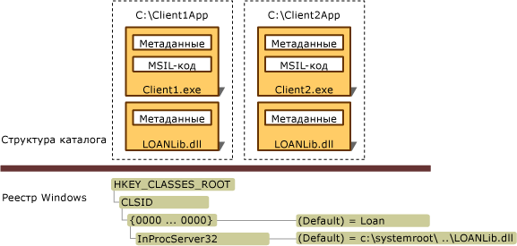

# Развертывание приложения взаимодействияDeploying an Interop Application
Приложения взаимодействия обычно включают клиентскую сборку .NET, одну или несколько сборок взаимодействия (представляющих различные библиотеки типов COM) и один или несколько зарегистрированных COM-компонентов.An interop application typically includes a .NET client assembly, one or more interop assemblies representing distinct COM type libraries, and one or more registered COM components. В Visual Studio и [!INCLUDE[winsdklong](../../../includes/winsdklong-md.md)] представлены средства для импорта и преобразования библиотеки типов в сборку взаимодействия, которые описываются в разделе [Импорт библиотеки типов в виде сборки](../../../docs/framework/interop/importing-a-type-library-as-an-assembly.md).Visual Studio and the [!INCLUDE[winsdklong](../../../includes/winsdklong-md.md)] provide tools to import and convert a type library to an interop assembly, as discussed in [Importing a Type Library as an Assembly](../../../docs/framework/interop/importing-a-type-library-as-an-assembly.md). Приложение взаимодействия можно развернуть двумя способами:There are two ways to deploy an interop application:  
  
-   С помощью встроенных типов взаимодействия. Начиная с версии [!INCLUDE[net_v40_long](../../../includes/net-v40-long-md.md)], можно указать компилятору внедрять сведения о типах из сборки взаимодействия в исполняемый файл.By using embedded interop types: Beginning with the [!INCLUDE[net_v40_long](../../../includes/net-v40-long-md.md)], you can instruct the compiler to embed type information from an interop assembly into your executable. Компилятор внедряет только сведения о типе, используемые приложением.The compiler embeds only the type information that your application uses. Не требуется развертывать сборку взаимодействия с приложением.You do not have to deploy the interop assembly with your application. Это рекомендуемая методика.This is the recommended technique.  
  
-   Развертывание сборок взаимодействия. Можно создать стандартную ссылку на сборку взаимодействия.By deploying interop assemblies: You can create a standard reference to an interop assembly. В этом случае сборки взаимодействия должны быть развернуты вместе с приложением.In this case, the interop assembly must be deployed with your application. Если вы применяете эту методику и не используете частный COM-компонент, всегда ссылайтесь на основную сборку взаимодействия (PIA), опубликованную автором COM-компонента, который планируется включить в управляемый код.If you employ this technique, and you are not using a private COM component, always reference the primary interop assembly (PIA) published by the author of the COM component you intend to incorporate in your managed code. Дополнительные сведения о создании и использовании основных сборок взаимодействия см. в разделе [Основные сборки взаимодействия](http://msdn.microsoft.com/en-us/b977a8be-59a0-40a0-a806-b11ffba5c080).For more information about producing and using primary interop assemblies, see [Primary Interop Assemblies](http://msdn.microsoft.com/en-us/b977a8be-59a0-40a0-a806-b11ffba5c080).  
  
 Если вы используете встроенные типы взаимодействия, развертывание осуществляется очень просто.If you use embedded interop types, deployment is simple and straightforward. В этом случае никаких особых действий с вашей стороны не требуется.There is nothing special you need to do. Далее в этой статье описываются сценарии развертывания сборок взаимодействия с приложением.The rest of this article describes the scenarios for deploying interop assemblies with your application.  
  
## Развертывание сборок взаимодействияDeploying Interop Assemblies  
 Сборки могут иметь строгие имена.Assemblies can have strong names. Сборка со строгим именем содержит открытый ключ издателя, предоставляющий уникальный идентификатор.A strong-named assembly includes the publisher's public key, which provides a unique identity. Сборки, созданные с помощью [средства импорта библиотек (Tlbimp.exe)](../../../docs/framework/tools/tlbimp-exe-type-library-importer.md), могут подписываться издателем с использованием параметра **/keyfile**.Assemblies that are produced by the [Type Library Importer (Tlbimp.exe)](../../../docs/framework/tools/tlbimp-exe-type-library-importer.md) can be signed by the publisher by using the **/keyfile** option. Подписанные сборки можно устанавливать в глобальный кэш сборок.You can install signed assemblies into the global assembly cache. Неподписанные сборки необходимо устанавливать на компьютер пользователя в виде частных сборок.Unsigned assemblies must be installed on the user's machine as private assemblies.  
  
### Частные сборкиPrivate Assemblies  
 Чтобы установить сборку, предназначенную для частного использования, необходимо установить в одну структуру каталогов исполняемый файл приложения и сборку взаимодействия, содержащую импортированные COM-типы.To install an assembly to be used privately, both the application executable and the interop assembly that contains imported COM types must be installed in the same directory structure. На следующем рисунке показана неподписанная сборка взаимодействия, которая предназначена для частного использования приложениями Client1.exe и Client2.exe, располагающимися в разных каталогах приложения.The following illustration shows an unsigned interop assembly to be used privately by Client1.exe and Client2.exe, which reside in separate application directories. Сборка взаимодействия (в этом примере LOANLib.dll) устанавливается дважды.The interop assembly, which is called LOANLib.dll in this example, is installed twice.  
  
   
Структура каталогов и записи реестра для частного развертыванияDirectory structure and registry entries for a private deployment  
  
 Все COM-компоненты, связанные с приложением, должны устанавливаться в реестр Windows.All COM components associated with the application must be installed in the Windows registry. Если приложения Client1.exe и Client2.exe, показанные на рисунке, установлены на разных компьютерах, необходимо зарегистрировать COM-компоненты на обоих компьютерах.If Client1.exe and Client2.exe in the illustration are installed on different computers, you must register the COM components on both computers.  
  
### Общие сборкиShared Assemblies  
 Сборки, которые являются общими для нескольких приложений, необходимо устанавливать в централизованный репозиторий, который называется глобальным кэшем сборок.Assemblies that are shared by multiple applications should be installed in a centralized repository called the global assembly cache. Клиенты .NET могут обращаться к одной копии сборки взаимодействия, которая подписана и установлена в глобальный кэш сборок..NET clients can access the same copy of the interop assembly, which is signed and installed in the global assembly cache. Дополнительные сведения о создании и использовании основных сборок взаимодействия см. в разделе [Основные сборки взаимодействия](http://msdn.microsoft.com/en-us/b977a8be-59a0-40a0-a806-b11ffba5c080).For more information about producing and using primary interop assemblies, see [Primary Interop Assemblies](http://msdn.microsoft.com/en-us/b977a8be-59a0-40a0-a806-b11ffba5c080).  
  
## См. такжеSee Also  
 [Предоставление COM-компонентов платформе .NET FrameworkExposing COM Components to the .NET Framework](../../../docs/framework/interop/exposing-com-components.md)  
 [Импорт библиотеки типов в виде сборкиImporting a Type Library as an Assembly](../../../docs/framework/interop/importing-a-type-library-as-an-assembly.md)  
 [Использование типов COM в управляемом кодеUsing COM Types in Managed Code](http://msdn.microsoft.com/en-us/1a95a8ca-c8b8-4464-90b0-5ee1a1135b66)  
 [Компиляция проекта, использующего взаимодействиеCompiling an Interop Project](../../../docs/framework/interop/compiling-an-interop-project.md)
