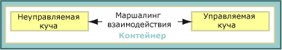
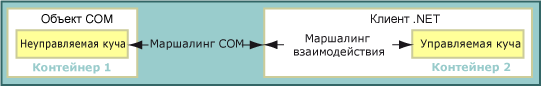
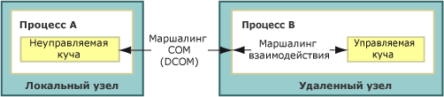
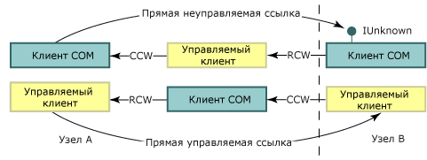
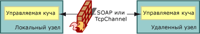

# Маршалинг взаимодействия
 Маршалинг взаимодействия определяет, как данные передаются в аргументах и возвращаемых значениях методов между управляемой и неуправляемой памятью во время вызовов. Маршалинг взаимодействия — это процесс времени выполнения, выполняемый службой маршалинга среды CLR.  
  
 Представление большинства типов данных является общим как в управляемой, так и в неуправляемой памяти. Эти типы обрабатываются упаковщиком взаимодействия. Другие типы могут иметь неоднозначное представление или могут вообще не быть представленными в управляемой памяти.  
  
 У неоднозначного типа может либо быть несколько представлений в неуправляемом коде, сопоставленных с одним управляемым типом, либо у него могут отсутствовать сведения о типе, такие как размер массива. Для неоднозначных типов упаковщик обеспечивает представление по умолчанию и альтернативные представления, если существует несколько представлений. Упаковщику можно предоставить явные инструкции по маршалингу неоднозначного типа.  
  
 Обзор включает следующие разделы.  
  
-   [Вызов платформы и модели взаимодействия COM](#platform_invoke_and_com_interop_models)  
  
-   [Маршалинг и подразделения COM](#marshaling_and_com_apartments)  
  
-   [Маршалинг удаленных вызовов](#marshaling_remote_calls)  
  
-   [См. также](#related_topics)  
  
-   [Ссылки](#reference)  
  
   
## Вызов платформы и модели взаимодействия COM  
 Среда CLR предоставляет два механизма взаимодействия с неуправляемым кодом.  
  
-   Вызов неуправляемого кода, позволяющий управляемому коду вызывать функции, экспортированные из неуправляемой библиотеки.  
  
-   COM-взаимодействие, позволяющее управляемому коду взаимодействовать с COM-объектами с помощью интерфейсов.  
  
 И вызов неуправляемого кода, и COM-взаимодействие используют механизм маршалинга взаимодействия для точной передачи аргументов метода между вызываемым и вызывающим объектами и при необходимости обратно. Как показано на схеме ниже, за исключением использования [функций обратного вызова](../../../docs/framework/interop/callback-functions.md) метод вызова неуправляемого кода всегда вызывается в направлении от управляемого к неуправляемому коду, а не наоборот. Хотя вызовы неуправляемого кода могут выполняться только от управляемого к неуправляемому коду, данные могут передаваться в обоих направлениях в виде параметров ввода или вывода. Вызовы метода COM-взаимодействия могут проходить в обоих направлениях.  
  
   
Направление вызовов неуправляемого кода и COM-взаимодействия  
  
 На самом нижнем уровне оба механизма используют одну и ту же службу маршалинга. Однако некоторые типы данных поддерживаются только COM-взаимодействием или только вызовом неуправляемого кода. Подробнее см. в разделе [Характеристики маршалинга по умолчанию](../../../docs/framework/interop/default-marshaling-behavior.md).  
  
 [К началу](#top)  
  
   
## Маршалинг и подразделения COM  
 Упаковщик взаимодействия маршалирует данные между кучей среды CLR и неуправляемой кучей. Маршалинг происходит всегда, когда вызывающий и вызываемый объекты не могут работать с одним и тем же экземпляром данных. Благодаря упаковщику взаимодействия вызывающий и вызываемый объекты могут считать, что они работают с одними и теми же данными, даже если каждый из них использует собственную их копию.  
  
 В COM также имеется упаковщик, который маршалирует данные между подразделениями COM или различными процессами COM. При вызове между управляемым и неуправляемым кодом в пределах одного подразделения COM задействуется только упаковщик взаимодействия. При вызове между управляемым и неуправляемым кодом в разных подразделениях COM или разных процессах задействуются и упаковщик взаимодействия, и упаковщик COM.  
  
### Клиенты COM и управляемые серверы  
 Для экспортированного управляемого сервера с библиотекой типов, зарегистрированной с помощью [средства регистрации сборок (Regasm.exe)](../../../docs/framework/tools/regasm-exe-assembly-registration-tool.md), существует запись реестра `ThreadingModel` со значением `Both`. Это значение показывает, что данный сервер можно активировать как в однопотоковом подразделении (STA), так и в многопотоковом подразделении (MTA). Как показано в таблице ниже, серверный объект создается в том же подразделении, что и вызывающий объект.  
  
|Клиент COM|Сервер .NET|Требования к маршалингу|  
|----------------|-----------------|-----------------------------|  
|STA|`Both` становится STA.|Маршалинг в том же подразделении.|  
|MTA|`Both` становится MTA.|Маршалинг в том же подразделении.|  
  
 Так как клиент и сервер находятся в одном и том же подразделении, служба маршалинга взаимодействия автоматически обрабатывает все маршалируемые данные. На рисунке ниже показана работа службы маршалинга взаимодействия между управляемой и неуправляемой кучами в одном и том же подразделении стиля COM.  
  
   
Процесс маршалинга в одном и том же подразделении  
  
 Если планируется экспортировать управляемый сервер, учтите, что клиент COM определяет подразделение сервера. Управляемый сервер, вызванный клиентом COM, инициализированным в многопотоковом подразделении, должен обеспечить потокобезопасность.  
  
### Управляемые клиенты и COM-серверы  
 По умолчанию для управляемого клиента используется многопотоковое подразделение, однако тип приложения клиента .NET может изменить эту настройку. Например, настройкой для подразделения клиента [!INCLUDE[vbprvblong](../../../includes/vbprvblong-md.md)] является однопотоковое подразделение. Для проверки и изменения настройки подразделения для управляемого клиента можно использовать атрибут <xref:System.STAThreadAttribute?displayProperty=fullName>, атрибут <xref:System.MTAThreadAttribute?displayProperty=fullName>, свойство <xref:System.Threading.Thread.ApartmentState%2A?displayProperty=fullName> или свойство <xref:System.Web.UI.Page.AspCompatMode%2A?displayProperty=fullName>.  
  
 Автор компонента настраивает сходство потоков COM-сервера. В таблице ниже показаны сочетания параметров подразделения для клиентов .NET и COM-серверов. Для этих сочетаний также показаны итоговые требования к маршалингу.  
  
|Клиент .NET|COM-сервер|Требования к маршалингу|  
|-----------------|----------------|-----------------------------|  
|MTA (по умолчанию)|MTA   STA|Маршалинг взаимодействия.   Маршалинг взаимодействия и маршалинг COM.|  
|STA|MTA   STA|Маршалинг взаимодействия и маршалинг COM.   Маршалинг взаимодействия.|  
  
 Когда управляемый клиент и неуправляемый сервер находятся в одном и том же подразделении, служба маршалинга взаимодействия обрабатывает все маршалируемые данные. Но если клиент и сервер инициализированы в разных подразделениях, также требуется маршалинг COM. На схеме ниже показаны элементы вызова между подразделениями.  
  
   
Вызов между клиентом .NET и COM-объектом, находящимися в разных подразделениях  
  
 Для маршалинга между подразделениями можно выполнить следующее:  
  
-   Согласиться на дополнительные издержки маршалинга между подразделениями, которые становятся заметными только в случае, когда границу пересекает много вызовов. Чтобы вызовы успешно пересекали границу подразделения, необходимо зарегистрировать библиотеку типов COM-компонента.  
  
-   Изменить основной поток, выбрав для клиентского потока однопотоковое или многопотоковое подразделение. Например, если клиент C# вызывает много COM-компонентов однопотоковых подразделений, можно избежать маршалинга между подразделениями, задав для основного потока однопотоковое подразделение.  
  
    > [!NOTE]
    >  Как только для потока клиента C# задается однопотоковое подразделение, для вызова COM-компонентов многопотоковых подразделений потребуется маршалинг между подразделениями.  
  
 Инструкции по выбору модели подразделения в явном виде см. в разделе [Управляемые и неуправляемые потоки](http://msdn.microsoft.com/en-us/db425c20-4b2f-4433-bf96-76071c7881e5).  
  
 [К началу](#top)  
  
   
## Маршалинг удаленных вызовов  
 При маршалинге между подразделениями маршалинг COM используется в каждом вызове между управляемым и неуправляемым кодом, если объекты находятся в отдельных процессах. Например:  
  
-   Клиент COM, обращающийся к управляемому серверу на удаленном компьютере, использует DCOM.  
  
-   Управляемый клиент, обращающийся к СОМ-серверу на удаленном компьютере, использует DCOM.  
  
 На схеме ниже показано, как маршалинг взаимодействия и маршалинг COM обеспечивают каналы связи через границы между процессами и узлами.  
  
   
Маршалинг между процессами  
  
### Сохранение идентификаторов  
 Среда CLR сохраняет идентификаторы управляемых и неуправляемых ссылок. На схеме ниже показан поток прямых неуправляемых ссылок (верхняя строка) и прямых управляемых ссылок (нижняя строка) через границы между процессами и узлами.  
  
   
Передача ссылок через границы между процессами и узлами  
  
 На этой схеме:  
  
-   Неуправляемый клиент получает ссылку на COM-объект от управляемого объекта, получившего эту ссылку от удаленного узла. Механизмом удаленного взаимодействия является DCOM.  
  
-   Управляемый клиент получает ссылку на управляемый объект от COM-объекта, получившего эту ссылку от удаленного узла. Механизмом удаленного взаимодействия является DCOM.  
  
    > [!NOTE]
    >  Экспортированная библиотека типов управляемого сервера должна быть зарегистрирована.  
  
 Число границ процессов между вызывающим и вызываемым объектами несущественно; одни и те же прямые ссылки используются для вызовов, входящих в процессы и исходящих из них.  
  
### Управляемое удаленное взаимодействие  
 Среда выполнения также обеспечивает управляемое удаленное взаимодействие, которое можно использовать для установления канала связи между управляемыми объектами через границы между процессами и узлами. Управляемое удаленное взаимодействие может предусматривать брандмауэр между связывающимися друг с другом компонентами, как показано на схеме ниже.  
  
   
Удаленные вызовы через брандмауэры с использованием SOAP или класса TcpChannel  
  
 Некоторые неуправляемые вызовы, например вызовы между [обслуживаемыми COM-компонентами](http://msdn.microsoft.com/en-us/f109ee24-81ad-4d99-9892-51ac6f34978c), могут проводиться через SOAP.  
  
 [К началу](#top)  
  
   
## Связанные разделы  
  
|Заголовок|Описание|  
|-----------|-----------------|  
|[Характеристики маршалинга по умолчанию](../../../docs/framework/interop/default-marshaling-behavior.md)|Описываются правила, используемые службой маршалинга взаимодействия для маршалинга данных.|  
|[Маршалинг данных при вызове неуправляемого кода](../../../docs/framework/interop/marshaling-data-with-platform-invoke.md)|Описывается способ объявления параметров метода и передачи аргументов в функции, экспортируемые неуправляемыми библиотеками.|  
|[Маршалинг данных с помощью COM- взаимодействия](../../../docs/framework/interop/marshaling-data-with-com-interop.md)|Описывается настройка оболочек COM для изменения характеристик маршалинга.|  
|[Практическое руководство. Миграция DCOM с управляемым кодом в WCF](../../../docs/framework/interop/how-to-migrate-managed-code-dcom-to-wcf.md)|Описывается переход с модели DCOM на WCF.|  
|[Практическое руководство. Сопоставление значений HRESULT и исключений](../../../docs/framework/interop/how-to-map-hresults-and-exceptions.md)|Описывается, как сопоставить настраиваемые исключения со значениями HRESULT, и приводится полный перечень сопоставлений значений HRESULT с соответствующими классами исключений платформы .NET Framework.|  
|[Взаимодействие с помощью универсальных типов](http://msdn.microsoft.com/en-us/26b88e03-085b-4b53-94ba-a5a9c709ce58)|Описываются действия, поддерживаемые при использовании универсальных типов для взаимодействия COM.|  
|[Взаимодействие с неуправляемым кодом](../../../docs/framework/interop/index.md)|Описываются службы взаимодействия, предоставляемые средой CLR.|  
|[Расширенное COM-взаимодействие](http://msdn.microsoft.com/en-us/3ada36e5-2390-4d70-b490-6ad8de92f2fb)|Приводятся ссылки на дополнительные сведения о включении COM-компонентов в разрабатываемое приложение .NET Framework.|  
|[Вопросы разработки для взаимодействия](http://msdn.microsoft.com/en-us/b59637f6-fe35-40d6-ae72-901e7a707689)|Приводятся советы по написанию кода встроенных COM-компонентов.|  
  
 [К началу](#top)  
  
   
## Ссылки  
 <xref:System.Runtime.InteropServices?displayProperty=fullName>  
  
 [К началу](#top)

