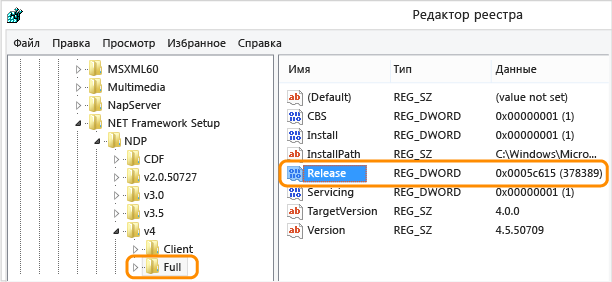

# <a name="how-to-determine-which-net-framework-versions-are-installed"></a>Практическое руководство. Определение установленных версий платформы .NET Framework

На компьютере можно [установить](../install/index.md) и запустить несколько версий платформы .NET Framework. При разработке или развертывании приложения могут потребоваться сведения о том, какие версии .NET Framework установлены на компьютере пользователя.

Платформа .NET Framework состоит из двух основных компонентов, версии которым присваиваются отдельно:

- набор сборок, которые являются коллекциями типов и ресурсов, обеспечивающих функции приложений (.NET Framework и сборкам назначается один номер версии);

- среда CLR, которая выполняет код приложения и управляет им. CLR имеет собственный номер версии (см. статью о [версиях и зависимостях](versions-and-dependencies.md)).

> [!NOTE]
> В каждой новой версии платформы .NET Framework сохранены функции предыдущих версий и добавлены новые функции. Можно загружать несколько версий платформы .NET Framework на одном компьютере одновременно. Это значит, что можно установить платформу .NET Framework, не удаляя предыдущие версии. Обычно не рекомендуется удалять предыдущие версии .NET Framework, так как используемое приложение может зависеть от конкретной версии .NET Framework и удаление платформы приведет к сбою в его работе.
>
> Существует разница между версией .NET Framework и версией общеязыковой среды выполнения (CLR).
>
> - Версия .NET Framework зависит от набора сборок, которые образуют библиотеку классов .NET Framework. Например, версии .NET Framework включают в себя 4.5, 4.6.1 и 4.7.2.
> - Версия среды CLR зависит от среды выполнения, в которой выполняются приложения .NET Framework. Одна версия среды CLR обычно поддерживает несколько версий .NET Framework. Например, среда CLR версии 4.0.30319.*xxxxx* поддерживает .NET Framework версии с 4 по 4.5.2, где *xxxxx* меньше 42000, а среда CLR версии 4.0.30319.42000 поддерживает .NET Framework, начиная с версии 4.6.
>
> Дополнительные сведения о версиях см. в статье [Версии и зависимости платформы .NET Framework](versions-and-dependencies.md).

Реестр содержит список версий .NET Framework, установленных на компьютере. Вы можете просмотреть реестр в редакторе реестра или отправить запрос с помощью кода:

- Поиск .NET Framework 4.5 и более поздних версий:

  - [Поиск версий .NET Framework с помощью редактора реестра](#net_b)
  - [Запрос версий .NET Framework из реестра с помощью кода](#net_d)
  - [Запрос версий .NET Framework из реестра с помощью PowerShell](#ps_a)

- Поиск более ранних версий .NET Framework (1–4):

  - [Поиск версий .NET Framework с помощью редактора реестра](#net_a)
  - [Запрос версий .NET Framework из реестра с помощью кода](#net_c)

Получить список версий среды CLR, установленных на компьютере, можно с помощью специального средства или кода.

- [Использование средства Clrver](#clr_a)
- [Использование кода для отправки запроса в класс Environment](#clr_b)

Сведения об определении установленных обновлений для каждой версии платформы .NET Framework см. в статье [Практическое руководство. Определение установленных обновлений платформы .NET Framework](how-to-determine-which-net-framework-updates-are-installed.md).

## <a name="find-newer-net-framework-versions-45-and-later"></a>Поиск .NET Framework 4.5 и более поздних версий

Для поиска сведений о версии в реестре можно использовать редактор реестра или выполнить запрос к реестру программным способом.

<a name="net_b"></a>

### <a name="use-registry-editor"></a>Использование редактора реестра

1. В меню **Пуск** выберите **Выполнить**, введите *regedit* и нажмите кнопку **ОК**.

     Для запуска программы regedit необходимы учетные данные администратора.

2. В редакторе реестра откройте следующий подраздел: **HKEY_LOCAL_MACHINE\SOFTWARE\Microsoft\NET Framework Setup\NDP\v4\Full**. Если подраздел **Full** отсутствует, платформа .NET Framework 4.5 или более поздней версии не установлена.

    > [!NOTE]
    > Папка **NET Framework Setup** в реестре *не* начинается с точки.

3. Проверьте значение DWORD с именем **Release**. Если оно имеется, платформа .NET Framework 4.5 или более поздней версии установлена. Это значение является разделом выпуска, который соответствует определенной версии .NET Framework. Например, на приведенном ниже рисунке значение параметра **Release** равно 378389, что является разделом выпуска для .NET Framework 4.5.

   

В следующей таблице перечислены значение DWORD **Release** в отдельных операционных системах для .NET Framework 4.5 и более поздних версий.

[!INCLUDE[Release key values note](~/includes/version-keys-note.md)]

<a name="version_table"></a>

|Версия платформы .NET Framework|Значение DWORD "Release"|
|--------------------------------|-------------|
|.NET Framework 4,5|Все версии операционной системы Windows: 378389|
|.NET Framework 4.5.1|Windows 8.1 и Windows Server 2012 R2: 378675<br />Все другие версии операционной системы Windows: 378758|
|.NET Framework 4.5.2|Все версии операционной системы Windows: 379893|
|.NET Framework 4.6|Windows 10: 393295<br />Все другие версии операционной системы Windows: 393297|
|.NET Framework 4.6.1|Windows 10 с ноябрьским обновлением: 394254<br />Все остальные версии операционной системы Windows (включая Windows 10): 394271|
|.NET Framework 4.6.2|В юбилейном обновлении Windows 10 и Windows Server 2016: 394802<br />Все остальные версии операционной системы Windows (включая другие операционные системы Windows 10): 394806|
|.NET Framework 4.7|Windows 10 Creators Update: 460798<br />Все остальные версии операционной системы Windows (включая другие операционные системы Windows 10): 460805|
|.NET Framework 4.7.1|Windows 10 Fall Creators Update и Windows Server версии 1709: 461308<br/>Все остальные версии операционной системы Windows (включая другие операционные системы Windows 10): 461310|
|.NET Framework 4.7.2|Windows 10 за апрель 2018 г. Update и Windows Server версии 1803: 461808<br/>Все остальные операционные системы, кроме Windows 10 с обновлением за апрель 2018 г. и Windows Server версии 1803: 461814|
|.NET Framework 4.8|Обновление Windows 10 за май 2019 года и обновление Windows 10 за ноябрь 2019 года: 528040<br/>Все остальные версии операционной системы Windows (включая другие операционные системы Windows 10): 528049|

#### <a name="specific-version"></a>Конкретная версия

Чтобы определить наличие *конкретной* версии .NET Framework в определенной версии операционной системы Windows, проверьте, *равно* ли значение DWORD **Release** значению, указанному в таблице. Например, чтобы определить наличие .NET Framework 4.6 в системе Windows 10, проверьте, является ли значение **Release** *равным* 393295.

#### <a name="minimum-version"></a>Минимальная версия

Чтобы определить наличие *минимально* необходимой версии .NET Framework, используйте меньшее значение DWORD **RELEASE** для этой версии из предыдущей таблицы. (Для удобства минимальные значения также перечислены в таблице ниже.)

Например, если приложение работает в .NET Framework 4.8 или более поздней версии, проверьте, является ли значение DWORD **RELEASE** *большим или равным* 528040.

|Версия платформы .NET Framework|Минимальное значение DWORD "Release"|
|--------------------------------|-------------|
|.NET Framework 4,5|378389|
|.NET Framework 4.5.1|378675|
|.NET Framework 4.5.2|379893|
|.NET Framework 4.6|393295|
|.NET Framework 4.6.1|394254|
|.NET Framework 4.6.2|394802|
|.NET Framework 4.7|460798|
|.NET Framework 4.7.1|461308|
|.NET Framework 4.7.2|461808|
|.NET Framework 4.8|528040|

#### <a name="multiple-versions"></a>Несколько версий

Для проверки нескольких версий сначала проверьте значение, которое *больше или равно* наименьшему значению DWORD для новейшей версии .NET Framework, а затем сравните значение с наименьшим значением DWORD для каждой последующей более новой версии. Например, если приложению требуется .NET Framework 4.7 или более поздней версии и необходимо определит наличие конкретной версии .NET Framework, сначала проверьте, что значение DWORD **RELEASE** *больше или равно* 461808 (наименьшему значению DWORD для .NET Framework 4.7.2). Сравните значение DWORD **RELEASE** с наименьшим значением для каждой более поздней версии .NET Framework.

<a name="net_d"></a>

### <a name="query-the-registry-using-code"></a>Отправка запросов в реестр с помощью кода

1. Используйте методы <xref:Microsoft.Win32.RegistryKey.OpenBaseKey%2A?displayProperty=nameWithType> и <xref:Microsoft.Win32.RegistryKey.OpenSubKey%2A?displayProperty=nameWithType> для доступа к подразделу **HKEY_LOCAL_MACHINE\SOFTWARE\Microsoft\NET Framework Setup\NDP\v4\Full** в реестре Windows.

   Наличие параметра **Release** типа DWORD в подразделе **HKEY_LOCAL_MACHINE\SOFTWARE\Microsoft\NET Framework Setup\NDP\v4\Full** свидетельствует о том, что на компьютере установлена платформа .NET Framework 4.5 или более поздней версии.

2. Проверьте значение параметра **Release**, чтобы определить установленную версию. Для обеспечения совместимости с последующими версиями значение должно быть больше или равно значению, указанному в [таблице версий .NET Framework](#version_table).

В следующем примере проверяется значение **Release** в реестре для поиска установленной версии .NET Framework 4.5 или более поздних.

[!code-csharp[ListVersions#5](../../../samples/snippets/csharp/framework/migration-guide/versions-installed3.cs)]
[!code-vb[ListVersions#5](../../../samples/snippets/visualbasic/framework/migration-guide/versions-installed3.vb)]

В этом примере применяются рекомендации для проверки версии:

- Проверяется, имеет ли параметр **Release** значение, *большее или равное* значению известных разделов выпуска.

- Проверка выполняется с самой последней до самой ранней версии.

<a name="ps_a"></a>

### <a name="use-powershell-to-check-for-a-minimum-required-version"></a>Использование PowerShell для проверки минимальной требуемой версии

Используйте команды PowerShell для проверки значения параметра **Release** в подразделе **HKEY_LOCAL_MACHINE\SOFTWARE\Microsoft\NET Framework Setup\NDP\v4\Full**.

В приведенных ниже примерах значение **Release** проверяется с целью определить, установлена ли версия 4.6.2 или более поздняя версия .NET Framework. Код возвращает значение `True`, если одна из таких версий установлена, и `False` в противном случае.

```PowerShell
(Get-ItemProperty "HKLM:SOFTWARE\Microsoft\NET Framework Setup\NDP\v4\Full").Release -ge 394802
```

Чтобы проверить наличие другой минимальной необходимой версии .NET Framework, замените значение `394802` в этих примерах на значение из [таблицы версий .NET Framework](#version_table). Используйте наименьшее значение, показанное для этой версии.

## <a name="find-older-net-framework-versions-1-through-4"></a>Поиск более ранних версий .NET Framework (1–4)

<a name="net_a"></a>

### <a name="use-registry-editor-older-framework-versions"></a>Использование редактора реестра (более ранние версии платформы)

1. В меню **Пуск** выберите **Выполнить**, введите *regedit* и нажмите кнопку **ОК**.

    Для запуска программы regedit необходимы учетные данные администратора.

2. В редакторе реестра откройте следующий подраздел: **HKEY_LOCAL_MACHINE\SOFTWARE\Microsoft\NET Framework Setup\NDP**.

    - Каждая установленная версия .NET Framework с 1.1 по 3.5 указывается как отдельный подраздел в разделе **HKEY_LOCAL_MACHINE\SOFTWARE\Microsoft\NET Framework Setup\NDP**. Пример: **HKEY_LOCAL_MACHINE\SOFTWARE\Microsoft\NET Framework Setup\NDP\v3.5**. Номер версии хранится в параметре **Version** подраздела версии.

    - Для версии .NET Framework 4 параметр **Version** находится в подразделе **HKEY_LOCAL_MACHINE\SOFTWARE\Microsoft\NET Framework Setup\NDP\v4.0\Client**, подразделе **HKEY_LOCAL_MACHINE\SOFTWARE\Microsoft\NET Framework Setup\NDP\v4.0\Full** или в обоих этих подразделах.

    > [!NOTE]
    > Папка **NET Framework Setup** в реестре не начинается с точки.

    На приведенном ниже рисунке показан подраздел для версии .NET Framework 3.5 вместе с параметром **Version**.

    

<a name="net_c"></a>

### <a name="query-the-registry-using-code-older-framework-versions"></a>Запрос реестра с помощью кода (более ранние версии платформы)

Используйте класс <xref:Microsoft.Win32.RegistryKey?displayProperty=nameWithType> для доступа к подразделу **HKEY_LOCAL_MACHINE\Software\Microsoft\NET Framework Setup\NDP** в реестре Windows.

В следующем примере ищутся установленные версии .NET Framework 1–4:

[!code-csharp[ListVersions](../../../samples/snippets/csharp/framework/migration-guide/versions-installed1.cs)]
[!code-vb[ListVersions](../../../samples/snippets/visualbasic/framework/migration-guide/versions-installed1.vb)]

## <a name="find-clr-versions"></a>Поиск версий CLR

<a name="clr_a"></a>

### <a name="use-clrverexe"></a>Использование Clrver.exe

Для определения версий среды CLR, установленных на компьютере, можно использовать [средство CLR Version (Clrver.exe)](../tools/clrver-exe-clr-version-tool.md).

- Запустите [Командную строку разработчика для Visual Studio](../tools/developer-command-prompt-for-vs.md) и введите `clrver`.

    Пример результатов выполнения:

    ```console
    Versions installed on the machine:
    v2.0.50727
    v4.0.30319
    ```

<a name="clr_b"></a>

### <a name="use-the-environment-class"></a>Использование класса Environment

> [!IMPORTANT]
> Для .NET Framework 4.5 и более поздних версий не следует использовать свойство <xref:System.Environment.Version%2A?displayProperty=nameWithType> для определения версии среды CLR. Вместо этого выполните запрос к реестру, как описано в разделе [Поиск .NET Framework версии 4.5 и более поздних с помощью кода](#net_d).

1. Выполните запрос к свойству <xref:System.Environment.Version?displayProperty=nameWithType>, чтобы получить объект <xref:System.Version>.

    Возвращенный объект `System.Version` указывает версию среды выполнения, в которой в настоящее время выполняется код. Он не содержит версий сборок или других версий среды выполнения, которые установлены на компьютере.

    Для платформы .NET Framework версий 4, 4.5, 4.5.1 и 4.5.2 возвращаемый объект <xref:System.Version> имеет строковое представление 4.0.30319.*xxxxx*, где *xxxxx* меньше 42000. Для .NET Framework 4.6 и более поздних версий оно имеет форму 4.0.30319.42000.

2. Получив объект `Version`, выполните к нему запрос.

   - Чтобы получить идентификатор основного выпуска (например, *4* в случае версии 4.0), используйте свойство <xref:System.Version.Major%2A?displayProperty=nameWithType>.

   - Чтобы получить идентификатор дополнительной версии (например, *0* в случае версии 4.0), используйте свойство <xref:System.Version.Minor%2A?displayProperty=nameWithType>.

   - Чтобы получить всю строку версии (например, *4.0.30319.18010*), используйте метод <xref:System.Version.ToString%2A?displayProperty=nameWithType>. Он возвращает одно значение, соответствующее версии среды выполнения, в которой выполняется код. Он не возвращает версий сборок или других версий среды выполнения, которые установлены на компьютере.

В следующем примере свойство <xref:System.Environment.Version%2A?displayProperty=nameWithType> используется для получения сведений о версии среды CLR:

[!code-csharp[ListVersions](../../../samples/snippets/csharp/framework/migration-guide/versions-installed2.cs)]
[!code-vb[ListVersions](../../../samples/snippets/visualbasic/framework/migration-guide/versions-installed2.vb)]

## <a name="see-also"></a>См. также

- [Практическое руководство. Определение установленных обновлений платформы .NET Framework](how-to-determine-which-net-framework-updates-are-installed.md)
- [Установка .NET Framework для разработчиков](../install/guide-for-developers.md)
- [Версии и зависимости платформы .NET Framework](versions-and-dependencies.md)
