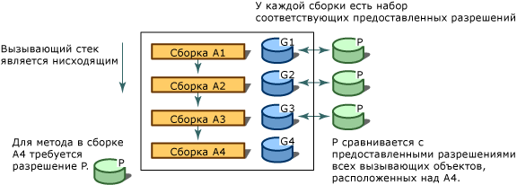

# Управление доступом для кода
[!INCLUDE[net_security_note](../../../includes/net-security-note-md.md)]  
  
 Современные, в высокой степени взаимосвязанные компьютерные системы часто подвержены воздействию кода из разных, иногда неизвестных источников. Код можно вложить в электронную почту, содержащуюся в документах или скачать через Интернет. К сожалению, многие пользователи уже на собственном опыте испытали действие небезопасного кода, включая вирусы и черви, который может повреждать и уничтожать данные, приводя к потере времени и денег.  
  
 Большинство распространенных механизмов обеспечения безопасности предоставляют пользователям права на основе их учетных данных (обычно это пароль), и ограничивают доступ пользователей к ресурсам (как правило, папкам и файлам). Однако этот подход неспособен решить некоторые проблемы: пользователи получают код из множества источников, некоторые из которых могут быть ненадежными; код может содержать ошибки или уязвимые места, которые могут использоваться вредоносным кодом. Кроме того, код в некоторых случаях может выполнять действия без ведома пользователя. В результате возможно повреждение компьютерных систем и утечка конфиденциальных данных, когда осмотрительные и благонадежные пользователи запускают вредоносное или содержащее множество ошибок программное обеспечение. Для выполнения кода большинство механизмов безопасности, применяемых в операционных системах, требуют, чтобы каждая его часть была полностью доверенной, кроме, возможно, сценариев на веб-страницах. Таким образом, необходим механизм безопасности с широкой областью применения, позволяющий коду, полученному от одной компьютерной системы, безопасно выполняться в другой системе даже при отсутствии отношений доверия между этими системами.  
  
 В целях защиты компьютерных систем от вредоносного мобильного кода, обеспечения возможности безопасного исполнения кода, поступившего из неизвестных источников, и защиты доверенного кода от преднамеренного или случайного нарушения безопасности платформа .NET Framework предлагает механизм безопасности, называемый управлением доступом для кода. Управление доступом для кода позволяет определять разные уровни надежности для кода, в зависимости от происхождения и других параметров его удостоверения. Управление доступом для кода также обеспечивает соблюдение различных уровней доверия для кода, минимизируя количество кода, для выполнения которого требуется полное доверие. С помощью управления доступом для кода можно снизить вероятность того, что код будет использован не по назначению вредоносным или содержащим множество ошибок кодом. Оно может также ограничить вашу ответственность, так как вы можете указать для кода набора операций, разрешенных к выполнению. Управление доступом для кода помогает также снизить уровень возможного ущерба от уязвимых мест в коде.  
  
> [!NOTE]
> В .NET Framework 4 были внесены значительные изменения в систему управления доступом для кода. Наиболее заметным изменением является [прозрачность безопасности](security-transparent-code.md), но существуют и другие существенные изменения, влияющие на управление доступом для кода. Сведения об этих изменениях см. в разделе [изменения в системе безопасности](../security/security-changes.md).  
  
 Управление доступом для кода в основном затрагивает код библиотек и приложения с частичным доверием. Разработчики библиотек должны защищать свой код от несанкционированного доступа из приложений с частичным доверием. Приложения с частичным доверием — это приложения, загружаемые из внешних источников, например Интернета. Приложения, установленные на локальном компьютере или в локальной интрасети, выполняются с полным доверием. Безопасность приложений с полным доверием не влияет на управление доступом для кода, если они не помечены как [прозрачные для безопасности](security-transparent-code.md), так как они являются полностью доверенными. Единственное ограничение для приложений с полным доверием состоит в том, что приложения с атрибутом <xref:System.Security.SecurityTransparentAttribute> не могут вызывать код, помеченный атрибутом <xref:System.Security.SecurityCriticalAttribute>. Приложения с частичным доверием должны запускаться в "песочнице" (например, в браузере Internet Explorer), чтобы к ним применялось управление доступом для кода. При попытке запуска приложения, скачанного из Интернета, на локальном компьютере возникает исключение <xref:System.NotSupportedException> со следующим сообщением: "Предпринята попытка загрузить сборку из сетевого ресурса, что в предыдущих версиях .NET Framework могло привести к помещению сборки в "песочницу". Этот выпуск .NET Framework не включает политику CAS по умолчанию, поэтому данная загрузка может быть опасной". Если вы уверены, что приложение может быть доверенным, можно включить его для выполнения с полным доверием с помощью [элемента\<лоадфромремотесаурцес >](../configure-apps/file-schema/runtime/loadfromremotesources-element.md). Сведения о запуске приложения в песочнице см. в разделе [как запустить частично доверенный код в песочнице](how-to-run-partially-trusted-code-in-a-sandbox.md).  
  
 Любой управляемый код, предназначенный для среды CLR, получает преимущества управления доступом для кода, даже если он не выполняет ни одного вызова управления доступом для кода. Дополнительные сведения см. в разделе [Основы управления доступом для кода](code-access-security-basics.md).  
  
   
## Ключевые функции управления доступом для кода  
 Управление доступом для кода помогает ограничить доступ кода к защищенным ресурсам и операциям. В.NET Framework управление доступом для кода выполняет следующие функции:  
  
- Определяет разрешения и наборы разрешений, представляющих право доступа к различным системным ресурсам.  
  
- Дает возможность представить в коде требование, чтобы вызывающие его объекты имели какие-то конкретные разрешения.  
  
- Дает возможность представить в коде требование, чтобы вызывающие объекты имели цифровую сигнатуру, позволяя таким образом вызывать защищенный код только пользователям из конкретной организации или веб-узла.  
  
- Вводит ограничения кода во время выполнения, сравнивая предоставленные разрешения каждого участника в стеке вызовов с разрешениями, которые участники должны иметь.  
  
   
## Обход стека вызова  
 Чтобы определить, разрешен ли коду доступ к ресурсу или выполнение операции, система безопасности среды выполнения обходит стек вызовов, сравнивая разрешения, выданные каждому вызывающему объекту, с затребованными разрешениями. Если какой-либо вызывающий объект в стеке вызовов не имеет запрашиваемого разрешения, создается исключение безопасности и ему отказывается в доступе. Обход стека вызовов предназначен для предотвращения отвлекающих атак, когда менее доверенный код вызывает более доверенный и использует его для выполнения неправомочных действий. Требование разрешений от всех вызывающих объектов во время выполнения влияет на производительность, но необходимо для защиты кода от отвлекающих атак со стороны менее доверенного кода. Для повышения производительности можно заставить код выполнять меньше обходов стека. Однако вы должны быть уверены, что при этом в системе безопасности не возникнет уязвимостей.  
  
 На рисунке ниже показан обход стека, происходящий, когда метод сборки A4 требует, чтобы вызывающие его объекты обладали разрешением P.  
  
   
Обход стека безопасности  
  
   
## См. также  
  
|Заголовок|Описание|  
|-----------|-----------------|  
|[Основы управления доступом для кода](code-access-security-basics.md)|Описывается управление доступом для кода и распространенные способы его использования.|  
|[Прозрачный для системы безопасности код, уровень 2](security-transparent-code-level-2.md)|Описывает модель прозрачности безопасности в .NET Framework 4.|  
|[Использование библиотек из частично доверенного кода](using-libraries-from-partially-trusted-code.md)|Описывается, как предоставить доступ к библиотекам и использовать их из неуправляемого код.|  
|[Основные понятия безопасности](../../standard/security/key-security-concepts.md)|Обзор многих ключевых терминов и принципов, используемых в системе безопасности .NET Framework.|  
|[Безопасность на основе ролей](../../standard/security/role-based-security.md)|Описывается использование безопасности на основе ролей.|  
|[Службы криптографии](../../standard/security/cryptographic-services.md)|Описывается использование шифрования в приложениях.|
