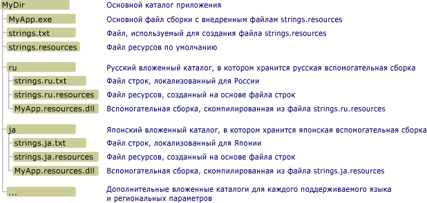

# Создание вспомогательных сборок для приложений для настольных систем
Файлы ресурсов играют важную роль в локализованных приложениях.  Они позволяют приложению использовать для отображения строк, изображений и других данных текущие региональные настройки пользователя, а также предоставлять альтернативные данных при отсутствии необходимых ресурсов для региональных настроек этого пользователя.  Для установления местонахождения локализованных ресурсов и их получения в платформе .NET Framework используется модель «Звезда».  Центром в этой модели является основная сборка, которая содержит не локализуемый исполняемый код и ресурсы для единственного языка и региональных параметров, называемых нейтральными языком и региональными параметрами, или региональными настройками по умолчанию.  Язык и региональные параметры по умолчанию являются резервными параметрами для приложения; они используются, когда не доступны локализованные ресурсы.  При использовании атрибута <xref:System.Resources.NeutralResourcesLanguageAttribute> для указания региональных настроек приложения по умолчанию.  Каждый луч звезды ведет к вспомогательной сборке, которая содержит ресурсы для одного языка и региона, но не содержит кода.  Поскольку эти вспомогательные сборки не являются частью основной сборки, можно легко заменять или обновлять ресурсы, соответствующие определенному языку и региональным параметрам, не заменяя основную сборку для приложения.  
  
> [!NOTE]
>  Ресурсы региональных настроек по умолчанию приложения также могут храниться и во вспомогательной сборке.  Для этого можно назначить атрибуту <xref:System.Resources.NeutralResourcesLanguageAttribute> значение <xref:System.Resources.UltimateResourceFallbackLocation?displayProperty=fullName>.  
  
## Имя и расположение вспомогательной сборки  
 Для реализации модели «Звезда» необходимо разместить ресурсы в определенных местах так, чтобы их можно было легко найти и использовать.  Если ресурсы именованы неверно или компилируются с ошибками, или неверно расположены, то среда CLR не сможет их найти и будет вместо них использовать ресурсы региональных настроек по умолчанию.  Диспетчер ресурсов .NET Framework, представленный объектом <xref:System.Resources.ResourceManager> используется для автоматического доступа к локализованным ресурсам.  Для диспетчер ресурсов необходимо выполнить следующие условия:  
  
-   Одна вспомогательная сборка должна включать все ресурсы для определенных региональных настроек.  Иначе говоря, необходимо компилировать множественное файлы .txt или .resx в один бинарный файл ресурсов \(.resources\).  
  
-   Для каждой региональной настройки, которая содержит ресурсы для локализованных языка и региональных параметров, должен быть выделен отдельный подкаталог.  Имя этого подкаталога должно быть таким же, как и название региональных настроек.  Кроме того можно хранить вспомогательные сборки в глобальном кэше сборок.  В этом случае компонент данных региональных настроек строгого имени сборки должен указывать на свои региональные настройки. \(См. раздел [Установка вспомогательных сборок в глобальном кэше сборок](#SN) далее в этом топике\).  
  
    > [!NOTE]
    >  Если приложение включает ресурсы дочерние региональные настройки по отношению к другим региональным настройкам, то поместите их в отдельные подкаталоги в каталоге приложения.  Не следует размещать субкультуры в подкаталогах каталога основного языка и региональных параметров.  
  
-   Вспомогательная сборка должна иметь то же имя, что и приложение, а также должна использовать расширение имени файла ".resources.dll".  Например если приложение называется Example.exe, то именем каждой вспомогательной сборки должно быть Example.resources.dll.  Обратите внимание, что имя вспомогательной сборки не указывает на региональные настройки данного файла ресурсов.  Однако вспомогательная сборка отображается в каталоге, который указывает на определенные язык и региональные параметры.  
  
-   Сведения о региональных настройках вспомогательной сборки должны быть включены в метаданных сборки.  Для хранения имени региональных настроек в метаданных вспомогательной сборки необходимо задать параметр `/culture` при использовании [Компоновщика сборок](../../../docs/framework/tools/al-exe-assembly-linker.md) для внедренных ресурсов вспомогательной сборки.  
  
 На следующем рисунке показан пример структуры каталогов и приведены требования к размещению файлов для приложений, которые не устанавливаются в [глобальный кэш сборок](../../../docs/framework/app-domains/gac.md).  Элементы с расширениями имен .txt и .resources не будут включаться в окончательный пакет приложения.  Они представляют собой промежуточные файлы ресурсов, используемые для создания итоговых вспомогательных сборок ресурсов.  В этом примере можно было бы заменить файлы .resx на файлы .txt.  Дополнительные сведения см. в разделе [Упаковка и разворачивание ресурсов](../../../docs/framework/resources/packaging-and-deploying-resources-in-desktop-apps.md).  
  
   
Каталог вспомогательной сборки  
  
## Компиляция вспомогательных сборок  
 Используйте [Генератор файлов ресурсов \(Resgen.exe\)](../../../docs/framework/tools/resgen-exe-resource-file-generator.md) для компилирования текстовых файлов или файлов XML \(с расширением .resx\), содержащих ресурсы, в двоичные файлы ресурсов.  Для компиляции файлов .resources во вспомогательные сборки используется [компоновщик сборок \(Al.exe\)](../../../docs/framework/tools/al-exe-assembly-linker.md).  Программа Al.exe создает сборку из указанных файлов .resources.  Вспомогательные сборки могут содержать только ресурсы; они не могут содержать исполняемый код.  
  
 Для создания вспомогательной сборки со строгим именем для приложения `Example` из файла ресурсов региональных настроек Германии strings.de.resources служит следующая команда Al.exe.  
  
```  
al /target:lib /embed:strings.de.resources /culture:de /out:Example.resources.dll  
```  
  
 Для создания вспомогательной сборки для приложения `Example` из файла strings.de.resources служит следующая команда Al.exe.  Опция **\/template** служит для наследования вспомогательной сборкой всех метаданных сборки, за исключением сведений о региональных настройках ее родительской сборки \(Example.dll\).  
  
```  
al /target:lib /embed:strings.de.resources /culture:de /out:Example.resources.dll /template:Example.dll  
```  
  
 В приведенной ниже таблице более подробно описываются параметры Al.exe, использованные в этих командах.  
  
|Команда|Описание|  
|-------------|--------------|  
|**\/target:**lib|Указывает, что вспомогательная сборка компилируется в файл библиотеки \(.dll\).  Поскольку вспомогательные сборки не содержит исполняемого кода и не являются основной сборкой приложения, их необходимо хранить в виде библиотек DLL.|  
|**\/embed:**strings.de.resources|Указывает для программы Al.exe имя файла ресурсов, включенного при компиляции сборки.  Во вспомогательной сборке можно включить несколько файлов ресурсов, но если следовать модели «Звезда», то необходимо компилировать отдельную вспомогательную сборку для каждых региональных настроек.  Впрочем, можно создавать и отдельные файлы .resources для строк и объектов.|  
|**\/culture:**de|Задает язык и региональные параметры компилируемого ресурса.  Среда CLR использует эти сведения в процессе поиска ресурсов, относящихся к указанному языку и региональным параметрам.  Если этот параметр опустить, то программа Al.exe скомпилирует ресурс, но среда выполнения не сможет его найти по запросу пользователя.|  
|**\/out:**Example.resources.dll|Задает имя выходного файла.  Имя должно соответствовать шаблону *baseName*.resources.*extension*, где *baseName* — имя основной сборки, а *extension* — допустимое расширение \(например, .dll\).  Обратите внимание, что среда выполнения не может определить региональные настройки вспомогательной сборки, основываясь на имени выходного файла; необходимо использовать опцию **\/culture**, чтобы указать их.|  
|**\/template:**Example.dll|Указывает на сборку, из которой наследуются все метаданные вспомогательной сборки, кроме поля языка и региональных параметров.  Этот параметр влияет на вспомогательные сборки только в том случае, когда указана сборку, у которой есть [строгое имя](../../../docs/framework/app-domains/strong-named-assemblies.md).|  
  
 Полный список параметров, доступных в программе Al.exe, см. в разделе [Компоновщик сборок \(Al.exe\)](../../../docs/framework/tools/al-exe-assembly-linker.md).  
  
## Вспомогательные сборки: пример  
 Ниже приведен простой пример «Hello world», который отображает окно сообщения, содержащее локализованное приветствие.  Пример включает ресурсы для английского \(США\), французского \(Франция\) и русского \(Россия\) языка, в качестве нейтрального языка выступает английский.  Для создания этого примера выполните следующее:  
  
1.  Создайте файл ресурсов с именем Greeting.resx и Greeting.txt, который будет содержать ресурсы для региональных настроек по умолчанию.  Сохраните в этом файле одну строку с именем `HelloString` и значением «Hello world\!».  
  
2.  Чтобы указать, что язык и региональные параметры по умолчанию для приложения — «en», необходимо также добавить в файл AssemblyInfo приложения или в главный файл исходного кода, которые будут скомпилированы в основную сборку приложения, следующий атрибут <xref:System.Resources.NeutralResourcesLanguageAttribute?displayProperty=fullName>.  
  
     [!code-csharp[Conceptual.Resources.Locating#2](../../../samples/snippets/csharp/VS_Snippets_CLR/conceptual.resources.locating/cs/assemblyinfo.cs#2)]
     [!code-vb[Conceptual.Resources.Locating#2](../../../samples/snippets/visualbasic/VS_Snippets_CLR/conceptual.resources.locating/vb/assemblyinfo.vb#2)]  
  
3.  Например, добавить поддержку языков и региональных параметров "en\-US", "fr\-FR" и "ru\-RU" можно следующим образом:  
  
    -   Для поддержки региональных настроек «en\-US» \(английского языка, США\) создайте файл ресурсов с именем Greeting.en\-US.resx или Greeting.en\-US.txt и сохраните в нем одну строку с именем `HelloString` и значением «Hi world\!».  
  
    -   Для поддержки языка и региональных параметров «fr\-FR» \(французского языка, Франция\) создайте файл ресурсов с именем Greeting.fr\-FR.resx или Greeting.fr\-FR.txt и сохраните в нем одну строку с именем `HelloString` и значением «Salut tout le monde\!».  
  
    -   Для поддержки региональных настроек «ru\-RU» \(русского языка, Россия\) создайте файл ресурсов с именем Greeting.ru\-RU.resx или Greeting.ru\-RU.txt и сохраните в нем одну строку с именем `HelloString`, значение которой — «Всем привет\!».  
  
4.  Используйте [Resgen.exe](../../../docs/framework/tools/resgen-exe-resource-file-generator.md) для компиляции каждого текстового или XML файла ресурсов в двоичный файл ресурсов \(.resources\).  Выходными данными будет набор файлов, имеющих то же корневое имя файла как и файлы .resx или .txt, но с расширением .resources.  При создании примера с помощью Visual Studio процесс компиляции отрегулируется автоматически.  Если используется среда, отличная от Visual Studio, выполните следующие команды для компилирования файлов .resx в файлы ресурсов:  
  
    ```  
  
    resgen Greeting.resx  
    resgen Greeting.en-us.resx  
    resgen Greeting.fr-FR.resx  
    resgen Greeting.ru-RU.resx  
  
    ```  
  
     Если ресурсы располагаются в текстовых файлах вместо XML\-файлов, замените расширение .resx на .txt.  
  
5.  Скомпилируйте следующий исходный код с ресурсами для региональных настроек по умолчанию в основную сборку приложения:  
  
    > [!IMPORTANT]
    >  При использовании командной строки, а не Visual Studio, для создания примера, необходимо изменить вызов конструктора класса <xref:System.Resources.ResourceManager> на следующий: `ResourceManager rm = new ResourceManager("Greetings",``typeof(Example).Assembly);`  
  
     [!code-csharp[Conceptual.Resources.Locating#1](../../../samples/snippets/csharp/VS_Snippets_CLR/conceptual.resources.locating/cs/program.cs#1)]
     [!code-vb[Conceptual.Resources.Locating#1](../../../samples/snippets/visualbasic/VS_Snippets_CLR/conceptual.resources.locating/vb/module1.vb#1)]  
  
     Если приложение называется Example и компилируется из командной строки, то команда для компилятора C\#:  
  
    ```  
    csc Example.cs /res:Greeting.resources  
    ```  
  
     Соответствующая команда для компилятора Visual Basic:  
  
    ```  
    vbc Example.vb /res:Greeting.resources  
    ```  
  
6.  Создайте подкаталог в каталоге основного приложения для каждого языка локализации, поддерживаемого приложением.  Необходимо создать подкаталоги en\-US, fr\-FR и ru\-RU.  Visual Studio автоматически создает эти подкаталоги в процессе компиляции.  
  
7.  Внедрите отдельные файлы ресурсов для определенного языка и региональных параметров во вспомогательные сборки и сохранение их в соответствующем каталоге.  Для этого можно воспользоваться командой для каждого файла .resources:  
  
    ```  
    al /target:lib /embed:Greeting.culture.resources /culture:culture /out:culture\Example.resources.dll  
    ```  
  
     где *culture* — это имя региональных настроек, ресурсы которых содержит вспомогательная сборка.  Visual Studio автоматически обрабатывает этот процесс.  
  
 Затем можно запустить пример.  Он будет случайным образом выбирать одну из поддерживаемых региональных настроек и отображать локализованное приветствие.  
  
<a name="SN"></a>   
## Установка вспомогательных сборок в глобальный кэш сборок  
 Вместо установки сборок в каталоге локального приложения, их можно установить в глобальный кэш сборок.  Это особенно полезно, если библиотеки классов и сборки ресурсов библиотеки классов используются несколькими приложениями.  
  
 Для установки сборок в глобальный кэш сборок требуется наличие строгих имен.  Сборки со строгими именами должны быть подписаны допустимой парой ключей "открытый\-закрытый".  Они содержат сведения о версии, с помощью которых среда выполнения определяет, какую сборку следует использовать для удовлетворения запроса компоновщика.  Дополнительные сведения о строгих именах см. в разделе [Управление версиями сборки](../../../docs/framework/app-domains/assembly-versioning.md).  Для получения дополнительных сведений о строгих именах см. раздел [Сборки со строгими именами](../../../docs/framework/app-domains/strong-named-assemblies.md).  
  
 Разработчик приложения, как правило, не имеет доступа к итоговой паре открытого и закрытого ключей.  Чтобы установить вспомогательную сборку в глобальный кэш сборок и обеспечить ее работоспособность, можно воспользоваться средством отложенной подписи.  Если подписание сборки откладывается, во время построения в файле резервируется место для подписи со строгим именем.  Фактически подписание откладывается до того момента, когда становится доступной итоговая пара открытого и закрытого ключей.  Дополнительные сведения об отложенной подписи см. в разделе [Отложенная подпись сборки](../../../docs/framework/app-domains/delay-sign-assembly.md).  
  
### Получение открытого ключа  
 Чтобы отложить подпись сборки, необходимо иметь доступ к открытому ключу.  Открытый ключ можно либо получить в организации, которая будет заниматься окончательным подписанием, либо создать самостоятельно с помощью [программы строгих имен \(Sn.exe\)](../../../docs/framework/tools/sn-exe-strong-name-tool.md).  
  
 Следующая команда Sn.exe создает тестовые пары открытого и закрытого ключа.  Параметр **–k** указывает, что необходимо создать новую пару ключей и сохранить ее в заданном файле с именем TestKeyPair.snk.  
  
```  
sn –k TestKeyPair.snk   
```  
  
 Открытый ключ можно извлечь из файла, содержащего тестовую пару ключей.  Следующая команда извлекает открытый ключ из TestKeyPair.snk и сохраняет его в PublicKey.snk:  
  
```  
sn –p TestKeyPair.snk PublicKey.snk  
```  
  
### Отложенная подпись сборки  
 После получения или создания открытого ключа, можно скомпилировать сборку и указать отложенную подпись, используя [компоновщик сборок \(Al.exe\)](../../../docs/framework/tools/al-exe-assembly-linker.md).  
  
 Для создания вспомогательной сборки со строгим именем для приложения StringLibrary из файла strings.ja.resources служит следующая команда Al.exe:  
  
```  
al /target:lib /embed:strings.ja.resources /culture:ja /out:StringLibrary.resources.dll /delay+ /keyfile:PublicKey.snk  
```  
  
 Опция **\/delay\+** указывает, что компоновщик сборок должен отложить подпись сборки.  Опция **\/keyfile** задает имя файла ключа, в котором содержится открытый ключ, применяемый для откладывания подписи сборки.  
  
### Повторная подпись сборки  
 Прежде чем развертывать приложение, можно заново подписать вспомогательную сборку, подписание которой было отложено, реальной парой ключей.  Это можно сделать с помощью программы Sn.exe.  
  
 Для подписи StringLibrary.resources.dll парой реальных ключей, хранящихся в файле RealKeyPair.snk, используется следующая команда Sn.exe.  Опция **–R** указывает, что нужно заново подписать сборку с отложенной подписью или сборку, которая должна быть подписана заново.  
  
```  
sn –R StringLibrary.resources.dll RealKeyPair.snk   
```  
  
### Установка вспомогательной сборки в глобальный кэш сборок  
 Когда среда выполнения ищет ресурсы в процессе перехода на резервные средства, в первую очередь она ищет [глобальный кэш сборок](../../../docs/framework/app-domains/gac.md). \(Дополнительные сведения см. в подразделе «Процесс использования резервных ресурсов» раздела [Упаковка и развертывание ресурсов](../../../docs/framework/resources/packaging-and-deploying-resources-in-desktop-apps.md).\) Как только вспомогательная сборка подписана строгим именем, ее можно установить в глобальном кэше сборок с помощью [программы глобального кэша сборок \(Gacutil.exe\)](../../../docs/framework/tools/gacutil-exe-gac-tool.md).  
  
 Следующая команда Gacutil.exe устанавливает StringLibrary.resources.dll в глобальный кэш сборок:  
  
```  
gacutil /i:StringLibrary.resources.dll  
```  
  
 Опция **\/i** указывает программе Gacutil.exe, что данную сборку требуется установить в глобальный кэш сборок.  После того, как вспомогательная сборка установлена в кэше, ресурсы, которые она содержит, становятся доступны для всех приложений, которые предназначены для использования вспомогательной сборки.  
  
### Ресурсы в глобальном кэше сборок: пример  
 В следующем примере используется метод библиотека классов .NET Framework для извлечения и возврата локализованных приветствий из файла ресурсов.  Библиотека и ее ресурсы зарегистрированы в глобальном кэше сборок.  Пример включает ресурсы для английского \(США\), французского \(Франция\), русского \(Россия\) и английского языков.  Английский является языком по умолчанию; ресурсы для него хранятся в основной сборке.  В начале пример задерживает подпись библиотеки и вспомогательных сборок открытым ключом, а затем заново подписывает их парой открытого и закрытого ключей.  Для создания этого примера выполните следующее:  
  
1.  Если не используется Visual Studio, то используйте следующую команду [средства строгих имен \(Sn.exe\)](../../../docs/framework/tools/sn-exe-strong-name-tool.md) для создания пары открытого и закрытого ключей с именем ResKey.snk:  
  
    ```  
    sn –k ResKey.snk  
    ```  
  
     Если используется Visual Studio, то используйте вкладку **Подпись** диалогового окна проекта **Свойства** для создания файла ключа.  
  
2.  Используйте следующую команду [средство строгих имен \(Sn.exe\)](../../../docs/framework/tools/sn-exe-strong-name-tool.md) для создания файла с именем открытого ключа PublicKey.snk:  
  
    ```  
    sn –p ResKey.snk PublicKey.snk  
    ```  
  
3.  Создайте файл ресурсов с именем Strings.resx, который будет содержать ресурсы для региональных настроек по умолчанию.  Сохраните в этом файле одну строка с именем `Greeting` и значением «How do you do?».  
  
4.  Чтобы указать, что региональные настройки для приложения по умолчанию — «en», необходимо также добавить в файл AssemblyInfo приложения или в главный файл исходного кода, которые будут скомпилированы в основную сборку приложения, следующий атрибут <xref:System.Resources.NeutralResourcesLanguageAttribute?displayProperty=fullName>:  
  
     [!code-csharp[Conceptual.Resources.Satellites#2](../../../samples/snippets/csharp/VS_Snippets_CLR/conceptual.resources.satellites/cs/stringlibrary.cs#2)]
     [!code-vb[Conceptual.Resources.Satellites#2](../../../samples/snippets/visualbasic/VS_Snippets_CLR/conceptual.resources.satellites/vb/stringlibrary.vb#2)]  
  
5.  Добавить поддержку для дополнительных региональных настроек \(языков «en\-US», «fr\-FR» и «ru\-RU»\) можно следующим образом:  
  
    -   Для поддержки языка и региональных параметров «en\-US» \(английского языка, США\) создайте файл ресурсов с именем Strings.en\-US.resx или Strings.en\-US.txt и сохраните в нем одну строку с именем `Greeting` и значением «Hello\!».  
  
    -   Для поддержки языка и региональных параметров «fr\-FR» \(французского языка, Франция\) создайте файл ресурсов с именем Strings.fr\-FR.resx или Strings.fr\-FR.txt и сохраните в нем одну строку с именем `Greeting`, значение которой — «Bon jour\!».  
  
    -   Для поддержки языка и региональных параметров «ru\-RU» \(русского языка, Россия\) создайте файл ресурсов с именем Strings.ru\-RU.resx или Strings.ru\-RU.txt и сохраните в нем одну строку с именем `Greeting`, значение которой — «Всем привет\!».  
  
6.  Используйте [Resgen.exe](../../../docs/framework/tools/resgen-exe-resource-file-generator.md) для компиляции каждого текстового или XML файла ресурсов в двоичный файл ресурсов \(.resources\).  Выходными данными будет набор файлов, имеющих то же корневое имя файла как и файлы .resx или .txt, но с расширением .resources.  При создании примера с помощью Visual Studio процесс компиляции отрегулируется автоматически.  Если используется среда, отличная от Visual Studio, выполните следующую команду для компилирования файлов .resx в файлы ресурсов:  
  
    ```  
    resgen filename  
    ```  
  
     где *filename* — дополнительный путь, имя файла и расширение .resx или текстового файла.  
  
7.  Скомпилируйте следующий исходный код для StringLibrary.vb или StringLibrary.cs с ресурсами для региональных настроек по умолчанию в библиотеки сборки с отложенной подписью с именем StringLibrary.dll:  
  
    > [!IMPORTANT]
    >  При использовании командной строки, а не Visual Studio, для создания примера, необходимо изменить вызов конструктора класса <xref:System.Resources.ResourceManager> на следующий: `ResourceManager rm = new ResourceManager("Strings",` `typeof(Example).Assembly);`.  
  
     [!code-csharp[Conceptual.Resources.Satellites#1](../../../samples/snippets/csharp/VS_Snippets_CLR/conceptual.resources.satellites/cs/stringlibrary.cs#1)]
     [!code-vb[Conceptual.Resources.Satellites#1](../../../samples/snippets/visualbasic/VS_Snippets_CLR/conceptual.resources.satellites/vb/stringlibrary.vb#1)]  
  
     Команда для компилятора C\#:  
  
    ```  
    csc /t:library /resource:Strings.resources /delaysign+ /keyfile:publickey.snk StringLibrary.cs  
    ```  
  
     Соответствующая команда для компилятора Visual Basic:  
  
    ```  
    vbc /t:library /resource:Strings.resources /delaysign+ /keyfile:publickey.snk StringLibrary.vb  
    ```  
  
8.  Создайте подкаталог в каталоге основного приложения для каждого языка локализации, поддерживаемого приложением.  Необходимо создать подкаталоги en\-US, fr\-FR и ru\-RU.  Visual Studio автоматически создает эти подкаталоги в процессе компиляции.  Поскольку все вспомогательные сборки имеют одно и то же имя файла, вложенные каталоги используются для хранения отдельных вспомогательных сборок для региональных настроек до тех пор, пока они не подписаны парой открытого и закрытого ключей.  
  
9. Внедрите отдельные файлы ресурсов для определенного языка и региональных параметров во вспомогательные сборки с отложенной подписью и сохранение их в соответствующем каталоге.  Для этого можно воспользоваться командой для каждого файла .resources:  
  
    ```  
    al /target:lib /embed:Strings.culture.resources /culture:culture /out:culture\StringLibrary.resources.dll /delay+ /keyfile:publickey.snk  
    ```  
  
     где *culture* — название региональной настройки.  В этом примере имена региональных настроек: en\-US, fr\-FR, и ru\-RU.  
  
10. Подпишите заново StringLibrary.dll с помощью [средства строгих имен \(Sn.exe\)](../../../docs/framework/tools/sn-exe-strong-name-tool.md) следующим образом:  
  
    ```  
    sn –R StringLibrary.dll RealKeyPair.snk  
    ```  
  
11. Подпишите заново отдельные вспомогательные сборки.  Для этого используйте [средством строгих имен \(Sn.exe\)](../../../docs/framework/tools/sn-exe-strong-name-tool.md) как показано ниже для каждой вспомогательной сборки:  
  
    ```  
    sn –R StringLibrary.resources.dll RealKeyPair.snk  
    ```  
  
12. Зарегистрируйте StringLibrary.dll и все вспомогательные сборки в глобальный кэш сборок с помощью следующей команды:  
  
    ```  
    gacutil /i filename  
    ```  
  
     где *filename* — имя регистрируемого файла.  
  
13. Если используется Visual Studio, создайте новый проект **Консольного приложения** с именем `Example`, добавьте в него следующий исходный код и ссылку на StringLibrary.dll и скомпилируйте.  
  
     [!code-csharp[Conceptual.Resources.Satellites#3](../../../samples/snippets/csharp/VS_Snippets_CLR/conceptual.resources.satellites/cs/example.cs#3)]
     [!code-vb[Conceptual.Resources.Satellites#3](../../../samples/snippets/visualbasic/VS_Snippets_CLR/conceptual.resources.satellites/vb/example.vb#3)]  
  
     Чтобы компилировать из командной строки используйте следующую команду для компилятора C\#:  
  
    ```  
    csc Example.cs /r:StringLibrary.dll   
    ```  
  
     Команда компилятора для Visual Basic:  
  
    ```  
    vbc Example.vb /r:StringLibrary.dll   
    ```  
  
14. Запустите Example.exe.  
  
## См. также  
 [Упаковка и развертывание ресурсов](../../../docs/framework/resources/packaging-and-deploying-resources-in-desktop-apps.md)   
 [Отложенная подпись сборки](../../../docs/framework/app-domains/delay-sign-assembly.md)   
 [Al.exe \(компоновщик сборок\)](../../../docs/framework/tools/al-exe-assembly-linker.md)   
 [Sn.exe \(Strong Name Tool\)](../../../docs/framework/tools/sn-exe-strong-name-tool.md)   
 [Gacutil.exe \(Global Assembly Cache Tool\)](../../../docs/framework/tools/gacutil-exe-gac-tool.md)   
 [Ресурсы в приложениях для настольных систем](../../../docs/framework/resources/index.md)