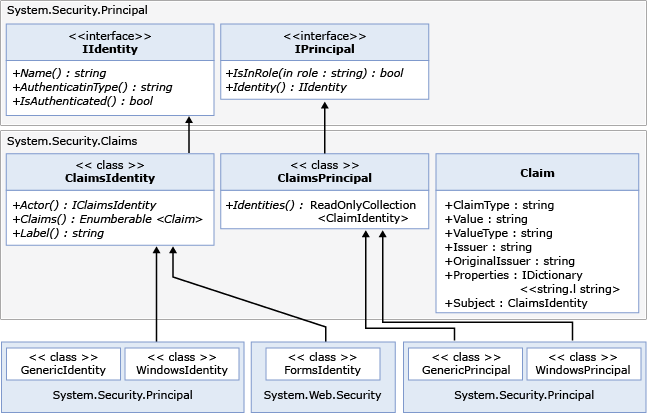

# <a name="wif-claims-programming-model"></a>Модель программирования требований WIF
Для работы с удостоверениями пользователей разработчики на ASP.NET и Windows Communication Foundation (WCF) обычно используют интерфейсы IIdentity и IPrincipal. В .NET 4.5 интегрирована платформа Windows Identity Foundation (WIF), благодаря чему утверждения теперь всегда присутствуют для любого субъекта, как показано на схеме ниже.  
  
   
  
 В .NET 4.5 пространство имен System.Security.Claims содержит новые классы ClaimsPrincipal и ClaimsIdentity (см. схему выше). Все субъекты в .NET теперь являются производными от ClaimsPrincipal. Все встроенные классы удостоверений, такие как FormsIdentity для ASP.NET и WindowsIdentity, теперь являются производными от ClaimsIdentity. Аналогичным образом, все встроенные классы субъектов, такие как GenericPrincipal и WindowsPrincipal, являются производными от ClaimsPrincipal.  
  
 Утверждение представлено классом <xref:System.Security.Claims.Claim>. Ниже перечислены его важные свойства.  
  
-   <xref:System.Security.Claims.Claim.Type%2A> представляет тип утверждения. Обычно это универсальный код ресурса (URI). Например, заявка с адресом электронной почты представляется как `http://schemas.microsoft.com/ws/2008/06/identity/claims/email`.  
  
-   <xref:System.Security.Claims.Claim.Value%2A> содержит значение утверждения в виде строки. Например, адрес электронной почты может быть представлено как «someone@contoso.com».  
  
-   <xref:System.Security.Claims.Claim.ValueType%2A> представляет тип значения утверждения. Обычно это универсальный код ресурса (URI). Например, строковый тип представляется как `http://www.w3.org/2001/XMLSchema#string`. Согласно схеме XML тип значения должен быть QName. Чтобы платформа WIF могла вывести допустимое значение QName, это значение должно иметь формат `namespace#format`. Если пространство имен не определено четко, проверка создаваемого кода XML схемой может оказаться невозможной, так как для этого пространства имен может отсутствовать опубликованный XSD-файл. Тип значения по умолчанию — `http://www.w3.org/2001/XMLSchema#string`. См. в разделе [ http://www.w3.org/2001/XMLSchema ](https://go.microsoft.com/fwlink/?LinkId=209155) для хорошо известного значения типов, которые можно использовать без опасений.  
  
-   <xref:System.Security.Claims.Claim.Issuer%2A> — это идентификатор службы маркеров безопасности (STS), выдавшей утверждение. Он может быть представлен в виде URL-адреса службы STS или ее имени, например `https://sts1.contoso.com/sts`.  
  
-   <xref:System.Security.Claims.Claim.OriginalIssuer%2A> — это идентификатор службы STS, выдавшей утверждение изначально, без учета других служб STS в цепочке. Представляется так же, как и <xref:System.Security.Claims.Claim.Issuer%2A>.  
  
-   <xref:System.Security.Claims.Claim.Subject%2A> — это субъект, удостоверение которого изучается. Оно содержит <xref:System.Security.Claims.ClaimsIdentity>.  
  
-   <xref:System.Security.Claims.Claim.Properties%2A> — это словарь, с помощью которого разработчик может предоставить относящиеся к приложению данные, которые должны передаваться по сети вместе с другими свойствами. Его можно использовать для пользовательской проверки.  
  
## <a name="identity-delegation"></a>Делегирование удостоверений  
 Важным свойством класса <xref:System.Security.Claims.ClaimsIdentity> является <xref:System.Security.Claims.ClaimsIdentity.Actor%2A>. Оно обеспечивает делегирование учетных данных в многоуровневой системе, в которой средний уровень выступает в роли клиента, выполняющего запросы к серверной службе.  
  
### <a name="accessing-claims-through-threadcurrentprincipal"></a>Доступ к утверждениям посредством Thread.CurrentPrincipal  
 Для доступа к набору утверждений текущего пользователя в приложении проверяющей стороны используйте свойство `Thread.CurrentPrincipal`.  
  
 В приведенном ниже примере кода показано использование этого метода для получения System.Security.Claims.ClaimsIdentity.  
  
```  
ClaimsPrincipal claimsPrincipal = Thread.CurrentPrincipal as ClaimsPrincipal;  
```  
  
 Дополнительные сведения см. в разделе <xref:System.Security.Claims>.  
  
### <a name="role-claim-type"></a>Тип утверждения роли  
 При настройке приложения проверяющей стороны необходимо выбрать тип утверждения роли. Этот тип утверждения используется методом System.Security.Claims.ClaimsPrincipal.IsInRole(System.String). Тип утверждения по умолчанию — `http://schemas.microsoft.com/ws/2008/06/identity/claims/role`.  
  
### <a name="claims-extracted-by-windows-identity-foundation-from-different-token-types"></a>Утверждения, извлекаемые Windows Identity Foundation из токенов различных типов  
 WIF изначально поддерживает несколько сочетаний механизмов проверки подлинности. В приведенной ниже таблице перечислены утверждения, которые WIF извлекает из токенов различных типов.  
  
|Тип маркера|Создаваемое утверждение|Соответствующий токен доступа Windows|  
|-|-|-|  
|SAML 1.1|1.  Все утверждения из System.IdentityModel.SecurityTokenService.GetOutputClaimsIdentity(System.Security.Claims.ClaimsPrincipal,System.IdentityModel.Protocols.WSTrust.RequestSecurityToken,System.IdentityModel.Scope).<br />2.  Утверждение `http://schemas.microsoft.com/ws/2008/06/identity/claims/confirmationkey`, которое содержит сериализованный XML-код ключа подтверждения, если токен содержит токен проверки.<br />3.  Утверждение `http://schemas.microsoft.com/ws/2008/06/identity/claims/samlissuername` из элемента Issuer.<br />4.  Утверждения AuthenticationMethod и AuthenticationInstant, если токен содержит оператор проверки подлинности.|В дополнение к утверждениям, перечисленным в строке "SAML 1.1", кроме утверждений типа `http://schemas.xmlsoap.org/ws/2005/05/identity/claims/name`, будут добавлены утверждения, связанные с проверкой подлинности Windows, и удостоверение будет представлено объектом WindowsClaimsIdentity.|  
|SAML 2.0|См. "SAML 1.1".|См. "SAML 1.1, сопоставление с учетной записью Windows".|  
|X509|1.  Утверждения с различающимся именем X500, свойствами emailName, dnsName, SimpleName, UpnName, UrlName, thumbprint, RsaKey (может извлекаться с помощью метода RSACryptoServiceProvider.ExportParameters из свойства X509Certificate2.PublicKey.Key), DsaKey (может извлекаться с помощью метода DSACryptoServiceProvider.ExportParameters из свойства X509Certificate2.PublicKey.Key), SerialNumber из сертификата X509.<br />2.  Утверждение AuthenticationMethod со значением `http://schemas.microsoft.com/ws/2008/06/identity/authenticationmethod/x509`. Утверждение AuthenticationInstant со значением времени, когда сертификат был проверен в формате DateTime XmlSchema.|1.  В качестве значения утверждения `http://schemas.xmlsoap.org/ws/2005/05/identity/claims/name` используется полное доменное имя учетной записи Windows. .<br />2.  Утверждения из сертификата X509, не сопоставленные с Windows, и утверждения из учетной записи Windows, полученные путем сопоставления сертификата с Windows.|  
|Имя участника-пользователя|1.  Утверждения сходны с утверждениями из раздела проверки подлинности Windows.<br />2.  Утверждение AuthenticationMethod со значением `http://schemas.microsoft.com/ws/2008/06/identity/authenticationmethod/password`. Утверждение AuthenticationInstant со значением времени, когда пароль был проверен в формате DateTime XmlSchema.||  
|Windows (Kerberos или NTLM)|1.  Утверждения, созданные на основе токена доступа, такие как PrimarySID, DenyOnlyPrimarySID, PrimaryGroupSID, DenyOnlyPrimaryGroupSID, GroupSID, DenyOnlySID и Name.<br />2.  Утверждение AuthenticationMethod со значением `http://schemas.microsoft.com/ws/2008/06/identity/authenticationmethod/windows`. Утверждение AuthenticationInstant со значением времени, когда токен доступа Windows был создан в формате DateTime XmlSchema.||  
|Пара ключей RSA|1.  Утверждение `http://schemas.xmlsoap.org/ws/2005/05/identity/claims/rsa` со значением RSAKeyValue.<br />2.  Утверждение AuthenticationMethod со значением `http://schemas.microsoft.com/ws/2008/06/identity/authenticationmethod/signature`. Утверждение AuthenticationInstant со значением времени, когда была проверена подлинность ключа RSA (то есть времени проверки подписи) в формате DateTime XMLSchema.||  
  
|Тип проверки подлинности|Коды URI, выпущенные в утверждении AuthenticationMethod|  
|-|-|  
|Пароль|`urn:oasis:names:tc:SAML:1.0:am:password`|  
|Kerberos|`urn:ietf:rfc:1510`|  
|SecureRemotePassword|`urn:ietf:rfc:2945`|  
|TLSClient|`urn:ietf:rfc:2246`|  
|X509|`urn:oasis:names:tc:SAML:1.0:am:X509-PKI`|  
|PGP|`urn:oasis:names:tc:SAML:1.0:am:PGP`|  
|Spki|`urn:oasis:names:tc:SAML:1.0:am:SPKI`|  
|XmlDSig|`urn:ietf:rfc:3075`|  
|Не указан|`urn:oasis:names:tc:SAML:1.0:am:unspecified`|
