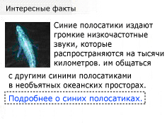

# Доступ ко внедренным объектам с помощью автоматизации пользовательского интерфейса
> [!NOTE]
> Эта документация предназначена для разработчиков .NET Framework, желающих использовать управляемые классы [!INCLUDE[TLA2#tla_uiautomation](../../../includes/tla2sharptla-uiautomation-md.md)] , заданные в пространстве имен <xref:System.Windows.Automation> . Последние сведения о [!INCLUDE[TLA2#tla_uiautomation](../../../includes/tla2sharptla-uiautomation-md.md)]см. в разделе [API автоматизации Windows. Автоматизация пользовательского интерфейса](/windows/win32/winauto/entry-uiauto-win32).  
  
 В этом разделе показано, как можно использовать [!INCLUDE[TLA#tla_uiautomation](../../../includes/tlasharptla-uiautomation-md.md)] для представления объектов, внедренных в содержимое элемента управления "Текст".  
  
> [!NOTE]
> Внедренные объекты могут включать изображения, гиперссылки, кнопки, таблицы или элементы ActiveX.  
  
 Внедренные объекты считаются дочерними элементами поставщика текста [!INCLUDE[TLA2#tla_uiautomation](../../../includes/tla2sharptla-uiautomation-md.md)] . Это позволяет предоставлять их через ту же древовидную структуру модели автоматизации пользовательского интерфейса, что и все остальные элементы [!INCLUDE[TLA#tla_ui](../../../includes/tlasharptla-ui-md.md)] . Функциональные возможности в свою очередь предоставляются с помощью шаблонов элементов управления, которые обычно требуются типом элемента управления внедренных объектов (например, поскольку гиперссылки основаны на тексте, они будут поддерживать <xref:System.Windows.Automation.TextPattern>).  
  
   
A sample document with textual content, ("Did You Know?"…) and two embedded objects (a picture of a whale and a text hyperlink), used as a target for the code examples.  
  
## Пример  
 В следующем примере кода демонстрируется извлечение коллекции внедренных объектов из поставщика текста [!INCLUDE[TLA2#tla_uiautomation](../../../includes/tla2sharptla-uiautomation-md.md)] . Для образца документа, приведенного во введении, будет возвращено два объекта (элемент изображения и текстовый элемент).  
  
> [!NOTE]
> Элемент изображения должен иметь некоторый связанный с ним встроенный текст, описывающий изображение, обычно в его свойстве <xref:System.Windows.Automation.AutomationElement.NameProperty> (например, "Синий кит".). Однако если получен текстовый диапазон, перекрывающий этот объект-изображение, в текстовом потоке не возвращается ни это изображение, ни его описательный текст.  
  
[!code-csharp[FindText#StartApp](../../../samples/snippets/csharp/VS_Snippets_Wpf/FindText/CSharp/SearchWindow.cs#startapp)]
[!code-vb[FindText#StartApp](../../../samples/snippets/visualbasic/VS_Snippets_Wpf/FindText/VisualBasic/SearchWindow.vb#startapp)]  
[!code-csharp[FindText#FindTextProvider](../../../samples/snippets/csharp/VS_Snippets_Wpf/FindText/CSharp/SearchWindow.cs#findtextprovider)]
[!code-vb[FindText#FindTextProvider](../../../samples/snippets/visualbasic/VS_Snippets_Wpf/FindText/VisualBasic/SearchWindow.vb#findtextprovider)]  
[!code-csharp[FindText#GetChildren](../../../samples/snippets/csharp/VS_Snippets_Wpf/FindText/CSharp/SearchWindow.cs#getchildren)]
[!code-vb[FindText#GetChildren](../../../samples/snippets/visualbasic/VS_Snippets_Wpf/FindText/VisualBasic/SearchWindow.vb#getchildren)]  
  
## Пример  
 В следующем примере кода демонстрируется получение текстового диапазона из внедренного объекта в поставщике текста [!INCLUDE[TLA2#tla_uiautomation](../../../includes/tla2sharptla-uiautomation-md.md)] . Полученный текстовый диапазон является пустым диапазоном, где за начальной точкой следует "... океан.(пространство)", и перед конечной точкой стоит закрывающая точка ".", представляющая внедренную гиперссылку (как показано на рисунке во введении). Несмотря на то что это пустой диапазон, он не считается вырожденным диапазоном, так как содержит ненулевой промежуток.  
  
> [!NOTE]
> <xref:System.Windows.Automation.TextPattern> может получить текстовый внедренный объект как гиперссылку; однако для предоставления полной функциональности внедренного объекта из него должен быть получен дополнительный <xref:System.Windows.Automation.TextPattern> .  
  
 [!code-csharp[UIATextPattern_snip#GetRangeFromChild](../../../samples/snippets/csharp/VS_Snippets_Wpf/UIATextPattern_snip/CSharp/SearchWindow.cs#getrangefromchild)]
 [!code-vb[UIATextPattern_snip#GetRangeFromChild](../../../samples/snippets/visualbasic/VS_Snippets_Wpf/UIATextPattern_snip/VisualBasic/SearchWindow.vb#getrangefromchild)]  
  
## См. также

- [Общие сведения об объекте TextPattern модели автоматизации пользовательского интерфейса](ui-automation-textpattern-overview.md)
- [Общие сведения о шаблонах элементов управления модели автоматизации пользовательского интерфейса](ui-automation-control-patterns-overview.md)
- [Шаблоны элементов управления модели автоматизации пользовательского интерфейса для клиентов](ui-automation-control-patterns-for-clients.md)
- [Добавление содержимого в текстовое поле с помощью модели автоматизации пользовательского интерфейса](add-content-to-a-text-box-using-ui-automation.md)
- [Поиск и выделение текста с помощью модели автоматизации пользовательского интерфейса](find-and-highlight-text-using-ui-automation.md)
