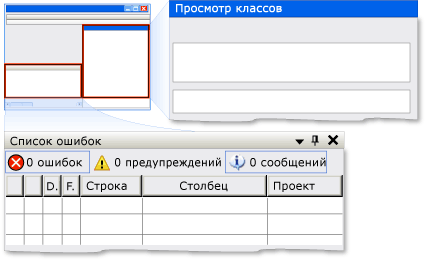

# Реализация шаблона элемента управления модели автоматизации пользовательского интерфейса DockImplementing the UI Automation Dock Control Pattern
> [!NOTE]
> Эта документация предназначена для разработчиков .NET Framework, желающих использовать управляемые классы [!INCLUDE[TLA2#tla_uiautomation](../../../includes/tla2sharptla-uiautomation-md.md)] , заданные в пространстве имен <xref:System.Windows.Automation> .This documentation is intended for .NET Framework developers who want to use the managed [!INCLUDE[TLA2#tla_uiautomation](../../../includes/tla2sharptla-uiautomation-md.md)] classes defined in the <xref:System.Windows.Automation> namespace. Последние сведения о [!INCLUDE[TLA2#tla_uiautomation](../../../includes/tla2sharptla-uiautomation-md.md)]см. в разделе [API автоматизации Windows. Автоматизация пользовательского интерфейса](/windows/win32/winauto/entry-uiauto-win32).For the latest information about [!INCLUDE[TLA2#tla_uiautomation](../../../includes/tla2sharptla-uiautomation-md.md)], see [Windows Automation API: UI Automation](/windows/win32/winauto/entry-uiauto-win32).  
  
 В этом разделе приводятся рекомендации и соглашения для реализации <xref:System.Windows.Automation.Provider.IDockProvider>, включая сведения о свойствах.This topic introduces guidelines and conventions for implementing <xref:System.Windows.Automation.Provider.IDockProvider>, including information about properties. Ссылки на дополнительные материалы перечислены в конце раздела.Links to additional references are listed at the end of the topic.  
  
 Шаблон элемента управления <xref:System.Windows.Automation.DockPattern> используется для предоставления свойств закрепления элемента управления в контейнере закрепления.The <xref:System.Windows.Automation.DockPattern> control pattern is used to expose the dock properties of a control within a docking container. Контейнер закрепления — это элемент управления, который позволяет упорядочить дочерние элементы по горизонтали и по вертикали друг относительно друга.A docking container is a control that allows you to arrange child elements horizontally and vertically, relative to each other. Примеры элементов управления, реализующих данный шаблон элемента управления, см. в разделе [Control Pattern Mapping for UI Automation Clients](control-pattern-mapping-for-ui-automation-clients.md).For examples of controls that implement this control pattern, see [Control Pattern Mapping for UI Automation Clients](control-pattern-mapping-for-ui-automation-clients.md).  
  
   
Пример закрепления из Visual Studio, где окно "Представление классов" — DockPosition.Right, а окно "Список ошибок" — DockPosition.BottomDocking Example from Visual Studio Where "Class View" Window Is DockPosition.Right and "Error List" Window Is DockPosition.Bottom  
  
   
## Правила и соглашения реализацииImplementation Guidelines and Conventions  
 При реализации шаблона элемента управления Dock обратите внимание на следующие правила и соглашения.When implementing the Dock control pattern, note the following guidelines and conventions:  
  
- <xref:System.Windows.Automation.Provider.IDockProvider> не предоставляет какие-либо свойства контейнера закрепления или какие-либо свойства элементов управления, закрепленных рядом с текущим элементом управления в контейнере закрепления.<xref:System.Windows.Automation.Provider.IDockProvider> does not expose any properties of the docking container or any properties of controls that are docked adjacent to the current control within the docking container.  
  
- Элементы управления закрепляются относительно друг друга в зависимости от их текущего z-порядка; чем больше z-порядок расположения, тем дальше они размещены от заданного края контейнера закрепления.Controls are docked relative to each other based on their current z-order; the higher their z-order placement, the farther they are placed from the specified edge of the docking container.  
  
- При изменении размеров контейнера закрепления все закрепленные элементы управления в контейнере будут перенесены с выравниванием по тому же краю, к которому они были первоначально прикреплены.If the docking container is resized, any docked controls within the container will be repositioned flush to the same edge to which they were originally docked. Размеры закрепленных элементов управления также будут изменены для заполнения пробелов в контейнере согласно поведению закрепления их <xref:System.Windows.Automation.DockPosition>.The docked controls will also resize to fill any space within the container according to the docking behavior of their <xref:System.Windows.Automation.DockPosition>. Например, если указано <xref:System.Windows.Automation.DockPosition.Top> , левая и правая стороны элемента управления будут расширены для заполнения всего доступного пространства.For example, if <xref:System.Windows.Automation.DockPosition.Top> is specified, the left and right sides of the control will expand to fill any available space. Если указано <xref:System.Windows.Automation.DockPosition.Fill> , все четыре стороны элемента управления будут расширены для заполнения всего доступного пространства.If <xref:System.Windows.Automation.DockPosition.Fill> is specified, all four sides of the control will expand to fill any available space.  
  
- На системах с несколькими мониторами элементы управления должны закрепляться с левой или правой стороны текущего монитора.On a multi-monitor system, controls should dock to the left or right side of the current monitor. Если это невозможно, они должны закрепляться с левой стороны крайнего левого монитора или с правой стороны крайнего правого монитора.If that is not possible, they should dock to the left side of the leftmost monitor or the right side of the rightmost monitor.  
  
   
## Обязательные члены для IDockProviderRequired Members for IDockProvider  
 Следующие свойства и методы обязательны для реализации интерфейса IDockProvider.The following properties and methods are required for implementing the IDockProvider interface.  
  
|Обязательные членыRequired members|Тип элементаMember type|ПримечанияNotes|  
|----------------------|-----------------|-----------|  
|<xref:System.Windows.Automation.Provider.IDockProvider.DockPosition%2A>|СвойствоProperty|НетNone|  
|<xref:System.Windows.Automation.Provider.IDockProvider.SetDockPosition%2A>|МетодMethod|НетNone|  
  
 Этот шаблон элемента управления не имеет связанных событий.This control pattern has no associated events.  
  
   
## ИсключенияExceptions  
 Поставщики должны вызывать следующие исключения.Providers must throw the following exceptions.  
  
|Тип исключенияException type|УсловиеCondition|  
|--------------------|---------------|  
|<xref:System.InvalidOperationException>|<xref:System.Windows.Automation.Provider.IDockProvider.SetDockPosition%2A>   — Когда элемент управления не может выполнить запрошенный стиль закрепления.-   When a control is not able to execute the requested dock style.|  
  
## См. также:See also

- [Общие сведения о шаблонах элементов управления модели автоматизации пользовательского интерфейсаUI Automation Control Patterns Overview](ui-automation-control-patterns-overview.md)
- [Поддержка шаблонов элементов управления в поставщике автоматизации пользовательского интерфейсаSupport Control Patterns in a UI Automation Provider](support-control-patterns-in-a-ui-automation-provider.md)
- [Шаблоны элементов управления модели автоматизации пользовательского интерфейса для клиентовUI Automation Control Patterns for Clients](ui-automation-control-patterns-for-clients.md)
- [Общие сведения о дереве модели автоматизации пользовательского интерфейсаUI Automation Tree Overview](ui-automation-tree-overview.md)
- [Использование кэширования в модели автоматизации пользовательского интерфейсаUse Caching in UI Automation](use-caching-in-ui-automation.md)
