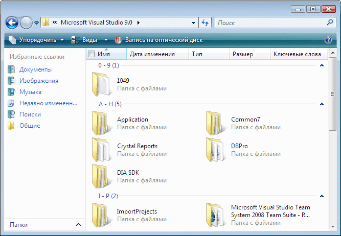

# Реализация шаблона элемента управления сеткой автоматизации пользовательского интерфейсаImplementing the UI Automation Grid Control Pattern
> [!NOTE]
> Эта документация предназначена для разработчиков .NET Framework, желающих использовать управляемые классы [!INCLUDE[TLA2#tla_uiautomation](../../../includes/tla2sharptla-uiautomation-md.md)] , заданные в пространстве имен <xref:System.Windows.Automation> .This documentation is intended for .NET Framework developers who want to use the managed [!INCLUDE[TLA2#tla_uiautomation](../../../includes/tla2sharptla-uiautomation-md.md)] classes defined in the <xref:System.Windows.Automation> namespace. Последние сведения о [!INCLUDE[TLA2#tla_uiautomation](../../../includes/tla2sharptla-uiautomation-md.md)]см. в разделе [API автоматизации Windows. Автоматизация пользовательского интерфейса](/windows/win32/winauto/entry-uiauto-win32).For the latest information about [!INCLUDE[TLA2#tla_uiautomation](../../../includes/tla2sharptla-uiautomation-md.md)], see [Windows Automation API: UI Automation](/windows/win32/winauto/entry-uiauto-win32).  
  
 В этом разделе приводятся рекомендации и соглашения для реализации <xref:System.Windows.Automation.Provider.IGridProvider>, включая сведения о свойствах, методах и событиях.This topic introduces guidelines and conventions for implementing <xref:System.Windows.Automation.Provider.IGridProvider>, including information about properties, methods, and events. Ссылки на дополнительные материалы перечислены в конце раздела.Links to additional references are listed at the end of the overview.  
  
 Шаблон элемента управления <xref:System.Windows.Automation.GridPattern> используется для поддержки элементов управления, которые действуют как контейнеры для коллекции дочерних элементов.The <xref:System.Windows.Automation.GridPattern> control pattern is used to support controls that act as containers for a collection of child elements. Дочерние элементы данного элемента должны реализовывать <xref:System.Windows.Automation.Provider.IGridItemProvider> и быть организованы в двумерной логической системе координат, к которой можно обращаться по строкам и столбцам.The children of this element must implement <xref:System.Windows.Automation.Provider.IGridItemProvider> and be organized in a two-dimensional logical coordinate system that can be traversed by row and column. Примеры элементов управления, реализующих данный шаблон элемента управления, см. в разделе [Control Pattern Mapping for UI Automation Clients](control-pattern-mapping-for-ui-automation-clients.md).For examples of controls that implement this control pattern, see [Control Pattern Mapping for UI Automation Clients](control-pattern-mapping-for-ui-automation-clients.md).  
  

## Правила и соглашения реализацииImplementation Guidelines and Conventions  
 При реализации шаблона элемента управления Grid обратите внимание на следующие правила и соглашения.When implementing the Grid control pattern, note the following guidelines and conventions:  
  
- Координаты сетки отсчитываются начиная с нуля и от левой верхней ячейки (или правой верхней ячейки в зависимости от языкового стандарта), имеющей координаты (0, 0).Grid coordinates are zero-based with the upper left (or upper right cell depending on locale) having coordinates (0, 0).  
  
- Если ячейка пуста, элемент модели автоматизации пользовательского интерфейса по-прежнему должен возвращаться для поддержки свойства <xref:System.Windows.Automation.Provider.IGridItemProvider.ContainingGrid%2A> для этой ячейки.If a cell is empty, a UI Automation element must still be returned in order to support the <xref:System.Windows.Automation.Provider.IGridItemProvider.ContainingGrid%2A> property for that cell. Это возможно, когда макет дочерних элементов сетки подобен массиву с переменной длиной (см. пример ниже).This is possible when the layout of child elements in the grid is similar to a ragged array (see example below).  
  
   
Пример элемента управления "Сетка" с пустыми координатамиExample of a Grid Control with Empty Coordinates  
  
- Сетка с единственным элементом по-прежнему должна реализовывать <xref:System.Windows.Automation.Provider.IGridProvider> , если она логически считается сеткой.A grid with a single item is still required to implement <xref:System.Windows.Automation.Provider.IGridProvider> if it is logically considered to be a grid. Количество дочерних элементов в сетке не имеет значения.The number of child items in the grid is immaterial.  
  
- Скрытые строки и столбцы, в зависимости от реализации поставщика, могут быть загружены в дерево [!INCLUDE[TLA2#tla_uiautomation](../../../includes/tla2sharptla-uiautomation-md.md)] и поэтому будут отражаться в свойствах <xref:System.Windows.Automation.GridPattern.GridPatternInformation.RowCount%2A> и <xref:System.Windows.Automation.GridPattern.GridPatternInformation.ColumnCount%2A> .Hidden rows and columns, depending on the provider implementation, may be loaded in the [!INCLUDE[TLA2#tla_uiautomation](../../../includes/tla2sharptla-uiautomation-md.md)] tree and therefore will be reflected in the <xref:System.Windows.Automation.GridPattern.GridPatternInformation.RowCount%2A> and <xref:System.Windows.Automation.GridPattern.GridPatternInformation.ColumnCount%2A> properties. Если скрытые строки и столбцы еще не загружены, они не должны учитываться.If the hidden rows and columns have not yet been loaded, they should not be counted.  
  
- <xref:System.Windows.Automation.Provider.IGridProvider> не позволяет активно манипулировать сеткой; для включения этой функциональности необходимо реализовать <xref:System.Windows.Automation.Provider.ITransformProvider> .<xref:System.Windows.Automation.Provider.IGridProvider> does not enable active manipulation of a grid; <xref:System.Windows.Automation.Provider.ITransformProvider> must be implemented to enable this functionality.  
  
- Используйте <xref:System.Windows.Automation.StructureChangedEventHandler> для прослушивания изменений структуры или макета сетки, таких как добавление, удаление или слияние ячеек.Use a <xref:System.Windows.Automation.StructureChangedEventHandler> to listen for structural or layout changes to the grid such as cells that have been added, removed, or merged.  
  
- Используйте <xref:System.Windows.Automation.AutomationFocusChangedEventHandler> для отслеживания прохождения по элементам или ячейкам сетки.Use a <xref:System.Windows.Automation.AutomationFocusChangedEventHandler> to track traversal through the items or cells of a grid.  
  

## Обязательные члены для IGridProviderRequired Members for IGridProvider  
 Следующие свойства и методы обязательны для реализации интерфейса IGridProvider.The following properties and methods are required for implementing the IGridProvider interface.  
  
|Обязательные членыRequired members|ТипType|ПримечанияNotes|  
|----------------------|----------|-----------|  
|<xref:System.Windows.Automation.Provider.IGridProvider.RowCount%2A>|СвойствоProperty|NoneNone|  
|<xref:System.Windows.Automation.Provider.IGridProvider.ColumnCount%2A>|СвойствоProperty|NoneNone|  
|<xref:System.Windows.Automation.Provider.IGridProvider.GetItem%2A>|МетодMethod|NoneNone|  
  
 Этот шаблон элемента управления не имеет связанных событий.This control pattern has no associated events.  
  

## ИсключенияExceptions  
 Поставщики должны вызывать следующие исключения.Providers must throw the following exceptions.  
  
|Тип исключенияException type|УсловиеCondition|  
|--------------------|---------------|  
|<xref:System.ArgumentOutOfRangeException>|<xref:System.Windows.Automation.Provider.IGridProvider.GetItem%2A>   - Если запрашиваемые координаты строки больше, чем <xref:System.Windows.Automation.Provider.IGridProvider.RowCount%2A> координаты <xref:System.Windows.Automation.Provider.IGridProvider.ColumnCount%2A>столбца больше, чем .-   If the requested row coordinate is larger than the <xref:System.Windows.Automation.Provider.IGridProvider.RowCount%2A> or the column coordinate is larger than the <xref:System.Windows.Automation.Provider.IGridProvider.ColumnCount%2A>.|  
|<xref:System.ArgumentOutOfRangeException>|<xref:System.Windows.Automation.Provider.IGridProvider.GetItem%2A>   - Если любой из запрошенных строк или координат столбца меньше нуля.-   If either of the requested row or column coordinates is less than zero.|  
  
## См. также разделSee also

- [UI Automation Control Patterns OverviewUI Automation Control Patterns Overview](ui-automation-control-patterns-overview.md)
- [Поддержка шаблонов элементов управления в поставщике модели автоматизации пользовательского интерфейсаSupport Control Patterns in a UI Automation Provider](support-control-patterns-in-a-ui-automation-provider.md)
- [Шаблоны элементов управления модели автоматизации пользовательского интерфейса для клиентовUI Automation Control Patterns for Clients](ui-automation-control-patterns-for-clients.md)
- [Реализация шаблона элемента управления GridItem модели автоматизации пользовательского интерфейсаImplementing the UI Automation GridItem Control Pattern](implementing-the-ui-automation-griditem-control-pattern.md)
- [UI Automation Tree OverviewUI Automation Tree Overview](ui-automation-tree-overview.md)
- [Использование кэширования в модели автоматизации пользовательского интерфейсаUse Caching in UI Automation](use-caching-in-ui-automation.md)
