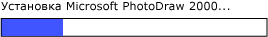

# Реализация шаблона элемента управления RangeValue автоматизации пользовательского интерфейса
> [!NOTE]
> Эта документация предназначена для разработчиков .NET Framework, желающих использовать управляемые классы [!INCLUDE[TLA2#tla_uiautomation](../../../includes/tla2sharptla-uiautomation-md.md)] , заданные в пространстве имен <xref:System.Windows.Automation> . Последние сведения о [!INCLUDE[TLA2#tla_uiautomation](../../../includes/tla2sharptla-uiautomation-md.md)]см. в разделе [API автоматизации Windows. Автоматизация пользовательского интерфейса](/windows/win32/winauto/entry-uiauto-win32).  
  
 В этом разделе приводятся рекомендации и соглашения для реализации <xref:System.Windows.Automation.Provider.IRangeValueProvider>, включая сведения о событиях и свойствах. Ссылки на дополнительные материалы перечислены в конце раздела.  
  
 Шаблон элемента управления <xref:System.Windows.Automation.RangeValuePattern> используется для поддержки элементов управления, для которых можно установить значение из диапазона. Примеры элементов управления, реализующих данный шаблон элемента управления, см. в разделе [Control Pattern Mapping for UI Automation Clients](control-pattern-mapping-for-ui-automation-clients.md).  
  

## Правила и соглашения реализации  
 При реализации шаблона элемента управления Range Value обратите внимание на следующие правила и соглашения.  
  
- Элементы управления позволяют повторную калибровку своих поддерживаемых свойств на основе языкового стандарта или предпочтений пользователя. Примером этого является элемент управления "Термометр", который можно задать для отображения температуры в шкале Цельсия или Фаренгейта.  
  
- Элементы управления, имеющие неоднозначные значения диапазона, такие как индикаторы выполнения или ползунки, должны нормализовать эти значения.  
  
   
Пример индикатора выполнения, где значение имеет тип Integer, а минимальное и максимальное значения свойства нормализованы до 0 и 100 соответственно  
  

## Обязательные члены для IRangeValueProvider  
  
|Обязательный член|Тип члена|Примечания|  
|---------------------|-----------------|-----------|  
|<xref:System.Windows.Automation.RangeValuePattern.IsReadOnlyProperty>|Свойство|None|  
|<xref:System.Windows.Automation.RangeValuePattern.ValueProperty>|Свойство|None|  
|<xref:System.Windows.Automation.RangeValuePattern.LargeChangeProperty>|Свойство|None|  
|<xref:System.Windows.Automation.RangeValuePattern.SmallChangeProperty>|Свойство|None|  
|<xref:System.Windows.Automation.RangeValuePattern.MaximumProperty>|Свойство|None|  
|<xref:System.Windows.Automation.RangeValuePattern.MinimumProperty>|Свойство|None|  
|<xref:System.Windows.Automation.RangeValuePattern.SetValue%2A>|Методы|None|  
  
 Этот шаблон элемента управления не имеет связанных событий.  
  

## Исключения  
 Поставщики должны вызывать следующие исключения.  
  
|Тип исключения|Условие|  
|--------------------|---------------|  
|<xref:System.ArgumentOutOfRangeException>|Метод<xref:System.Windows.Automation.RangeValuePattern.SetValue%2A> вызывается со значением либо больше, чем <xref:System.Windows.Automation.RangeValuePattern.MaximumProperty> , либо меньше, чем <xref:System.Windows.Automation.RangeValuePattern.MinimumProperty>.|  
  
## См. также раздел

- [UI Automation Control Patterns Overview](ui-automation-control-patterns-overview.md)
- [Поддержка шаблонов элементов управления в поставщике модели автоматизации пользовательского интерфейса](support-control-patterns-in-a-ui-automation-provider.md)
- [Шаблоны элементов управления модели автоматизации пользовательского интерфейса для клиентов](ui-automation-control-patterns-for-clients.md)
- [UI Automation Tree Overview](ui-automation-tree-overview.md)
- [Использование кэширования в модели автоматизации пользовательского интерфейса](use-caching-in-ui-automation.md)
