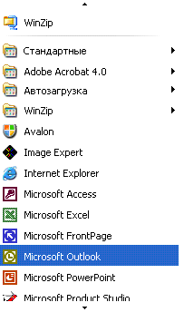

# Реализация шаблона элемента управления Scroll для автоматизации пользовательского интерфейсаImplementing the UI Automation Scroll Control Pattern
> [!NOTE]
> Эта документация предназначена для разработчиков .NET Framework, желающих использовать управляемые классы [!INCLUDE[TLA2#tla_uiautomation](../../../includes/tla2sharptla-uiautomation-md.md)] , заданные в пространстве имен <xref:System.Windows.Automation> .This documentation is intended for .NET Framework developers who want to use the managed [!INCLUDE[TLA2#tla_uiautomation](../../../includes/tla2sharptla-uiautomation-md.md)] classes defined in the <xref:System.Windows.Automation> namespace. Последние сведения о [!INCLUDE[TLA2#tla_uiautomation](../../../includes/tla2sharptla-uiautomation-md.md)]см. в разделе [API автоматизации Windows. Автоматизация пользовательского интерфейса](/windows/win32/winauto/entry-uiauto-win32).For the latest information about [!INCLUDE[TLA2#tla_uiautomation](../../../includes/tla2sharptla-uiautomation-md.md)], see [Windows Automation API: UI Automation](/windows/win32/winauto/entry-uiauto-win32).  
  
 В этом разделе приводятся рекомендации и соглашения для реализации <xref:System.Windows.Automation.Provider.IScrollProvider>, включая сведения о событиях и свойствах.This topic introduces guidelines and conventions for implementing <xref:System.Windows.Automation.Provider.IScrollProvider>, including information about events and properties. Ссылки на дополнительные материалы перечислены в конце раздела.Links to additional references are listed at the end of the topic.  
  
 Шаблон элемента управления <xref:System.Windows.Automation.ScrollPattern> используется для поддержки элемента управления, который выступает в качестве прокручиваемого контейнера для коллекции дочерних объектов.The <xref:System.Windows.Automation.ScrollPattern> control pattern is used to support a control that acts as a scrollable container for a collection of child objects. Этому элементу управления не обязательно использовать полосы прокрутки для поддержки функции прокрутки, хотя обычно это делается.The control is not required to use scrollbars to support the scrolling functionality, although it commonly does.  
  
   
Пример элемента управления прокрутки, не использующего полосы прокруткиExample of a Scrolling Control that Does Not Use Scrollbars  
  
 Примеры элементов управления, реализующих данный шаблон элемента управления, см. в разделе [Control Pattern Mapping for UI Automation Clients](control-pattern-mapping-for-ui-automation-clients.md).For examples of controls that implement this control, see [Control Pattern Mapping for UI Automation Clients](control-pattern-mapping-for-ui-automation-clients.md).  
  
   
## Правила и соглашения реализацииImplementation Guidelines and Conventions  
 При реализации шаблона элемента управления Scroll обратите внимание на следующие правила и соглашения.When implementing the Scroll control pattern, note the following guidelines and conventions:  
  
- Дочерние элементы данного элемента управления должны реализовывать <xref:System.Windows.Automation.Provider.IScrollItemProvider>.The children of this control must implement <xref:System.Windows.Automation.Provider.IScrollItemProvider>.  
  
- Полосы прокрутки контейнерного элемента управления не поддерживают шаблон элемента управления <xref:System.Windows.Automation.ScrollPattern> .The scrollbars of a container control do not support the <xref:System.Windows.Automation.ScrollPattern> control pattern. Вместо него они должны поддерживать шаблон элемента управления <xref:System.Windows.Automation.RangeValuePattern> .They must support the <xref:System.Windows.Automation.RangeValuePattern> control pattern instead.  
  
- Если прокрутка измеряется в процентах, все значения или величины, связанные с делением шкалы прокрутки, должны быть нормализованы в диапазоне от 0 до 100.When scrolling is measured in percentages, all values or amounts related to scroll graduation must be normalized to a range of 0 to 100.  
  
- Свойства<xref:System.Windows.Automation.ScrollPatternIdentifiers.HorizontallyScrollableProperty> и <xref:System.Windows.Automation.ScrollPatternIdentifiers.VerticallyScrollableProperty> не зависят от <xref:System.Windows.Automation.AutomationElement.IsEnabledProperty>.<xref:System.Windows.Automation.ScrollPatternIdentifiers.HorizontallyScrollableProperty> and <xref:System.Windows.Automation.ScrollPatternIdentifiers.VerticallyScrollableProperty> are independent of the <xref:System.Windows.Automation.AutomationElement.IsEnabledProperty>.  
  
- Если свойство <xref:System.Windows.Automation.ScrollPatternIdentifiers.HorizontallyScrollableProperty> = `false` , то свойство <xref:System.Windows.Automation.ScrollPatternIdentifiers.HorizontalViewSizeProperty> должно иметь значение 100 %, а свойство <xref:System.Windows.Automation.ScrollPatternIdentifiers.HorizontalScrollPercentProperty> должно иметь значение <xref:System.Windows.Automation.ScrollPatternIdentifiers.NoScroll>.If <xref:System.Windows.Automation.ScrollPatternIdentifiers.HorizontallyScrollableProperty> = `false` then <xref:System.Windows.Automation.ScrollPatternIdentifiers.HorizontalViewSizeProperty> should be set to 100% and <xref:System.Windows.Automation.ScrollPatternIdentifiers.HorizontalScrollPercentProperty> should be set to <xref:System.Windows.Automation.ScrollPatternIdentifiers.NoScroll>. Аналогично, если свойство <xref:System.Windows.Automation.ScrollPatternIdentifiers.VerticallyScrollableProperty> = `false` , то свойство <xref:System.Windows.Automation.ScrollPatternIdentifiers.VerticalViewSizeProperty> должно иметь значение 100 %, а свойство <xref:System.Windows.Automation.ScrollPatternIdentifiers.VerticalScrollPercentProperty> должно иметь значение <xref:System.Windows.Automation.ScrollPatternIdentifiers.NoScroll>.Likewise, if <xref:System.Windows.Automation.ScrollPatternIdentifiers.VerticallyScrollableProperty> = `false` then <xref:System.Windows.Automation.ScrollPatternIdentifiers.VerticalViewSizeProperty> should be set to 100 percent and <xref:System.Windows.Automation.ScrollPatternIdentifiers.VerticalScrollPercentProperty> should be set to <xref:System.Windows.Automation.ScrollPatternIdentifiers.NoScroll>. Это позволяет клиенту автоматизации пользовательского интерфейса использовать эти значения свойств в методе <xref:System.Windows.Automation.ScrollPattern.SetScrollPercent%2A> , избегая [состояния гонки](https://support.microsoft.com/default.aspx?scid=kb;en-us;317723) , если клиент не заинтересован в активации прокрутки.This allows a UI Automation client to use these property values within the <xref:System.Windows.Automation.ScrollPattern.SetScrollPercent%2A> method while avoiding a [race condition](https://support.microsoft.com/default.aspx?scid=kb;en-us;317723) if a direction the client is not interested in scrolling becomes activated.  
  
- <xref:System.Windows.Automation.Provider.IScrollProvider.HorizontalScrollPercent%2A> зависит от конкретного языка.<xref:System.Windows.Automation.Provider.IScrollProvider.HorizontalScrollPercent%2A> is locale-specific. Установка HorizontalScrollPercent = 100.0 должна задавать расположение прокрутки элемента управления в крайней правой позиции для таких языков, как английский, где чтение выполняется слева направо.Setting HorizontalScrollPercent = 100.0 must set the scrolling location of the control to the equivalent of its rightmost position for languages such as English that read left to right. И наоборот, для таких языков, как арабский, где чтение выполняется справа налево, установка HorizontalScrollPercent = 100.0 должен задавать расположение прокрутки в крайней левой позиции.Alternately, for languages such as Arabic that read right to left, setting HorizontalScrollPercent = 100.0 must set the scroll location to the leftmost position.  
  
   
## Обязательные члены для IScrollProviderRequired Members for IScrollProvider  
 Следующие свойства и методы обязательны для реализации <xref:System.Windows.Automation.Provider.IScrollProvider>.The following properties and methods are required for implementing <xref:System.Windows.Automation.Provider.IScrollProvider>.  
  
|Обязательный членRequired member|Тип членаMember type|ПримечанияNotes|  
|---------------------|-----------------|-----------|  
|<xref:System.Windows.Automation.Provider.IScrollProvider.HorizontalScrollPercent%2A>|свойство;Property|ОтсутствуютNone|  
|<xref:System.Windows.Automation.Provider.IScrollProvider.VerticalScrollPercent%2A>|свойство;Property|ОтсутствуютNone|  
|<xref:System.Windows.Automation.Provider.IScrollProvider.HorizontalViewSize%2A>|свойство;Property|ОтсутствуютNone|  
|<xref:System.Windows.Automation.Provider.IScrollProvider.VerticalViewSize%2A>|свойство;Property|ОтсутствуютNone|  
|<xref:System.Windows.Automation.Provider.IScrollProvider.HorizontallyScrollable%2A>|свойство;Property|ОтсутствуютNone|  
|<xref:System.Windows.Automation.Provider.IScrollProvider.VerticallyScrollable%2A>|свойство;Property|ОтсутствуютNone|  
|<xref:System.Windows.Automation.Provider.IScrollProvider.Scroll%2A>|МетодMethod|ОтсутствуютNone|  
|<xref:System.Windows.Automation.Provider.IScrollProvider.SetScrollPercent%2A>|МетодMethod|ОтсутствуютNone|  
  
 Этот шаблон элемента управления не имеет связанных событий.This control pattern has no associated events.  
  
   
## ИсключенияExceptions  
 Поставщики должны вызывать следующие исключения.Providers must throw the following exceptions.  
  
|Тип исключенияException Type|УсловиеCondition|  
|--------------------|---------------|  
|<xref:System.ArgumentException>|Метод<xref:System.Windows.Automation.Provider.IScrollProvider.Scroll%2A> вызывает данное исключение, если элемент управления поддерживает значения <xref:System.Windows.Automation.ScrollAmount.SmallIncrement> исключительно для горизонтальной или вертикальной прокрутки, но передано значение <xref:System.Windows.Automation.ScrollAmount.LargeIncrement> .<xref:System.Windows.Automation.Provider.IScrollProvider.Scroll%2A> throws this exception if a control supports <xref:System.Windows.Automation.ScrollAmount.SmallIncrement> values exclusively for horizontal or vertical scrolling, but a <xref:System.Windows.Automation.ScrollAmount.LargeIncrement> value is passed in.|  
|<xref:System.ArgumentException>|Метод<xref:System.Windows.Automation.Provider.IScrollProvider.SetScrollPercent%2A> вызывает данное исключение, если передается значение, которое невозможно преобразовать к типу double.<xref:System.Windows.Automation.Provider.IScrollProvider.SetScrollPercent%2A> throws this exception when a value that cannot be converted to a double is passed in.|  
|<xref:System.ArgumentOutOfRangeException>|Метод<xref:System.Windows.Automation.Provider.IScrollProvider.SetScrollPercent%2A> создает исключение, если переданное значение меньше 0 или больше 100 (за исключением -1, что эквивалентно <xref:System.Windows.Automation.ScrollPatternIdentifiers.NoScroll>).<xref:System.Windows.Automation.Provider.IScrollProvider.SetScrollPercent%2A> throws this exception when a value greater than 100 or less than 0 is passed in (except -1 which is equivalent to <xref:System.Windows.Automation.ScrollPatternIdentifiers.NoScroll>).|  
|<xref:System.InvalidOperationException>|Оба метода, <xref:System.Windows.Automation.Provider.IScrollProvider.Scroll%2A> и <xref:System.Windows.Automation.Provider.IScrollProvider.SetScrollPercent%2A> , вызывают это исключение при попытке прокрутки в неподдерживаемом направлении.Both <xref:System.Windows.Automation.Provider.IScrollProvider.Scroll%2A> and <xref:System.Windows.Automation.Provider.IScrollProvider.SetScrollPercent%2A> throw this exception when an attempt is made to scroll in an unsupported direction.|  
  
## См. такжеSee also

- [Общие сведения о шаблонах элементов управления модели автоматизации пользовательского интерфейсаUI Automation Control Patterns Overview](ui-automation-control-patterns-overview.md)
- [Поддержка шаблонов элементов управления в поставщике автоматизации пользовательского интерфейсаSupport Control Patterns in a UI Automation Provider](support-control-patterns-in-a-ui-automation-provider.md)
- [Шаблоны элементов управления модели автоматизации пользовательского интерфейса для клиентовUI Automation Control Patterns for Clients](ui-automation-control-patterns-for-clients.md)
- [Общие сведения о дереве модели автоматизации пользовательского интерфейсаUI Automation Tree Overview](ui-automation-tree-overview.md)
- [Использование кэширования в модели автоматизации пользовательского интерфейсаUse Caching in UI Automation](use-caching-in-ui-automation.md)
