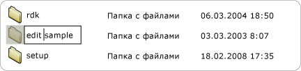
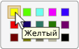

# Реализация шаблона элемента управления Value модели автоматизации пользовательского интерфейсаImplementing the UI Automation Value Control Pattern
> [!NOTE]
> Эта документация предназначена для разработчиков .NET Framework, желающих использовать управляемые классы [!INCLUDE[TLA2#tla_uiautomation](../../../includes/tla2sharptla-uiautomation-md.md)] , заданные в пространстве имен <xref:System.Windows.Automation> .This documentation is intended for .NET Framework developers who want to use the managed [!INCLUDE[TLA2#tla_uiautomation](../../../includes/tla2sharptla-uiautomation-md.md)] classes defined in the <xref:System.Windows.Automation> namespace. Последние сведения о [!INCLUDE[TLA2#tla_uiautomation](../../../includes/tla2sharptla-uiautomation-md.md)]см. в разделе [API автоматизации Windows. Автоматизация пользовательского интерфейса](/windows/win32/winauto/entry-uiauto-win32).For the latest information about [!INCLUDE[TLA2#tla_uiautomation](../../../includes/tla2sharptla-uiautomation-md.md)], see [Windows Automation API: UI Automation](/windows/win32/winauto/entry-uiauto-win32).  
  
 В этом разделе приводятся рекомендации и соглашения для реализации <xref:System.Windows.Automation.Provider.IValueProvider>, включая сведения о событиях и свойствах.This topic introduces guidelines and conventions for implementing <xref:System.Windows.Automation.Provider.IValueProvider>, including information on events and properties. Ссылки на дополнительные материалы перечислены в конце раздела.Links to additional references are listed at the end of the topic.  
  
 Шаблон элемента управления <xref:System.Windows.Automation.ValuePattern> используется для поддержки элементов управления, имеющих встроенное значение, которое не попадает в диапазон и может быть представлено в виде строки.The <xref:System.Windows.Automation.ValuePattern> control pattern is used to support controls that have an intrinsic value not spanning a range and that can be represented as a string. Эта строка может быть редактируемой в зависимости от элемента управления и его параметров.This string can be editable, depending on the control and its settings. Примеры элементов управления, реализующих данный шаблон элемента управления, см. в разделе [Control Pattern Mapping for UI Automation Clients](control-pattern-mapping-for-ui-automation-clients.md).For examples of controls that implement this pattern, see [Control Pattern Mapping for UI Automation Clients](control-pattern-mapping-for-ui-automation-clients.md).  
  

## Правила и соглашения реализацииImplementation Guidelines and Conventions  
 При реализации шаблона элемента управления Value обратите внимание на следующие правила и соглашения.When implementing the Value control pattern, note the following guidelines and conventions:  
  
- Элементы управления, такие как <xref:System.Windows.Automation.ControlType.ListItem> и <xref:System.Windows.Automation.ControlType.TreeItem> , должны поддерживать шаблон <xref:System.Windows.Automation.ValuePattern> , если значение любого из элементов можно изменять независимо от текущего режима редактирования элемента управления.Controls such as <xref:System.Windows.Automation.ControlType.ListItem> and <xref:System.Windows.Automation.ControlType.TreeItem> must support <xref:System.Windows.Automation.ValuePattern> if the value of any of the items is editable, regardless of the current edit mode of the control. Родительский элемент управления также должен поддерживать шаблон <xref:System.Windows.Automation.ValuePattern> , если дочерние элементы являются редактируемыми.The parent control must also support <xref:System.Windows.Automation.ValuePattern> if the child items are editable.  
  
   
Пример редактируемого элемента спискаExample of an Editable List Item  
  
- Однострочные элементы управления "Поле ввода" поддерживают программный доступ к своему содержимому путем реализации <xref:System.Windows.Automation.Provider.IValueProvider>.Single-line edit controls support programmatic access to their contents by implementing <xref:System.Windows.Automation.Provider.IValueProvider>. Однако многострочные элементы управления "Поле ввода" не реализуют <xref:System.Windows.Automation.Provider.IValueProvider>; вместо этого они предоставляют доступ к своему содержимому путем реализации <xref:System.Windows.Automation.Provider.ITextProvider>.However, multi-line edit controls do not implement <xref:System.Windows.Automation.Provider.IValueProvider>; instead they provide access to their content by implementing <xref:System.Windows.Automation.Provider.ITextProvider>.  
  
- Для получения текстового содержимого многострочного элемента управления "Поле ввода" этот элемент управления должен реализовывать <xref:System.Windows.Automation.Provider.ITextProvider>.To retrieve the textual contents of a multi-line edit control, the control must implement <xref:System.Windows.Automation.Provider.ITextProvider>. Однако <xref:System.Windows.Automation.Provider.ITextProvider> не поддерживает установку значения элемента управления.However, <xref:System.Windows.Automation.Provider.ITextProvider> does not support setting the value of a control.  
  
- <xref:System.Windows.Automation.Provider.IValueProvider> не поддерживает извлечение сведений о форматировании или значений подстроки.<xref:System.Windows.Automation.Provider.IValueProvider> does not support the retrieval of formatting information or substring values. Реализуйте <xref:System.Windows.Automation.Provider.ITextProvider> в этих сценариях.Implement <xref:System.Windows.Automation.Provider.ITextProvider> in these scenarios.  
  
- <xref:System.Windows.Automation.Provider.IValueProvider>должны быть реализованы с помощью элементов управления, таких как управление **выбором Color Picker** от Microsoft Word (иллюстрированный ниже), который поддерживает строку отображение между значением цвета (например, "желтый") и эквивалентной внутренней структурой RGB.<xref:System.Windows.Automation.Provider.IValueProvider> must be implemented by controls such as the **Color Picker** selection control from Microsoft Word (illustrated below), which supports string mapping between a color value (for example, "yellow") and an equivalent internal RGB structure.  
  
   
Пример сопоставления строки настройки цветаExample of Color Swatch String Mapping  
  
- Элемент управления должен иметь свойство <xref:System.Windows.Automation.AutomationElement.IsEnabledProperty> , установленное в значение `true` , и свойство <xref:System.Windows.Automation.ValuePattern.IsReadOnlyProperty> , установленное в значение `false` , перед разрешением вызова метода <xref:System.Windows.Automation.Provider.IValueProvider.SetValue%2A>.A control should have its <xref:System.Windows.Automation.AutomationElement.IsEnabledProperty> set to `true` and its <xref:System.Windows.Automation.ValuePattern.IsReadOnlyProperty> set to `false` before allowing a call to <xref:System.Windows.Automation.Provider.IValueProvider.SetValue%2A>.  
  

## Обязательные члены для IValueProviderRequired Members for IValueProvider  
 Следующие свойства и методы обязательны для реализации <xref:System.Windows.Automation.Provider.IValueProvider>.The following properties and methods are required for implementing <xref:System.Windows.Automation.Provider.IValueProvider>.  
  
|Обязательные членыRequired members|Тип членаMember type|ПримечанияNotes|  
|----------------------|-----------------|-----------|  
|<xref:System.Windows.Automation.ValuePattern.IsReadOnlyProperty>|СвойствоProperty|NoneNone|  
|<xref:System.Windows.Automation.ValuePattern.ValueProperty>|СвойствоProperty|NoneNone|  
|<xref:System.Windows.Automation.ValuePattern.SetValue%2A>|МетодMethod|NoneNone|  
  

## ИсключенияExceptions  
 Поставщики должны вызывать следующие исключения.Providers must throw the following exceptions.  
  
|Тип исключенияException type|УсловиеCondition|  
|--------------------|---------------|  
|<xref:System.InvalidOperationException>|<xref:System.Windows.Automation.ValuePattern.SetValue%2A>   - Если информация, связанная с локальной информацией, передается в элемент управления в неправильном формате, например неправильно отформатированная дата.-   If locale-specific information is passed to a control in an incorrect format such as an incorrectly formatted date.|  
|<xref:System.ArgumentException>|<xref:System.Windows.Automation.ValuePattern.SetValue%2A>   - Если новое значение не может быть преобразовано из строки в формат, который распознает элемент управления.-   If a new value cannot be converted from a string to a format the control recognizes.|  
|<xref:System.Windows.Automation.ElementNotEnabledException>|<xref:System.Windows.Automation.ValuePattern.SetValue%2A>   - При попытке манипулировать элементом управления, который не включен.-   When an attempt is made to manipulate a control that is not enabled.|  
  
## См. также разделSee also

- [UI Automation Control Patterns OverviewUI Automation Control Patterns Overview](ui-automation-control-patterns-overview.md)
- [Поддержка шаблонов элементов управления в поставщике модели автоматизации пользовательского интерфейсаSupport Control Patterns in a UI Automation Provider](support-control-patterns-in-a-ui-automation-provider.md)
- [Шаблоны элементов управления модели автоматизации пользовательского интерфейса для клиентовUI Automation Control Patterns for Clients](ui-automation-control-patterns-for-clients.md)
- [Образец текста ValuePattern ВставитьValuePattern Insert Text Sample](https://github.com/Microsoft/WPF-Samples/tree/master/Accessibility/InsertText)
- [UI Automation Tree OverviewUI Automation Tree Overview](ui-automation-tree-overview.md)
- [Использование кэширования в модели автоматизации пользовательского интерфейсаUse Caching in UI Automation](use-caching-in-ui-automation.md)
