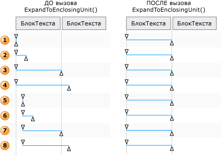

# Общие сведения об объектах TextPattern и Embedded
> [!NOTE]
> Эта документация предназначена для разработчиков .NET Framework, желающих использовать управляемые классы [!INCLUDE[TLA2#tla_uiautomation](../../../includes/tla2sharptla-uiautomation-md.md)] , заданные в пространстве имен <xref:System.Windows.Automation> . Последние сведения о [!INCLUDE[TLA2#tla_uiautomation](../../../includes/tla2sharptla-uiautomation-md.md)]см. в разделе [API автоматизации Windows. Автоматизация пользовательского интерфейса](/windows/win32/winauto/entry-uiauto-win32).  
  
 В этом обзоре описано, как [!INCLUDE[TLA#tla_uiautomation](../../../includes/tlasharptla-uiautomation-md.md)] представляет внедренные объекты или дочерние элементы в текстовом документе или контейнере.  
  
 Во [!INCLUDE[TLA2#tla_uiautomation](../../../includes/tla2sharptla-uiautomation-md.md)] встроенном объекте находится любой элемент, который имеет нетекстовые границы; например, изображение, гиперссылка, таблица или тип документа, такие как электронная таблица Microsoft Excel или файл Microsoft Windows Media. Это отличается от стандартного определения, где элемент создается в одном приложении и внедряется или связывается в другом. То, может ли объект редактироваться в его исходном приложении, не важно в контексте [!INCLUDE[TLA2#tla_uiautomation](../../../includes/tla2sharptla-uiautomation-md.md)].  
  

## Внедренные объекты и дерево модели автоматизации пользовательского интерфейса  
 Внедренные объекты рассматриваются как отдельные элементы в представлении элементов управления дерева [!INCLUDE[TLA2#tla_uiautomation](../../../includes/tla2sharptla-uiautomation-md.md)] . Они представляются как дочерние элементы контейнера текста, чтобы доступ к ним можно было получать с помощью той же модели, как и для других элементов управления в [!INCLUDE[TLA2#tla_uiautomation](../../../includes/tla2sharptla-uiautomation-md.md)].  
  
   
Пример контейнера текста внедренными объектами таблицы, изображения и гиперссылки  
  
   
Пример представления содержимого для части предыдущего контейнера текста  
  

## Предоставление внедренных объектов с помощью TextPattern и TextPatternRange  
 Используемые в сочетании, класс шаблона элемента управления <xref:System.Windows.Automation.TextPattern> и класс <xref:System.Windows.Automation.Text.TextPatternRange> предоставляют методы и свойства, упрощающие навигацию и запросы внедренных объектов.  
  
 Текстовое содержимое (или внутренний текст) контейнера текста и внедренного объекта, например гиперссылки или ячейки таблицы, представляется как один непрерывный текстовый поток и в представлении элемента управления и в представлении содержимого дерева [!INCLUDE[TLA2#tla_uiautomation](../../../includes/tla2sharptla-uiautomation-md.md)] . Границы объекта игнорируются. Если клиент автоматизации пользовательского интерфейса извлекает текст с целью вывода, интерпретации или анализа, текстовый диапазон следует проверить на соответствие особым случаям, например таблице с текстовым содержимым или другим внедренным объектам. Для этого можно вызвать <xref:System.Windows.Automation.Text.TextPatternRange.GetChildren%2A> , чтобы получить <xref:System.Windows.Automation.AutomationElement> для каждого внедренного объекта, и затем вызвать <xref:System.Windows.Automation.TextPattern.RangeFromChild%2A> , чтобы получить текстовый диапазон для каждого элемента. Это выполняется рекурсивно, пока не будет получено все текстовое содержимое.  
  
   
Пример текстового потока с внедренными объектами и их диапазонами  
  
 Для обхода содержимого текстового диапазона в фоновом режиме применяется ряд шагов для успешного выполнения метода <xref:System.Windows.Automation.Text.TextPatternRange.Move%2A> .  
  
1. Текстовый диапазон нормализован, т. е. он свернут до вырожденного диапазона в конечной точке <xref:System.Windows.Automation.Text.TextPatternRangeEndpoint.Start> , что делает конечную точку <xref:System.Windows.Automation.Text.TextPatternRangeEndpoint.End> избыточной. Этот шаг необходим для устранения двусмысленности в ситуациях, когда диапазон текста охватывает <xref:System.Windows.Automation.Text.TextUnit> границы: например, `{The URL https://www.microsoft.com is embedded in text` где «я» и «я» являются конечными точками диапазона текста.  
  
2. Результирующий диапазон перемещается в <xref:System.Windows.Automation.TextPattern.DocumentRange%2A> в начало запрошенной границы <xref:System.Windows.Automation.Text.TextUnit> .  
  
3. Диапазон перемещается вперед или назад в <xref:System.Windows.Automation.TextPattern.DocumentRange%2A> на запрошенное число границ <xref:System.Windows.Automation.Text.TextUnit> .  
  
4. Затем диапазон расширяется из вырожденного состояния путем перемещения конечной точки <xref:System.Windows.Automation.Text.TextPatternRangeEndpoint.End> на одну запрошенную границу <xref:System.Windows.Automation.Text.TextUnit> .  
  
   
Примеры корректировки текстового диапазона для Move() и ExpandToEnclosingUnit()  
  

## Распространенные сценарии  
 В следующих разделах представлены примеры наиболее распространенных сценариев, использующих внедренные объекты.  
  
 Условные обозначения для приведенных примеров:  
  
 { = <xref:System.Windows.Automation.Text.TextPatternRangeEndpoint.Start>  
  
 } = <xref:System.Windows.Automation.Text.TextPatternRangeEndpoint.End>  
  
### Hyperlink  

**Пример 1. Текстовый диапазон, содержащий внедренную текстовую гиперссылку**
  
`{The URL https://www.microsoft.com is embedded in text}.`
  
|Вызываемый метод|Результат|  
|-------------------|------------|  
|<xref:System.Windows.Automation.Text.TextPatternRange.GetText%2A>|Возвращает строку `The URL https://www.microsoft.com is embedded in text`.|  
|<xref:System.Windows.Automation.Text.TextPatternRange.GetEnclosingElement%2A>|Возвращает внутренний <xref:System.Windows.Automation.AutomationElement> , который охватывает диапазон текста. В этом случае это <xref:System.Windows.Automation.AutomationElement> , представляющий поставщик текста.|  
|<xref:System.Windows.Automation.Text.TextPatternRange.GetChildren%2A>|Возвращает <xref:System.Windows.Automation.AutomationElement> , представляющий элемент управления гиперссылки.|  
|<xref:System.Windows.Automation.TextPattern.RangeFromChild%2A> , где <xref:System.Windows.Automation.AutomationElement> — это объект, возвращаемый предыдущим методом `GetChildren` .|Возвращает диапазон, которыйhttps://www.microsoft.comпредставляет "|  
  
 **Пример 2. Текстовый диапазон, частично охватывающий внедренную текстовую гиперссылку**  
  
 URL-адрес `https://{[www]}` встроен в текст.  
  
|Вызываемый метод|Результат|  
|-------------------|------------|  
|<xref:System.Windows.Automation.Text.TextPatternRange.GetText%2A>|Возвращает строку "www".|  
|<xref:System.Windows.Automation.Text.TextPatternRange.GetEnclosingElement%2A>|Возвращает внутренний <xref:System.Windows.Automation.AutomationElement> , который охватывает диапазон текста. В этом случае это элемент управления гиперссылки.|  
|<xref:System.Windows.Automation.Text.TextPatternRange.GetChildren%2A>|Возвращает, `null` так как диапазон текста не охватывает всю строку URL-адреса.|  
  
**Пример 3 - текстовый диапазон, частично охватывающий содержимое текстового контейнера. Текстовый контейнер имеет встроенную гиперссылку текста, которая не является частью диапазона текста.**  
  
`{The URL} [https://www.microsoft.com](https://www.microsoft.com) is embedded in text.`
  
|Вызываемый метод|Результат|  
|-------------------|------------|  
|<xref:System.Windows.Automation.Text.TextPatternRange.GetText%2A>|Возвращает строку "URL-адрес".|  
|<xref:System.Windows.Automation.Text.TextPatternRange.GetEnclosingElement%2A>|Возвращает внутренний <xref:System.Windows.Automation.AutomationElement> , который охватывает диапазон текста. В этом случае это <xref:System.Windows.Automation.AutomationElement> , представляющий поставщик текста.|  
|<xref:System.Windows.Automation.Text.TextPatternRange.Move%2A> с параметрами (TextUnit.Word, 1).|Перемещает занимаемый диапазон текста к "http", так как текст гиперссылки состоит из отдельных слов. В этом случае гиперссылка не рассматривается как один объект.   URL-адрес (http) встроен в текст.|  
  

### Образ —  
 **Пример 1. Текстовый диапазон, содержащий внедренное изображение**  
  
 «Пример  в текст».  
  
|Вызываемый метод|Результат|  
|-------------------|------------|  
|<xref:System.Windows.Automation.Text.TextPatternRange.GetText%2A>|Возвращает строку "внедрено в текст". Любой замещающий текст, связанный с изображением, не может быть включен в текстовый поток.|  
|<xref:System.Windows.Automation.Text.TextPatternRange.GetEnclosingElement%2A>|Возвращает внутренний <xref:System.Windows.Automation.AutomationElement> , который охватывает диапазон текста. В этом случае это <xref:System.Windows.Automation.AutomationElement> , представляющий поставщик текста.|  
|<xref:System.Windows.Automation.Text.TextPatternRange.GetChildren%2A>|Возвращает <xref:System.Windows.Automation.AutomationElement> , представляющий элемент управления изображения.|  
|<xref:System.Windows.Automation.TextPattern.RangeFromChild%2A> , где <xref:System.Windows.Automation.AutomationElement> — это объект, возвращаемый предыдущим методом <xref:System.Windows.Automation.Text.TextPatternRange.GetChildren%2A> .|Возвращает вырожденный диапазон, представляющий «».|  
  
 **Пример 2 - текстовый диапазон, частично охватывающий содержимое текстового контейнера. Текстовый контейнер имеет встроенное изображение, которое не является частью диапазона текста.**  
  
 (Изображение)  встроен в текст.  
  
|Вызываемый метод|Результат|  
|-------------------|------------|  
|<xref:System.Windows.Automation.Text.TextPatternRange.GetText%2A>|Возвращает строку "Изображение".|  
|<xref:System.Windows.Automation.Text.TextPatternRange.GetEnclosingElement%2A>|Возвращает внутренний <xref:System.Windows.Automation.AutomationElement> , который охватывает диапазон текста. В этом случае это <xref:System.Windows.Automation.AutomationElement> , представляющий поставщик текста.|  
|<xref:System.Windows.Automation.Text.TextPatternRange.Move%2A> с параметрами (TextUnit.Word, 1).|Перемещает текстовый диапазон к "is". Поскольку только основанные на тексте внедренные объекты считаются частью текстового потока, изображение в этом примере не влияет на перемещение или возвращаемое значение (1 в данном случае).|  
  

### Таблица  
  
### Таблица, используемая для примеров  
  
|Ячейка с изображением|Ячейка с текстом|  
|---------------------|--------------------|  
||X|  
||Да|  
|   Изображение для Z|Z|  
  
 **Пример 1. Получение контейнера текста из содержимого ячейки.**  
  
|Вызываемый метод|Результат|  
|-------------------|------------|  
|<xref:System.Windows.Automation.GridPattern.GetItem%2A> с параметрами (0,0)|Возвращает <xref:System.Windows.Automation.AutomationElement> , представляющий содержимое ячейки таблицы. В этом случае элемент — это текстовый элемент управления.|  
|<xref:System.Windows.Automation.TextPattern.RangeFromChild%2A> , где <xref:System.Windows.Automation.AutomationElement> — это объект, возвращаемый предыдущим методом `GetItem` .|Возвращает диапазон, охватывающий |  
|<xref:System.Windows.Automation.Text.TextPatternRange.GetEnclosingElement%2A> для объекта, возвращаемого предыдущим методом `RangeFromChild` .|Возвращает <xref:System.Windows.Automation.AutomationElement> , представляющий ячейку таблицы. В этом случае элемент — это текстовый элемент управления, поддерживающий TableItemPattern.|  
|<xref:System.Windows.Automation.Text.TextPatternRange.GetEnclosingElement%2A> для объекта, возвращаемого предыдущим методом `GetEnclosingElement` .|Возвращает <xref:System.Windows.Automation.AutomationElement> , представляющий таблицу.|  
|<xref:System.Windows.Automation.Text.TextPatternRange.GetEnclosingElement%2A> для объекта, возвращаемого предыдущим методом `GetEnclosingElement` .|Возвращает <xref:System.Windows.Automation.AutomationElement> , представляющий поставщик текста.|  
  
 **Пример 2. Получение текстового содержимого ячейки.**  
  
|Вызываемый метод|Результат|  
|-------------------|------------|  
|<xref:System.Windows.Automation.GridPattern.GetItem%2A> с параметрами (1,1).|Возвращает <xref:System.Windows.Automation.AutomationElement> , представляющий содержимое ячейки таблицы. В этом случае элемент — это текстовый элемент управления.|  
|<xref:System.Windows.Automation.TextPattern.RangeFromChild%2A> , где <xref:System.Windows.Automation.AutomationElement> — это объект, возвращаемый предыдущим методом `GetItem` .|Возвращает "Y".|  
  
## См. также раздел

- <xref:System.Windows.Automation.TextPattern>
- <xref:System.Windows.Automation.Text.TextPatternRange>
- <xref:System.Windows.Automation.Provider.ITextProvider>
- <xref:System.Windows.Automation.Provider.ITextRangeProvider>
- [Доступ ко внедренным объектам с помощью автоматизации пользовательского интерфейса](access-embedded-objects-using-ui-automation.md)
- [Представление содержимого таблицы с помощью автоматизации пользовательского интерфейса](expose-the-content-of-a-table-using-ui-automation.md)
- [Проход по тексту при помощи модели автоматизации пользовательского интерфейса](traverse-text-using-ui-automation.md)
- [Пример поиска и выбора TextPattern](https://github.com/Microsoft/WPF-Samples/tree/master/Accessibility/FindText)
