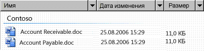

# Поддержка автоматизированного пользовательского интерфейса для типа элемента управления DataGrid
> [!NOTE]
> Эта документация предназначена для разработчиков .NET Framework, желающих использовать управляемые классы [!INCLUDE[TLA2#tla_uiautomation](../../../includes/tla2sharptla-uiautomation-md.md)] , заданные в пространстве имен <xref:System.Windows.Automation> . Последние сведения о [!INCLUDE[TLA2#tla_uiautomation](../../../includes/tla2sharptla-uiautomation-md.md)]см. в разделе [API автоматизации Windows. Автоматизация пользовательского интерфейса](/windows/win32/winauto/entry-uiauto-win32).  
  
 В этом разделе содержатся сведения о поддержке в [!INCLUDE[TLA#tla_uiautomation](../../../includes/tlasharptla-uiautomation-md.md)] типа элемента управления DataGrid. В [!INCLUDE[TLA2#tla_uiautomation](../../../includes/tla2sharptla-uiautomation-md.md)]тип элемента управления — это набор условий, которым должен удовлетворять элемент управления для использования свойства `ControlType` . Условия включают конкретные правила для древовидной структуры [!INCLUDE[TLA2#tla_uiautomation](../../../includes/tla2sharptla-uiautomation-md.md)] , значений свойств [!INCLUDE[TLA2#tla_uiautomation](../../../includes/tla2sharptla-uiautomation-md.md)] и шаблонов элементов управления.  
  
 С помощью типа элемента управления DataGrid пользователь может легко работать с элементами, содержащими метаданные, представленные в столбцах. Элементы управления DataGrid имеют строки элементов и столбцы сведений об этих элементах. Элемент управления ListView в проводнике Microsoft Vista — пример элемента управления, поддерживающего тип DataGrid.  
  
 В следующих разделах описывается необходимая древовидная структура [!INCLUDE[TLA2#tla_uiautomation](../../../includes/tla2sharptla-uiautomation-md.md)] , свойства, шаблоны элементов управления и события для типа элемента управления DataGrid. Требования [!INCLUDE[TLA2#tla_uiautomation](../../../includes/tla2sharptla-uiautomation-md.md)] применяются ко всем элементам [!INCLUDE[TLA#tla_winclient](../../../includes/tlasharptla-winclient-md.md)]управления сеткой данных, будь то, Win32 или Windows Forms.  
  
## Требуемая древовидная структура модели автоматизации пользовательского интерфейса  
 В следующей таблице описывается представление элемента управления и представление содержимого дерева [!INCLUDE[TLA2#tla_uiautomation](../../../includes/tla2sharptla-uiautomation-md.md)] , относящиеся к элементам управления DataGrid, и показывается, что может содержаться в каждом представлении. Дополнительные сведения о дереве [!INCLUDE[TLA2#tla_uiautomation](../../../includes/tla2sharptla-uiautomation-md.md)] см. в разделе [UI Automation Tree Overview](ui-automation-tree-overview.md).  
  
|Дерево[!INCLUDE[TLA2#tla_uiautomation](../../../includes/tla2sharptla-uiautomation-md.md)] — представление элемента управления|Дерево[!INCLUDE[TLA2#tla_uiautomation](../../../includes/tla2sharptla-uiautomation-md.md)] — представление содержимого|  
|------------------------------------------------------------------------------------------------|------------------------------------------------------------------------------------------------|  
|DataGrid   <ul><li>Заголовок {0, 1 или 2}   <ul><li>HeaderItem (количество столбцов или строк)</li></ul></li><li>DataItem (0 и более; возможна иерархическая структуризация)</li></ul>|DataGrid   - DataItem (0 или более; может быть структурирован в иерархии)|  
  

## Требуемые свойства модели автоматизации пользовательского интерфейса  
 В следующей таблице перечислены свойства, значение или определение которых в первую очередь относится к элементам управления DataGrid. Для получения [!INCLUDE[TLA2#tla_uiautomation](../../../includes/tla2sharptla-uiautomation-md.md)] дополнительной информации о свойствах [см.](ui-automation-properties-for-clients.md)  
  
|Свойство|Значение|Примечания|  
|--------------|-----------|-----------|  
|<xref:System.Windows.Automation.AutomationElementIdentifiers.AutomationIdProperty>|См. примечания.|Значение этого свойства должно быть уникальным среди всех элементов управления в приложении.|  
|<xref:System.Windows.Automation.AutomationElementIdentifiers.BoundingRectangleProperty>|См. примечания.|Внешний прямоугольник, содержащий весь элемент управления.|  
|<xref:System.Windows.Automation.AutomationElementIdentifiers.ClickablePointProperty>|См. примечания.|Поддерживается при наличии ограничивающего прямоугольника. Если не все точки внутри ограничивающего прямоугольника являются интерактивными и выполняется специализированная проверка на наличие данных, выполните переопределение и предоставьте интерактивную точку.|  
|<xref:System.Windows.Automation.AutomationElementIdentifiers.ControlTypeProperty>|DataGrid|Это значение одинаково для всех инфраструктур пользовательского интерфейса.|  
|<xref:System.Windows.Automation.AutomationElementIdentifiers.IsContentElementProperty>|True|Это свойство всегда должно иметь значение True. Это означает, что элемент управления DataGrid всегда должен быть в представлении содержимого дерева [!INCLUDE[TLA2#tla_uiautomation](../../../includes/tla2sharptla-uiautomation-md.md)] .|  
|<xref:System.Windows.Automation.AutomationElementIdentifiers.IsControlElementProperty>|True|Это свойство всегда должно иметь значение True. Это означает, что элемент управления DataGrid всегда должен быть в представлении элемента управления дерева [!INCLUDE[TLA2#tla_uiautomation](../../../includes/tla2sharptla-uiautomation-md.md)] .|  
|<xref:System.Windows.Automation.AutomationElementIdentifiers.IsKeyboardFocusableProperty>|См. примечания.|Если элемент управления может получать фокус клавиатуры, он должен поддерживать это свойство.|  
|<xref:System.Windows.Automation.AutomationElementIdentifiers.LabeledByProperty>|См. примечания.|Если имеется статическая текстовая метка, то данное свойство должно предоставлять ссылку на этот элемент управления.|  
|<xref:System.Windows.Automation.AutomationElementIdentifiers.LocalizedControlTypeProperty>|"сетка данных"|Локализованная строка, соответствующая типу элемента управления DataGrid.|  
|<xref:System.Windows.Automation.AutomationElementIdentifiers.NameProperty>|См. примечания.|Элемент управления DataGrid обычно получает значение для своего свойства `Name` из статического текста метки. Если статическая текстовая метка не предусмотрена, разработчик приложения должен назначить значение свойству `Name` . Значение свойства `Name` никогда не должно быть текстовым содержимым элемента управления "Поле ввода".|  
  
## Необходимые шаблоны элементов управления модели автоматизации пользовательского интерфейса  
 В следующей таблице перечислены шаблоны элементов управления, которые должны поддерживаться всеми элементами управления DataGrid. Дополнительные сведения о шаблонах элементов управления см. в разделе [UI Automation Control Patterns Overview](ui-automation-control-patterns-overview.md).  
  
|Шаблон элемента управления|Поддержка|Примечания|  
|---------------------|-------------|-----------|  
|<xref:System.Windows.Automation.Provider.IGridProvider>|Да|Сам элемент управления DataGrid всегда поддерживает шаблон элемента управления Grid, поскольку содержит метаданные, которые располагаются в сетке.|  
|<xref:System.Windows.Automation.Provider.IScrollProvider>|Зависит|Возможность прокрутки сетки данных зависит от содержимого и наличия полос прокрутки.|  
|<xref:System.Windows.Automation.Provider.ISelectionProvider>|Зависит|Возможность выбора сетки данных зависит от содержимого.|  
|<xref:System.Windows.Automation.Provider.ITableProvider>|Да|Элемент управления DataGrid всегда имеет заголовок в поддереве, поэтому должен поддерживаться шаблон элемента управления Table.|  
  
 Элементы данных в контейнерах DataGrid будут поддерживать как минимум следующие шаблоны:  
  
- шаблон элемента управления Selection Item (если сетка данных поддерживает выбор);  
  
- шаблон элемента управления Scroll Item (если сетка данных поддерживает прокрутку);  
  
- шаблон элемента управления Grid Item;  
  
- Table Item - шаблон элемента управления  
  

## Необходимые события модели автоматизации пользовательского интерфейса  
 В следующей таблице перечислены события [!INCLUDE[TLA2#tla_uiautomation](../../../includes/tla2sharptla-uiautomation-md.md)] , которые должны поддерживаться всеми элементами управления DataGrid. Дополнительные сведения о событиях см. в разделе [UI Automation Events Overview](ui-automation-events-overview.md).  
  
|Событие[!INCLUDE[TLA2#tla_uiautomation](../../../includes/tla2sharptla-uiautomation-md.md)]|Поддержка|Примечания|  
|---------------------------------------------------------------------------------|-------------|-----------|  
|<xref:System.Windows.Automation.AutomationElementIdentifiers.AutomationFocusChangedEvent>|Обязательно|None|  
|Событие изменения свойства<xref:System.Windows.Automation.AutomationElementIdentifiers.BoundingRectangleProperty>|Обязательно|None|  
|Событие изменения свойства<xref:System.Windows.Automation.AutomationElementIdentifiers.IsEnabledProperty>|Обязательно|None|  
|Событие изменения свойства<xref:System.Windows.Automation.AutomationElementIdentifiers.IsOffscreenProperty>|Обязательно|None|  
|<xref:System.Windows.Automation.AutomationElementIdentifiers.LayoutInvalidatedEvent>|Зависит|None|  
|<xref:System.Windows.Automation.AutomationElementIdentifiers.StructureChangedEvent>|Обязательно|None|  
|Событие изменения свойства<xref:System.Windows.Automation.MultipleViewPatternIdentifiers.CurrentViewProperty>|Зависит|None|  
|Событие изменения свойства<xref:System.Windows.Automation.ScrollPatternIdentifiers.HorizontallyScrollableProperty>|Зависит|Если элемент управления поддерживает шаблон Scroll, то он должен поддерживать данное событие.|  
|Событие изменения свойства<xref:System.Windows.Automation.ScrollPatternIdentifiers.HorizontalScrollPercentProperty>|Зависит|Если элемент управления поддерживает шаблон Scroll, то он должен поддерживать данное событие.|  
|Событие изменения свойства<xref:System.Windows.Automation.ScrollPatternIdentifiers.HorizontalViewSizeProperty>|Зависит|Если элемент управления поддерживает шаблон Scroll, то он должен поддерживать данное событие.|  
|Событие изменения свойства<xref:System.Windows.Automation.ScrollPatternIdentifiers.VerticalScrollPercentProperty>|Зависит|Если элемент управления поддерживает шаблон Scroll, то он должен поддерживать данное событие.|  
|Событие изменения свойства<xref:System.Windows.Automation.ScrollPatternIdentifiers.VerticallyScrollableProperty>|Зависит|Если элемент управления поддерживает шаблон Scroll, то он должен поддерживать данное событие.|  
|Событие изменения свойства<xref:System.Windows.Automation.ScrollPatternIdentifiers.VerticalViewSizeProperty>|Зависит|Если элемент управления поддерживает шаблон Scroll, то он должен поддерживать данное событие.|  
|<xref:System.Windows.Automation.SelectionPatternIdentifiers.InvalidatedEvent>|Обязательно|None|  
  
## Пример элемента управления DataGrid  
 На следующем рисунке показан элемент управления List View, который реализует тип элемента управления DataGrid.  
  
   
  
 Представление элемента управления и представление содержимого дерева [!INCLUDE[TLA2#tla_uiautomation](../../../includes/tla2sharptla-uiautomation-md.md)] , относящиеся к элементу управления List View, показаны ниже. Шаблоны элементов управления для каждого элемента автоматизации отображаются в круглых скобках.  
  
|Дерево[!INCLUDE[TLA2#tla_uiautomation](../../../includes/tla2sharptla-uiautomation-md.md)] — представление элемента управления|Дерево[!INCLUDE[TLA2#tla_uiautomation](../../../includes/tla2sharptla-uiautomation-md.md)] — представление содержимого|  
|------------------------------------------------------------------------------------------------|------------------------------------------------------------------------------------------------|  
|<ul><li>DataGrid (Table, Grid, Selection)</li><li>Заголовок   <ul><li>HeaderItem "Name" (Invoke)</li><li>HeaderItem "Date Modified" (Invoke)</li><li>HeaderItem "Size" (Invoke)</li></ul></li><li>Группа "Contoso" (TableItem, GridItem, SelectionItem,\*Таблица, Сетка )   <ul><li>DataItem "Счета Receivable.doc" (SelectionItem, Invoke,\*\*TableItem , GridItem )</li><li>DataItem "Счета Payable.doc" (SelectionItem, Invoke,\*\*TableItem , GridItem )</li></ul></li></ul>|<ul><li>DataGrid (Table, Grid, Selection)</li><li>Группа "Contoso" (TableItem, GridItem, SelectionItem,\*Таблица, Сетка )   <ul><li>DataItem "Счета Receivable.doc" (SelectionItem, Invoke,\*\*TableItem , GridItem )</li><li>DataItem "Счета Payable.doc" (SelectionItem, Invoke,\*\*TableItem , GridItem )</li></ul></li></ul>|  
  
 \*Предыдущий пример показывает DataGrid, который содержит несколько уровней управления. Элемент управления Group ("Contoso") содержит два элемента управления DataItem ("Accounts Receivable.doc" и "Accounts Payable.doc"). Пара DataGrid/GridItem не зависит от пары на другом уровне. Элементы управления DataItem в элементе управления Group также могут предоставляться как тип элемента управления ListItem, что позволяет им быть представленными более четко, как выбираемые объекты, а не как простые элементы данных. Этот пример не включает дочерние элементы сгруппированных элементов данных.  
  
## См. также раздел

- <xref:System.Windows.Automation.ControlType.DataGrid>
- [Общие сведения о типах элементов управления автоматизации пользовательского интерфейса](ui-automation-control-types-overview.md)
- [Общие сведения о модели автоматизации пользовательского интерфейса](ui-automation-overview.md)
