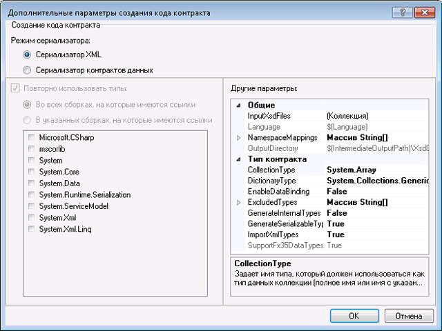

# Средство первого контакта
Контракты службы часто приходится создавать из существующих служб.В [!INCLUDE[net_v45](../../../includes/net-v45-md.md)] классы контрактов данных можно создать автоматически из существующих служб с помощью инструмента поддержки парадигмы «сперва контракт».Для использования данного средства файл определения схемы XML \(XSD\) необходимо загрузить локально. Программа не может импортировать удаленные контракты данных через HTTP.  
  
 Данное средство встроено в [!INCLUDE[vs_current_long](../../../includes/vs-current-long-md.md)] в качестве задачи построения.Файлы кода, созданные задачей построения, создаются при каждом построении проекта, так что в проекте легко отражаются изменения в базовом контракте службы.  
  
 Типы схем, которые может импортировать средство поддержки парадигмы «сперва контракт.  
  
```  
<xsd:complexType>  
<xsd:simpleType>  
```  
  
 Простые типы не создаются, если они являются примитивами, такими как `Int16` или `String`, сложные типы не создаются, если они имеют тип `Collection`.Типы также не создаются, если они являются частью другого `xsd:complexType`.Во всех этих случаях данные типы будут ссылаться на существующие в проекте типы.  
  
## Добавление в проект контракта данных.  
 Перед использованием средства «сперва контракт» в проект следует добавить контракт службы \(XSD\).В качестве наглядного примера будет использоваться следующий контракт.Это определение службы является небольшим подмножеством контракта службы, используемого API поиска службы Bing.  
  
```xml  
<?xml version="1.0" encoding="utf-8"?>  
<xs:schema id="ServiceSchema"  
    targetNamespace="http://tempuri.org/ServiceSchema.xsd"  
    elementFormDefault="qualified"  
    xmlns="http://tempuri.org/ServiceSchema.xsd"  
    xmlns:mstns="http://tempuri.org/ServiceSchema.xsd"  
    xmlns:xs="http://www.w3.org/2001/XMLSchema"  
>  
  <xs:complexType name="SearchRequest">  
    <xs:sequence>  
      <xs:element minOccurs="0" maxOccurs="1" name="Version" type="xs:string" default="2.2" />  
      <xs:element minOccurs="0" maxOccurs="1" name="Market" type="xs:string" />  
      <xs:element minOccurs="0" maxOccurs="1" name="UILanguage" type="xs:string" />  
      <xs:element minOccurs="1" maxOccurs="1" name="Query" type="xs:string" />  
      <xs:element minOccurs="1" maxOccurs="1" name="AppId" type="xs:string" />  
      <xs:element minOccurs="0" maxOccurs="1" name="Latitude" type="xs:double" />  
      <xs:element minOccurs="0" maxOccurs="1" name="Longitude" type="xs:double" />  
      <xs:element minOccurs="0" maxOccurs="1" name="Radius" type="xs:double" />  
    </xs:sequence>  
  </xs:complexType>  
  <xs:simpleType name="WebSearchOption">  
    <xs:restriction base="xs:string">  
      <xs:enumeration value="DisableHostCollapsing" />  
      <xs:enumeration value="DisableQueryAlterations" />  
    </xs:restriction>  
  </xs:simpleType>  
</xs:schema>  
  
```  
  
 Чтобы добавить приведенный выше контракт службы в проект, щелкните правой кнопкой мыши проект и выберите **Добавить новый…**.Выберите определение схемы с панели диалогового окна «Шаблоны» и дайте новому файлу имя SampleContract.xsd.Скопируйте и вставьте приведенный выше код в новый файл.  
  
## Настройка параметров первоначального контракта  
 Параметры первоначального контракта можно задать в меню «Свойства» проекта [!INCLUDE[indigo2](../../../includes/indigo2-md.md)].Чтобы включить разработку на основе парадигмы «сперва контракт», установите флажок **Включить XSD в качестве языка определения типов** на странице WCF окна свойств проекта.  
  
   
  
 Чтобы настроить дополнительные свойства, нажмите кнопку «Дополнительно».  
  
   
  
 Можно установить следующие дополнительные параметры для создания кода на основе контрактов.Можно задать параметры только для всех файлов в проекте. В настоящий момент для отдельных файлов параметры задавать нельзя.  
  
-   **Режим сериализатора**: этот параметр определяет, какой сериализатор используется для чтения файлов контракта службы.Если выбран параметр **XML\-сериализатор**, параметры **Типы коллекций** и **Типы повторного использования** отключены.Эти параметры применяются только к **Сериализатору контракта данных**.  
  
-   **Типы повторного использования**: этот параметр определяет библиотеки, которые применяются для повторно используемых типов.Этот параметр применим только в том случае, если свойство **Режим сериализатора** имеет значение **Сериализатор контракта данных**.  
  
-   **Тип коллекции**: этот параметр задает полное имя типа или типа с указанием сборки, используемого для типа данных коллекции.Этот параметр применим только в том случае, если свойство **Режим сериализатора** имеет значение **Сериализатор контракта данных**.  
  
-   **Коллекция типа**: этот параметр задает полное имя типа или типа с указанием сборки, используемого для типа данных коллекции.  
  
-   **EnableDataBinding**: этот параметр определяет, следует ли использовать интерфейс <xref:System.ComponentModel.INotifyPropertyChanged> для всех типов данных при привязке данных.  
  
-   **ExcludedTypes**: этот параметр определяет список полных имен или имен типов с указанием сборки, который необходимо исключить из ссылочных сборок.Этот параметр применим только в том случае, если свойство **Режим сериализатора** имеет значение **Сериализатор контракта данных**.  
  
-   **GenerateInternalTypes**: этот параметр определяет, следует ли создавать классы, помеченные как внутренние.Этот параметр применим только в том случае, если свойство **Режим сериализатора** имеет значение **Сериализатор контракта данных**.  
  
-   **GenerateSerializableTypes**: этот параметр определяет, следует ли создавать классы с атрибутом <xref:System.SerializableAttribute>.Этот параметр применим только в том случае, если свойство **Режим сериализатора** имеет значение **Сериализатор контракта данных**.  
  
-   **ImportXMLTypes**: этот параметр определяет, следует ли настроить сериализатор контрактов данных, так чтобы атрибут <xref:System.SerializableAttribute> применялся к классам без атрибута <xref:System.Runtime.Serialization.DataContractAttribute>.Этот параметр применим только в том случае, если свойство **Режим сериализатора** имеет значение **Сериализатор контракта данных**.  
  
-   **SupportFx35TypedDataSets**: этот параметр определяет, следует ли предоставлять дополнительные функциональные возможности для типизированных наборов данных, созданных в .NET Framework 3.5.Если свойство **Режим сериализатора** имеет значение **XML\-сериализатор**, расширение <xref:System.Data.Design.TypedDataSetSchemaImporterExtensionFx35> будет добавлено в средство импорта схемы XML, если этому свойству задано значение True.Если свойство **Режим сериализатора** имеет значение **Сериализатор контракта данных**, тип <xref:System.DateTimeOffset> будет исключен из ссылок, если значение задан как False, поэтому [DateTimeOffset](assetId:///DateTimeOffset?qualifyHint=False&amp;autoUpgrade=True) всегда создается для более старых версий платформы .NET Framework.  
  
-   **InputXsdFiles**: этот параметр определяет список входных файлов.Каждый файл должен содержать допустимую схему XML.  
  
-   **Язык**: этот параметр определяет язык создаваемого кода контракта.Параметр должен быть узнаваем методом <xref:System.CodeDom.Compiler.CodeDomProvider>.  
  
-   **NamespaceMappings**: этот параметр определяет сопоставление из целевого пространства имен XSD с пространствами имен среды CLR.В каждом сопоставлении необходимо использовать следующий формат:  
  
    ```xml  
    “<Schema Namespace>, <CLR Namespace>”  
    ```  
  
     Сериализатор XML принимает только одно сопоставление в следующем формате:  
  
    ```xml  
    “*, <CLR Namespace>”  
    ```  
  
-   **Выходной каталог**: этот параметр задает каталог, в котором создаются файлы кода.  
  
 Параметры будут использоваться при построении проекта для создания типов контракта службы из файлов контракта службы.  
  
## Разработка на основе контрактов  
 После добавления в проект контракта службы и подтверждения параметров построения постройте проект, нажав клавишу **F6**.Типы, определенные в контракте службы, станут затем доступными для использования в проекте.  
  
 Для использования типов, определенных в контракте службы, добавьте ссылку на `ContractTypes` в текущем пространстве имен.  
  
```csharp  
using MyProjectNamespace.ContractTypes;  
```  
  
 Типы, определенные в контракте службы, будут затем разрешены для использования в проекте \(как показано ниже\).  
  
   
  
 Типы, созданные с помощью средства, помещаются в файл GeneratedXSDTypes.cs.По умолчанию файл создается в каталоге \<project directory\>\/obj\/\<build configuration\>\/XSDGeneratedCode\/.Образец схемы в начале этого раздела преобразуется следующим образом:  
  
```scr  
//------------------------------------------------------------------------------  
// <auto-generated>  
//     This code was generated by a tool.  
//     Runtime Version:4.0.30319.17330  
//  
//     Changes to this file may cause incorrect behavior and will be lost if  
//     the code is regenerated.  
// </auto-generated>  
//------------------------------------------------------------------------------  
  
namespace TestXSD3.ContractTypes  
{  
    using System.Xml.Serialization;  
  
    /// <remarks/>  
    [System.CodeDom.Compiler.GeneratedCodeAttribute("System.Xml", "4.0.30319.17330")]  
    [System.SerializableAttribute()]  
    [System.Diagnostics.DebuggerStepThroughAttribute()]  
    [System.ComponentModel.DesignerCategoryAttribute("code")]  
    [System.Xml.Serialization.XmlTypeAttribute(Namespace="http://tempuri.org/ServiceSchema.xsd")]  
    [System.Xml.Serialization.XmlRootAttribute(Namespace="http://tempuri.org/ServiceSchema.xsd", IsNullable=true)]  
    public partial class SearchRequest  
    {  
  
        private string versionField;  
  
        private string marketField;  
  
        private string uILanguageField;  
  
        private string queryField;  
  
        private string appIdField;  
  
        private double latitudeField;  
  
        private bool latitudeFieldSpecified;  
  
        private double longitudeField;  
  
        private bool longitudeFieldSpecified;  
  
        private double radiusField;  
  
        private bool radiusFieldSpecified;  
  
        public SearchRequest()  
        {  
            this.versionField = "2.2";  
        }  
  
        /// <remarks/>  
        [System.ComponentModel.DefaultValueAttribute("2.2")]  
        public string Version  
        {  
            get  
            {  
                return this.versionField;  
            }  
            set  
            {  
                this.versionField = value;  
            }  
        }  
  
        /// <remarks/>  
        public string Market  
        {  
            get  
            {  
                return this.marketField;  
            }  
            set  
            {  
                this.marketField = value;  
            }  
        }  
  
        /// <remarks/>  
        public string UILanguage  
        {  
            get  
            {  
                return this.uILanguageField;  
            }  
            set  
            {  
                this.uILanguageField = value;  
            }  
        }  
  
        /// <remarks/>  
        public string Query  
        {  
            get  
            {  
                return this.queryField;  
            }  
            set  
            {  
                this.queryField = value;  
            }  
        }  
  
        /// <remarks/>  
        public string AppId  
        {  
            get  
            {  
                return this.appIdField;  
            }  
            set  
            {  
                this.appIdField = value;  
            }  
        }  
  
        /// <remarks/>  
        public double Latitude  
        {  
            get  
            {  
                return this.latitudeField;  
            }  
            set  
            {  
                this.latitudeField = value;  
            }  
        }  
  
        /// <remarks/>  
        [System.Xml.Serialization.XmlIgnoreAttribute()]  
        public bool LatitudeSpecified  
        {  
            get  
            {  
                return this.latitudeFieldSpecified;  
            }  
            set  
            {  
                this.latitudeFieldSpecified = value;  
            }  
        }  
  
        /// <remarks/>  
        public double Longitude  
        {  
            get  
            {  
                return this.longitudeField;  
            }  
            set  
            {  
                this.longitudeField = value;  
            }  
        }  
  
        /// <remarks/>  
        [System.Xml.Serialization.XmlIgnoreAttribute()]  
        public bool LongitudeSpecified  
        {  
            get  
            {  
                return this.longitudeFieldSpecified;  
            }  
            set  
            {  
                this.longitudeFieldSpecified = value;  
            }  
        }  
  
        /// <remarks/>  
        public double Radius  
        {  
            get  
            {  
                return this.radiusField;  
            }  
            set  
            {  
                this.radiusField = value;  
            }  
        }  
  
        /// <remarks/>  
        [System.Xml.Serialization.XmlIgnoreAttribute()]  
        public bool RadiusSpecified  
        {  
            get  
            {  
                return this.radiusFieldSpecified;  
            }  
            set  
            {  
                this.radiusFieldSpecified = value;  
            }  
        }  
    }  
  
    /// <remarks/>  
    [System.CodeDom.Compiler.GeneratedCodeAttribute("System.Xml", "4.0.30319.17330")]  
    [System.SerializableAttribute()]  
    [System.Xml.Serialization.XmlTypeAttribute(Namespace="http://tempuri.org/ServiceSchema.xsd")]  
    [System.Xml.Serialization.XmlRootAttribute(Namespace="http://tempuri.org/ServiceSchema.xsd", IsNullable=false)]  
    public enum WebSearchOption  
    {  
  
        /// <remarks/>  
        DisableHostCollapsing,  
  
        /// <remarks/>  
        DisableQueryAlterations,  
    }  
}  
  
```  
  
## Ошибки и предупреждения  
 Предупреждения и ошибки, обнаруженные во время синтаксического анализа схемы XSD, появятся в виде предупреждений и ошибок построения.  
  
## Наследование интерфейса  
 Невозможно использовать наследование интерфейса с разработкой на основе контрактов. Это согласуется с тем, как интерфейсы действуют в других операциях.Чтобы использовать интерфейс, который наследует базовый интерфейс, используйте 2 отдельные конечные точки.Первая конечная точка использует унаследованный контракт, а вторая конечная точка реализует базовый интерфейс.