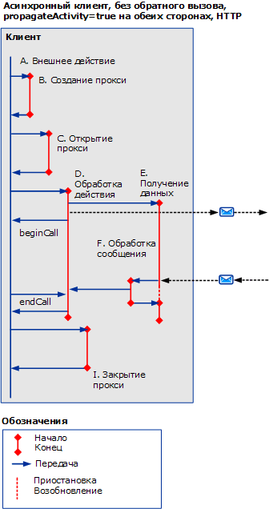
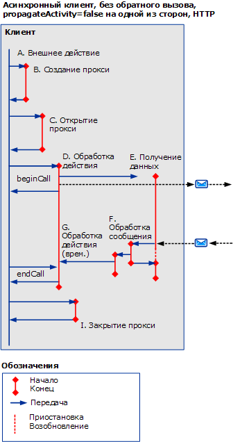
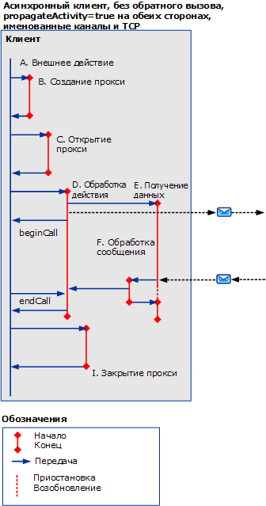
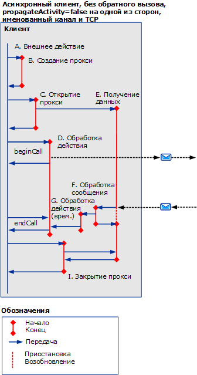
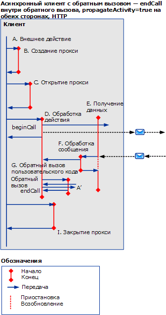
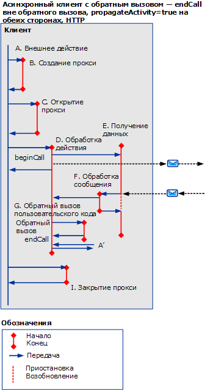
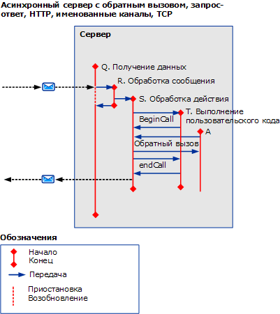

# Асинхронные сценарии с использованием HTTP, TCP или именованного канала
В этом разделе описываются действия и перенаправления для различных асинхронных сценариев типа запрос-ответ (с многопотоковыми запросами с использованием HTTP, TCP или именованного канала).  
  
## Асинхронный запрос-ответ без ошибок  
 В этом разделе описываются действия и перенаправления для асинхронного сценария типа запрос-ответ (с многопотоковым клиентом).  
  
 Действие вызывающего завершается, когда возвращается значение `beginCall` и `endCall`. При осуществлении обратного вызова возвращается обратный вызов.  
  
 Вызываемое действие завершится, когда возвращается значение `beginCall` и `endCall` или когда возвращается обратный вызов, если он был вызван из данного действия.  
  
### Асинхронный клиент без обратного вызова  
  
#### Распространение включено для обеих сторон (с использованием HTTP)  
   
  
 Рисунок 1. Асинхронный клиент, без обратного вызова `propagateActivity` = `true` на обеих сторонах HTTP  
  
 Если `propagateActivity` = `true`, действие ProcessMessage указывает, какое действие ProcessAction для передачи.  
  
 Для сценариев, основанных на HTTP, для первого отправляемого сообщения вызывается действие ReceiveBytes, которое сохраняется на время существования запроса.  
  
#### Распространение отключено для обеих сторон (с использованием HTTP)  
 Если `propagateActivity` = `false` для обеих сторон, действие ProcessMessage указывает, какое действие ProcessAction для передачи. Таким образом, вызывается новое временное действие ProcessAction с новым идентификатором. Если асинхронный ответ соответствует запросу в коде ServiceModel, идентификатор действия может быть получен из локального контекста. Фактическое действие ProcessAction может быть передано с данным идентификатором.  
  
   
  
 Рис. 2. Асинхронный клиент, без обратного вызова `propagateActivity` = `false` для обеих сторон, HTTP  
  
 Для сценариев, основанных на HTTP, для первого отправляемого сообщения вызывается действие ReceiveBytes, которое сохраняется на время существования запроса.  
  
 Действие Process Action создается на асинхронном клиенте при `propagateActivity` = `false` в вызывающей или вызываемой и, когда сообщение-ответ не содержит заголовка Action.  
  
#### Распространение включено для обеих сторон (с использованием TCP или именованного канала)  
   
  
 Рис. 3. Асинхронный клиент, без обратного вызова `propagateActivity` = `true` на обеих сторонах именованного канала или TCP  
  
 Для сценария, основанного на именованном канале или TCP, действие ReceiveBytes вызывается при открытии клиента и сохраняется на время существования подключения.  
  
 Аналогично рисунку 1, если `propagateActivity` = `true`, действие ProcessMessage указывает, какое действие ProcessAction для передачи.  
  
#### Распространение отключено для обеих сторон (с использованием TCP или именованного канала)  
 Для сценария, основанного на именованном канале или TCP, действие ReceiveBytes вызывается при открытии клиента и сохраняется на время существования подключения.  
  
 Аналогично Fig.2, если `propagateActivity` = `false` для обеих сторон, действие ProcessMessage указывает, какое действие ProcessAction для передачи. Таким образом, вызывается новое временное действие ProcessAction с новым идентификатором. Если асинхронный ответ соответствует запросу в коде ServiceModel, идентификатор действия может быть получен из локального контекста. Фактическое действие ProcessAction может быть передано с данным идентификатором.  
  
   
  
 Рис. 4. Асинхронный клиент, без обратного вызова `propagateActivity` = `false` на обеих сторонах именованного канала или TCP  
  
### Асинхронный клиент с обратным вызовом  
 В данном сценарии добавляются действия G и A’ для обратного вызова и `endCall`, а также их передачи в обратном вызове и вне его.  
  
 В этом разделе показано только использование HTTP с `propragateActivity` = `true`. Однако дополнительные действия и передачи также применимы к другим случаям (то есть `propagateActivity` = `false`, с использованием TCP или именованного канала).  
  
 Обратный вызов создает новое действие (G), когда клиент вызывает пользовательский код для уведомления о готовности результатов. Затем пользовательский код вызывает `endCall` в обратном вызове (как показано на рисунке 5) или вне обратного вызова (рисунок 6). Так как не известно, какие действия пользователь `endCall` , вызывается из, это действие называется `A’`. Действие A’ может быть одинаковым или отличаться от действия A.  
  
   
  
 Рис. 5. Асинхронный клиент с обратным вызовом, `endCall` в обратном вызове  
  
   
  
 Рис. 6. Асинхронный клиент с обратным вызовом, `endCall` вне обратного вызова  
  
### Асинхронный сервер с обратным вызовом  
   
  
 Рис. 7. Асинхронный сервер с обратным вызовом  
  
 Стек каналов выполняет обратный вызов клиента при получении сообщения: трассировки для данной обработки выдаются в самом действии ProcessRequest.  
  
## Асинхронный запрос-ответ с ошибками  
 Во время `endCall` получаются сообщения об ошибке. В противном случае действия и передачи аналогичны предыдущим сценариям.  
  
## Асинхронная односторонняя связь с ошибками или без них  
 Ответ отсутствует или клиенту возвращается ошибка.
