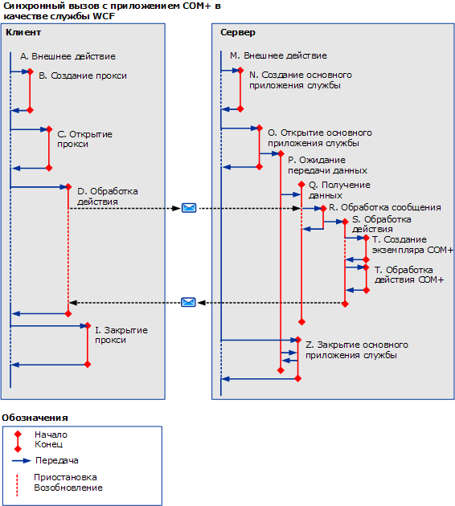

# COM+
На следующем рисунке показано, как можно использовать трассировку действий в приложении COM+. Вместо выполнения пользовательского кода на сервере можно определить действие COM+ для каждого вызова метода в объектной модели COM+.  
  
 
